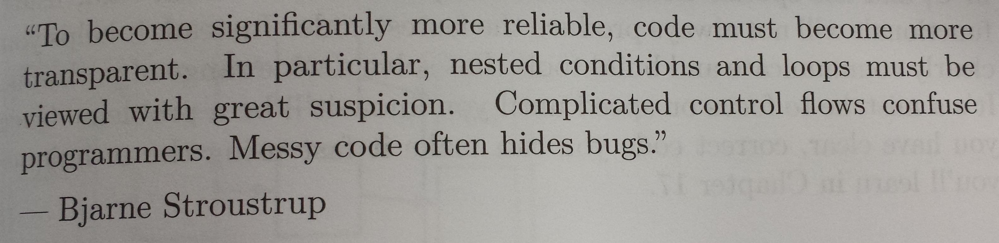

## Content

- Functions 
- Robust programming with functions
- Scoping
- Closures
- High-level functions
- Vectorisation

# Functions

Among the R's strong points, Hadley Whickham cites:

> [R has] a strong foundation in functional programming. The ideas of
> functional programming are well suited to solving many of the
> challenges of data analysis. R provides a powerful and flexible
> toolkit which allows you to write concise yet descriptive code.

Also
> To understand computations in R, two slogans are helpful:
> - Everything that exists is an object.
> - Everything that happens is a function call.
> John Chambers

 

- Functions are a means of **abstraction**. A concept/computation is
  encapsulated/isolated from the rest with a function.
- Functions should **do one thing**, and do it well (compute, or plot,
  or save, ... not all in one go).
- **Side effects**: your functions should not have any (unless, of
  course, that is the main point of that function - plotting, write to
  disk, ...). Functions shouldn't make any changes in any
  environment. The only return their output.
- **Do not use global variables**. Everything the function needs is
  being passed as an argument. Function must be **self-contained**.
- Function streamline code and process

From the `R Inferno`:

Make your functions as simple as possible. Simple has many advantages:

- Simple functions are likely to be human efficient: they will be easy
  to understand and to modify.
- Simple functions are likely to be computer efficient.
- Simple functions are less likely to be buggy, and bugs will be
  easier to fix.
- (Perhaps ironically) simple functions may be more general—thinking
  about the heart of the matter often broadens the application.


Functions can be

1. Correct.
2. An error occurs that is clearly identified.
3. An obscure error occurs.
4. An incorrect value is returned.

We like category 1. Category 2 is the right behavior if the inputs do
not make sense, but not if the inputs are sensible. Category 3 is an
unpleasant place for your users, and possibly for you if the users
have access to you. Category 4 is by far the worst place to be - the
user has no reason to believe that anything is wrong. Steer clear of
category 4.


Finally, functions are

- Easier to debug (part III)
- Easier to profile (part IV)
- Easier to parallelise (part IV)

Functions are an central part of robust R programming.

## Function parts

A function is made of
- a name
- some inputs (formal parameters)
- a single output (return value)
- a body
- an environment, the map of the location of the functions variable

```{r, eval=FALSE}
f <- function(x) {
    y <- x + 1
    return(x * y)
}
```

And these can be accessed and modified indivdually

```{r, eval=FALSE}
body(f)
args(f)
environment(f)

body(f) <- quote({
    y <- x * y
    return(x + y)
})
```


## Lexical scoping

- If a name is not found in a functions environment, it is looked up
  in the parent (enclosing) from.
- If it is not found in the parent (enclosing) frame, it is looked up
  in the parent's parent frame, and so on...

*Lexical scoping*: default behaviour, current environment, then
traversing *enclosing/parent environments*.

```{r, eval=FALSE}
f <- function(x) x + y

f(1)

environment(f)
y <- 2
f(1)
```

```{r, eval=FALSE}

e <- new.env()
environment(f) <- e

f(1)
e$y <- 10
f(1)
```

This is of course bad practice, we don't want to rely on global variables.

```{r, eval=FALSE}
codetools::findGlobals(f)
```

## Exercises

Start by mentally running the code chunks below - what do the functions return? 

After testing new code chunks, don't forget to clean up your
workspace, to avoid unexpected results.

```{r, eval=FALSE}
f <- function() {
    x <- 1
    y <- 2
    c(x, y)
}
f()
```

```{r, eval=FALSE}
x <- 2
g <- function(){
    y <- 1
    c(x, y)
}
g()
```

```{r, eval=FALSE}
x <- 1
h <- function() {
    y <- 2
    i <- function() {
        z <- 3
        c(x, y, z)
    }
    i()
}
h()
```

```{r, eval=FALSE}
j <- function(x) {
    y <- 2
    function(){
        c(x, y)
    }
}
k <- j(1)
k()
```

```{r, eval=FALSE}
j <- function() {
    if (!exists("a")) {
        a <- 1
    } else {
        a <- a + 1
    }
    print(a)
}
j() ## First call
j() ## Second call
```

```{r, eval=FALSE}
f <- function() x
x <- 1
f() 
x <- 2
f()
```

```{r, eval=FALSE}
f <- function(x) {
    f <- function(x) {
        f <- function(x) {
            x^2
        }
        f(x) + 1
    }
    f(x) * 2
}
f(10)
```

## More about functions

- Argument matching by position or by names
- Calling a function with a list of arguments

```{r, eval=FALSE}
args <- list(x = 1:10, trim = 0.3)
do.call(mean, args)
```

- Default arguments

```{r, eval=FALSE}
f <- function(x = 1, y = 2) x * y
f <- function(x = 1, y = x + 2) x * y
```

- Missing arguments

```{r, eval=FALSE}
f <- function(x = 1, y) {
	c(missing(x), missing(y))
}
f()
f(x = 1)
```

- Passing non-matched parameters `...` to an inner function

```{r, eval=FALSE}
plot2 <- function(...) {
    message("Verbose plotting...")
    plot(...)
}

f <- function(...) list(...)
```

- Return values: last statement, explicit `return`, make output
  `invivisble`
  
```{r, eval=FALSE}
f1 <- function() 1
f2 <- function() return(1)
f3 <- function() return(invisible(1))
```

- Explicit triggers before exiting. Useful to restore global state
  (plotting parameters, cleaning temporary files, ...)

```{r, eval=FALSE}
f1 <- function(x) {
    on.exit(print("!"))
    x + 1
}

f2 <- function(x) {
    on.exit(print("!"))
    stop("Error")
}
```

```{r, eval=FALSE}
f3 <- function() {
    on.exit(print("1"))
    on.exit(print("2"))
    invisible(TRUE)
}


f4 <- function() {
    on.exit(print("1"))
    on.exit(print("2"), add = TRUE)
    invisible(TRUE)
}
```

- Anonymous functions, created on-the-flight and passed to `lapply` or
  other high-level functions.

```{r, eval=FALSE}
function(x) x + y
body(function(x) x + y)
args(function(x) x + y)
environment(function(x) x + y)
```

## More about scoping

*Lexical scoping*: default behaviour, current environment, then
traversing *enclosing/parent environments*.


*Dynamic scoping*: looking up variables in the *calling environment*,
used in non-standard evaluation.


# Functional programming

**First-class functions** - a function is a value just like any other
variable. Functions can thus be used as arguments to other
functions. Functions are considered *first-class citizens*.

**Higher-order functions** - refers to functions that take functions
as parameters (input) or return functions (output).

## Closures

> "An object is data with functions. A closure is a function with
> data." - John D. Cool

Closures: functions written by functions. They enclose the envionment
of the parent function and can access all its variables. 

```{r, eval=FALSE}
make.power <- function(n) 
    function(x) x^n

  
cube <- make.power(3)
square <- make.power(2)
cube(2)
square(2)
environment(cube)
environment(square)
```

Mutable state: a counter function

```{r, eval=FALSE}
new_counter <- function() {
    i <- 0
    function() {
        i <<- i + 1
        i 
    }
}

count1 <- new_counter()
count2 <- new_counter()

count1()
count1()
count2()

environment(count1)
environment(count2)
environment(count1)$i
environment(count2)$i
```

Questions:

- What happens of we place the code `i <- 0` and the function
  definition outside of a function, i.e in the global environment?

- What happens if we use `<-` instead of `<<-`?

The `colorRampPallette`

```{r, eval=FALSE}
colramp <- colorRampPalette(c("blue", "yellow"))
colramp(5)
plot(1:10, col = colramp(10), pch = 19, cex = 2,
     main = "colramp(10)")
```

## Functional

Take a function as input or return a function as output.

- `Reduce(f, x)` uses a binary function to successively combine the
  elements of a given vector and a possibly given initial value.

```{r, eval=FALSE}
L <- replicate(3, matrix(rnorm(9), 3), simplify = FALSE)
Reduce("+", L)
try(sum(L))
```

```{r, eval=FALSE}
Reduce("+", list(1, 2, 3), init = 10)
Reduce("+", list(1, 2, 3), accumulate = TRUE)
Reduce("+", list(1, 2, 3), right = TRUE, accumulate = TRUE)
```

- `Filter(f, x)` extracts the elements of a vector for which a
  predicate (logical) function gives true.

- `Negate(f)`  creates the negation of a given function.

```{r, eval=FALSE}
even <- function(x) x %% 2 == 0
(y <- sample(100, 10))
Filter(even, y)
Filter(Negate(even), y)
```

- `Map(f, ...)` applies a function to the corresponding elements of
  given vectors. Similar to `mapply` without any attempt to simplify.

```{r, eval=FALSE}
Map(even, 1:3)
```

- `Find(f, x)` and `Position(f, x)` give the first (or last elements)
  and its position in the vector, for which a predicate (logical)
  function gives true.

```{r, eval=FALSE}
Find(even, 10:15)
Find(even, 10:15, right = TRUE)
Position(Negate(even), 10:15)
Position(Negate(even), 10:15, right = TRUE)
```

## References

- R Gentleman, *R Programming for Bioinformatics*, CRC Press, 2008
- `?Map`, or any other of the higher order functions
- Blog post, *Higher Order Functions in R*, John Myles White
		http://www.johnmyleswhite.com/notebook/2010/09/23/higher-order-functions-in-r/

# Vectorisation


> Many operations in R are vectorized, and understanding and using
> vectorization is an essential component of becoming a proficient
> programmer. -  R Gentleman in *R Programming for Bioinformatics*.

A *vectorised computation* is one that, when applied to a vector (of
length greater than 1), automatically operates directly on all
elements of the input vector.


```{r, eval=FALSE}
(x <- 1:5)
(y <- 5:1)
x + y
```

## Recycling rule

What is `x` and `y` are of different length: the shorter vector is
replicate so that its length matches the longer ones.

```{r, eval=FALSE}
(x <- 1:6)
(y <- 1:2)
x+y
```

If the shorter vector is not an even multiple of the longer, a warning
is issued.

## Example

Compute difference between times of events, `e`. Given `n` events,
there will be `n-1` inter-event times. `interval[i] <- e[i+1] - e[i]`

Procedural implementation:

```{r, eval=FALSE}
diff1 <- function(e) {
  n <- length(e)
  interval <- rep(0, n - 1) 
  for (i in 1:(n - 1)) 
      interval[i] <- e[i + 1] - e[i]
  interval
}
e <- c(2, 5, 10.2, 12, 19)
diff1(e)
```

Vectorised implementation:

```{r, eval=FALSE}
diff2 <- function(e) {
  n <- length(e)
  e[-1] - e[-n]
}
e <- c(2, 5, 10.2, 12, 19)
diff2(e)
```

## `*apply` functions

How to apply a function, iteratively, on a set of elements?

`apply(X, MARGIN, FUN, ...)`


- `MARGIN` = 1 for row, 2 for cols.
- `FUN` = function to apply
- `...` = extra args to function.
- `simplify` =  should the result be simplified if possible.


`*apply` functions are (generally) **NOT** faster than loops, but more
succint and thus clearer.

```{r, eval=FALSE}
v <- rnorm(1000) ## or a list
res <- numeric(length(v))

for (i in 1:length(v)) 
  res[i] <- f(v[i])

res <- sapply(v, f)

## if f is vectorised
f(v)
```

function | use case
-------|---------------------------------------
apply  | matrices, arrays, data.frames
lapply | lists, vectors
sapply | lists, vectors
vapply | with a pre-specified type of return value
tapply | atomic objects, typically vectors
by     | similar to tapply
eapply | environments
mapply | multiple values
rapply | recursive version of lapply
esApply | `ExpressionSet`, defined in `Biobase`

See also the `BiocGenerics` package for `[l|m|s|t]apply` S4 generics,
as well as parallel versions in the `parallel` package (see
`Performance` section).


See also the `plyr` package, that offers its own flavour of `apply`
functions.

  in/out    |  list   | data frame | array
------------|---------|------------|---------
 list       | llply() |	ldply()    | laply()
 data frame | dlply() |	ddply()    | daply()
 array      | alply() |	adply()    | aaply()


## Other functions

- `replicate` - repeated evaluation of an expression
- `aggregate` - compute summary statistics of data subsets
- `ave` - group averages over level combinations of factors
- `sweep` - sweep out array summaries

## Anonymous functions

A function defined/called without being assigned to an identifier and
generally passed as argument to other functions.


```{r, eval=FALSE}
M <- matrix(rnorm(100), 10)
apply(M, 1, function(Mrow) 'do something with Mrow')
apply(M, 2, function(Mcol) 'do something with Mcol')
```

## Use case: integration

```{r, echo=FALSE, eval=FALSE}
f <- function(x, a = 1) sin(x^2)/ (a + abs(x))
x <- seq(-7, 7, 0.02 )
x0 <- seq(-2, 2, 0.02)
y0 <- f(x0)
y0[y0 < 0] <- 0
plot(x, f(x), type = "l", main = expression(f(x) ==  frac(sin(x^2),(a + abs(x)))))
grid()
abline(v = c(-2, 2), lty = "dotted")
polygon(x0, y0, col = "#00000010")
```


The `integrate` function approximates definite integrals by
adaptive quadrature.


```{r, eval=FALSE}
f <- function(x, a = 1) sin(x^2)/ (a + abs(x))
integrate(f, lower = -2, upper = 2)
```

It is not vectorised.

```{r, eval=FALSE}
lo <- c(-2, 0)
hi <- c(0, 2)
integrate(f, lower = lo, upper = hi)
```

## How to vectorise

1. To vectorise a function, we can explicitly wrap it inside a helper
   function that will take care of argument recycling (via `rep`),
   then loop over the inputs and call the non-vectorised function.

2. To vectorise a function, we can explicitate the vectorised
   calculation using `mapply`.

```{r, eval=FALSE}
mapply(function(lo, hi) integrate(f, lo, hi)$value,
       lo, hi)
```

3. Create a vectorised form using `Vectorize`. It takes a function
   (here, an anonymous function) as input and returns a function.

```{r, eval=FALSE}
Integrate <- Vectorize(
  function(fn, lower, upper)
  integrate(fn, lower, upper)$value,
  vectorize.args=c("lower", "upper")
  )
Integrate(f, lower=lo, upper=hi)
```

## **Efficient** apply-like functions

These functions combine high-level vectorised syntax for clarity
**and** efficient C-level vectorised imputation (see *Performance*
section).

- In `base`: rowSums, rowMeans, colSums, colMeans
- In `Biobase`: rowQ, rowMax, rowMin, rowMedias, ...
- In `genefilter`: rowttests, rowFtests, rowSds, rowVars, ...

Generalisable on other data structures, like `ExpressionSet`
instances.

## Parallelisation

Vectorised operations are natural candidats for parallel execution.
See later, *Parallel computation* topic.

## References

- R Gentleman, *R Programming for Bioinformatics*, CRC Press, 2008
- Ligges and Fox, *R Help Desk, How Can I Avoid This Loop or Make It
  Faster?* R News, Vol 8/1. May 2008.
- Grouping functions: sapply vs. lapply vs. apply. vs. tapply
  vs. by vs. aggregate ... http://stackoverflow.com/questions/3505701/
