# Objectives

- Reading data in R
- Data manipulation and exploration
- Randomisation
- Visualisation
- Basic statistics

---

Parts of the `data.frame` and `ggplot2` material are based on the
[R for data analysis and visualization](http://www.datacarpentry.org/R-ecology-lesson/index.html)
Data Carpentry course.


# Part 1: Data exploration and visualisation
## Reading in data

The file we'll be reading in is a dataset that has been 1) processed
in Skyline and 2) summarized by each run and protein with
`MSstats`. We will practice with it.

**Tip** Often you'll get data delivered as a Microsoft Excel file. You
can export any spreadsheet to a `.csv` (comma separated values) file
in Excel through the `Save As.. > Format: Comma Separated Values
(.csv)` menu item.

In Rstudio, go to the `environnment` pane, click on `Import Dataset`
dropdown and choose `From Text File...` from the dropdown menu. Import
the `iPRG_example_runsummary.csv` file from your data directory, and
inspect that Rstudio correctly parsed the text file into an R
`data.frame`.


Now inspect the `Console` `Environment` pane again. Notice that a new
variable for the `iPRG_example` data frame was created in the
environment by executing the `read.csv` function. Let's have a look at
the documentation for this function by pulling up the help pages with
the `?`.


```r
iprg <- read.csv("./data/iPRG_example_runsummary.csv")
```

## Data frames

### Tidy data

The `iprg` object that we created is a `data.frame`


```r
class(iprg)
```

```
## [1] "data.frame"
```

These object are the equivalent of a sheet in a spreadsheet file. They
are composed on a set of columns, which are different vectors (or
characters, numerics, factors, ...) as seen previously. 

There are actually some additional cont strains compared to a
spreadsheet. Rather than being limitations, these constrains are an
important feature that allow some standardisation and hence automatic
computations.

* All the data in a `data.frame` must be included in a column, as a
  vector. This means that it's not possible to add *random* notes or
  values, as is sometimes seen in spreadsheets. 
  
* All columns/vectors must have the same length, as opposed to
  spreadsheets, where sometimes some values or summary statistics are
  added at the bottom.
  
* No colours or font decorations.

This leads us to a very important concept in data formatting and data
manipulation, which is that data should be *tidy*, where 

* Columns describe different variables
* Rows describe different observations
* A cell contains a measurement or piece of information for a single
  observation.

There are two important reasons that we want tidy data

1. No need to tidy it up, which is a task many of us waste way to much
   time with.
2. The data is well structured, easy to read in, whatever the software
   or programming languages, and is easy to reason about.


Note that data is always tidy, and for good reasons so. For example,
omics data is often presented as shown below


|                                | JD_06232014_sample1-A.raw| JD_06232014_sample1_B.raw|
|:-------------------------------|-------------------------:|-------------------------:|
|sp&#124;D6VTK4&#124;STE2_YEAST  |                  26.58301|                  26.81232|
|sp&#124;O13297&#124;CET1_YEAST  |                  24.71809|                  24.71912|
|sp&#124;O13329&#124;FOB1_YEAST  |                  23.47075|                  23.37678|
|sp&#124;O13539&#124;THP2_YEAST  |                  24.29661|                  27.52021|
|sp&#124;O13547&#124;CCW14_YEAST |                  27.11638|                  27.22234|

which is not strictly tidy, as the protein intensity is presented along
multiple columns. Some situations lend themselves more to a long or
wide format (as we will see later), but the data should never be
*messy*, as for example below:


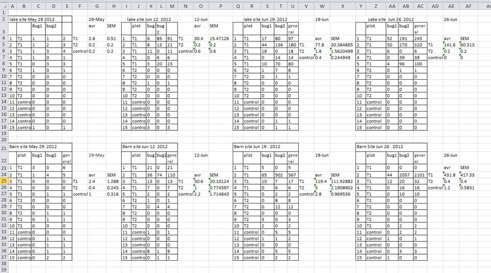

> **Challenge**
> 
> Compare the structure of the data presented above (loaded from the
> `iprg2.rda` files) and the `iprg` data.

### What are data frames?

Data frames are the _de facto_ data structure for most tabular data, and what we
use for statistics and plotting.

A data frame can be created by hand, but most commonly they are generated by the
functions `read.csv()` or `read.table()`; in other words, when importing
spreadsheets from your hard drive (or the web).

A data frame is the representation of data in the format of a table where the
columns are vectors that all have the same length. Because the column are
vectors, they all contain the same type of data (e.g., characters, integers,
factors). We can see this when inspecting the <b>str</b>ucture of a data frame
with the function `str()`:


```r
str(iprg)
```

```
## 'data.frame':	36321 obs. of  7 variables:
##  $ Protein      : Factor w/ 3027 levels "sp|D6VTK4|STE2_YEAST",..: 1 1 1 1 1 1 1 1 1 1 ...
##  $ Log2Intensity: num  26.8 26.6 26.6 26.8 26.8 ...
##  $ Run          : Factor w/ 12 levels "JD_06232014_sample1-A.raw",..: 2 3 1 4 5 6 7 8 9 11 ...
##  $ Condition    : Factor w/ 4 levels "Condition1","Condition2",..: 1 1 1 2 2 2 3 3 3 4 ...
##  $ BioReplicate : int  1 1 1 2 2 2 3 3 3 4 ...
##  $ Intensity    : num  1.18e+08 1.02e+08 1.01e+08 1.20e+08 1.16e+08 ...
##  $ TechReplicate: Factor w/ 3 levels "A","B","C": 2 3 1 1 2 3 1 2 3 2 ...
```

### Inspecting `data.frame` objects

We already saw how the functions `head()` and `str()` can be useful to check the
content and the structure of a data frame. Here is a non-exhaustive list of
functions to get a sense of the content/structure of the data. Let's try them out!

* Size:
    * `dim(iprg)` - returns a vector with the number of rows in the first element,
          and the number of columns as the second element (the **dim**ensions of
          the object)
    * `nrow(iprg)` - returns the number of rows
    * `ncol(iprg)` - returns the number of columns

* Content:
    * `head(iprg)` - shows the first 6 rows
    * `tail(iprg)` - shows the last 6 rows

* Names:
    * `names(iprg)` - returns the column names (synonym of `colnames()` for `data.frame`
	   objects)
    * `rownames(iprg)` - returns the row names

* Summary:
    * `str(iprg)` - structure of the object and information about the class, length and
	   content of  each column
    * `summary(iprg)` - summary statistics for each column

Note: most of these functions are "generic", they can be used on other types of
objects besides `data.frame`.


> **Challenge**
>
> Based on the output of `str(iprg)`, can you answer the following questions?
>
> * What is the class of the object `iprg`?
> * How many rows and how many columns are in this object?
> * How many proteins have been assayed?

### Indexing and subsetting data frames

Our data frame has rows and columns (it has 2 dimensions), if we want
to extract some specific data from it, we need to specify the
*coordinates* we want from it. Row numbers come first, followed by
column numbers. However, note that different ways of specifying these
coordinates lead to results with different classes.


```r
iprg[1]      # first column in the data frame (as a data.frame)
iprg[, 1]    # first column in the data frame (as a vector)
iprg[1, 1]   # first element in the first column of the data frame (as a vector)
iprg[1, 6]   # first element in the 6th column (as a vector)
iprg[1:3, 3] # first three elements in the 3rd column (as a vector)
iprg[3, ]    # the 3rd element for all columns (as a data.frame)
head_iprg <- iprg[1:6, ] # equivalent to head(iprg)
```

`:` is a special function that creates numeric vectors of integers in
increasing or decreasing order, test `1:10` and `10:1` for instance.

You can also exclude certain parts of a data frame using the `-` sign:


```r
iprg[, -1]          # The whole data frame, except the first column
iprg[-c(7:36321), ] # Equivalent to head(iprg)
```

As well as using numeric values to subset a `data.frame` columns can
be called by name, using one of the four following notations:


```r
iprg["Protein"]       # Result is a data.frame
iprg[, "Protein"]     # Result is a vector
iprg[["Protein"]]     # Result is a vector
iprg$Protein          # Result is a vector
```

For our purposes, the last three notations are equivalent. RStudio
knows about the columns in your data frame, so you can take advantage
of the autocompletion feature to get the full and correct column name.

> **Challenge**
>
> 1. Create a `data.frame` (`iprg_200`) containing only the observations from
>    row 200 of the `iprg` dataset.


```r
iprg_200 <- iprg[200, ]
```

> 2. Notice how `nrow()` gave you the number of rows in a `data.frame`?
>
>      * Use that number to pull out just that last row in the data frame.
>      * Compare that with what you see as the last row using `tail()` to make
>        sure it's meeting expectations.
>      * Pull out that last row using `nrow()` instead of the row number.
>      * Create a new data frame object (`iprg_last`) from that last row.


```r
iprg_last <- iprg[nrow(iprg), ]
```

> 3. Extract the row that is in the middle of the data frame. Store
>    the content of this row in an object named `iprg_middle`.


```r
i <- floor(nrow(iprg)/2)
iprg_middle <- iprg[i, ]
```

> 4. Combine `nrow()` with the `-` notation above to reproduce the behavior of
>    `head(iprg)` keeping just the first through 6th rows of the `iprg`
>    dataset.


```r
iprg[-(7:nrow(iprg)), ]
```

```
##                Protein Log2Intensity                       Run  Condition
## 1 sp|D6VTK4|STE2_YEAST      26.81232 JD_06232014_sample1_B.raw Condition1
## 2 sp|D6VTK4|STE2_YEAST      26.60786 JD_06232014_sample1_C.raw Condition1
## 3 sp|D6VTK4|STE2_YEAST      26.58301 JD_06232014_sample1-A.raw Condition1
## 4 sp|D6VTK4|STE2_YEAST      26.83563 JD_06232014_sample2_A.raw Condition2
## 5 sp|D6VTK4|STE2_YEAST      26.79430 JD_06232014_sample2_B.raw Condition2
## 6 sp|D6VTK4|STE2_YEAST      26.60863 JD_06232014_sample2_C.raw Condition2
##   BioReplicate Intensity TechReplicate
## 1            1 117845016             B
## 2            1 102273602             C
## 3            1 100526837             A
## 4            2 119765106             A
## 5            2 116382798             B
## 6            2 102328260             C
```

## Factors


When we did `str(iprg)` we saw that several of the columns consist of
numerics, however, the columns `Protein`, `Run`, and `Condition`, are
of a special class called a `factor`. Factors are very useful and are
actually something that make R particularly well suited to working
with data, so we're going to spend a little time introducing them.

Factors are used to represent categorical data. Factors can be ordered
or unordered, and understanding them is necessary for statistical
analysis and for plotting.

Factors are stored as integers, and have labels (text) associated with
these unique integers. While factors look (and often behave) like
character vectors, they are actually integers under the hood, and you
need to be careful when treating them like strings.

Once created, factors can only contain a pre-defined set of values,
known as *levels*. By default, R always sorts *levels* in alphabetical
order. For instance, if you have a factor with 2 levels:


```r
sex <- factor(c("male", "female", "female", "male"))
```

R will assign `1` to the level `"female"` and `2` to the level
`"male"` (because `f` comes before `m`, even though the first element
in this vector is `"male"`). You can check this by using the function
`levels()`, and check the number of levels using `nlevels()`:


```r
levels(sex)
```

```
## [1] "female" "male"
```

```r
nlevels(sex)
```

```
## [1] 2
```

Sometimes, the order of the factors does not matter, other times you
might want to specify the order because it is meaningful (e.g., "low",
"medium", "high"), it improves your visualization, or it is required
by a particular type of analysis. Here, one way to reorder our levels
in the `sex` vector would be:


```r
sex # current order
```

```
## [1] male   female female male  
## Levels: female male
```

```r
sex <- factor(sex, levels = c("male", "female"))
sex # after re-ordering
```

```
## [1] male   female female male  
## Levels: male female
```

In R's memory, these factors are represented by integers (1, 2, 3),
but are more informative than integers because factors are self
describing: `"female"`, `"male"` is more descriptive than `1`,
`2`. Which one is "male"?  You wouldn't be able to tell just from the
integer data. Factors, on the other hand, have this information built
in. It is particularly helpful when there are many levels (like the
species names in our example dataset).

### Converting factors

If you need to convert a factor to a character vector, you use
`as.character(x)`.


```r
as.character(sex)
```

```
## [1] "male"   "female" "female" "male"
```

### Using `stringsAsFactors=FALSE`

By default, when building or importing a data frame, the columns that
contain characters (i.e., text) are coerced (=converted) into the
`factor` data type. Depending on what you want to do with the data,
you may want to keep these columns as `character`. To do so,
`read.csv()` and `read.table()` have an argument called
`stringsAsFactors` which can be set to `FALSE`.

In most cases, it's preferable to set `stringsAsFactors = FALSE` when
importing your data, and converting as a factor only the columns that
require this data type.

> **Challenge**
> 
> Compare the output of `str(surveys)` when setting `stringsAsFactors = TRUE` (default) and `stringsAsFactors = FALSE`:


```r
iprg <- read.csv("data/iPRG_example_runsummary.csv", stringsAsFactors = TRUE)
str(iprg)
```

```
## 'data.frame':	36321 obs. of  7 variables:
##  $ Protein      : Factor w/ 3027 levels "sp|D6VTK4|STE2_YEAST",..: 1 1 1 1 1 1 1 1 1 1 ...
##  $ Log2Intensity: num  26.8 26.6 26.6 26.8 26.8 ...
##  $ Run          : Factor w/ 12 levels "JD_06232014_sample1-A.raw",..: 2 3 1 4 5 6 7 8 9 11 ...
##  $ Condition    : Factor w/ 4 levels "Condition1","Condition2",..: 1 1 1 2 2 2 3 3 3 4 ...
##  $ BioReplicate : int  1 1 1 2 2 2 3 3 3 4 ...
##  $ Intensity    : num  1.18e+08 1.02e+08 1.01e+08 1.20e+08 1.16e+08 ...
##  $ TechReplicate: Factor w/ 3 levels "A","B","C": 2 3 1 1 2 3 1 2 3 2 ...
```

```r
iprg <- read.csv("data/iPRG_example_runsummary.csv", stringsAsFactors = FALSE)
str(iprg)
```

```
## 'data.frame':	36321 obs. of  7 variables:
##  $ Protein      : chr  "sp|D6VTK4|STE2_YEAST" "sp|D6VTK4|STE2_YEAST" "sp|D6VTK4|STE2_YEAST" "sp|D6VTK4|STE2_YEAST" ...
##  $ Log2Intensity: num  26.8 26.6 26.6 26.8 26.8 ...
##  $ Run          : chr  "JD_06232014_sample1_B.raw" "JD_06232014_sample1_C.raw" "JD_06232014_sample1-A.raw" "JD_06232014_sample2_A.raw" ...
##  $ Condition    : chr  "Condition1" "Condition1" "Condition1" "Condition2" ...
##  $ BioReplicate : int  1 1 1 2 2 2 3 3 3 4 ...
##  $ Intensity    : num  1.18e+08 1.02e+08 1.01e+08 1.20e+08 1.16e+08 ...
##  $ TechReplicate: chr  "B" "C" "A" "A" ...
```

## Other data structures

|          | dimensions | number of types | 
|:---------|------------|-----------------|
| `vector` |       1    |       1         | 
| `matrix` |       2    |       1         | 
| `array`  |     any    |       1         | 
|`data.frame`|       2    | 1 per colums    | 
| `list`   | 1 (length) | any             |

## Data exploration

Let's explore some basic properties of our dataset. Go to the RStudio
Environment pane and double click the `iPRG_example` entry. This data
is in tidy, long format, which is an easier data format for data
manipulation operations such as selecting, grouping, summarizing, etc.

Data exported out of many omics processing or quantification tools are
often formatted in *wide* format, which is easier to read when we
would like to compare values (i.e intensity values) for specific
subjects (i.e peptides) across different values for a variable of
interest such as (i.e conditions). We'll format a summary of this
dataset as a 'wide' data frame later in this tutorial.

Let's do some more data exploration by examining how R read in the
iPRG dataset.


> **Challenge**
> 
> Explore the data as described below
>
> * What is the *class* of the variable?
> * What dimension is it? How many rows and columns does it have?
> * What variables (column names) do we have?
> * Look at the few first and last lines to make sure the data was
>   imported correctly.
> * Display a summary of the whole data.

Let's now inspect the possible values for the `Conditions` and the
`BioReplicate` columns. To aswer the questions, below, we will need to
use the `unique` function. From the manual page, we learn that 

```
'unique' returns a vector, data frame or array like 'x' but with
duplicate elements/rows removed.
```

For example


```r
unique(c(1, 2, 4, 1, 1, 2, 3, 3, 4, 1))
```

```
## [1] 1 2 4 3
```

```r
unique(c("a", "b", "a"))
```

```
## [1] "a" "b"
```


```r
dfr <- data.frame(x = c(1, 1, 2),
                  y = c("a", "a", "b"))
dfr
```

```
##   x y
## 1 1 a
## 2 1 a
## 3 2 b
```

```r
unique(dfr)
```

```
##   x y
## 1 1 a
## 3 2 b
```

> **Challenge**
>
> * How many conditions are there?


```r
unique(iprg$Condition)
```

```
## [1] "Condition1" "Condition2" "Condition3" "Condition4"
```

```r
length(unique(iprg$Condition))
```

```
## [1] 4
```

> * How many biological replicates are there?


```r
unique(iprg$BioReplicate)
```

```
## [1] 1 2 3 4
```

```r
length(unique(iprg$BioReplicate))
```

```
## [1] 4
```

> * How many condition/technical replicates combinations are there?


```r
unique(iprg$Condition)
```

```
## [1] "Condition1" "Condition2" "Condition3" "Condition4"
```

```r
unique(iprg$BioReplicate)
```

```
## [1] 1 2 3 4
```

```r
unique(iprg[, c("Condition", "TechReplicate")])
```

```
##     Condition TechReplicate
## 1  Condition1             B
## 2  Condition1             C
## 3  Condition1             A
## 4  Condition2             A
## 5  Condition2             B
## 6  Condition2             C
## 7  Condition3             A
## 8  Condition3             B
## 9  Condition3             C
## 10 Condition4             B
## 11 Condition4             C
## 12 Condition4             A
```

It is often useful to start a preliminary analysis, or proceed with a
more detailed data exploration using a smalle subset of the data.

> **Challenge**
> 
> Select subsets of rows from iPRG dataset. Let's focus on 
> 
> * Condition 1 only 
> * Condition 1 and TechReplicate A
> * all measurements on one particular MS run.
> * Conditions 1 and 2
>
> For each of there, how many measurements are there?


```r
iprg_c1 <- iprg[iprg$Condition == "Condition1", ]
head(iprg_c1)
```

```
##                 Protein Log2Intensity                       Run  Condition
## 1  sp|D6VTK4|STE2_YEAST      26.81232 JD_06232014_sample1_B.raw Condition1
## 2  sp|D6VTK4|STE2_YEAST      26.60786 JD_06232014_sample1_C.raw Condition1
## 3  sp|D6VTK4|STE2_YEAST      26.58301 JD_06232014_sample1-A.raw Condition1
## 13 sp|O13297|CET1_YEAST      24.71912 JD_06232014_sample1_B.raw Condition1
## 14 sp|O13297|CET1_YEAST      24.67437 JD_06232014_sample1_C.raw Condition1
## 15 sp|O13297|CET1_YEAST      24.71809 JD_06232014_sample1-A.raw Condition1
##    BioReplicate Intensity TechReplicate
## 1             1 117845016             B
## 2             1 102273602             C
## 3             1 100526837             A
## 13            1  27618234             B
## 14            1  26774670             C
## 15            1  27598550             A
```

```r
nrow(iprg_c1)
```

```
## [1] 9079
```

```r
iprg_c1A <- iprg[iprg$Condition == "Condition1" & iprg$TechReplicate == "A", ]
head(iprg_c1A)
```

```
##                  Protein Log2Intensity                       Run
## 3   sp|D6VTK4|STE2_YEAST      26.58301 JD_06232014_sample1-A.raw
## 15  sp|O13297|CET1_YEAST      24.71809 JD_06232014_sample1-A.raw
## 27  sp|O13329|FOB1_YEAST      23.47075 JD_06232014_sample1-A.raw
## 39  sp|O13539|THP2_YEAST      24.29661 JD_06232014_sample1-A.raw
## 51 sp|O13547|CCW14_YEAST      27.11638 JD_06232014_sample1-A.raw
## 63 sp|O13563|RPN13_YEAST      26.17056 JD_06232014_sample1-A.raw
##     Condition BioReplicate Intensity TechReplicate
## 3  Condition1            1 100526837             A
## 15 Condition1            1  27598550             A
## 27 Condition1            1  11625198             A
## 39 Condition1            1  20606703             A
## 51 Condition1            1 145493943             A
## 63 Condition1            1  75530595             A
```

```r
nrow(iprg_c1A)
```

```
## [1] 3026
```

```r
iprg_r1 <- iprg[iprg$Run == "JD_06232014_sample1_B.raw", ]
head(iprg_r1)
```

```
##                  Protein Log2Intensity                       Run
## 1   sp|D6VTK4|STE2_YEAST      26.81232 JD_06232014_sample1_B.raw
## 13  sp|O13297|CET1_YEAST      24.71912 JD_06232014_sample1_B.raw
## 25  sp|O13329|FOB1_YEAST      23.37678 JD_06232014_sample1_B.raw
## 37  sp|O13539|THP2_YEAST      27.52021 JD_06232014_sample1_B.raw
## 49 sp|O13547|CCW14_YEAST      27.22234 JD_06232014_sample1_B.raw
## 61 sp|O13563|RPN13_YEAST      26.09476 JD_06232014_sample1_B.raw
##     Condition BioReplicate Intensity TechReplicate
## 1  Condition1            1 117845016             B
## 13 Condition1            1  27618234             B
## 25 Condition1            1  10892143             B
## 37 Condition1            1 192490784             B
## 49 Condition1            1 156581624             B
## 61 Condition1            1  71664672             B
```

```r
nrow(iprg_r1)
```

```
## [1] 3026
```

```r
iprg_c12 <- iprg[iprg$Condition %in% c("Condition1", "Condition2"), ]
head(iprg_c12)
```

```
##                Protein Log2Intensity                       Run  Condition
## 1 sp|D6VTK4|STE2_YEAST      26.81232 JD_06232014_sample1_B.raw Condition1
## 2 sp|D6VTK4|STE2_YEAST      26.60786 JD_06232014_sample1_C.raw Condition1
## 3 sp|D6VTK4|STE2_YEAST      26.58301 JD_06232014_sample1-A.raw Condition1
## 4 sp|D6VTK4|STE2_YEAST      26.83563 JD_06232014_sample2_A.raw Condition2
## 5 sp|D6VTK4|STE2_YEAST      26.79430 JD_06232014_sample2_B.raw Condition2
## 6 sp|D6VTK4|STE2_YEAST      26.60863 JD_06232014_sample2_C.raw Condition2
##   BioReplicate Intensity TechReplicate
## 1            1 117845016             B
## 2            1 102273602             C
## 3            1 100526837             A
## 4            2 119765106             A
## 5            2 116382798             B
## 6            2 102328260             C
```

```r
nrow(iprg_c12)
```

```
## [1] 18160
```

# Part 2: Data visualisation

## Histogram

Make a histogram of all the MS1 intensities, quantified by Skyline,
for `iPRG_example`.


```r
hist(iprg$Intensity)
```

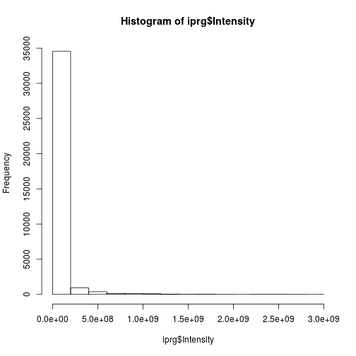

Our histogram looks quite skewed. How does this look on log-scale? 

Do you recognise this distribution? The distribution for
log2-transformed intensities looks very similar to the normal
distribution. The advantage of working with normally distributed data
is that we can apply a variety of statistical tests to analyse and
interpret our data. Let's add a log2-scaled intensity column to our
data so we don't have to transform the original intensities every time
we need them.


```r
hist(iprg$Log2Intensity,
     xlab = "log2 transformed intensities",
     main = "Histogram of iPRG data")
```


In this case, we have duplicated information in our data, we have the
raw and log-transformed data. This is not necessary (and not advised),
as it is straightforward to transform the data on the flight.


```r
hist(log2(iprg$Intensity),
     xlab = "log2 transformed intensities",
     main = "Histogram of iPRG data")
```

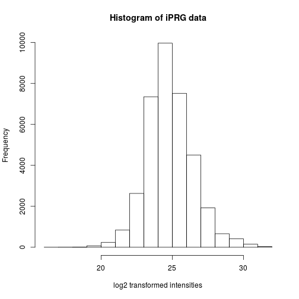

We look at the summary for the log2-transformed values including the
value for the mean. Let's fix that first.


```r
summary(iprg$Log2Intensity)
```

```
##    Min. 1st Qu.  Median    Mean 3rd Qu.    Max. 
##   16.37   23.78   24.68   24.82   25.78   31.42
```


> **Challenge**
> 
> Reproduce the histogram above but plotting the data on the log base
> 10 scale, using the `log10` function. See also the more general
> `log` function.


```r
hist(log10(iprg$Intensity))
```


## Boxplot or box-and-whisker plot

Boxplots are extremely useful because they allow us to quickly
visualise the data distribution, without making assumptions of the
distribution type (non-parametric). We can read up on what statistics
the different elements of a box-and-whisker represent in the R help
files.


```r
boxplot(iprg$Log2Intensity)
```


The boxplot, however, shows us the intensities for all conditions and
replicates. If we want to display the data for, we have multile
possibilities.

* We can first split the data, using the `by` function


```r
int_by_run <- by(iprg$Log2Intensity, iprg$Run, c)
boxplot(int_by_run)
```


* We can use the formula syntax


```r
boxplot(Log2Intensity ~ Run, data = iprg)
```


* We can use the `ggplot2` package that is very flexible to visualise
  data under different angles.
  
  
## The `ggplot2`  package

`ggplot2` is a plotting package that makes it simple to create
complex plots from data in a data frame. It provides a more
programmatic interface for specifying what variables to plot, how they
are displayed, and general visual properties, so we only need minimal
changes if the underlying data change or if we decide to change from a
bar plot to a scatterplot. This helps in creating publication quality
plots with minimal amounts of adjustments and tweaking.

### Comparison between base graphics and `ggplot2`

**Base graphics**

Uses a *canvas model* a series of instructions that sequentially fill
the plotting canvas. While this model is very useful to build plots
bits by bits bottom up, which is useful in some cases, it has some
clear drawback:

* Layout choices have to be made without global overview over what may
  still be coming.
* Different functions for different plot types with different
  interfaces.
* No standard data input.
* Many routine tasks require a lot of boilerplate code.
* No concept of facets/lattices/viewports.
* Poor default colours.

**The grammar of graphics**

The components of `ggplot2`'s of graphics are

1. A **tidy** dataset
2. A choice of geometric objects that servers as the visual
   representation of the data - for instance, points, lines,
   rectangles, contours.
3. A description of how the variables in the data are mapped to visual
   properties (aesthetics) or the geometric objects, and an associated
   scale (e.g. linear, logarithmic, rang)
4. A statistical summarisation rule
5. A coordinate system.
6. A facet specification, i.e. the use of several plots to look at the
   same data.


Fist of all, we need to load the `ggplot2` package


```r
library("ggplot2")
```

ggplot graphics are built step by step by adding new elements.

To build a ggplot we need to:

* bind the plot to a specific data frame using the `data` argument


```r
ggplot(data = iprg)
```

* define aesthetics (`aes`), by selecting the variables to be plotted
  and the variables to define the presentation such as plotting size,
  shape color, etc.


```r
ggplot(data = iprg, aes(x = Run, y = Log2Intensity))
```

* add `geoms` -- graphical representation of the data in the plot
     (points, lines, bars). To add a geom to the plot use `+` operator


```r
ggplot(data = iprg, aes(x = Run, y = Log2Intensity)) +
  geom_boxplot()
```


See the [documentation page](http://ggplot2.tidyverse.org/reference/)
to explore the many available `geoms`.


The `+` in the `ggplot2` package is particularly useful because it
allows you to modify existing `ggplot` objects. This means you can
easily set up plot "templates" and conveniently explore different
types of plots, so the above plot can also be generated with code like
this:


```r
## Assign plot to a variable
ints_plot <- ggplot(data = iprg, aes(x = Run, y = Log2Intensity))

## Draw the plot
ints_plot + geom_boxplot()
```

Notes:

* Anything you put in the `ggplot()` function can be seen by any geom layers
  that you add (i.e., these are universal plot settings). This includes the x and
  y axis you set up in `aes()`.
  
* You can also specify aesthetics for a given geom independently of the
  aesthetics defined globally in the `ggplot()` function.

* The `+` sign used to add layers must be placed at the end of each
  line containing a layer. If, instead, the `+` sign is added in the
  line before the other layer, `ggplot2` will not add the new layer
  and will return an error message.


> **Challenge**
> 
> * Repeat the plot above but displaying the raw intensities. 
> * Log-10 transform the raw intensities on the flight when plotting.


```r
ggplot(data = iprg, aes(x = Run, y = Intensity)) + geom_boxplot()
```

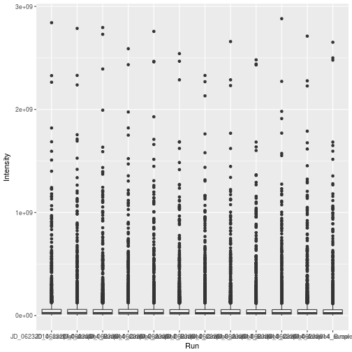

```r
ggplot(data = iprg, aes(x = Run, y = log10(Intensity))) + geom_boxplot()
```

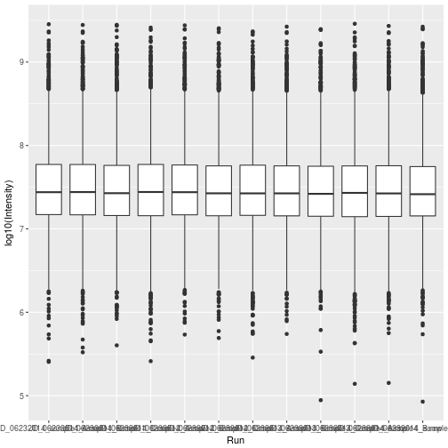
## Customising plots 

First, let's colour the boxplot based on the condition:


```r
ggplot(data = iprg,
       aes(x = Run, y = Log2Intensity,
           fill = Condition)) +
  geom_boxplot()
```

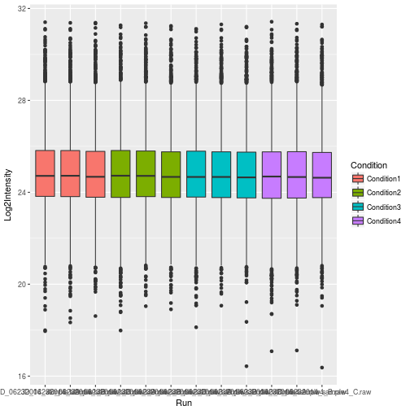

Now let's rename all axis labels and title, and rotate the x-axis
labels 90 degrees. We can add those specifications using the `labs`
and `theme` functions of the `ggplot2` package.


```r
ggplot(aes(x = Run, y = Log2Intensity, fill = Condition),
       data = iprg) +
    geom_boxplot() +
    labs(title = 'Log2 transformed intensity distribution per MS run',
         y = 'Log2(Intensity)',
         x = 'MS run') +
    theme(axis.text.x = element_text(angle = 90))    
```

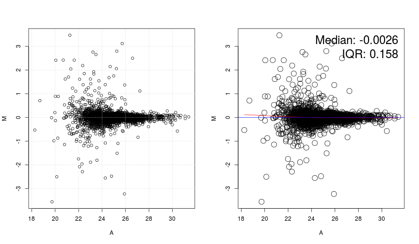


And easily switch from a boxplot to a violin plot representation by
changing the `geom` type.


```r
ggplot(aes(x = Run, y = Log2Intensity, fill = Condition),
       data = iprg) +
    geom_violin() +
    labs(title = 'Log2 transformed intensity distribution per Subject',
         y = 'Log2(Intensity)',
         x = 'MS run') +
    theme(axis.text.x = element_text(angle = 90))
```


Finally, we can also overlay multiple geoms by simply *adding* them
one after the other.


```r
p <- ggplot(aes(x = Run, y = Log2Intensity, fill = Condition),
            data = iprg)
p + geom_boxplot()
```


```r
p + geom_boxplot() + geom_jitter() ## not very usefull
```

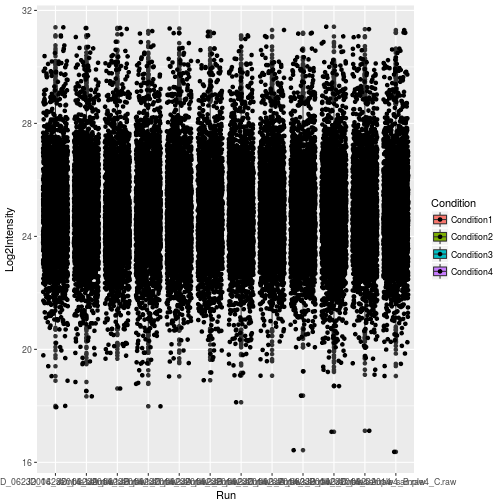

```r
p + geom_jitter() + geom_boxplot()
```

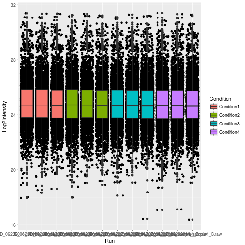

```r
p + geom_jitter(alpha = 0.1) + geom_boxplot()
```


> **Challenge**
> 
> * Overlay a boxplot goem on top of a jitter geom for the raw or
>   log-10 transformed intensities.
> * Customise the plot as suggested above.


```r
## Note how the log10 transformation is applied to both geoms
ggplot(data = iprg, aes(x = Run, y = log10(Intensity))) +
    geom_jitter(alpha = 0.1) +
    geom_boxplot()
```


Finally, a very useful feature of `ggplot2` is **facetting**, that
defines how to subset the data into different *panels* (facets).


```r
names(iprg)
```

```
## [1] "Protein"       "Log2Intensity" "Run"           "Condition"    
## [5] "BioReplicate"  "Intensity"     "TechReplicate"
```

```r
ggplot(data = iprg,
       aes(x = TechReplicate, y = Log2Intensity,
           fill = Condition)) +
    geom_boxplot() + 
    facet_grid(~ Condition)
```

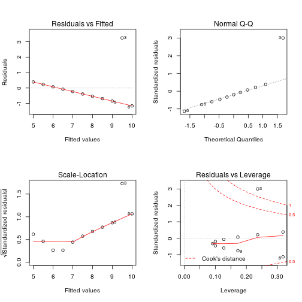

## Saving your work

You can save plots to a number of different file formats. PDF is by
far the most common format because it's lightweight, cross-platform
and scales up well but jpegs, pngs and a number of other file formats
are also supported. Let's redo the last barplot but save it to the
file system this time.

Let's save the boxplot as pdf file. 


```r
pdf()
p + geom_jitter(alpha = 0.1) + geom_boxplot()
dev.off()
```

The default file name is `Rplots.pdf`. We can customise that file name
specifying it by passing the file name, as a character, to the `pdf()`
function.

> **Challenge**
> 
> Save a figure of your choice to a pdf file. Read the manual for the
> `png` function and save that same image to a png file.
>
> **Tip**: save your figures in a dedicated directory.

Finally, we can save this whole session you worked so hard on! We can
save individual variables using the `save` function, or save the
complete environment with `save.image`. Be careful though, as this can
save a lot of unnecessary (temporary) data.


```r
save.image(file = '02-rstats-all.rda')
```

**Tip**: The best way to save your work is to save the script that
contains the exact command that lead to the results! Or better, we can
save and document our full analysis in an R markdown file!

# Part 3: Basic statistics

## Randomisation

### Random selection of samples from a larger set

Let's assume that we have the population with a total of 10 subjects. Suppose we label them from 1 to 10 and randomly would like
to select 3 subjects we can do this using the `sample` function. When
we run `sample` another time, different subjects will be selected. Try
this a couple times.


```r
sample(10, 3)
```

```
## [1] 3 4 7
```

```r
sample(10, 3)
```

```
## [1] 10  7  3
```

Now suppose we would like to select the same randomly selected samples
every time, then we can use a random seed number.


```r
set.seed(3728)
sample(10, 3)
```

```
## [1] 5 8 7
```

```r
set.seed(3728)
sample(10, 3)
```

```
## [1] 5 8 7
```

Let's practice with fun example. Select two in our group member for coming early next Monday.

```r
group.member <- c('Meena', 'Tsung-Heng', 'Ting', 'April', 'Dan', 'Cyril', 'Kylie', 'Sara')
sample(group.member, 2)
```

```
## [1] "Dan"   "Cyril"
```


### Completely randomized order of MS runs

We can also create a random order using all elements of iPRG
dataset. Again, we can achieve this using `sample`, asking for exactly
the amount of samples in the subset. This time, each repetition gives
us a different order of the complete set.


```r
msrun <- unique(iprg$Run)
msrun
```

```
##  [1] "JD_06232014_sample1_B.raw" "JD_06232014_sample1_C.raw"
##  [3] "JD_06232014_sample1-A.raw" "JD_06232014_sample2_A.raw"
##  [5] "JD_06232014_sample2_B.raw" "JD_06232014_sample2_C.raw"
##  [7] "JD_06232014_sample3_A.raw" "JD_06232014_sample3_B.raw"
##  [9] "JD_06232014_sample3_C.raw" "JD_06232014_sample4_B.raw"
## [11] "JD_06232014_sample4_C.raw" "JD_06232014_sample4-A.raw"
```

```r
## randomize order among all 12 MS runs
sample(msrun, length(msrun))
```

```
##  [1] "JD_06232014_sample1_B.raw" "JD_06232014_sample3_C.raw"
##  [3] "JD_06232014_sample4_B.raw" "JD_06232014_sample1_C.raw"
##  [5] "JD_06232014_sample3_B.raw" "JD_06232014_sample4_C.raw"
##  [7] "JD_06232014_sample3_A.raw" "JD_06232014_sample2_B.raw"
##  [9] "JD_06232014_sample1-A.raw" "JD_06232014_sample2_C.raw"
## [11] "JD_06232014_sample4-A.raw" "JD_06232014_sample2_A.raw"
```

```r
## different order will be shown.
sample(msrun, length(msrun))
```

```
##  [1] "JD_06232014_sample3_B.raw" "JD_06232014_sample2_A.raw"
##  [3] "JD_06232014_sample3_A.raw" "JD_06232014_sample2_B.raw"
##  [5] "JD_06232014_sample2_C.raw" "JD_06232014_sample3_C.raw"
##  [7] "JD_06232014_sample4-A.raw" "JD_06232014_sample1-A.raw"
##  [9] "JD_06232014_sample4_B.raw" "JD_06232014_sample1_C.raw"
## [11] "JD_06232014_sample1_B.raw" "JD_06232014_sample4_C.raw"
```

### Randomized block design

- Allow to remove known sources of variability that you are not
  interested in.

- Group conditions into blocks such that the conditions in a block are
  as similar as possible.

- Randomly assign samples with a block.

This particular dataset contains a total of 12 MS runs across 4
conditions, 3 technical replicates per condition. Using the
`block.random` function in the `psych` package, we can achieve
randomized block designs! `block.random` function makes random assignment of `n` subjects with an equal number in all of `N` conditions.


```r
library("psych") ## load the psych package

msrun <- unique(iprg[, c('Condition','Run')])
msrun
```

```
##     Condition                       Run
## 1  Condition1 JD_06232014_sample1_B.raw
## 2  Condition1 JD_06232014_sample1_C.raw
## 3  Condition1 JD_06232014_sample1-A.raw
## 4  Condition2 JD_06232014_sample2_A.raw
## 5  Condition2 JD_06232014_sample2_B.raw
## 6  Condition2 JD_06232014_sample2_C.raw
## 7  Condition3 JD_06232014_sample3_A.raw
## 8  Condition3 JD_06232014_sample3_B.raw
## 9  Condition3 JD_06232014_sample3_C.raw
## 10 Condition4 JD_06232014_sample4_B.raw
## 11 Condition4 JD_06232014_sample4_C.raw
## 12 Condition4 JD_06232014_sample4-A.raw
```

```r
## 4 Conditions of 12 MS runs randomly ordered
block.random(n = 12, c(Condition = 4))
```

```
##     blocks Condition
## S1       1         4
## S2       1         2
## S3       1         3
## S4       1         1
## S5       2         2
## S6       2         1
## S7       2         3
## S8       2         4
## S9       3         4
## S10      3         3
## S11      3         2
## S12      3         1
```

```r
block.random(n = 12, c(Condition = 4, BioReplicate=3))
```

```
##     blocks Condition BioReplicate
## S1       1         4            2
## S2       1         4            1
## S3       1         3            1
## S4       1         1            1
## S5       1         1            2
## S6       1         3            3
## S7       1         2            1
## S8       1         2            3
## S9       1         4            3
## S10      1         2            2
## S11      1         1            3
## S12      1         3            2
```


## Basic statistical summaries

### Calculate simple statistics

Let's start data with one protein as an example and calculate the
mean, standard deviation, standard error of the mean across all
replicates per condition. We then store all the computed statistics
into a single summary data frame for easy access.

We can use the `aggregate` function to compute summary statistics. `aggregate` splits the data into subsets, computes summary statistics for each, and returns the result in a convenient form.


```r
# check what proteins are in dataset, show all protein names
head(unique(iprg$Protein))
```

```
## [1] "sp|D6VTK4|STE2_YEAST"  "sp|O13297|CET1_YEAST"  "sp|O13329|FOB1_YEAST" 
## [4] "sp|O13539|THP2_YEAST"  "sp|O13547|CCW14_YEAST" "sp|O13563|RPN13_YEAST"
```


```r
# Let's start with one protein, named "sp|P44015|VAC2_YEAST"
oneproteindata <- iprg[iprg$Protein == "sp|P44015|VAC2_YEAST", ]

# there are 12 rows in oneproteindata
oneproteindata
```

```
##                    Protein Log2Intensity                       Run
## 21096 sp|P44015|VAC2_YEAST      26.30163 JD_06232014_sample1_B.raw
## 21097 sp|P44015|VAC2_YEAST      26.11643 JD_06232014_sample1_C.raw
## 21098 sp|P44015|VAC2_YEAST      26.29089 JD_06232014_sample1-A.raw
## 21099 sp|P44015|VAC2_YEAST      25.81957 JD_06232014_sample2_A.raw
## 21100 sp|P44015|VAC2_YEAST      26.11527 JD_06232014_sample2_B.raw
## 21101 sp|P44015|VAC2_YEAST      26.08498 JD_06232014_sample2_C.raw
## 21102 sp|P44015|VAC2_YEAST      23.14806 JD_06232014_sample3_A.raw
## 21103 sp|P44015|VAC2_YEAST      23.32465 JD_06232014_sample3_B.raw
## 21104 sp|P44015|VAC2_YEAST      23.29555 JD_06232014_sample3_C.raw
## 21105 sp|P44015|VAC2_YEAST      20.94536 JD_06232014_sample4_B.raw
## 21106 sp|P44015|VAC2_YEAST      21.71424 JD_06232014_sample4_C.raw
## 21107 sp|P44015|VAC2_YEAST      20.25209 JD_06232014_sample4-A.raw
##        Condition BioReplicate Intensity TechReplicate
## 21096 Condition1            1  82714388             B
## 21097 Condition1            1  72749239             C
## 21098 Condition1            1  82100518             A
## 21099 Condition2            2  59219741             A
## 21100 Condition2            2  72690802             B
## 21101 Condition2            2  71180513             C
## 21102 Condition3            3   9295260             A
## 21103 Condition3            3  10505591             B
## 21104 Condition3            3  10295788             C
## 21105 Condition4            4   2019205             B
## 21106 Condition4            4   3440629             C
## 21107 Condition4            4   1248781             A
```


```r
# If you want to see more details, 
?aggregate
```

### Calculate mean per groups


```r
## splits 'oneproteindata' into subsets by 'Condition', 
## then, compute 'FUN=mean' of 'log2Int'
sub.mean <- aggregate(Log2Intensity ~ Condition,
                      data = oneproteindata,
                      FUN = mean)
sub.mean
```

```
##    Condition Log2Intensity
## 1 Condition1      26.23632
## 2 Condition2      26.00661
## 3 Condition3      23.25609
## 4 Condition4      20.97056
```

### Calculate SD (standard deviation) per groups

$$ s = \sqrt{\frac{1}{n-1} \sum_{i=1}^n (x_i - \bar x)^2} $$

> **Challenge**
> 
> Using the `aggregate` function above, calculate the standard
> deviation, by applying the `median` function.


```r
## The same as mean calculation above. 'FUN' is changed to 'sd'.
sub.median <- aggregate(Log2Intensity ~ Condition,
                    data = oneproteindata, FUN = median)
sub.median
```

```
##    Condition Log2Intensity
## 1 Condition1      26.29089
## 2 Condition2      26.08498
## 3 Condition3      23.29555
## 4 Condition4      20.94536
```

> Using the `aggregate` function above, calculate the standard
> deviation, by applying the `sd` function.


```r
## The same as mean calculation above. 'FUN' is changed to 'sd'.
sub.sd <- aggregate(Log2Intensity ~ Condition,
                    data = oneproteindata, FUN = sd)
sub.sd
```

```
##    Condition Log2Intensity
## 1 Condition1    0.10396539
## 2 Condition2    0.16268179
## 3 Condition3    0.09467798
## 4 Condition4    0.73140174
```


### Count the number of observation per groups

> **Challenge**
> 
> Using the `aggregate` function above, count the number of
> observations per group with the `length` function.


```r
## The same as mean calculation. 'FUN' is changed 'length'.
sub.len <- aggregate(Log2Intensity ~ Condition,
                     data = oneproteindata,
                     FUN = length)
sub.len
```

```
##    Condition Log2Intensity
## 1 Condition1             3
## 2 Condition2             3
## 3 Condition3             3
## 4 Condition4             3
```

### Calculate SE (standard error of mean) per groups

$$ SE = \sqrt{\frac{s^2}{n}} $$


```r
sub.se <- sqrt(sub.sd$Log2Intensity^2 / sub.len$Log2Intensity)
sub.se
```

```
## [1] 0.06002444 0.09392438 0.05466236 0.42227499
```

We can now make the summary table including the results above (mean,
sd, se and length).


```r
## paste0 : concatenate vectors after convering to character.
(grp <- paste0("Condition", 1:4)) 
```

```
## [1] "Condition1" "Condition2" "Condition3" "Condition4"
```

```r
## It is equivalent to paste("Condition", 1:4, sep="")
summaryresult <- data.frame(Group = grp,
                            mean = sub.mean$Log2Intensity,
                            sd = sub.sd$Log2Intensity, 
                            se = sub.se, 
                            length = sub.len$Log2Intensity)
summaryresult
```

```
##        Group     mean         sd         se length
## 1 Condition1 26.23632 0.10396539 0.06002444      3
## 2 Condition2 26.00661 0.16268179 0.09392438      3
## 3 Condition3 23.25609 0.09467798 0.05466236      3
## 4 Condition4 20.97056 0.73140174 0.42227499      3
```

## Visualization with error bars for descriptive purpose

*error bars* can have a variety of meanings or conclusions if what
they represent is not precisely specified. Below we provide some
examples of which types of error bars are common. We're using the
summary of protein `sp|P44015|VAC2_YEAST` from the previous section
and the `ggplot2` package as it provides a convenient way to make
easily adaptable plots.


```r
# means without any errorbar
p <- ggplot(aes(x = Group, y = mean, colour = Group),
            data = summaryresult)+
    geom_point(size = 3)
p
```


Let's change a number of visual properties to make the plot more attractive.
 
* Let's change the labels of x-axis and y-axis and title: `labs(title="Mean", x="Condition", y='Log2(Intensity)')`
* Let's change background color for white: `theme_bw()`
* Let's change size or color of labels of axes and title, text of
  x-axis by using a *theme*
* Let's change the position of legend (use `'none'` to remove it)
* Let's make the box for legend
* Let's remove the box for legend key.


```r
p2 <- p + labs(title = "Mean", x = "Group", y = 'Log2(Intensity)') +
    theme_bw() + 
    theme(plot.title = element_text(size = 25, colour = "darkblue"),
          axis.title.x = element_text(size = 15),
          axis.title.y = element_text(size = 15),
          axis.text.x = element_text(size = 13),
          legend.position = 'bottom',
          legend.background = element_rect(colour = 'black'),
          legend.key = element_rect(colour = 'white'))
p2
```


Let's now add the **standard deviation**:


```r
# mean with SD
p2 + geom_errorbar(aes(ymax = mean + sd, ymin = mean - sd), width = 0.1) + 
      labs(title="Mean with SD")
```

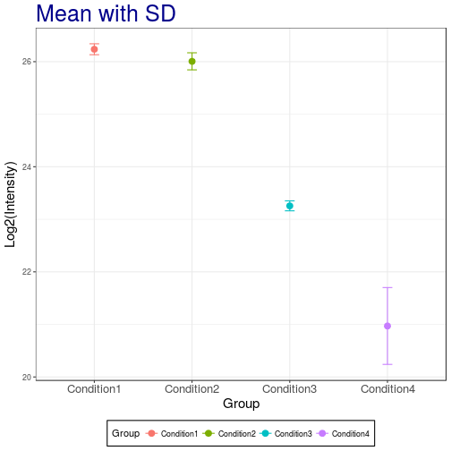

> **Challenge**
> 
> Add the **standard error of the mean**. Which one is smaller?


```r
# mean with SE
p2 + geom_errorbar(aes(ymax = mean + se, ymin=mean - se), width = 0.1) +
    labs(title="Mean with SE")
```


```r
## The SE is narrow than the SD!
```

> **Challenge**
> 
> Add the **standard error of the mean** with black color. 


```r
# mean with SE
p2 + geom_errorbar(aes(ymax = mean + se, ymin=mean - se), width = 0.1, color='black') +
    labs(title="Mean with SE")
```


## Working with statistical distributions

For each statistical distribution, we have function to compute

* density
* distribution function
* quantile function 
* random generation

For the normale distribution `norm`, these are respectively

* `dnorm`
* `pnorm`
* `qnorm`
* `rnorm`

Let's start by sampling 1000000 values from a normal distribution $N(0, 1)$:


```r
xn <- rnorm(1e6)
hist(xn, freq = FALSE)
rug(xn)
lines(density(xn), lwd = 2)
```


By definition, the area under the density curve is 1. The area at the
left of 0, 1, and 2 are respectively:


```r
pnorm(0)
```

```
## [1] 0.5
```

```r
pnorm(1)
```

```
## [1] 0.8413447
```

```r
pnorm(2)
```

```
## [1] 0.9772499
```

To ask the inverse question, we use the quantile function. The obtain
0.5, 0.8413447 and 0.9772499 of our distribution, we need means
of:


```r
qnorm(0.5)
```

```
## [1] 0
```

```r
qnorm(pnorm(1))
```

```
## [1] 1
```

```r
qnorm(pnorm(2))
```

```
## [1] 2
```

Finally, the density function gives us the *height* at which we are
for a given mean:


```r
hist(xn, freq = FALSE)
lines(density(xn), lwd = 2)
points(0, dnorm(0), pch = 19, col = "red")
points(1, dnorm(1), pch = 1, col = "blue")
points(2, dnorm(2), pch = 4, col = "orange")
```


## Calculate the confidence interval

Now that we've covered the standard error of the mean and the standard
deviation, let's investigate how we can add custom confidence
intervals (CI) for our measurement of the mean. We'll add these CI's
to the summary results we previously stored for protein
`sp|P44015|VAC2_YEAST`.

Confidence interval: 

$$\mbox{mean} \pm (SE \times \frac{\alpha}{2} ~ \mbox{quantile of t distribution})$$


To calculate the 95% confident interval, we need to be careful and set
the quantile for two-sided. We need to divide by two for error.  For
example, 95% confidence interval, right tail is 2.5% and left tail is
2.5%.


```r
summaryresult$ciw.lower.95 <- summaryresult$mean -
    qt(0.975, summaryresult$len - 1) * summaryresult$se
summaryresult$ciw.upper.95 <- summaryresult$mean +
    qt(0.975, summaryresult$len - 1) * summaryresult$se
summaryresult
```

```
##        Group     mean         sd         se length ciw.lower.95
## 1 Condition1 26.23632 0.10396539 0.06002444      3     25.97805
## 2 Condition2 26.00661 0.16268179 0.09392438      3     25.60248
## 3 Condition3 23.25609 0.09467798 0.05466236      3     23.02090
## 4 Condition4 20.97056 0.73140174 0.42227499      3     19.15366
##   ciw.upper.95
## 1     26.49458
## 2     26.41073
## 3     23.49128
## 4     22.78746
```


```r
# mean with 95% two-sided confidence interval
ggplot(aes(x = Group, y = mean, colour = Group),
       data = summaryresult) +
    geom_point() +
    geom_errorbar(aes(ymax = ciw.upper.95, ymin = ciw.lower.95), width = 0.1) +
    labs(title="Mean with 95% confidence interval", x="Condition", y='Log2(Intensity)') +
    theme_bw() +
    theme(plot.title = element_text(size=25, colour="darkblue"),
          axis.title.x = element_text(size=15),
          axis.title.y = element_text(size=15),
          axis.text.x = element_text(size=13),
          legend.position = 'bottom',
          legend.background = element_rect(colour = 'black'),
          legend.key = element_rect(colour='white'))
```


> **Challenges**
> 
> Replicate the above for the 99% two-sided confidence interval. 


```r
# mean with 99% two-sided confidence interval
summaryresult$ciw.lower.99 <- summaryresult$mean - qt(0.995,summaryresult$len-1) * summaryresult$se
summaryresult$ciw.upper.99 <- summaryresult$mean + qt(0.995,summaryresult$len-1) * summaryresult$se
summaryresult
```

```
##        Group     mean         sd         se length ciw.lower.95
## 1 Condition1 26.23632 0.10396539 0.06002444      3     25.97805
## 2 Condition2 26.00661 0.16268179 0.09392438      3     25.60248
## 3 Condition3 23.25609 0.09467798 0.05466236      3     23.02090
## 4 Condition4 20.97056 0.73140174 0.42227499      3     19.15366
##   ciw.upper.95 ciw.lower.99 ciw.upper.99
## 1     26.49458     25.64058     26.83205
## 2     26.41073     25.07442     26.93879
## 3     23.49128     22.71357     23.79860
## 4     22.78746     16.77955     25.16157
```

```r
ggplot(aes(x = Group, y = mean, colour = Group),
       data = summaryresult) +
    geom_point() +
    geom_errorbar(aes(ymax = ciw.upper.99, ymin=ciw.lower.99), width=0.1) +
    labs(title="Mean with 99% confidence interval", x="Condition", y='Log2(Intensity)') +
    theme_bw()+
    theme(plot.title = element_text(size=25, colour="darkblue"),
          axis.title.x = element_text(size=15),
          axis.title.y = element_text(size=15),
          axis.text.x = element_text(size=13),
          legend.position = 'bottom',
          legend.background = element_rect(colour='black'),
          legend.key = element_rect(colour='white'))
```


### Some comments

* Error bars with SD and CI are overlapping between groups! 

* Error bars for the SD show the spread of the population while error
  bars based on SE reflect the uncertainty in the mean and depend on
  the sample size.

* Confidence intervals of `n` on the other hand mean that the
  intervals capture the population mean `n` percent of the time.

* When the sample size increases, CI and SE are getting closer to each
  other.

## Saving our results

We have two objects that contain all the information that we have
generated so far:

* The `summaryresults` object, that contains all the summary
  statistics.
* The `iprg` data frame, that was read from the `csv` file. This
  object can be easily regenerated using `read.csv`, and hence doesn't
  necessarily to be saved explicity.
  


```r
save(summaryresult, file = "./data/summaryresults.rda")
save(iprg, file = "./data/iprg.rda")
```

We can also save the summary result as a `csv` file using the
`write.csv` function:


```r
write.csv(sumamryresult, file = "./data/summary.csv")
```

**Tip**: Exporting to csv is useful to share your work with
collaborators that do not use R, but for wany continous work in R, to
assure data validity accords platforms, the best format is `rda`.

---

Back to course [home page](https://github.com/MayInstitute/MayInstitute2017/blob/master/Program3_Intro%20stat%20in%20R/README.md) 
