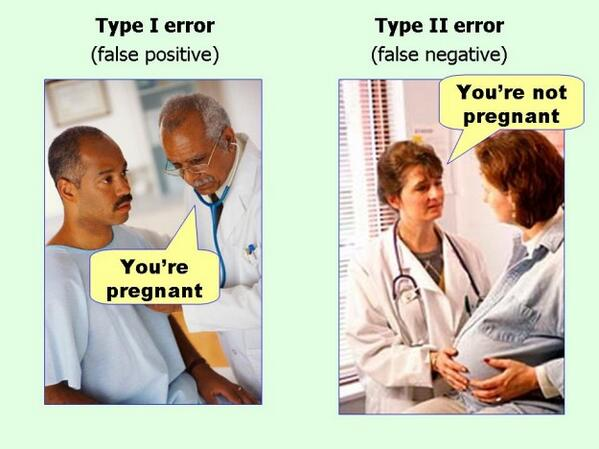
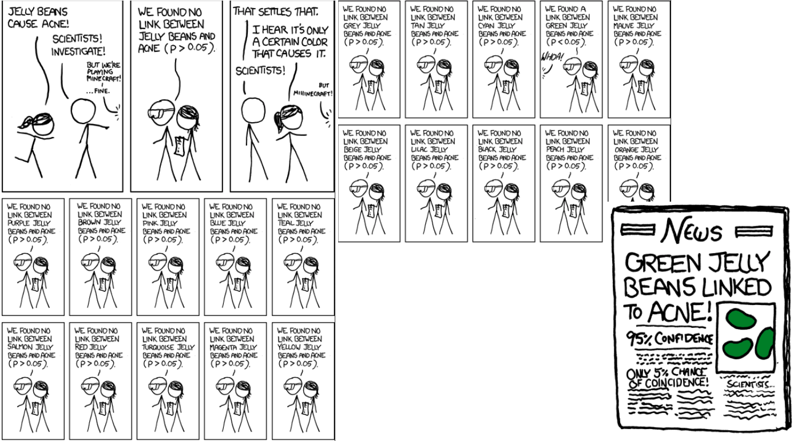

```{r, echo=FALSE}
source("make-fdr-diagram.R")
```

## Foreword

> the function of significance tests is to prevent you from making a
  fool of yourself, and not to make unpublishable results publishable
  [1]

at the end of the course, we will understand 

> Why Most Published Research Findings Are False. [3]

and will pledge to not make (too frequently) fools of ourselves.

## Statistical hypothesis testing

- Testing a working hypothesis

- Contrast an observed result to a *comparable* random distribution
  (assumptions!). If it is *different enough* from what we would
  expect by chance, then we might have an interesting result.

## The testing process


1. Set up a model of reality: null hypothesis $H_0$ (no difference
   with random distribution; as opposed to *alternative hypothesis*
   $H_1$, there is a difference with random distribution)

2. Do an experiment, collect data

3. Compute the probability of the data in this model

4. Make a decision: reject $H_0$ if the computed probability is deemed
   too small.


## Choosing a test statistic

- Continuous data (such as micro-array, quantitative proteomics, ...)
  and we want to compare means: *t-test*

- Count data (high-throughput sequencing) and we want to compare the
  number of reads between two conditions: *negative binomial*

- Gene set enrichment (is there an enrichment of genes with a specific
  function in my set of interesting genes): *hypergeometric*

Check what is used in the literature. Use state-of-the-art
methods/software that have been specifically developed for the
desing/technology at hand.

## Type of tests: (non-)parametric

* Parametric: assumption is that the data comes from a population that
  follows a probability distribution

* Non-parametric: no defined/fixed parameters


When assumptions are correct, a parametric test has more *statistical
power*.

In practice, as most studies are under-powered, non-parametric tests
are not an option.
  
## Types of tests: One-sample or two-sample tests

```{r, echo=FALSE}
set.seed(1)
library(ggplot2)
library(gridExtra)
d <- data.frame(x = rnorm(15), Group = 1)
p1 <- ggplot(aes(y = x, x = Group), data = d) + geom_boxplot() + geom_jitter() + ylab("log2 fold-change") + geom_hline(yintercept = 0, colour = "red")

d <- data.frame(x = c(rnorm(15, 5), rnorm(15, 6.5)), Group = rep(LETTERS[1:2], each = 15))
p2 <- ggplot(aes(y = x, x = Group, colour = Group), data = d) +
      geom_boxplot() + geom_jitter() +
      theme(legend.position="none") 
grid.arrange(p1, p2, ncol = 2)
```

## One-sides vs two-sided tests


```{r, echo=FALSE}
par(mfrow = c(1, 2))
plot(density(rnorm(1e5)), xlab = "", main = expression(mu < 0))
segments(qnorm(0.95), 0, qnorm(0.95), dnorm(qnorm(0.95)), lty = "dotted")
text(2, 0.02, "5%")


plot(density(rnorm(1e5)), xlab = "", main = expression(mu != 0))
segments(qnorm(0.975), 0, qnorm(0.975), dnorm(qnorm(0.975)), lty = "dotted")
segments(qnorm(0.025), 0, qnorm(0.025), dnorm(qnorm(0.025)), lty = "dotted")
text(2, 0.02, "2.5%")
text(-2, 0.02, "2.5%")

```

## Types of tests: paired tests

Measurements in two conditions are paired.

```{r, echo=FALSE}
set.seed(123)
d <- data.frame(y = c(sort(rnorm(15, 5)),
     		      sort(rnorm(15, 5.8))),
		x = c(jitter(rep(1, 15), amount = 0.15),
		      jitter(rep(2, 15), amount = 0.15)),
		Group = rep(1:2, each = 15))

dd <- cbind(d[1:15, 1:2], d[16:30, 1:3])
colnames(dd)[1:4] <- paste0(colnames(dd)[1:4], rep(1:2, each = 2))
dd$Group <- 1:15

p2 <- ggplot(aes(x = x, y = y, group = Group, colour = as.factor(Group)), data = d) +
             geom_boxplot() + geom_point() + theme(legend.position="none") +
	     xlab("Group") + ylab("Variable")
p2 <- p2 + scale_x_discrete("Group", limits = 1:2)
p2 + geom_segment(aes(x = x1, y = y1, xend = x2, yend = y2), data = dd, colour = "grey")
```

## Working example: Student's t-test

Comparing means from 2 groups, continuous data.

- $H_0: \mu_1 = \mu_2$
- $H_1: \mu_1 \neq \mu_2$

Assumptions:

- data is normally distributed
- data are independent and identically distributed
- equal or un-equal (Welch test) variance

- t-test is robust to deviations.

(All models are wrong. Some are useful)

## Welch test (t-test with unequal variances)

Two samples of sizes $n_1$ and $n_2$

   $t = \frac{\bar{X_1} - \bar{X_2}}{s_{\bar{x_1} - \bar{x_2}}}$

where

  $s_{\bar{x_1} - \bar{x_2}} = \sqrt{\frac{s_{x_1}^2}{n_1} + \frac{s_{x_2}^2}{n_2}}$

and $s_{xi}$ is the standard deviation of sample $i$

  $s_{x_i} = \sqrt{\frac{1}{N-1} \displaystyle\sum_{i = 1}^{N} (x_i - \bar{x})^2}$ 


## How to we estimate how different we are from *random*

```{r, echo = FALSE}
addseg <- function(x, ...) {
       segments(x, 0, x, dnorm(x), lty = "dotted", lwd = 2, ...)
       ## segments(-1000, dnorm(x), x, dnorm(x), lty = "dotted", ...)
}
x <- rt(1e6, df = 28)
plot(density(x), main = "t-distribution", xlab = "")
grid()
addseg(0, col = "black")
addseg(1, col = "blue")
addseg(qnorm(0.975), col = "orange")
addseg(qnorm(0.025), col = "orange")
addseg(qnorm(0.995), col = "red")
addseg(qnorm(0.005), col = "red")
```

**p-value**: how (un)likely it would be to observe a value as extreme or
more extreme under $H_0$.


## P-value

**p-value**: how (un)likely it would be to observe a value as extreme or
more extreme under $H_0$.

If p-value <= than (**arbitrary**) significance level, then we reject
$H_0$.

## Avoid fallacy

The p-value is the probability that the data could happen, under the
condition that the null hypothesis is true.

It is not the probability that the null hypothesis is true.

Absence of evidence $\neq$ evidence of absence

## What can go wrong


|                   |        $H_0$ is true   |    $H_0$ is false 
|-------------------|---------------------|------------------------  
|$H_0$ is rejected  | Type I error, FP    |   correct TP
|$H_0$ not rejected |       correct TN    | Type II error, FN

Type I and  II errors are not independent. One can't control both.

power of a test = 1 - $type~II$

(FP: false positive, TP: true positive, FN: false negative, TN: true positive)

**False discovery rate**: $\frac{FP}{FP+TP}$

##



## In R

```{r, echo=FALSE}
set.seed(1)
```

```{r}
x <- rnorm(15, mean = 7, sd = 1)
y <- rnorm(15, mean = 5, sd = 1.2)
t.test(x, y)
```

##

```{r, echo = FALSE}
x <- rt(1e6, df = 28)
plot(density(x), main = "t(28); t = 5.4214; p-value = 8.778e-6", xlab = "")
grid()
addseg(0, col = "black")
addseg(1, col = "blue")
addseg(qnorm(0.975), col = "orange")
addseg(qnorm(0.025), col = "orange")
addseg(qnorm(0.995), col = "red")
addseg(qnorm(0.005), col = "red")
abline(v = 5.4215)
```

## But

Is the p-value really what we want? What is the probability that we
make a fool of ourselves?

What about the power of our test? Let's calculate a false positive
rate.

##

```{r, echo=FALSE}
fdrdiagramme(sig.level = 0.01)
```

##

```{r, echo=FALSE}
fdrdiagramme(power = 0.5, preal = 0.05, sig.level = 0.05)
```

##

```{r, echo=FALSE}
fdrdiagramme(power = 0.5, preal = 0.9, sig.level = 0.05)
```

##

See also this interactive app http://shinyapps.org/apps/PPV/.


##

```{r, echo=FALSE}
preal <- seq(0.1, 0.9, 0.01)
sig <- c(0.05, 0.01)
power <- seq(0.1, 0.9, 0.01)
res <- expand.grid(preal = preal, sig = sig, power = power)
res$fdr <- apply(res, 1,
	   	 function(x)
		 fdrdiagramme(preal = x[1], sig.level = x[2], power = x[3], plot = FALSE))

ggplot(aes(x = power, y = preal), data = res) +
       geom_tile(aes(fill = fdr)) +
       scale_fill_gradientn(colours = c("white", "yellow", "orange", "red", "black")) +
       ylab("P(real)") + 
       facet_wrap(~sig)
```

## Adjustment for multiple testing 

A p-value informs us about a single test. What if we have 1000s or
more tests?

## Jelly beans can cause ([xkcd](https://xkcd.com/882/))



## Adjustment for multiple testing 

**A p-value informs us about a single test. What if we have 1000s or more tests?**

As the number of comparisons increases, it becomes more likely that
the some results will appear to differ by chance. Our confidence that
a result will generalise to independent data should generally be
weaker if it is observed as part of an analysis that involves multiple
comparisons, rather than an analysis that involves only a single
comparison.

For example, if one test is performed at the 5% level, there is only a
5% chance of incorrectly rejecting the null hypothesis if the null
hypothesis is true. However, for 100 tests where all null hypotheses
are true, the expected number of incorrect rejections is 5.  These
errors are **false positives**.

## Let's try it (1)

```{r, echo=FALSE}
set.seed(1)
```

```{r}
t.test(rnorm(5), rnorm(5))
```

## Let's try it (1)

```{r}
pv <- replicate(1000, t.test(rnorm(5), rnorm(5))$p.value)
head(sort(pv))
table(pv < 0.05)
```

## 

```{r, echo=FALSE}
hist(pv)
```

## How to interpret a p-value histogram ([link](http://varianceexplained.org/statistics/interpreting-pvalue-histogram/))


## Adjusting for multiple comparisons

* **Family-wise error rate** (FWER) The probability of one or more
    false positives. **Bonferroni correction** For $m$ tests, multiply
    each p-value with $m$. Then see if anyone still remains below
    significance threshold.

* **False discovery rate** (FDR): The expected fraction of false
  positives among all discoveries. Allows us to choose $n$ results
  with a given FDR. Examples are Benjamini-Hochberg or q-values. 

## FDR adjustment


Observed p-values are a mix of samples from a uniform (**nulls**) and
anti-conservative (**alternatives**) distributions.

## Identifying positive candidates

Volcano plots: (adjusted) p-values vs effect size (fold-change)


## Why are most published research findings false

- fishing for p < 0.05 (p-hacking)
- under-powered studies
- poor data analysis practice

Also

- Omitting null results
- Under-specified methods
- Weak experimental design

(see also the
**[Reproducibility and the conduct of research](https://github.com/lgatto/open-rr-bioinfo-best-practice/blob/master/03-rr.md#reproducibility-and-the-conduct-of-research)**)

## What can we do

- Beware of **arbitrary thresholds**, look for **outliers**: does
  changing one parameter suddenly change your biological results
  substantially?

- The choice of level of significance should be based on the relative
  consequences of the 2 types of errors.

- Consider **p-value and effect** (for example volcano plot).

- Look at **confidence intervals**.

- Beware of **under-powered** studies.

- Read up what is best in your field (there is some great work out
  there) - for example the
  [`limma`](http://bioconductor.org/packages/release/bioc/html/limma.html),
  [`edgeR`](http://bioconductor.org/packages/release/bioc/html/edgeR.html),
  [`DESeq2`](http://bioconductor.org/packages/release/bioc/html/DESeq2.html)
  Bioconductor packages. 
  
- Even if we don't see any effect, doesn't mean there is
  none. Significance testing is not a way to make unpublishable
  results publishable. 

## References


[1] David Colquhoun *An investigation of the false discovery rate and
    the misinterpretation of p-values* R. Soc. open sci. 2014 1
    140216;
    [doi:10.1098/rsos.140216](http://rsos.royalsocietypublishing.org/content/1/3/140216).

[2] Regina Nuzzo *Scientific method: Statistical errors* 2014 Nature
    506, 150–152
    [doi:10.1038/506150a](http://www.nature.com/news/scientific-method-statistical-errors-1.14700)

[3] Ioannidis JPA Why Most Published Research Findings Are False. 2015
    PLoS Med 2(8):
    e124. [doi:10.1371/journal.pmed.0020124](http://journals.plos.org/plosmedicine/article?id=10.1371/journal.pmed.0020124).

[4] Statistics for biologists [web
    collection](http://www.nature.com/collections/qghhqm/pointsofsignificance).
