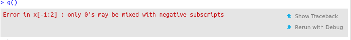

# Overview

- Defensive programming
- Debbugging: techniques and tools
- Condition handling
- Testing

# Defensive programming

Before we begin with debugging, let's look at ways to prevent bugs
(more at the end of this part). 

*Defensive programming*: 
- making the code work in a predicable manner
- writing code that fails in a well-defined manner
- if something *weird* happens, either properly deal with it, of fail
  quickly and loudly

The level of defensiveness will depend whether you write a function
for interactive of programmatic usage.

## Talk to your users

### Diagnostic messages


```r
message("This is a message for our dear users.")
```


```r
message("This is a message for our dear users. ",
	paste("Thank you for using our software",
              sw, "version", packageVersion(sw)))
```

Do not use `print` or `cat`:


```r
f1 <- function() {
    cat("I AM LOUD AND YOU CAN'T HELP IT.\n")
    ## do stuff
    invisible(TRUE)
}
f1()
```


```r
f2 <- function() {
    message("Sorry to interup, but...")
    ## do stuff
    invisible(TRUE)
}
f2()
suppressMessages(f2())
```

Of course, it is also possible to manually define verbosity. This
makes you write more code for a feature readily available. But still
better to use `message`.


```r
f3 <- function(verbose = TRUE) {
    if (verbose)
        message("I am being verbose because you let me.")
    ## do stuff
    invisible(TRUE)
}
f3()
f3(verbose = FALSE)
```

### Progress bars

- `utils::txtProgressBar` function


```r
n <- 10
pb <- txtProgressBar(min = 0, max = n, style = 3)
for (i in 1:n) {
    setTxtProgressBar(pb, i)
    Sys.sleep(0.5)
}
close(pb)
```

- [`progress`](https://github.com/gaborcsardi/progress) package


```r
library("progress")
pb <- progress_bar$new(total = n)
for (i in 1:n) {
    pb$tick()
    Sys.sleep(0.5)
}
```

Tip: do not over use progress bars. Ideally, a user should be
confident that everything is under control and progress is made while
waiting for a function to return. In my experience, a progress bar is
usefull when there is a specific and/or user-defined number of
iterations, such a *iterating over n files*, or *running a simulation
n times*.

**Question**: What about mixing progress bars and verbosity.

### Warning

> There is a problem with warnings. No one reads them. Pat Burns, in
> *R inferno*.


```r
warning("Do not ignore me. Somthing bad might have happened.")
warning("Do not ignore me. Somthing bad might be happening.", immediate. = TRUE)
```


```r
f <- function(...)
    warning("Attention, attention, ...!", ...)
f()
f(call. = FALSE)
```
Print warnings after they have been thrown.


```r
warnings()
last.warning
```

See also to `warn` option in `?options` .


```r
option("warn")
```

### Error


```r
stop("This is the end, my friend.")
```


```r
log(c(2, 1, 0, -1, 2)); print('end') ## warning 
xor(c(TRUE, FALSE));  print ('end')  ## error
```

Stop also has a `call.` parameter.


```r
geterrmessage()
```

### Logging

See for example the [`log4r`](https://github.com/johnmyleswhite/log4r)
package:


```r
## Import the log4r package.
library('log4r')

## Create a new logger object with create.logger().
logger <- create.logger()

## Set the logger's file output: currently only allows flat files.
logfile(logger) <- file.path('base.log')

## Set the current level of the logger.
level(logger) <- "INFO"

## Try logging messages at different priority levels.
debug(logger, 'A Debugging Message') ## Won't print anything
info(logger, 'An Info Message')
warn(logger, 'A Warning Message')
error(logger, 'An Error Message')
fatal(logger, 'A Fatal Error Message')
```

## KISS

Keep your functions simple and stupid (and short). 

## Failing fast and well

> Bounds errors are ugly, nasty things that should be stamped out
> whenever possible. One solution to this problem is to use the
> `assert` statement. The `assert` statement tells C++, "This can
> never happen, but if it does, abort the program in a nice way." One
> thing you find out as you gain programming experience is that things
> that can "never happen" happen with alarming frequency. So just to
> make sure that things work as they are supposed to, it’s a good idea
> to put lots of self checks in your program. -- Practical C++
> Programming, Steve Oualline, O'Reilly.


```r
if (!condition) stop(...)
```


```r
stopifnot(TRUE)
stopifnot(TRUE, FALSE)
```

For example to test input classes, lengths, ...


```r
f <- function(x) {
    stopifnot(is.numeric(x), length(x) == 1)
    invisible(TRUE)
}

f(1)
f("1")
f(1:2)
f(letters)
```

The [`assertthat`](https://github.com/hadley/assertthat) package:


```r
x <- "1"
library("assertthat")
stopifnot(is.numeric(x))
assert_that(is.numeric(x))
assert_that(length(x) == 2)
```

* `assert_that()` signal an error.
* `see_if()` returns a logical value, with the error message as an attribute.
* `validate_that()` returns `TRUE` on success, otherwise returns the error as
  a string.

  
  
* `is.flag(x)`: is x `TRUE` or `FALSE`? (a boolean flag)
* `is.string(x)`: is x a length 1 character vector?
* `has_name(x, nm)`, `x %has_name% nm`: does `x` have component `nm`?
* `has_attr(x, attr)`, `x %has_attr% attr`: does `x` have attribute `attr`?
* `is.count(x)`: is x a single positive integer?
* `are_equal(x, y)`: are `x` and `y` equal?
* `not_empty(x)`: are all dimensions of `x` greater than 0?
* `noNA(x)`: is `x` free from missing values?
* `is.dir(path)`: is `path` a directory?
* `is.writeable(path)`/`is.readable(path)`: is `path` writeable/readable?
* `has_extension(path, extension)`: does `file` have given `extension`?


## Consistency and predictability

Reminder of the innteractive use vs programming examples: 
- `[` and `drop` 
- `sapply`, `lapply`, `vapply`

Remember also the concept of *tidy data*.

## Comparisons

### Floating point issues to be aware of

R FAQ [7.31](http://cran.r-project.org/doc/FAQ/R-FAQ.html#Why-doesn_0027t-R-think-these-numbers-are-equal_003f)?


```r
a <- sqrt(2)
a * a == 2
a * a - 2
```


```r
1L + 2L == 3L
1.0 + 2.0 == 3.0
0.1 + 0.2 == 0.3
```

### Floating point: how to compare

- `all.equal` compares R objects for *near equality*. Takes into
  account whether object attributes and names ought the taken into
  consideration (`check.attributes` and `check.names` parameters) and
  tolerance, which is machine dependent.


```r
all.equal(0.1 + 0.2, 0.3)
all.equal(0.1 + 0.2, 3.0)
isTRUE(all.equal(0.1 + 0.2, 3)) ## when you just want TRUE/FALSE
```

### Exact identity

`identical`: test objects for exact equality


```r
1 == NULL
all.equal(1, NULL)
identical(1, NULL)
identical(1, 1.)   ## TRUE in R (both are stored as doubles)
all.equal(1, 1L)
identical(1, 1L)   ## stored as different types
```

Appropriate within `if`, `while` condition statements. (not
`all.equal`, unless wrapped in `isTRUE`).

## Exercise

(From [adv-r](http://adv-r.had.co.nz/Exceptions-Debugging.html#defensive-programming).)

The `col_means` function computes the means of all numeric columns in
a data frame.


```r
col_means <- function(df) {
  numeric <- sapply(df, is.numeric)
  numeric_cols <- df[, numeric]
  data.frame(lapply(numeric_cols, mean))
}
```

Is it a robust function? What happens if there are unusual inputs.


```r
col_means(mtcars)
col_means(mtcars[, 0])
col_means(mtcars[0, ])
col_means(mtcars[, "mpg", drop = FALSE])
col_means(1:10)
col_means(as.matrix(mtcars))
col_means(as.list(mtcars))

mtcars2 <- mtcars
mtcars2[-1] <- lapply(mtcars2[-1], as.character)
col_means(mtcars2)
```
# Debugging: techniques and tools

### Shit happens

> Funding your bug is a process of confirming the many things that you
> believe are true - until you find one which is not true. -- Norm Matloff

#### 1. Identify the bug (the difficult part)
- Something went wrong!
- Where in the code does it happen?
- Does it happen every time?
- What input triggered it?
- Report it (even if it is in your code - use github issues, for
  example).

**Tip**: Beware of your intuition. As a scientist, do what you are
used to: generate a hypotheses, *design an experiment* to test them,
and record the results.

#### 2. Fix it (the less difficult part)
- Correct the bug.
- Make sure that bug will not repeat itself!
- How can we be confident that we haven't introduced new bugs?

## Tools

- `print`/`cat`
- `traceback()`
- `browser()`
- `options(error = )`, `options(warn = )`
- `trace`
- IDE: RStudio, StatET, emacs' ess tracebug.


### Manually

Inserting `print` and `cat` statements in the code. Works, but time
consuming. 

### Finding the bug

> Many bugs are subtle and hard to find. -- Hadley Wickham

Bugs are shy, and are generally hidden, deep down in your code, to
make it as difficult as possible for you to find them.


`traceback`: lists the sequence of calls that lead to the error


```r
g()
traceback()
```

If the source code is available (for example for `source()`d code),
then traceback will display the exact location in the function, in the
form `filename.R#linenum`.

### Browsing the error

- Register the function for debugging: `debug(g)`. This adds a call to
  the `browser()` function (see also below) and the very beginning of
  the function `g`.
  
- Every call to `g()` will not be run interactively.

- To finish debugging: `undebug(g)`.


```r
debug(g)
g()
```

How to debug:

- `n` executes the next step of the function. Use `print(n)` or
  `get(n)` to print/access the variable `n`.
- `s` to step into the next function. If it is not a function, same as
  `n`.
- `f` to finish execution of the current loop of function.
- `c` to leave interactive debugging and continue regular execution of
  the function. 
- `Q` to stop debugging, terminate the function and return to the
  global workspace.
- `where` print a stack trace of all active function calls.
- `Enter` same as `n` (or `s`, if it was used most recently), unless
  `options(browserNLdisabled = TRUE)` is set.

To fix a function when the source code is not directly available, use
`fix(fun)`. This will open the function's source code for editing and,
after saving and closing, store the updated function in the global
workspace.

### Breakpoints

- Add a call to `browser()` anywhere in the source code to execute the
  rest of the code interactively.
  
- To run breakpoints conditionally, wrap the call to `browser()` in a
  condition.

### Setting options

- `options(error = recover)`: display the call stack and choose where
  to step in.

- `options(error = stop)` or `options(error = NULL)`: reset to default
  behaviour.

- `options(warn = 'numeric')`: sets the handling of warning
  messages. If `warn` is negative all warnings are ignored.  If `warn`
  is zero (the default) warnings are stored until the top-level
  function returns.  If 10 or fewer warnings were signalled they will
  be printed otherwise a message saying how many were signalled. An
  object called `last.warning` is created and can be printed through
  the function `warnings`.  If `warn` is one, warnings are printed as
  they occur.  If `warn` is two or larger all warnings are turned into
  errors.

- `options(error = dump.frames)`: like `recover` but for
  non-interactive use. Will create a `last.dump.rda` file in the
  current working directory, which can then be reloaded in an
  interactive session to re-inter interactive debugging (using
  `debugger()`).

### Debugging with IDEs

- RSudio: `Show Traceback`, `Rerun with Debug` and interactive debugging.




- StatET (Eclipse plugin)

- [emacs ESS and tracebug](http://ess.r-project.org/Manual/ess.html#Developing-with-ESS)

### Exercise

1. Your turn - play with `traceback`, `recover` and `debug`:

(Example originally by Martin Morgan and Robert Gentleman.)


```r
e <- function(i) {
  x <- 1:4
  if (i < 5) x[1:2]
  else x[-1:2] # oops! x[-(1:2)]
}
f <- function() sapply(1:10, e)
g <- function() f()
```

2. Fix `readFasta2`.


```r
## make sure you have the 'sequences' package.
## Get readFasta2, the function to debug
sequences:::debugme()
## Get an example file
f <- dir(system.file("extdata", package = "sequences"),
         full.names=TRUE, pattern = "moreDnaSeqs.fasta")
## BANG!
readFasta2(f)
```

## Condition handling

### `try` and `tryCatch`

The function `f` will never terminate.


```r
f <- function() {
    x <- "1"
    log(x)
    message("x was the ", class(x), " ", x)
}
f()
```

Use `try` to proceed with the execution even when an error occurs.


```r
f <- function() {
    x <- "1"
    try(log(x))
    message("x was the ", class(x), " ", x)
}
f()
```


```r
try({
    a <- 1
    b <- "2"
    a + b
})
```

In case of error, `try` returns a object of class `try-error`:


```r
success <- try(1 + 2)
failure <- try(1 + "2", silent = TRUE)
class(success)
class(failure)
```


```r
inherits(failure, "try-error")

if (inherits(failure, "try-error"))
	message("There was an error here.")
```
Handling errors is particularly useful to iterate over all elements of
an input, despite errors (and inspecting/handling/fixing the errors
afterwards).


```r
el <- list(1:10, c(-1, 1), TRUE, "1")
res <- lapply(el, log)
res
res <- lapply(el, function(x) try(log(x)))
res
```

#### Hadley's tip

> Another useful `try()` idiom is using a default value if an
> expression fails. Simply assign the default outside the `try` block,
> and then run the risky code:


```r
default <- NULL
try(default <- read.csv("possibly-bad-input.csv"), silent = TRUE)
```

> There is also `plyr::failwith()`, which makes this strategy even
> easier to implement.


```r
f <- function(x)
    if (x == 1) stop("Error!") else 1

f(1)
f(2)
     
     
safef <- failwith(NULL, f)
safef(1)
safef(2)
```

Use `tryCatch` to specify a behaviour (handler function) in case of
error, warning or message.


```r
f <- function() {
    x <- "1"
    tryCatch(log(x),
             error = function(e) cat("There was an error!\n"))
    message("x was the ", class(x), " ", x)
}
f()
```

More example from Hadleys' *Advanced R* book.


```r
show_condition <- function(code) {
  tryCatch(code,
    error = function(c) "error",
    warning = function(c) "warning",
    message = function(c) "message"
  )
}
show_condition(stop("!"))
show_condition(warning("?!"))
show_condition(message("?"))
show_condition(0)
```

A more informative `read.csv` version:


```r
read.csv2 <- function(file, ...) {
  tryCatch(read.csv(file, ...), error = function(c) {
    c$message <- paste0(c$message, " (in ", file, ")")
    stop(c)
  })
}
read.csv("code/dummy.csv")
read.csv2("code/dummy.csv")
```

`tryCatch` has a `finally` argument that specifies a code block to be
executed regardless of whether the initial expression succeeds or
fails. Usefull, for example, to clean up (deleting files, closing
connections, ...).


### `withCallingHandlers`


The `withCallingHandlers` function allows to defined special behaviour
in case of *unusual conditions*, including warnings and errors. In the
example below, we start a browser in case of (obscure) warnings.


```r
f <- function(x = 10) {
    lapply(seq_len(x), function(i) {
        ## make an example 2x2 contingency table
        d <- matrix(sample(4:10, 4), nrow = 2, ncol = 2)
        ## will produce warning if there is a 5 or less 
        ## in the contingency table
        chisq.test(d)
    })
}
```


```r
set.seed(1)
f()
set.seed(1)
withCallingHandlers(f(), warning=function(e) recover())
```

### Difference between `tryCatch` and `withCallingHandlers`

(From [*Advanced R*](http://adv-r.had.co.nz/Exceptions-Debugging.html#condition-handling))

The handlers in `withCallingHandlers()` are called in the context of
the call that generated the condition whereas the handlers in
`tryCatch()` are called in the context of `tryCatch()`. This is shown
here with `sys.calls()`, which is the run-time equivalent of
`traceback()` -- it lists all calls leading to the current function.


```r
f <- function() g()
g <- function() h()
h <- function() stop("!")

tryCatch(f(), error = function(e) print(sys.calls()))
```

```
## [[1]]
## knitr::knit("03-debug.Rmd")
## 
## [[2]]
## process_file(text, output)
## 
## [[3]]
## withCallingHandlers(if (tangle) process_tangle(group) else process_group(group), 
##     error = function(e) {
##         setwd(wd)
##         cat(res, sep = "\n", file = output %n% "")
##         message("Quitting from lines ", paste(current_lines(i), 
##             collapse = "-"), " (", knit_concord$get("infile"), 
##             ") ")
##     })
## 
## [[4]]
## process_group(group)
## 
## [[5]]
## process_group.block(group)
## 
## [[6]]
## call_block(x)
## 
## [[7]]
## block_exec(params)
## 
## [[8]]
## in_dir(opts_knit$get("root.dir") %n% input_dir(), evaluate::evaluate(code, 
##     envir = env, new_device = FALSE, keep_warning = !isFALSE(options$warning), 
##     keep_message = !isFALSE(options$message), stop_on_error = if (options$error && 
##         options$include) 0L else 2L, output_handler = knit_handlers(options$render, 
##         options)))
## 
## [[9]]
## evaluate::evaluate(code, envir = env, new_device = FALSE, keep_warning = !isFALSE(options$warning), 
##     keep_message = !isFALSE(options$message), stop_on_error = if (options$error && 
##         options$include) 0L else 2L, output_handler = knit_handlers(options$render, 
##         options))
## 
## [[10]]
## evaluate_call(expr, parsed$src[[i]], envir = envir, enclos = enclos, 
##     debug = debug, last = i == length(out), use_try = stop_on_error != 
##         2L, keep_warning = keep_warning, keep_message = keep_message, 
##     output_handler = output_handler)
## 
## [[11]]
## handle(ev <- withCallingHandlers(withVisible(eval(expr, envir, 
##     enclos)), warning = wHandler, error = eHandler, message = mHandler))
## 
## [[12]]
## try(f, silent = TRUE)
## 
## [[13]]
## tryCatch(expr, error = function(e) {
##     call <- conditionCall(e)
##     if (!is.null(call)) {
##         if (identical(call[[1L]], quote(doTryCatch))) 
##             call <- sys.call(-4L)
##         dcall <- deparse(call)[1L]
##         prefix <- paste("Error in", dcall, ": ")
##         LONG <- 75L
##         msg <- conditionMessage(e)
##         sm <- strsplit(msg, "\n")[[1L]]
##         w <- 14L + nchar(dcall, type = "w") + nchar(sm[1L], type = "w")
##         if (is.na(w)) 
##             w <- 14L + nchar(dcall, type = "b") + nchar(sm[1L], 
##                 type = "b")
##         if (w > LONG) 
##             prefix <- paste0(prefix, "\n  ")
##     }
##     else prefix <- "Error : "
##     msg <- paste0(prefix, conditionMessage(e), "\n")
##     .Internal(seterrmessage(msg[1L]))
##     if (!silent && identical(getOption("show.error.messages"), 
##         TRUE)) {
##         cat(msg, file = stderr())
##         .Internal(printDeferredWarnings())
##     }
##     invisible(structure(msg, class = "try-error", condition = e))
## })
## 
## [[14]]
## tryCatchList(expr, classes, parentenv, handlers)
## 
## [[15]]
## tryCatchOne(expr, names, parentenv, handlers[[1L]])
## 
## [[16]]
## doTryCatch(return(expr), name, parentenv, handler)
## 
## [[17]]
## withCallingHandlers(withVisible(eval(expr, envir, enclos)), warning = wHandler, 
##     error = eHandler, message = mHandler)
## 
## [[18]]
## withVisible(eval(expr, envir, enclos))
## 
## [[19]]
## eval(expr, envir, enclos)
## 
## [[20]]
## eval(expr, envir, enclos)
## 
## [[21]]
## tryCatch(f(), error = function(e) print(sys.calls()))
## 
## [[22]]
## tryCatchList(expr, classes, parentenv, handlers)
## 
## [[23]]
## tryCatchOne(expr, names, parentenv, handlers[[1L]])
## 
## [[24]]
## value[[3L]](cond)
```

```r
withCallingHandlers(f(), error = function(e) print(sys.calls()))
```

```
## [[1]]
## knitr::knit("03-debug.Rmd")
## 
## [[2]]
## process_file(text, output)
## 
## [[3]]
## withCallingHandlers(if (tangle) process_tangle(group) else process_group(group), 
##     error = function(e) {
##         setwd(wd)
##         cat(res, sep = "\n", file = output %n% "")
##         message("Quitting from lines ", paste(current_lines(i), 
##             collapse = "-"), " (", knit_concord$get("infile"), 
##             ") ")
##     })
## 
## [[4]]
## process_group(group)
## 
## [[5]]
## process_group.block(group)
## 
## [[6]]
## call_block(x)
## 
## [[7]]
## block_exec(params)
## 
## [[8]]
## in_dir(opts_knit$get("root.dir") %n% input_dir(), evaluate::evaluate(code, 
##     envir = env, new_device = FALSE, keep_warning = !isFALSE(options$warning), 
##     keep_message = !isFALSE(options$message), stop_on_error = if (options$error && 
##         options$include) 0L else 2L, output_handler = knit_handlers(options$render, 
##         options)))
## 
## [[9]]
## evaluate::evaluate(code, envir = env, new_device = FALSE, keep_warning = !isFALSE(options$warning), 
##     keep_message = !isFALSE(options$message), stop_on_error = if (options$error && 
##         options$include) 0L else 2L, output_handler = knit_handlers(options$render, 
##         options))
## 
## [[10]]
## evaluate_call(expr, parsed$src[[i]], envir = envir, enclos = enclos, 
##     debug = debug, last = i == length(out), use_try = stop_on_error != 
##         2L, keep_warning = keep_warning, keep_message = keep_message, 
##     output_handler = output_handler)
## 
## [[11]]
## handle(ev <- withCallingHandlers(withVisible(eval(expr, envir, 
##     enclos)), warning = wHandler, error = eHandler, message = mHandler))
## 
## [[12]]
## try(f, silent = TRUE)
## 
## [[13]]
## tryCatch(expr, error = function(e) {
##     call <- conditionCall(e)
##     if (!is.null(call)) {
##         if (identical(call[[1L]], quote(doTryCatch))) 
##             call <- sys.call(-4L)
##         dcall <- deparse(call)[1L]
##         prefix <- paste("Error in", dcall, ": ")
##         LONG <- 75L
##         msg <- conditionMessage(e)
##         sm <- strsplit(msg, "\n")[[1L]]
##         w <- 14L + nchar(dcall, type = "w") + nchar(sm[1L], type = "w")
##         if (is.na(w)) 
##             w <- 14L + nchar(dcall, type = "b") + nchar(sm[1L], 
##                 type = "b")
##         if (w > LONG) 
##             prefix <- paste0(prefix, "\n  ")
##     }
##     else prefix <- "Error : "
##     msg <- paste0(prefix, conditionMessage(e), "\n")
##     .Internal(seterrmessage(msg[1L]))
##     if (!silent && identical(getOption("show.error.messages"), 
##         TRUE)) {
##         cat(msg, file = stderr())
##         .Internal(printDeferredWarnings())
##     }
##     invisible(structure(msg, class = "try-error", condition = e))
## })
## 
## [[14]]
## tryCatchList(expr, classes, parentenv, handlers)
## 
## [[15]]
## tryCatchOne(expr, names, parentenv, handlers[[1L]])
## 
## [[16]]
## doTryCatch(return(expr), name, parentenv, handler)
## 
## [[17]]
## withCallingHandlers(withVisible(eval(expr, envir, enclos)), warning = wHandler, 
##     error = eHandler, message = mHandler)
## 
## [[18]]
## withVisible(eval(expr, envir, enclos))
## 
## [[19]]
## eval(expr, envir, enclos)
## 
## [[20]]
## eval(expr, envir, enclos)
## 
## [[21]]
## withCallingHandlers(f(), error = function(e) print(sys.calls()))
## 
## [[22]]
## f()
## 
## [[23]]
## g()
## 
## [[24]]
## h()
## 
## [[25]]
## stop("!")
## 
## [[26]]
## .handleSimpleError(function (e) 
## print(sys.calls()), "!", quote(h()))
## 
## [[27]]
## h(simpleError(msg, call))
```

```
## Error in h(): !
```

### Debugging at the C level with `ddd`

Wolfgang: demo?

### Exercise


Write a new `safelog` function that catches and handles errors and
warnings to emulate the following behaviour.


```r
log(1)
```

```
## [1] 0
```

```r
safelog(1)
```

```
## [1] 0
```

```r
log(-1)
```

```
## Warning in log(-1): NaNs produced
```

```
## [1] NaN
```

```r
safelog(-1)
```

```
## [1] "a warning with input -1"
```

```r
log("a")
```

```
## Error in log("a"): non-numeric argument to mathematical function
```

```r
safelog("a")
```

```
## [1] "an error with input a"
```

## Tracing code

From `?trace`:

> A call to `trace` allows you to insert debugging code (e.g., a call
> to `browser` or `recover`) at chosen places in any function. A call
> to `untrace` cancels the tracing.


```r
## Report whenever e invoked
trace(sum)
hist(rnorm(100))
untrace(sum)
```


```r
## Evaluate arbitrary code whenever e invoked
trace(e, quote(cat("i am", i, "\n")))
## Another way to enter browser whenver e invoked
trace(e, browser)
## stop tracing
untrace(e)
```

### Inserting code dynamically

> The `trace` function operates by constructing a revised version of
> the function (or of the method, if ‘signature’ is supplied), and
> assigning the new object back where the original was found.


```r
f <- function() {
    ## make an example 2x2 contingency table
    d <- matrix(sample(4:10, 4), nrow=2, ncol=2)
     chisq.test(d)
}
set.seed(1)
f() ## no warning

set.seed(11)
f() ## warning
```

We want to conditionally enter brower mode, when an element of `d` is
smaller than 5.


```r
if (any(d < 5))
  browser()
```

This expression must be executed at a specific location in our function `f`:


```r
as.list(body(f))
```


```r
trace("f", quote(if (any(d < 5)) browser()), at = 3)
```

We can now run our updated function `f`


```r
f
body(f)
```


```r
set.seed(1)
f() ## normal execution

set.seed(11)
f() ## enters browser mode
```

### Debugging S4 methods

> The `trace` function operates by constructing a revised version of
> the function (or of the method, if ‘signature’ is supplied), and
> assigning the new object back where the original was found.


```r
library("MSnbase")
data(itraqdata)
x <- itraqdata[[1]]
plot(x, full=TRUE)
```

Not helpful:


```r
debug(plot)
plot(x, full=TRUE)
```

Try again:


```r
trace("plot", browser, 
      signature = c("Spectrum", "missing"))
plot(x, full=TRUE)
```


## Unit testing

See [here](https://github.com/lgatto/2016-02-25-adv-programming-EMBL/blob/master/unittesting.md).

