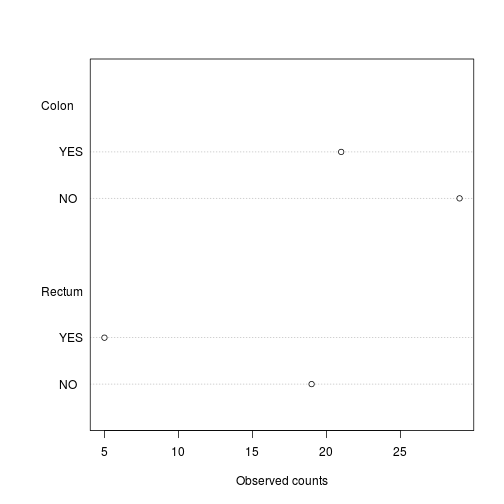
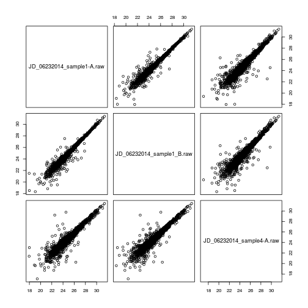

# Objectives

- Statistical hypothesis testing: t-test
- Sample size calculation
- Analysis for categorical data 
- Linear regression and correlation

---

# Part 4: Statistical hypothesis test

First, we are going to prepare the session for further analyses.


```r
load("./data/summaryresults.rda")
load("./data/iprg.rda")
```

## Two sample t-test for one protein with one feature

Now, we'll perform a t-test whether protein `sp|P44015|VAC2_YEAST` has
a change in abundance between Condition 1 and Condition 2.

### Hypothesis

* $H_0$: no change in abundance, mean(Condition1) - mean(Condition2) = 0
* $H_a$: change in abundance, mean(Condition1) - mean(Condition 2) $\neq$ 0

### Statistics

* Observed $t = \frac{\mbox{difference of group means}}{\mbox{estimate of variation}} = \frac{(mean_{1} - mean_{2})}{SE} \sim t_{\alpha/2, df}$
* Standard error, $SE=\sqrt{\frac{s_{1}^2}{n_{1}} + \frac{s_{2}^2}{n_{2}}}$

with 

* $n_{i}$: number of replicates
* $s_{i}^2 = \frac{1}{n_{i}-1} \sum (Y_{ij} - \bar{Y_{i \cdot}})^2$: sample variance

### Data preparation


```r
## Let's start with one protein, named "sp|P44015|VAC2_YEAST"
oneproteindata <- iprg[iprg$Protein == "sp|P44015|VAC2_YEAST", ]

## Then, get two conditions only, because t.test only works for two groups (conditions).
oneproteindata.condition12 <- oneproteindata[oneproteindata$Condition %in% 
                                             c('Condition1', 'Condition2'), ]
oneproteindata.condition12
```

```
##                    Protein Log2Intensity                       Run
## 21096 sp|P44015|VAC2_YEAST      26.30163 JD_06232014_sample1_B.raw
## 21097 sp|P44015|VAC2_YEAST      26.11643 JD_06232014_sample1_C.raw
## 21098 sp|P44015|VAC2_YEAST      26.29089 JD_06232014_sample1-A.raw
## 21099 sp|P44015|VAC2_YEAST      25.81957 JD_06232014_sample2_A.raw
## 21100 sp|P44015|VAC2_YEAST      26.11527 JD_06232014_sample2_B.raw
## 21101 sp|P44015|VAC2_YEAST      26.08498 JD_06232014_sample2_C.raw
##        Condition BioReplicate Intensity TechReplicate
## 21096 Condition1            1  82714388             B
## 21097 Condition1            1  72749239             C
## 21098 Condition1            1  82100518             A
## 21099 Condition2            2  59219741             A
## 21100 Condition2            2  72690802             B
## 21101 Condition2            2  71180513             C
```

```r
table(oneproteindata.condition12[, c("Condition", "BioReplicate")])
```

```
##             BioReplicate
## Condition    1 2
##   Condition1 3 0
##   Condition2 0 3
```

If we want to remove the levels that are not relevant anymore, we can
use `droplevels`:


```r
oneproteindata.condition12 <- droplevels(oneproteindata.condition12)
table(oneproteindata.condition12[, c("Condition", "BioReplicate")])
```

```
##             BioReplicate
## Condition    1 2
##   Condition1 3 0
##   Condition2 0 3
```

To perform the t-test, we use the `t.test` function. Let's first
familiarise ourselves with it by looking that the manual 


```r
?t.test
```

And now apply to to our data


```r
# t test for different abundance (log2Int) between Groups (Condition)
result <- t.test(Log2Intensity ~ Condition,
                 data = oneproteindata.condition12,
                 var.equal = FALSE)

result
```

```
## 
## 	Welch Two Sample t-test
## 
## data:  Log2Intensity by Condition
## t = 2.0608, df = 3.4001, p-value = 0.1206
## alternative hypothesis: true difference in means is not equal to 0
## 95 percent confidence interval:
##  -0.1025408  0.5619598
## sample estimates:
## mean in group Condition1 mean in group Condition2 
##                 26.23632                 26.00661
```

> **Challenge**
>
> Repeat the t-test above but with calculating a 90% confidence interval
> for the log2 fold change.


### The `htest` class

The `t.test` function, like other hypothesis testing function, return
a result of a type we haven't encountered yet, the `htest` class:


```r
class(result)
```

```
## [1] "htest"
```

which stores typical results from such tests. Let's have a more
detailed look at what information we can learn from the results our
t-test. When we type the name of our `result` object, we get a short
textual summary, but the object contains more details:


```r
names(result)
```

```
## [1] "statistic"   "parameter"   "p.value"     "conf.int"    "estimate"   
## [6] "null.value"  "alternative" "method"      "data.name"
```

and we can access each of these by using the `$` operator, like we
used to access a single column from a `data.frame`, but the `htest`
class is not a `data.frame` (it's actually a `list`). For example, to
access the group means, we would use


```r
result$estimate
```

```
## mean in group Condition1 mean in group Condition2 
##                 26.23632                 26.00661
```

> **Challenge**
> 
> * Calculate the (log2-transformed) fold change between groups
> * Extract the value of the t-statistics
> * Calculate the standard error (fold-change/t-statistics)
> * Extract the degrees of freedom (parameter)
> * Extract the p values
> * Extract the 95% confidence intervals


We can also manually compute our t-test statistic using the formulas
we descibed above and compare it with the `summaryresult`.

Recall the `summaryresult` we generated last section.


```r
summaryresult
```

```
##        Group     mean         sd         se length ciw.lower.95
## 1 Condition1 26.23632 0.10396539 0.06002444      3     25.97805
## 2 Condition2 26.00661 0.16268179 0.09392438      3     25.60248
## 3 Condition3 23.25609 0.09467798 0.05466236      3     23.02090
## 4 Condition4 20.97056 0.73140174 0.42227499      3     19.15366
##   ciw.upper.95 ciw.lower.99 ciw.upper.99
## 1     26.49458     25.64058     26.83205
## 2     26.41073     25.07442     26.93879
## 3     23.49128     22.71357     23.79860
## 4     22.78746     16.77955     25.16157
```

```r
summaryresult12 <- summaryresult[1:2, ]

## test statistic, It is the same as 'result$statistic' above.
diff(summaryresult12$mean) ## different sign, but absolute values are same as result$estimate[1]-result$estimate[2]
```

```
## [1] -0.2297095
```

```r
sqrt(sum(summaryresult12$sd^2/summaryresult12$length)) ## same as stand error
```

```
## [1] 0.1114662
```

```r
## the t-statistic : sign is different
diff(summaryresult12$mean)/sqrt(sum(summaryresult12$sd^2/summaryresult12$length))
```

```
## [1] -2.060799
```

## Re-calculating the p values

See the previous
[*Working with statistical distributions*](https://htmlpreview.github.io/?https://github.com/MayInstitute/MayInstitute2017/blob/master/Program3_Intro%20stat%20in%20R/02-rstats.html#working_with_statistical_distributions)
for a reminder.

Referring back to our t-test results above, we can manually calculate
the one- and two-side tests p-values using the t-statistics and the
test parameter (using the `pt` function).


Our result t statistic was 2.0607988 (accessible
with `result$statistic`). Let's start by visualising it along a t
distribution. Let's create data from such a distribution, making sure
we set to appropriate parameter.


```r
## generate 10^5 number with the same degree of freedom for distribution.
xt <- rt(1e5, result$parameter) 
plot(density(xt), xlim = c(-10, 10))
abline(v = result$statistic, col = "red") ## where t statistics are located.
abline(h = 0, col = "gray") ## horizontal line at 0
```


**The area on the left** of that point is given by `pt(result$statistic,
result$parameter)`, which is 0.939693. The p-value for a one-sided test, which is ** the area on the right** of red line, is this given by


```r
1 - pt(result$statistic, result$parameter)
```

```
##          t 
## 0.06030697
```

And the p-value for a two-sided test is 


```r
2 * (1 - pt(result$statistic, result$parameter))
```

```
##         t 
## 0.1206139
```

which is the same as the one calculated by the t-test.

***

# Part 5a: Sample size calculation

To calculate the required sample size, you’ll need to know four
things:

* $\alpha$: confidence level
* $power$: 1 - $\beta$, where $\beta$ is probability of a true positive discovery
* $\Delta$: anticipated fold change
* $\sigma$: anticipated variance

## R code

Assuming equal varaince and number of samples across groups, the
following formula is used for sample size estimation:

$$\frac{2{\sigma}^2}{n}\leq(\frac{\Delta}{z_{1-\beta}+z_{1-\alpha/2}})^2$$


```r
library("pwr")

## ?pwr.t.test

# Significance level alpha
alpha <- 0.05

# Power = 1 - beta
power <- 0.95

# anticipated log2 fold change 
delta <- 1

# anticipated variability
sigma <- 0.9

# Effect size
# It quantifies the size of the difference between two groups
d <- delta/sigma

#Sample size estimation
pwr.t.test(d = d, sig.level = alpha, power = power, type = 'two.sample')
```

```
## 
##      Two-sample t test power calculation 
## 
##               n = 22.06036
##               d = 1.111111
##       sig.level = 0.05
##           power = 0.95
##     alternative = two.sided
## 
## NOTE: n is number in *each* group
```


> **Challenge**
> 
> * Calculate power with 10 samples and the same parameters as above.


Let's investigate the effect of required fold change and variance on the sample size estimation.


```r
# anticipated log2 fold change 
delta <- seq(0.1, 0.7, .1)

# anticipated variability
sigma <- seq(0.1,0.5,.1)

d <- expand.grid(delta = delta, sigma = sigma)
d$d <- d$delta / d$sigma
d$n <- sapply(d$d, 
             function(.d) {
                 res <- pwr.t.test(d = .d, sig.level = 0.05, power = 0.95)
                 ceiling(res$n)
             })
d$sigma <- factor(d$sigma)

library("ggplot2")
p <- ggplot(data = d, aes(x = delta, y = n,
                          group = factor(sigma),
                          colour = sigma))
p + geom_line() + geom_point()
```


```r
print(p)
```


***
# Part 5b: Choosing a model

The decision of which statistical model is appropriate for a given set of observations depends on the type of data that have been collected.

* Quantitative response with quantitative predictors : regression model

* Categorical response with quantitative predictors : logistic regression model for bivariate categorical response (e.g., Yes/No, dead/alive), multivariate logistic regression model when the response variable has more than two possible values.

* Quantitative response with categorical predictors : ANOVA model (quantitative response across several populations defined by one or more categorical predictor variables)

* Categorical response with categorical predictors : contingency table that can be used to draw conclusions about the relationships between variables.


Part 5b are adapted from *Bremer & Doerge*,
[Using R at the Bench : Step-by-Step Data Analytics for Biologists](https://www.amazon.com/dp/1621821129/ref=olp_product_details?_encoding=UTF8&me=)
, cold Spring Harbor LaboratoryPress, 2015.


***

# Part 5c: Analysis of categorical data

For this part, we are going to use a new dataset, which contains the
patient information from TCGA colorectal cohort. This data is from
*Proteogenomic characterization of human colon and rectal cancer*
(Zhang et al. 2014).


Let's read in and explore the TCGA colorectal cancer data:


```r
TCGA.CRC <- read.csv("./data/TCGA_sample_information.csv")
head(TCGA.CRC)
```

```
##   TCGA.participant.ID Gender Cancer BRAF.mutation history_of_colon_polyps
## 1        TCGA-A6-3807 Female  Colon             0                      NO
## 2        TCGA-A6-3808   Male  Colon             0                     YES
## 3        TCGA-A6-3810   Male  Colon             0                     YES
## 4        TCGA-AA-3518 Female  Colon             0                      NO
## 5        TCGA-AA-3525   Male  Colon             1                      NO
## 6        TCGA-AA-3526   Male  Colon             0                     YES
```

Rows in the data array are patients and columns are patient
information. The column definition is shown as following:

| Variable            |
|---------------------|
| TCGA participant ID |
| Gender              |
| Cancer type         |
| BTAF mutation status|
| History of colon polyps |

Let's be familiar with data first.

```r
## check the dimension of data
dim(TCGA.CRC)
```

```
## [1] 78  5
```

```r
dim(TCGA.CRC$Gender) # dim function is for matrix, array or data frame.
```

```
## NULL
```

```r
## check unique information of Gender column.
unique(TCGA.CRC$Gender)
```

```
## [1] Female Male  
## Levels: Female Male
```

```r
class(TCGA.CRC$Gender)
```

```
## [1] "factor"
```

> **Challenge**
> 
> * Get unique information and class for `Cancer` information
> * Get unique information and class for `BRAF.mutation` information
> * Get unique information and class for `history_of_colon_polyps` information


`table` function generates contingency table (or classification table with frequency of outcomes) at each combination.


```r
## check how many female and male are in the dataset
table(TCGA.CRC$Gender)
```

```
## 
## Female   Male 
##     34     44
```

```r
## check unique information if paticipant ID
unique(TCGA.CRC$TCGA.participant.ID)
```

```
##  [1] TCGA-A6-3807 TCGA-A6-3808 TCGA-A6-3810 TCGA-AA-3518 TCGA-AA-3525
##  [6] TCGA-AA-3526 TCGA-AA-3529 TCGA-AA-3531 TCGA-AA-3534 TCGA-AA-3552
## [11] TCGA-AA-3554 TCGA-AA-3558 TCGA-AA-3561 TCGA-AA-3664 TCGA-AA-3666
## [16] TCGA-AA-3672 TCGA-AA-3684 TCGA-AA-3695 TCGA-AA-3710 TCGA-AA-3715
## [21] TCGA-AA-3818 TCGA-AA-3848 TCGA-AA-3986 TCGA-AA-3989 TCGA-AA-A004
## [26] TCGA-AA-A00A TCGA-AA-A00F TCGA-AA-A00K TCGA-AA-A00N TCGA-AA-A00U
## [31] TCGA-AA-A010 TCGA-AA-A01D TCGA-AA-A01F TCGA-AA-A01I TCGA-AA-A01K
## [36] TCGA-AA-A01P TCGA-AA-A01R TCGA-AA-A01S TCGA-AA-A01T TCGA-AA-A01V
## [41] TCGA-AA-A01X TCGA-AA-A01Z TCGA-AA-A022 TCGA-AA-A024 TCGA-AA-A029
## [46] TCGA-AA-A02H TCGA-AA-A02O TCGA-AA-A02Y TCGA-AA-A03F TCGA-AA-A03J
## [51] TCGA-AF-2691 TCGA-AF-2692 TCGA-AF-3400 TCGA-AF-3913 TCGA-AG-3574
## [56] TCGA-AG-3580 TCGA-AG-3584 TCGA-AG-3593 TCGA-AG-A002 TCGA-AG-A008
## [61] TCGA-AG-A00C TCGA-AG-A00H TCGA-AG-A00Y TCGA-AG-A011 TCGA-AG-A014
## [66] TCGA-AG-A015 TCGA-AG-A01L TCGA-AG-A01W TCGA-AG-A01Y TCGA-AG-A020
## [71] TCGA-AG-A026 TCGA-AG-A02N TCGA-AG-A02X TCGA-AG-A032
## 74 Levels: TCGA-A6-3807 TCGA-A6-3808 TCGA-A6-3810 ... TCGA-AG-A032
```

```r
length(unique(TCGA.CRC$TCGA.participant.ID))
```

```
## [1] 74
```

There are 74 unique participant IDs. but there are total 78 rows. We can suspect that there are multiple rows for some IDs. Let's check. Get the count per participants ID

```r
countID <- table(TCGA.CRC$TCGA.participant.ID)
countID
```

```
## 
## TCGA-A6-3807 TCGA-A6-3808 TCGA-A6-3810 TCGA-AA-3518 TCGA-AA-3525 
##            1            1            1            1            1 
## TCGA-AA-3526 TCGA-AA-3529 TCGA-AA-3531 TCGA-AA-3534 TCGA-AA-3552 
##            1            1            1            1            1 
## TCGA-AA-3554 TCGA-AA-3558 TCGA-AA-3561 TCGA-AA-3664 TCGA-AA-3666 
##            1            1            1            1            1 
## TCGA-AA-3672 TCGA-AA-3684 TCGA-AA-3695 TCGA-AA-3710 TCGA-AA-3715 
##            1            1            1            1            1 
## TCGA-AA-3818 TCGA-AA-3848 TCGA-AA-3986 TCGA-AA-3989 TCGA-AA-A004 
##            1            1            1            1            1 
## TCGA-AA-A00A TCGA-AA-A00F TCGA-AA-A00K TCGA-AA-A00N TCGA-AA-A00U 
##            2            1            2            2            1 
## TCGA-AA-A010 TCGA-AA-A01D TCGA-AA-A01F TCGA-AA-A01I TCGA-AA-A01K 
##            1            1            1            1            1 
## TCGA-AA-A01P TCGA-AA-A01R TCGA-AA-A01S TCGA-AA-A01T TCGA-AA-A01V 
##            1            1            1            1            1 
## TCGA-AA-A01X TCGA-AA-A01Z TCGA-AA-A022 TCGA-AA-A024 TCGA-AA-A029 
##            1            1            1            1            1 
## TCGA-AA-A02H TCGA-AA-A02O TCGA-AA-A02Y TCGA-AA-A03F TCGA-AA-A03J 
##            1            1            1            1            1 
## TCGA-AF-2691 TCGA-AF-2692 TCGA-AF-3400 TCGA-AF-3913 TCGA-AG-3574 
##            1            1            1            1            1 
## TCGA-AG-3580 TCGA-AG-3584 TCGA-AG-3593 TCGA-AG-A002 TCGA-AG-A008 
##            1            1            1            1            1 
## TCGA-AG-A00C TCGA-AG-A00H TCGA-AG-A00Y TCGA-AG-A011 TCGA-AG-A014 
##            1            2            1            1            1 
## TCGA-AG-A015 TCGA-AG-A01L TCGA-AG-A01W TCGA-AG-A01Y TCGA-AG-A020 
##            1            1            1            1            1 
## TCGA-AG-A026 TCGA-AG-A02N TCGA-AG-A02X TCGA-AG-A032 
##            1            1            1            1
```

Some participant IDs has 2 rows. Let's get the subset that has more than one row.

```r
unique(countID)
```

```
## [1] 1 2
```

```r
countID[countID > 1]
```

```
## 
## TCGA-AA-A00A TCGA-AA-A00K TCGA-AA-A00N TCGA-AG-A00H 
##            2            2            2            2
```
4 participants have two rows per each. Let's check the rows for `parcipant ID = TCGA-AA-A00A`


```r
TCGA.CRC[TCGA.CRC$TCGA.participant.ID == 'TCGA-AA-A00A', ]
```

```
##    TCGA.participant.ID Gender Cancer BRAF.mutation history_of_colon_polyps
## 26        TCGA-AA-A00A   Male  Colon             0                      NO
## 27        TCGA-AA-A00A   Male  Colon             0                      NO
```

There are two rows with the same information. They are duplicated rows. Let's remove them.

```r
TCGA.CRC <- TCGA.CRC[!duplicated(TCGA.CRC), ]
```

> **Challenge**
> 
> * Check whether dimension and number of participants ID are changed after removing duplicated rows.


## Generate 2-way contingency tables

`table` function also can calculate 2-way contingency table, which is frequency outcomes of two categorical variables. Let's get the table and visualise the count data.


```r
cancer.polyps <- table(TCGA.CRC$history_of_colon_polyps, TCGA.CRC$Cancer)
cancer.polyps
```

```
##      
##       Colon Rectum
##   NO     29     19
##   YES    21      5
```

```r
dotchart(cancer.polyps, xlab = "Observed counts")
```



## Comparison of two proportions

**Hypothesis in general** : 

$H_0$ : each population has the same proportion of observations, $\pi_{j=1|i=1} = \pi_{j=1|i=2}$

$H_a$ : different population have different proportion of observations.

**Hypothesis that we are interested with this example**: whether the proportion of patients who have history of colon polyps in the patients with colon cancer is different from that in the patients with rectal cancer.


```r
polyps <- cancer.polyps[2, ]
cancer <- apply(cancer.polyps, 2, sum)
pt <- prop.test(polyps, cancer)
pt
```

```
## 
## 	2-sample test for equality of proportions with continuity
## 	correction
## 
## data:  polyps out of cancer
## X-squared = 2.3268, df = 1, p-value = 0.1272
## alternative hypothesis: two.sided
## 95 percent confidence interval:
##  -0.03156841  0.45490175
## sample estimates:
##    prop 1    prop 2 
## 0.4200000 0.2083333
```

```r
# name of output
names(pt)
```

```
## [1] "statistic"   "parameter"   "p.value"     "estimate"    "null.value" 
## [6] "conf.int"    "alternative" "method"      "data.name"
```

```r
# proportion in each group
pt$estimate 
```

```
##    prop 1    prop 2 
## 0.4200000 0.2083333
```

```r
# test statistic value
pt$statistic 
```

```
## X-squared 
##   2.32678
```

```r
# degree of freedom
pt$parameter
```

```
## df 
##  1
```

## Test of independence

**Hypothesis in general** : 

$H_0$ : the factors are independent.

$H_a$ : the factors are not independent.

**Hypothesis that we are interested with this example**: whether history of colon polyps and type of colon cancer are independent or not.


### Pearson Chi-squared test

$$\chi^2 =\sum_{i=1}^2 \sum_{j=1}^2 \frac{(O_{ij}-E_{ij})^2}{E_{ij}} \sim \chi^2_{(2-1)(2-1)}$$

$O_{ij}$ : $n_{ij}$, which is the count within the cells

$E_{ij}$ : $n_{i+}n_{+j}/n$, where $n_{i+}$ is the row count sum, $n_{+j}$ is the column count sum and n is the total count.

!! assumption : the distribution of the test statistic is approximately chi-square if the expected counts are large enough. Use this test only if the expected count for each cell is greater than 5.


```r
chisq.test(cancer.polyps)
```

```
## 
## 	Pearson's Chi-squared test with Yates' continuity correction
## 
## data:  cancer.polyps
## X-squared = 2.3268, df = 1, p-value = 0.1272
```

Mathematically, two tests above are equivalent. `prop.test()` uses `chisq.test()` internally and print output differently.


### Fisher's exact test

Fisher's exact test is a non-parametric test for independence.
It compares the distributions of counts within 4 cells. p-value for Fisher's exact test is the probability of obtaining more extreme data by chance than the data observed if the row and column totals are held fixed.

There are no assumptions on distributions or sample sizes for this test.
Therefore, the Fisher's exact test can be used with small sample sizes. However, if the sample sizes are very small, then the power of the test will be very low.

Apply the Fisher's exact test using the `fisher.test` function and extract the odds ratio.


```r
ft <- fisher.test(cancer.polyps)
ft
```

```
## 
## 	Fisher's Exact Test for Count Data
## 
## data:  cancer.polyps
## p-value = 0.1177
## alternative hypothesis: true odds ratio is not equal to 1
## 95 percent confidence interval:
##  0.09234132 1.24084405
## sample estimates:
## odds ratio 
##  0.3681978
```

and extract the odds ratio.

```r
ft$estimate 
```

```
## odds ratio 
##  0.3681978
```


> **Challenge**
> 
> * Compare the proportion of male patients in the patients with colon cancer is different from that in the patients with rectal cancer.


### Optional practice :  Large-sample Z-test

We could also apply a z-test for comparison of two proportions, defined as

$$Z=\frac{\widehat{p}_1-\widehat{p}_2}{\sqrt{\widehat{p} (1- \widehat{p}) (\frac{1}{n_1} + \frac{1}{n_2})}}$$

where $\widehat{\pi}_1 = \frac{y_{1}}{n_1}$, $\widehat{\pi}_2 = \frac{y_{2}}{n_2}$ and $\widehat{p}=\frac{x_1 + x_2}{n_1 + n_2}$.

We are going to use this test to illustrate how to write functions in
R. 

An R function is created with the function constructor, named
`function`, and is composed of:

1. a name: we will call our function to calculate the p-value
   `z.prop.p`;
2. some inputs: our inputs are the number of observations for the
   outcome of interest, `x1` and `x2`, and the total number of
   observation in each category, `n1` and `n2`;
3. a returned value (output): the computed p-value, named `pvalue`;
4. a body, i.e. the code that, given the inputs, calculates the output.


```r
z.prop.p <- function(x1, x2, n1, n2) {
    pi_1 <- x1/n1
    pi_2 <- x2/n2
    numerator <- pi_1 - pi_2
    p_common <- (x1+x2)/(n1+n2)
    denominator <- sqrt(p_common * (1-p_common) * (1/n1 + 1/n2))
    stat <- numerator/denominator
    pvalue <- 2 * (1 - pnorm(abs(stat)))
    return(pvalue)
}

z.prop.p(cancer.polyps[2,1], cancer.polyps[2,2], sum(cancer.polyps[,1]), sum(cancer.polyps[,2]))
```

```
## [1] 0.07418571
```


> **Challenge**
>
> Write a function named `f2c` (`c2f`) that converts a temperature
> from Fahrenheit to Celsium (Celsium to Fahrenheit) using the
> following formula $F = C \times 1.8 + 32$ ($C = \frac{F - 32}{1.8}$).


***

# Part 6: Linear models and correlation


When considering correlations and modelling data, visualisation is key. 

Let's use the famous
[*Anscombe's quartet*](https://en.wikipedia.org/wiki/Anscombe%27s_quartet)
data as a motivating example. This data is composed of 4 pairs of
values, $(x_1, y_1)$ to $(x_4, y_4)$:


| x1| x2| x3| x4|    y1|   y2|    y3|    y4|
|--:|--:|--:|--:|-----:|----:|-----:|-----:|
| 10| 10| 10|  8|  8.04| 9.14|  7.46|  6.58|
|  8|  8|  8|  8|  6.95| 8.14|  6.77|  5.76|
| 13| 13| 13|  8|  7.58| 8.74| 12.74|  7.71|
|  9|  9|  9|  8|  8.81| 8.77|  7.11|  8.84|
| 11| 11| 11|  8|  8.33| 9.26|  7.81|  8.47|
| 14| 14| 14|  8|  9.96| 8.10|  8.84|  7.04|
|  6|  6|  6|  8|  7.24| 6.13|  6.08|  5.25|
|  4|  4|  4| 19|  4.26| 3.10|  5.39| 12.50|
| 12| 12| 12|  8| 10.84| 9.13|  8.15|  5.56|
|  7|  7|  7|  8|  4.82| 7.26|  6.42|  7.91|
|  5|  5|  5|  8|  5.68| 4.74|  5.73|  6.89|

Each of these $x$ and $y$ sets have the same variance, mean and
correlation:


|         |          1|          2|          3|          4|
|:--------|----------:|----------:|----------:|----------:|
|var(x)   | 11.0000000| 11.0000000| 11.0000000| 11.0000000|
|mean(x)  |  9.0000000|  9.0000000|  9.0000000|  9.0000000|
|var(y)   |  4.1272691|  4.1276291|  4.1226200|  4.1232491|
|mean(y)  |  7.5009091|  7.5009091|  7.5000000|  7.5009091|
|cor(x,y) |  0.8164205|  0.8162365|  0.8162867|  0.8165214|

But...

While the *residuals* of the linear regression clearly indicate
fundamental differences in these data, the most simple and
straightforward approach is *visualisation* to highlight the
fundamental differences in the datasets.


See also another, more recent example:
[The Datasaurus Dozen dataset](https://www.autodeskresearch.com/publications/samestats).
<details>


</details>


## Correlation

Here is an example where a wide format comes very handy. We are going
to convert our iPRG data using the `spread` function from the `tidyr`
package:


```r
library("tidyr")
iprg2 <- spread(iprg[, 1:3], Run, Log2Intensity)
rownames(iprg2) <- iprg2$Protein
iprg2 <- iprg2[, -1]
```


And lets focus on the 3 runs, i.e. 2 replicates from condition
1 and 


```r
x <- iprg2[, c(1, 2, 10)]
head(x)
```

```
##                       JD_06232014_sample1-A.raw JD_06232014_sample1_B.raw
## sp|D6VTK4|STE2_YEAST                   26.58301                  26.81232
## sp|O13297|CET1_YEAST                   24.71809                  24.71912
## sp|O13329|FOB1_YEAST                   23.47075                  23.37678
## sp|O13539|THP2_YEAST                   24.29661                  27.52021
## sp|O13547|CCW14_YEAST                  27.11638                  27.22234
## sp|O13563|RPN13_YEAST                  26.17056                  26.09476
##                       JD_06232014_sample4-A.raw
## sp|D6VTK4|STE2_YEAST                   26.65573
## sp|O13297|CET1_YEAST                   24.50814
## sp|O13329|FOB1_YEAST                   23.03473
## sp|O13539|THP2_YEAST                   25.07576
## sp|O13547|CCW14_YEAST                  27.07526
## sp|O13563|RPN13_YEAST                  25.77958
```

```r
pairs(x)
```



We can use the `cor` function to calculate the Pearson correlation
between two vectors of the same length (making sure the order is
correct), or a dataframe. But, we have missing values in the data,
which will stop us from calculating the correlation:


```r
cor(x)
```

```
##                           JD_06232014_sample1-A.raw
## JD_06232014_sample1-A.raw                         1
## JD_06232014_sample1_B.raw                        NA
## JD_06232014_sample4-A.raw                        NA
##                           JD_06232014_sample1_B.raw
## JD_06232014_sample1-A.raw                        NA
## JD_06232014_sample1_B.raw                         1
## JD_06232014_sample4-A.raw                        NA
##                           JD_06232014_sample4-A.raw
## JD_06232014_sample1-A.raw                        NA
## JD_06232014_sample1_B.raw                        NA
## JD_06232014_sample4-A.raw                         1
```

We first need to omit the proteins/rows that contain missing values


```r
x2 <- na.omit(x)
cor(x2)
```

```
##                           JD_06232014_sample1-A.raw
## JD_06232014_sample1-A.raw                 1.0000000
## JD_06232014_sample1_B.raw                 0.9794954
## JD_06232014_sample4-A.raw                 0.9502142
##                           JD_06232014_sample1_B.raw
## JD_06232014_sample1-A.raw                 0.9794954
## JD_06232014_sample1_B.raw                 1.0000000
## JD_06232014_sample4-A.raw                 0.9502517
##                           JD_06232014_sample4-A.raw
## JD_06232014_sample1-A.raw                 0.9502142
## JD_06232014_sample1_B.raw                 0.9502517
## JD_06232014_sample4-A.raw                 1.0000000
```

### A note on correlation and replication

It is often assumed that high correlation is a halmark of good
replication. Rather than focus on the correlation of the data, a
better measurement would be to look a the log2 fold-changes, i.e. the
distance between or repeated measurements. The ideal way to visualise
this is on an MA-plot:


```r
par(mfrow = c(1, 2))
r1 <- x2[, 1]
r2 <- x2[, 2]
M <- r1 - r2
A <- (r1 + r2)/2
plot(A, M); grid()
suppressPackageStartupMessages(library("affy"))
affy::ma.plot(A, M)
```


See also this
[post](http://simplystatistics.org/2015/08/12/correlation-is-not-a-measure-of-reproducibility/)
on the *Simply Statistics* blog.

## Linear modelling

`abline(0, 1)` can be used to add a line with intercept 0 and
slop 1. It we want to add the line that models the data linearly, we
can calculate the parameters using the `lm` function:


```r
lmod <- lm(r2 ~ r1)
summary(lmod)
```

```
## 
## Call:
## lm(formula = r2 ~ r1)
## 
## Residuals:
##     Min      1Q  Median      3Q     Max 
## -3.4939 -0.0721  0.0126  0.0881  3.4595 
## 
## Coefficients:
##             Estimate Std. Error t value Pr(>|t|)    
## (Intercept) 0.348190   0.091842   3.791 0.000153 ***
## r1          0.985878   0.003688 267.357  < 2e-16 ***
## ---
## Signif. codes:  0 '***' 0.001 '**' 0.01 '*' 0.05 '.' 0.1 ' ' 1
## 
## Residual standard error: 0.3263 on 3024 degrees of freedom
## Multiple R-squared:  0.9594,	Adjusted R-squared:  0.9594 
## F-statistic: 7.148e+04 on 1 and 3024 DF,  p-value: < 2.2e-16
```

which can be used to add the adequate line that reflects the (linear)
relationship between the two data


```r
plot(r1, r2)
abline(lmod, col = "red")
```


As we have seen in the beginning of this section, it is essential not
to rely solely on the correlation value, but look at the data. This
also holds true for linear (or any) modelling, which can be done by
plotting the model:


```r
par(mfrow = c(2, 2))
plot(lmod)
```


* *Cook's distance* is a commonly used estimate of the influence of a
  data point when performing a least-squares regression analysis and
  can be used to highlight points that particularly influence the
  regression.
  
* *Leverage* quantifies the influence of a given observation on the
  regression due to its location in the space of the inputs.

See also `?influence.measures`.


> **Challenge**
> 
> 1. Take any of the `iprg2` replicates, model and plot their linear
>    relationship. The `iprg2` data is available as an `rda` file, or
>    regenerate it as shown above.
> 2. The Anscombe quartet is available as `anscombe`. Load it, create
>    a linear model for one $(x_i, y_i)$ pair of your choice and
>    visualise/check the model.


```r
x3 <- anscombe[, 3]
y3 <- anscombe[, 7]
lmod <- lm(y3 ~ x3)
summary(lmod)
```

```
## 
## Call:
## lm(formula = y3 ~ x3)
## 
## Residuals:
##     Min      1Q  Median      3Q     Max 
## -1.1586 -0.6146 -0.2303  0.1540  3.2411 
## 
## Coefficients:
##             Estimate Std. Error t value Pr(>|t|)   
## (Intercept)   3.0025     1.1245   2.670  0.02562 * 
## x3            0.4997     0.1179   4.239  0.00218 **
## ---
## Signif. codes:  0 '***' 0.001 '**' 0.01 '*' 0.05 '.' 0.1 ' ' 1
## 
## Residual standard error: 1.236 on 9 degrees of freedom
## Multiple R-squared:  0.6663,	Adjusted R-squared:  0.6292 
## F-statistic: 17.97 on 1 and 9 DF,  p-value: 0.002176
```

```r
par(mfrow = c(2, 2))
plot(lmod)
```


Finally, let's conclude by illustrating how `ggplot2` can very
elegantly be used to produce similar plots, with useful annotations:


```r
library("ggplot2")
dfr <- data.frame(r1, r2, M, A)
p <- ggplot(aes(x = r1, y = r2), data = dfr) + geom_point()
p + geom_smooth(method = "lm") +
    geom_quantile(colour = "red")
```


> **Challenge**
>
> Replicate the MA plot above using `ggplot2`. Then add a
> non-parametric lowess regression using `geom_smooth()`.


```r
p <- ggplot(aes(x = A, y = M), data = dfr) + geom_point()
p + geom_smooth() + geom_quantile(colour = "red")
```

```
## `geom_smooth()` using method = 'gam'
```

```
## Smoothing formula not specified. Using: y ~ x
```


--- 
Back to course [home page](https://github.com/MayInstitute/MayInstitute2017/blob/master/Program3_Intro%20stat%20in%20R/README.md)
