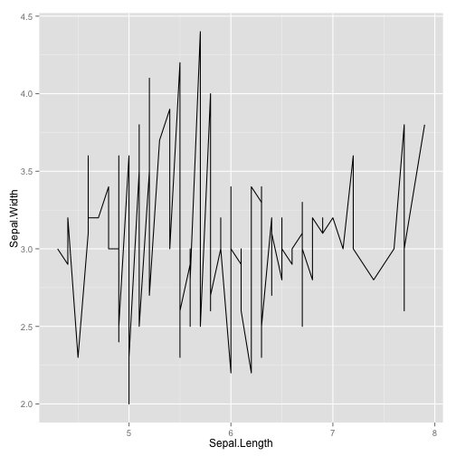
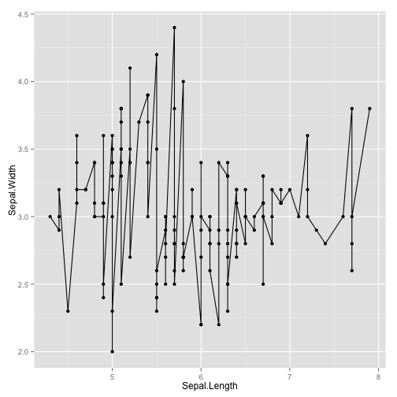
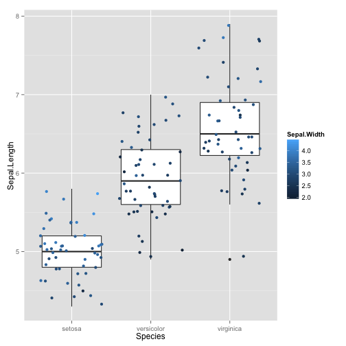
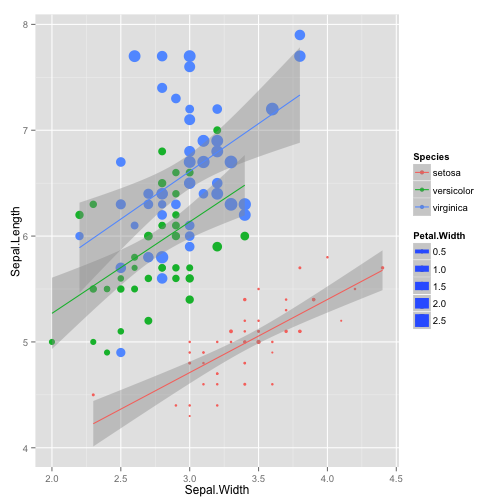
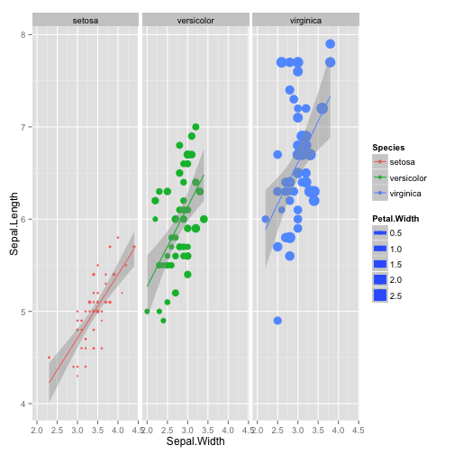
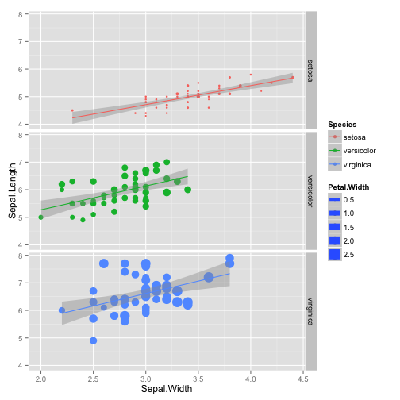
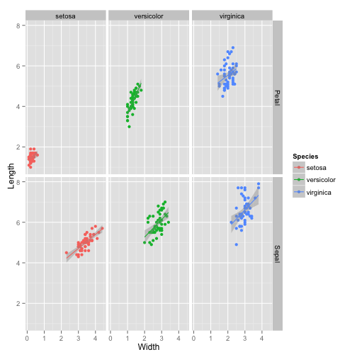

Bioinformatics for Big Omics Data: Advanced graphics in R using ggplot2
=======================================================================
width: 1440
height: 900
transition: none
font-family: 'Helvetica'
css: my_style.css
author: Raphael Gottardo, PhD
date: January 06, 2014

<a rel="license" href="http://creativecommons.org/licenses/by-sa/3.0/deed.en_US"></a><br /><tiny>This work is licensed under a <a rel="license" href="http://creativecommons.org/licenses/by-sa/3.0/deed.en_US">Creative Commons Attribution-ShareAlike 3.0 Unported License</tiny></a>.

Exploratory data analysis (EDA)
=========================
What is EDA?
- Statistical practice concerned with (among other things): uncover underlying structure, extract important variables, detect outliers and anomalies, test underlying assumptions, develop models
- Named by John Tukey
- *Extremely Important*

R provides a powerful environment for EDA and visualization

EDA techniques
==============
- Mostly graphical
- Plotting the raw data (histograms, scatterplots, etc.)
- Plotting simple statistics such as means, standard deviations, medians, box plots, etc
- Positioning such plots so as to maximize our natural pattern-recognition abilities
- A clear picture is worth a thousand words!

A few tips
==========
- Avoid 3-D graphics
- Don’t show too much information on the same graph (color, patterns, etc)
- Stay away from Excel, Excel is not a statistics package!
- R provides a great environment for EDA with good graphics capabilities

Graphics in R
=============

Generic function for plotting of objects in R is `plot`. The output will vary depending on the object type (e.g. scatter-plot, pair-plot, etc)

```r
data(iris)
plot(iris)
```

 


Graphics in R (suite)
=============

R provides many other graphics capabilities, such as histograms, boxplots, etc.


```r
hist(iris$Sepal.Length)
```

 


-----------


```r
boxplot(iris)
```

 


Anything wrong with the Species boxplot?


Graphics in R (end)
===================

While R's graphics is very powerful and fully customizable, it can be difficult and painful to get to the desired plot. 

For example, there are many different parameters, not necessarily consistent across function, etc.

**Friends don't let friends use R base graphics!**

[ggplot2](http://ggplot2.org/) provides a much richer and consistent environment for graphics in R.

ggplot2
=======

Description from Hadley Wickham:

> ggplot2 is a plotting system for R, based on the grammar of graphics, which tries to take the good parts of base and lattice graphics and none of the bad parts. It takes care of many of the fiddly details that make plotting a hassle (like drawing legends) as well as providing a powerful model of graphics that makes it easy to produce complex multi-layered graphics.

Provides lots of different geometrics for data visualization:

See http://docs.ggplot2.org/current/ for details.

ggplot2 provides two main APIs: `qplot` and `ggplot`

ggplot2 - qplot
=======

`qplot` is basically a replacement for `plot` but provide a cleaner output with a consistent interface.


```r
# Load library
library(ggplot2)
# Using the variables directly
qplot(iris$Sepal.Length,iris$Sepal.Width)
```

 


---------------------------------------------


```r
# Can also use a dataframe
qplot(Sepal.Length,Sepal.Width, data=iris)
```

 


ggplot2 - plot types
=======

Plot types can be specified with the `geom` option


```r
# Points
qplot(Sepal.Length, Sepal.Width, data=iris, geom="point")
```

 


-----------------------------


```r
# line
qplot(Sepal.Length, Sepal.Width, data=iris, geom="line")
```

 


ggplot2 - combining plot types
=======

Plot types can be specified with the `geom` option, multiple types can be combined


```r
# Points and line
qplot(Sepal.Length, Sepal.Width, data=iris, geom=c("line","point"))
```

 


--------------------------------


```r
# Points and line
qplot(x=Species, y=Sepal.Length, data=iris, geom=c("boxplot","point"))
```

 


Notice anything wrong on the plot above? Try changing the `point` option with `jitter`.

ggplot2 - mapping aesthetics variables
=======

In ggplot2, additional variables can be mapped to plot aesthetics including `color`, `fill`, `shape`, `size`, `alpha`, `linetype`. 


```r
# Points and line
qplot(x=Species, y=Sepal.Length, data=iris, geom=c("boxplot","jitter"), color=Sepal.Width)
```

 


----------------------


```r
# Points and line
qplot(x=Sepal.Width, y=Sepal.Length, data=iris, geom=c("point","smooth"), color=Species, size=Petal.Width, method="lm")
```

 


ggplot2 - facetting
===================

Sometimes it can be convenient to visualize some characteristic of a dataset conditioning on the levels of some other variable.
Such feature is readily available in ggplot2 using the `facets` argument. 


```r
# Points and line
qplot(x=Sepal.Width, y=Sepal.Length, data=iris, geom=c("point","smooth"), color=Species, size=Petal.Width, method="lm", facets=~Species)
```

 


---------------

Or if you prefer to facet by rows


```r
# Points and line
qplot(x=Sepal.Width, y=Sepal.Length, data=iris, geom=c("point","smooth"), color=Species, size=Petal.Width, method="lm", facets= Species~.)
```

 


Reshaping your data with reshape2
===================

It is often necessary to reshape (e.g. pivot) your data before analysis. This can easily be done in R using the `reshape2` package.
This package provides two mains functions `melt` and `cast`. `melt` basically "melts" a dataframe in wide format into a long format. `cast` goes in the other direction.

Let's revisite our `iris` dataset.

```r
# We first load the library
library(reshape2)
# Only display the first few lines
head(iris)
```

```
  Sepal.Length Sepal.Width Petal.Length Petal.Width Species
1          5.1         3.5          1.4         0.2  setosa
2          4.9         3.0          1.4         0.2  setosa
3          4.7         3.2          1.3         0.2  setosa
4          4.6         3.1          1.5         0.2  setosa
5          5.0         3.6          1.4         0.2  setosa
6          5.4         3.9          1.7         0.4  setosa
```


We can see in the data above that we are measuring both width and length on two different flower characteristics: Sepal, and Petal. So we could store the same information with only one length (resp. width) column and an additional variable for type (Sepal/Petal). 

reshape2 - melt
==============

The `melt` function provides some good default option that will try to best guess how to "melt" the data.


```r
# We first need to add a column to keep track of the flower
iris$flower_id <- rownames(iris)
# Default options
iris_melted <- melt(iris)
head(iris_melted)
```

```
  Species flower_id     variable value
1  setosa         1 Sepal.Length   5.1
2  setosa         2 Sepal.Length   4.9
3  setosa         3 Sepal.Length   4.7
4  setosa         4 Sepal.Length   4.6
5  setosa         5 Sepal.Length   5.0
6  setosa         6 Sepal.Length   5.4
```

but this is not quite what we want, let's try:

```r
# Let's customize some options
iris_melted <- melt(iris, measure.vars=c(1, 3), value.name="length")
iris_melted <- melt(iris_melted, measure.vars=c(1, 2), value.name="width")
head(iris_melted)
```

```
  Species flower_id     variable length    variable width
1  setosa         1 Sepal.Length    5.1 Sepal.Width   3.5
2  setosa         2 Sepal.Length    4.9 Sepal.Width   3.0
3  setosa         3 Sepal.Length    4.7 Sepal.Width   3.2
4  setosa         4 Sepal.Length    4.6 Sepal.Width   3.1
5  setosa         5 Sepal.Length    5.0 Sepal.Width   3.6
6  setosa         6 Sepal.Length    5.4 Sepal.Width   3.9
```


reshape2 - melt (suite)
==============

Now we can cleanup the output:


```r
# We first split that variable to get the columns we need
split_variable <- strsplit(as.character(iris_melted$variable),split="\\.")
# Create two new variables
iris_melted$flower_part <- sapply(split_variable, "[", 1)
# Remove the columns we don't need
iris_melted$variable <- NULL
iris_melted$variable <- NULL

head(iris_melted)
```

```
  Species flower_id length width flower_part
1  setosa         1    5.1   3.5       Sepal
2  setosa         2    4.9   3.0       Sepal
3  setosa         3    4.7   3.2       Sepal
4  setosa         4    4.6   3.1       Sepal
5  setosa         5    5.0   3.6       Sepal
6  setosa         6    5.4   3.9       Sepal
```


reshape2 - cast
===============

Use `acast` or `dcast` depending on whether you want vector/matrix/array output or data frame output. Data frames can have at most two dimensions.


```r
iris_cast <- dcast(iris_melted, formula=Species+flower_id~flower_part, value.var="width")
head(iris_cast)
```

```
  Species flower_id Petal Sepal
1  setosa         1     2     2
2  setosa        10     2     2
3  setosa        11     2     2
4  setosa        12     2     2
5  setosa        13     2     2
6  setosa        14     2     2
```


**Q:** Why are the elements of `flower_id` not properly ordered?

**Exercise:** Try to reorder the variable names in the formula. What happens?

Back to ggplot2
===============

Using our long format dataframe, we can further explore the iris dataset.


```r
# We can now facet by Species and Petal/Sepal
qplot(x=width, y=length, data=iris_melted, geom=c("point","smooth"), color=Species, method="lm", facets= flower_part~Species)
```

 


References
==========

Here are some good references for mastering ggplot2

- [R Graphics Cookbook](http://www.amazon.com/dp/1449316956/ref=cm_sw_su_dp?tag=ggplot2-20) by Winston Chang

- [ggplot2: Elegant Graphics for Data Analysis (Use R!)](http://www.amazon.com/dp/0387981403/ref=cm_sw_su_dp?tag=ggplot2-20) by Hadley Wickham

