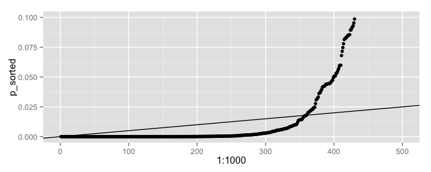
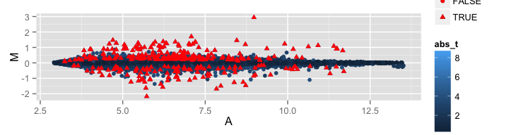

# Bioinformatics for Big Omics Data: Differential expression analysis
Raphael Gottardo  
January 28, 2014  


## Setting up some options

Let's first turn on the cache for increased performance and improved styling

```r
# Set some global knitr options
library("knitr")
opts_chunk$set(tidy=TRUE, tidy.opts=list(blank=FALSE, width.cutoff=60), cache=TRUE, messages=FALSE)
```

## Outline


- Classical approaches (t/F-test, adjusted p-values)
- Two conditions (t-test) 
- Multiple testing (FWER, FDR) 
- Alternative to the t-test
- Bayesian and Empirical Bayesian approaches

## The two condition problem


Let's assume that our data have been normalized and probes summarized.


Condition | 1 | -- | 1 | 2 | -- | 2 |
---|---|---|---|---|---|--- |
Replicate | 1 | -- | $R_1$ | 1 | -- | $R_2$ | 
Gene 1 | x | -- | x | y | -- | y |
Gene 2 | x | -- | x | y | -- | y |
Gene G | x | -- | x | y | -- | y |


 
Our goal here is to find genes that are _differentially expressed_ between the two conditions. 

## Goal


**Note:** Here I will focus on oligo based arrays

- For each gene: Is gene g differentially expressed between the two conditions?
- Is the mean expression level under condition 1 different from the mean expression level under condition 2?
- Test an hypothesis about the equality of the means of the two distributions

## Two-sample t-tests


- For each gene, are the mean log expression values equal?

Welch's t-test: $$t_g=(\bar{y}_{1g}-\bar{y}_{2g})/\sqrt{s^2_{1g}/R_1+s^2_{2g}/R_2}$$

If the means are equal, $t$ approximately follows a t-distribution with $R_1 + R_2 - 1$ degrees of freedom.

p-value $p = 2\cdot P(|t_{R_1+R_2-1}| > |t_g|)$

## Error rates


## Multiple testing


- Fix the type I error rate (0.05)
- Minimize the type II
- This is what we do for each gene with a p-value cut off of 0.05
- Problem?
    - Look at many genes!

## Multiple testing

- 1000 t-tests, all null hypothesis are true ($\mu_1=\mu_2$) 
    - For one test, Pr of making an error is 0.05.
    - For 1000 tests, Pr of making at least one error is 1-(1-0.05)^1000 which is 1!

## Multiple testing


- The error probability is much greater when looking at many genes!
- We look at $G$ genes with $G$ very large! For each gene, $\alpha$ error probability
- Multiple testing is used to control an overall measure of error (FWER, FDR)

## Family Wise Error Rate


Controls the probability of making at least one type I error 


**Example:** Bonferroni multiple adjustment

$$\tilde p_g = G \cdot p_g$$

If $\tilde p_g \le \alpha$ then $FWER \le \alpha$


Many other (more powerful) FWER procedures exist (Holm's step-down, Hochberg's step-up).

## False Discovery Rate

Proportion of false positive among the genes called DE

First procedure introduced by Benjamini and Hochberg (1995)

- Order the p-values $p_{(1)} \le \dots \le p_{(g)} \le \dots \le p_{(G)}$

Let $k$ be the largest $g$ such that $p_{(g)} \le g/G\alpha$ then the 

FDR is controlled at $\alpha$

- Hypothesis need to be independent!
- Alternative approaches exist for dealing with the dependence at the cost of losing 
some power when the test are in fact independent. 

## False Discovery Rate


```r
library(ggplot2)
p <- rbeta(1000, 0.1, 0.1)
p_sorted <- sort(p)
qplot(1:1000, p_sorted, ) + geom_abline(intercept = 0, slope = 0.05/1000) + 
    xlim(c(0, 500)) + ylim(c(0, 0.1))
```

```
## Warning: Removed 570 rows containing missing values (geom_point).
```

 

- Look at the `p.adjust` function in R!


## t-test - revisited

Microarray experiments are expensive, and as such the number of replicates is usually small. These can lead to the following issues:

- The test statistic is not normally distributed
- The variance estimates are noisy, with thousands of test, some of the estimated variances can be extremely small!


## Modified t-test


- Small variance problem: 

Regularized t-test: $$t_g=(\bar{y}_{1g}-\bar{y}_{2g})/\sqrt{s^2_{1g}/R_1+s^2_{2g}/R_2+c}$$

where $c$ is a positive constant used to regularize the variance estimate (e.g. 95% of all standard deviations $S_g$)

- Small sample size and distributional assumption:

Estimate the null distribution by permutation. Under the assumption of no differential expression we can permute the columns of the data matrix. 

This is the main idea behind SAM. 

Tusher, V. G., Tibshirani, R., & Chu, G. (2001). Significance analysis of microarrays applied to the ionizing radiation response. Proceedings of the National Academy of Sciences of the United States of America, 98(9), 5116–5121. doi:10.1073/pnas.091062498


## Linear Models for Microarray Data - LIMMA


LIMMA is popular Bioconductor package for the analysis of microarray data that provides a flexible linear modeling framework for assessing differential expression.

Smyth, G. K. (2004). Linear models and empirical bayes methods for assessing differential expression in microarray experiments. Statistical Applications in Genetics and Molecular Biology, 3(1), Article3. doi:10.2202/1544-6115.1027

## Linear Models for Microarray Data - LIMMA 


Let $\mathbf{y}^T_g=(y_{g1}, y_{g2},\dots, y_{gn})$ be the expression vector of gene $g$. 
The response would be log-ratios for 2-color microarrays or log-intensities for single-channel data. 

Smyth (2004) assumes that the mean expression value of $\mathbf{y}_g$ can be described through a linear model:

$$ \mathbb{E}(\mathbf{y}_g)=\mathbf{X}\boldsymbol{\alpha}_g$$ 

where $\mathbf{X}$ is a full column rank design matrix and $\boldsymbol{\alpha}_g$ is a coefficient vector. 

## Linear Models for Microarray Data - LIMMA 

It is futher assume that 

$$\mathrm{var}(\mathbf{y}_g)=\mathbf{W}_g\sigma_g^2$$ 

where $\mathbf{W}_g$ is a weight matrix. Certain constrasts $\mathbf{C}$ of the vector $\boldsymbol{\alpha}_g$ are of biological interest, and these are defined as:

$$\boldsymbol{\beta}_g=\mathbf{C}^T\boldsymbol{\alpha}_g.$$

The goal here will be to test if some of these contrats are equal to zero. 

## Linear Models for Microarray Data - LIMMA 

As an example of the difference between the design matrix $\mathbf{X}$ and the contrast matrix $\mathbf{C}$ consider a time course experiment for times $t_0$, $t_1$ and $t_2$ in which there are two replicates for each time point. A design matrix for this experiment would be:

$$\mathbf{X} = \left(\begin{array}{ccc}
        1 & 0 & 0\\
        1 & 0 & 0\\
        0 & 1 & 0\\
        0 & 1 & 0\\
        0 & 0 & 1\\
        0 & 0 & 1\end{array}\right)$$
        
If we are interested in the difference between $t_0$ and $t_1$, as well as the difference between $t_1$ and $t_2$, the transpose of the contrast matrix would be:

$$\mathbf{C^T} = \left(\begin{array}{ccc}
              -1 & 1 & 0 \\
               0 & -1 & 1 \end{array}\right)$$


## Linear Models for Microarray Data - LIMMA 


It is assumed that the linear model is fitted for each gene to obtain an estimator $\hat{\boldsymbol{\alpha}}_g$ of $\boldsymbol{\alpha}_g$, and estimator $s^2_g$ of $\sigma_g^2$ and estimated covariance matrix:

$$\mathrm{var}(\hat{\alpha}_g ) = \mathbf{V}_g s^2_g$$

where $\mathbf{V}_g$ is positive definite and does not depend on $s_g^2$. Then we have
$$ \mathrm{var}( \hat{\boldsymbol{\beta}}_g ) = \mathbf{C}^T \mathbf{V}_g \mathbf{C} s^2_g $$

**Note:** So far no distributional assumptions are made, and the fitting is not necessarily done by least-squares. However the contrast estimator will be assumed to be approximately normal with mean $\boldsymbol{\beta}_g$ and covariance $\mathbf{C}^T \mathbf{V}_g \mathbf{C} \sigma^2_g$


## Linear Models for Microarray Data - LIMMA 


 Let $v_{gj}$ be the $j^{th}$ diagonal element of $\mathbf{C}^T \mathbf{V}_g \mathbf{C}$, then the distributional assumptions made are equivalent to: 
 
 $$ \hat{\beta}_{gj} | \beta_{gj} , \sigma_g^2 \sim \mathrm{N}(\beta_{gj} , v_{gj} \sigma_g^2)$$
 
 and 
 
 $$ s^2_g|\sigma_g^2 \sim \frac{\sigma_g^2}{d_g}\chi^2_{d_g}$$
 
 where $d_g$ is the residual degrees of freedom for the linear model for gene $g$. Under these
assumptions the ordinary t-statistic

$$ t_{gj}=\frac{\hat{\beta}_{gj}}{s_g\sqrt{v_{gj}}}$$

follows an approximate t-distribution on $d_g$ degrees of freedom, which can be used to test the null hypothesis:
$H_0 : \beta_{gj} = 0.$

## Linear Models for Microarray Data - LIMMA 


This approach still suffers from the small sample size problem mentioned previously. One solution is to use a hierarchical model to borrow strength across genes. In particular, we will place a prior distribution on the inverse variances as follows:

$$\sigma_g^{-2}\sim \frac{1}{d_0 s_0^2}\chi^2_{d_0}$$ 

where ${d_0}$ and $s_0$ are fixed hyper-parameters. Similarly, a prior distribution can be placed on the unknown contrast parameters:

$$\beta_{gj} |\sigma_g^2,\beta_{gj}\ne 0 \sim \mathrm{N}(0,v_{0j}\sigma_g^2)$$

with $\mathrm{Pr}(\beta_{gj}\ne 0) = p_j$ where $v_{0j}$ and $p_j$ are given hyperparameters.

## LIMMA - Hierarchical model


Under the above hierarchical model, the posterior mean of $\sigma_g^2$ given $s_g^2$ is

$$\tilde{s}^2_g=\mathbb{E}(\sigma^2_g|s^2_g)= \frac{d_0s_0^2+d_gs_g^2}{d_0+d_g}$$

and we can define the following moderated t-statistics:

$$ \tilde{t}_{gj}=\frac{\hat{\beta}_{gj}}{\tilde{s}_g\sqrt{v_{gj}}}$$

The moderated t-statistics $\tilde{t}_{gj}$ and the residual sample variances $s^2$
are shown to be distributed independently. The moderated t is shown to follow a t-
distribution under the null hypothesis $H_0 : \beta_{gj}$ = 0 with degrees of freedom $d_g +d_0$.

## LIMMA - Estimation of hyperparameters


All parameters except $p_j$ are shared across genes and can easily be estimated using an empirical Bayes approach using all genes. The most difficult parameter to estimate is $p_j$, but this parameter is only used in the calculation of the posterior odds and is not required for inference via the moderated t-statistics. 

This is typical of frequentist inference where the alternative does not matter. 

## Other Bayesian approaches


Here are a few other Bayesian approaches that are available for the analysis of gene expression microarray data:
- Kendziorski, C. M., Newton, M. A., Lan, H., & Gould, M. N. (2003). On parametric empirical Bayes methods for comparing multiple groups using replicated gene expression profiles. Statistics in Medicine, 22(24), 3899–3914. doi:10.1002/sim.1548

- Gottardo, R., Raftery, A. E., Yeung, K. Y., & Bumgarner, R. E. (2006). Bayesian robust inference for differential gene expression in microarrays with multiple samples. Biometrics, 62(1), 10–18. doi:10.1111/j.1541-0420.2005.00397.x

- Lewin, A., Bochkina, N., & Richardson, S. (2007). Fully Bayesian mixture model for differential gene expression: simulations and model checks. Statistical Applications in Genetics and Molecular Biology, 6(1), Article36. doi:10.2202/1544-6115.1314

However, in my opinion, LIMMA provides the best user experience in terms of analysis in R and Bioconductor.

## The LIMMA package


Let's first install Limma:


```r
source("http://bioconductor.org/biocLite.R")
```

```
## Bioconductor version 2.14 (BiocInstaller 1.14.3), ?biocLite for
##   help
## A newer version of Bioconductor is available for this version of
##   R, ?BiocUpgrade for help
```

```r
biocLite("limma")
```

```
## BioC_mirror: http://bioconductor.org
## Using Bioconductor version 2.14 (BiocInstaller 1.14.3), R version
##   3.1.2.
## Installing package(s) 'limma'
```

```
## 
## The downloaded binary packages are in
## 	/var/folders/_r/hy8xh8lx3xx0jqslfghgw7jr0000gn/T//RtmpmrOGBh/downloaded_packages
```

```
## Old packages: 'codetools', 'devtools', 'dplyr', 'Formula',
##   'knitr', 'Matrix', 'matrixStats', 'robustbase', 'shiny'
```

Now we're ready to start using Limma


```r
library(limma)
library(Biobase)
```

```
## Loading required package: BiocGenerics
## Loading required package: parallel
## 
## Attaching package: 'BiocGenerics'
## 
## The following objects are masked from 'package:parallel':
## 
##     clusterApply, clusterApplyLB, clusterCall, clusterEvalQ,
##     clusterExport, clusterMap, parApply, parCapply, parLapply,
##     parLapplyLB, parRapply, parSapply, parSapplyLB
## 
## The following object is masked from 'package:limma':
## 
##     plotMA
## 
## The following object is masked from 'package:stats':
## 
##     xtabs
## 
## The following objects are masked from 'package:base':
## 
##     anyDuplicated, append, as.data.frame, as.vector, cbind,
##     colnames, do.call, duplicated, eval, evalq, Filter, Find, get,
##     intersect, is.unsorted, lapply, Map, mapply, match, mget,
##     order, paste, pmax, pmax.int, pmin, pmin.int, Position, rank,
##     rbind, Reduce, rep.int, rownames, sapply, setdiff, sort,
##     table, tapply, union, unique, unlist
## 
## Welcome to Bioconductor
## 
##     Vignettes contain introductory material; view with
##     'browseVignettes()'. To cite Bioconductor, see
##     'citation("Biobase")', and for packages 'citation("pkgname")'.
```

```r
library(data.table)
```

but we need some data!


## Getting some data with GEOquery


We're going to look at the dataset used in:

Nakaya, H. I., Wrammert, J., Lee, E. K., Racioppi, L., Marie-Kunze, S., Haining, W. N., et al. (2011). Systems biology of vaccination for seasonal influenza in humans. Nature Immunology, 12(8), 786–795. doi:10.1038/ni.2067


```r
library(GEOquery)
# Download the mapping information and processed data main
# serie #gds[[1]] = LAIV/TIV 0809, gds[[2]] = FACS, gds[[3]]
# = TIV 0708
gds <- getGEO("GSE29619", destdir = "Data/GEO/")
```

```
## ftp://ftp.ncbi.nlm.nih.gov/geo/series/GSE29nnn/GSE29619/matrix/
## Found 3 file(s)
## GSE29619-GPL13158_series_matrix.txt.gz
## Using locally cached version: Data/GEO//GSE29619-GPL13158_series_matrix.txt.gz
## Using locally cached version of GPL13158 found here:
## Data/GEO//GPL13158.soft 
## GSE29619-GPL3921_series_matrix.txt.gz
## Using locally cached version: Data/GEO//GSE29619-GPL3921_series_matrix.txt.gz
## Using locally cached version of GPL3921 found here:
## Data/GEO//GPL3921.soft 
## GSE29619-GPL570_series_matrix.txt.gz
## Using locally cached version: Data/GEO//GSE29619-GPL570_series_matrix.txt.gz
## Using locally cached version of GPL570 found here:
## Data/GEO//GPL570.soft
```

## Getting some data with GEOquery

but before we can use this, we need to clean up the pData a bit (see code in .Rmd file by clicking on the pencil icon above, which will bring you to this slide in the .Rmd file). 


```r
### Sanitize data and metadata
gds_new <- gds
sanitize_pdata <- function(pd) {
    keepCols <- c("characteristics_ch1.1", "characteristics_ch1.2", 
        "description", "supplementary_file")
    pd <- pd[, keepCols]
    colnames(pd) <- c("ptid", "time", "description", "filename")
    pd$ptid <- gsub(".*: ", "", pd$ptid)
    pd$time <- gsub(".*: ", "", pd$time)
    pd$time <- gsub("Day", "D", pd$time)
    pd$description <- gsub("(-\\w*){2}$", "", pd$description)
    pd$filename <- basename(as.character(pd$filename))
    pd$filename <- gsub(".CEL.gz", "", pd$filename)
    pd
}
pData(gds_new[[1]]) <- sanitize_pdata(pData(gds_new[[1]]))
pData(gds_new[[2]]) <- sanitize_pdata(pData(gds_new[[2]]))
pData(gds_new[[3]]) <- sanitize_pdata(pData(gds_new[[3]]))
```


## Model set-up and estimation


Let's create seperate `ExpressionSet`s for the datasets of interests.


```r
TIV_08 <- gds_new[[1]][, grepl("2008-TIV", pData(gds_new[[1]])$description)]
LAIV_08 <- gds_new[[1]][, grepl("2008-LAIV", pData(gds_new[[1]])$description)]
TIV_07 <- gds_new[[3]][, grepl("2007-TIV", pData(gds_new[[3]])$description)]
```

TIV_08, LAIV_08 and TIV_07 are expression sets containing data from three time points (variable name is "time", with values D0, D3 and D7), for several probes (i.e., of form GSMXXXX) and patients (variable name "ptid"). 

We then use the limma R package to identify genes that are differentially expressed at D3 and D7 compared to baseline for each study. 


```r
mm_TIV_08 <- model.matrix(~ptid + time, TIV_08)  # design matrix
fit_TIV_08 <- lmFit(TIV_08, mm_TIV_08)  #Fit linear model for each gene given a series of arrays
ebay_TIV_08 <- eBayes(fit_TIV_08)  # compute moderated t-statistics, moderated F-statistic, and log-odds of differential expression
```

## Testing specific hypothesis


Let's first look at the estimated coefficients


```r
colnames(fit_TIV_08$coef)
```

```
##  [1] "(Intercept)" "ptid2"       "ptid29"      "ptid3"       "ptid32"     
##  [6] "ptid35"      "ptid38"      "ptid39"      "ptid4"       "ptid42"     
## [11] "ptid43"      "ptid44"      "ptid46"      "ptid47"      "ptid48"     
## [16] "ptid51"      "ptid53"      "ptid63"      "ptid65"      "ptid68"     
## [21] "ptid70"      "ptid72"      "ptid73"      "ptid74"      "ptid78"     
## [26] "ptid80"      "ptid83"      "ptid85"      "timeD3"      "timeD7"
```
In this case, the design matrix contains 1's and 0's, indicating which patient and time point matches up to a given measurement in the vector, $\mathbf{Y}$. There is no column for timeD0, since it is the reference point. When both timeD3 and timeD7 are zero, than we know that the measurement is from timeD0. 

Now we can test specific hypotheses.

## Testing specific hypothesis 


Here we look for genes differentially expressed at day 3 and day 7 wrt baseline:


```r
# Test t3=t0
topT3 <- topTable(ebay_TIV_08, coef = "timeD3", number = Inf, 
    sort.by = "none")
# Test t7=t0
topT7 <- topTable(ebay_TIV_08, coef = "timeD7", number = Inf, 
    sort.by = "none")
```


`topTable()` extracts a table of the top-ranked genes from a linear model fit and outputs a `data.frame` with the following columns:

```r
colnames(topT7)
```

```
##  [1] "ID"                               "GB_ACC"                          
##  [3] "SPOT_ID"                          "Species.Scientific.Name"         
##  [5] "Annotation.Date"                  "Sequence.Type"                   
##  [7] "Sequence.Source"                  "Target.Description"              
##  [9] "Representative.Public.ID"         "Gene.Title"                      
## [11] "Gene.Symbol"                      "ENTREZ_GENE_ID"                  
## [13] "RefSeq.Transcript.ID"             "Gene.Ontology.Biological.Process"
## [15] "Gene.Ontology.Cellular.Component" "Gene.Ontology.Molecular.Function"
## [17] "logFC"                            "AveExpr"                         
## [19] "t"                                "P.Value"                         
## [21] "adj.P.Val"                        "B"
```
as you can see it contains information about the probes contained in the `ExpressionSet` as well as values calculated by LIMMA. 


## MA plot d7 vs d0


```r
lm7 <- rowMeans(exprs(TIV_08)[, grepl("D7", pData(TIV_08)$time)])
lm0 <- rowMeans(exprs(TIV_08)[, grepl("D0", pData(TIV_08)$time)])
M <- lm7 - lm0
A <- (lm7 + lm0)/2
```


```r
dt <- data.table(A, M, abs_t = abs(topT7$t), p = topT7$adj.P.Val)
ggplot(dt, aes(x = A, y = M, color = abs_t, shape = p < 0.01)) + 
    geom_point() + geom_point(data = dt[p < 0.01], aes(x = A, 
    y = M), color = "red")
```

 

## MA plot d7 vs d0 

Let's compare to ordinary t-statistics


```r
# Ordinary t-statistic
ordinary_t <- fit_TIV_08$coef/fit_TIV_08$stdev.unscaled/fit_TIV_08$sigma
ordinary_t <- ordinary_t[, "timeD7"]
# p-values based on normal approx with BH fdr adjustment
ordinary_p <- p.adjust(2 * pnorm(abs(ordinary_t), lower.tail = FALSE), 
    method = "BH")
```


```r
dt <- data.table(A, M, abs_t = abs(ordinary_t), p = ordinary_p)
ggplot(dt[is.finite(abs_t)], aes(x = A, y = M, color = abs_t, 
    shape = p < 0.01)) + geom_point() + geom_point(data = dt[p < 
    0.01], aes(x = A, y = M), color = "red")
```

 

## Setting up your own contrast


Suppose you want to look at the difference between timeD7 and timeD3. We need to create a contrast matrix that will get this information from the design matrix. This can easily be done using the `makeContrats` function as follows,


```r
cont_matrix <- makeContrasts(timeD7 - timeD3, levels = mm_TIV_08)
```

```
## Warning in makeContrasts(timeD7 - timeD3, levels = mm_TIV_08): Renaming
## (Intercept) to Intercept
```

```r
fit2 <- contrasts.fit(fit_TIV_08, cont_matrix)
```

```
## Warning in contrasts.fit(fit_TIV_08, cont_matrix): row names of contrasts
## don't match col names of coefficients
```

```r
fit2 <- eBayes(fit2)
topTable(fit2, adjust = "fdr")
```

```
##                            ID   GB_ACC SPOT_ID Species.Scientific.Name
## 211430_PM_s_at 211430_PM_s_at   M87789                    Homo sapiens
## 215946_PM_x_at 215946_PM_x_at AL022324                    Homo sapiens
## 214669_PM_x_at 214669_PM_x_at BG485135                    Homo sapiens
## 213502_PM_x_at 213502_PM_x_at AA398569                    Homo sapiens
## 215379_PM_x_at 215379_PM_x_at AV698647                    Homo sapiens
## 215121_PM_x_at 215121_PM_x_at AA680302                    Homo sapiens
## 214677_PM_x_at 214677_PM_x_at   X57812                    Homo sapiens
## 213182_PM_x_at 213182_PM_x_at   R78668                    Homo sapiens
## 216576_PM_x_at 216576_PM_x_at AF103529                    Homo sapiens
## 209138_PM_x_at 209138_PM_x_at   M87790                    Homo sapiens
##                Annotation.Date      Sequence.Type Sequence.Source
## 211430_PM_s_at    Aug 20, 2010  Exemplar sequence         GenBank
## 215946_PM_x_at    Aug 20, 2010 Consensus sequence         GenBank
## 214669_PM_x_at    Aug 20, 2010 Consensus sequence         GenBank
## 213502_PM_x_at    Aug 20, 2010 Consensus sequence         GenBank
## 215379_PM_x_at    Aug 20, 2010 Consensus sequence         GenBank
## 215121_PM_x_at    Aug 20, 2010 Consensus sequence         GenBank
## 214677_PM_x_at    Aug 20, 2010 Consensus sequence         GenBank
## 213182_PM_x_at    Aug 20, 2010 Consensus sequence         GenBank
## 216576_PM_x_at    Aug 20, 2010 Consensus sequence         GenBank
## 209138_PM_x_at    Aug 20, 2010  Exemplar sequence         GenBank
##                                                                                                                                                                                                                                                                                                                                                                                                                                            Target.Description
## 211430_PM_s_at                                                                                                                                                  gb:M87789.1 /DB_XREF=gi:185361 /FEA=FLmRNA /CNT=1 /TID=Hs.300697.0 /TIER=FL /STK=0 /UG=Hs.300697 /LL=3502 /UG_GENE=IGHG3 /DEF=Human (hybridoma H210) anti-hepatitis A IgG variable region, constant region, complementarity-determining regions mRNA, complete cds. /PROD=IgG /FL=gb:M87789.1
## 215946_PM_x_at gb:AL022324 /DB_XREF=gi:3702433 /FEA=DNA /CNT=2 /TID=Hs.296552.1 /TIER=ConsEnd /STK=0 /UG=Hs.296552 /LL=3545 /UG_GENE=IGLL3 /UG_TITLE=immunoglobulin lambda-like polypeptide 3 /DEF=Human DNA sequence from clone CTA-246H3 on chromosome 22 Contains the gene for IGLL1 (immunoglobulin lambda-like polypeptide 1, pre-B-cell specific), a pseudogene similar to LRP5 (Lipoprotein Receptor Related Protein.), ESTs, Genomic markers (D22S...
## 214669_PM_x_at                                                                                                                                                                                                                   gb:BG485135 /DB_XREF=gi:13417414 /DB_XREF=602503756F1 /CLONE=IMAGE:4617445 /FEA=mRNA /CNT=101 /TID=Hs.325722.1 /TIER=ConsEnd /STK=0 /UG=Hs.325722 /LL=28875 /UG_GENE=IGKV3D-15 /UG_TITLE=immunoglobulin kappa variable 3D-15
## 213502_PM_x_at                                                                                                                                                                                                                         gb:AA398569 /DB_XREF=gi:2051678 /DB_XREF=zt73g04.s1 /CLONE=IMAGE:728022 /FEA=DNA /CNT=47 /TID=Hs.296552.0 /TIER=Stack /STK=35 /UG=Hs.296552 /LL=3545 /UG_GENE=IGLL3 /UG_TITLE=immunoglobulin lambda-like polypeptide 3
## 215379_PM_x_at                                                                                                                                                                                                                                     gb:AV698647 /DB_XREF=gi:10300618 /DB_XREF=AV698647 /CLONE=GKCBJC12 /FEA=mRNA /CNT=4 /TID=Hs.289110.4 /TIER=ConsEnd /STK=0 /UG=Hs.289110 /LL=28831 /UG_GENE=IGLJ3 /UG_TITLE=immunoglobulin lambda joining 3
## 215121_PM_x_at                                                                                                                                                                                                                                     gb:AA680302 /DB_XREF=gi:2656270 /DB_XREF=ac83d05.s1 /CLONE=IMAGE:869193 /FEA=mRNA /CNT=18 /TID=Hs.181125.2 /TIER=ConsEnd /STK=1 /UG=Hs.181125 /LL=3535 /UG_GENE=IGL@ /UG_TITLE=immunoglobulin lambda locus
## 214677_PM_x_at                                                                                                                                                                                  gb:X57812.1 /DB_XREF=gi:33723 /GEN=immunoglobulin lambda light chain /FEA=mRNA /CNT=199 /TID=Hs.289110.2 /TIER=ConsEnd /STK=0 /UG=Hs.289110 /LL=28831 /UG_TITLE=immunoglobulin lambda joining 3 /DEF=Human rearranged immunoglobulin lambda light chain mRNA.
## 213182_PM_x_at                                                                                                                                                                                                                 gb:R78668 /DB_XREF=gi:854949 /DB_XREF=yi74c04.r1 /CLONE=IMAGE:144966 /FEA=EST /CNT=286 /TID=Hs.106070.2 /TIER=ConsEnd /STK=0 /UG=Hs.106070 /LL=1028 /UG_GENE=CDKN1C /UG_TITLE=cyclin-dependent kinase inhibitor 1C (p57, Kip2)
## 216576_PM_x_at                                                                                                                                                                  gb:AF103529.1 /DB_XREF=gi:4378387 /FEA=mRNA /CNT=1 /TID=Hs.247910.0 /TIER=ConsEnd /STK=0 /UG=Hs.247910 /DEF=Homo sapiens isolate donor N clone N88K immunoglobulin kappa light chain variable region mRNA, partial cds. /PROD=immunoglobulin kappa light chain variableregion
## 209138_PM_x_at                                                                                         gb:M87790.1 /DB_XREF=gi:185363 /FEA=FLmRNA /CNT=660 /TID=Hs.181125.0 /TIER=FL+Stack /STK=584 /UG=Hs.181125 /LL=3535 /UG_GENE=IGL@ /DEF=Human (hybridoma H210) anti-hepatitis A immunoglobulin lambda chain variable region, constant region, complementarity-determining regions mRNA, complete cds. /PROD=immunoglobulin lambda-chain /FL=gb:M87790.1
##                Representative.Public.ID
## 211430_PM_s_at                   M87789
## 215946_PM_x_at                 AL022324
## 214669_PM_x_at                 BG485135
## 213502_PM_x_at                 AA398569
## 215379_PM_x_at                 AV698647
## 215121_PM_x_at                 AA680302
## 214677_PM_x_at                   X57812
## 213182_PM_x_at                   R78668
## 216576_PM_x_at                 AF103529
## 209138_PM_x_at                   M87790
##                                                                                                                                                                                                         Gene.Title
## 211430_PM_s_at immunoglobulin heavy locus /// immunoglobulin heavy constant gamma 1 (G1m marker) /// immunoglobulin heavy constant mu /// immunoglobulin heavy variable 4-31 /// hypothetical protein LOC100290146
## 215946_PM_x_at                                   immunoglobulin lambda-like polypeptide 1 /// immunoglobulin lambda-like polypeptide 3 /// glucuronidase, beta/immunoglobulin lambda-like polypeptide 1 pseudogene
## 214669_PM_x_at                                                                       immunoglobulin kappa locus /// immunoglobulin kappa constant /// immunoglobulin kappa variable 3-20 /// similar to hCG1686089
## 213502_PM_x_at                                                                                                                             glucuronidase, beta/immunoglobulin lambda-like polypeptide 1 pseudogene
## 215379_PM_x_at                                                                                                                                                                 immunoglobulin lambda variable 1-44
## 215121_PM_x_at                                                                                                                                 cyclosporin A transporter 1 /// immunoglobulin lambda variable 1-44
## 214677_PM_x_at                                                                                                                                                                         Immunoglobulin lambda locus
## 213182_PM_x_at                                                                                                                                                    cyclin-dependent kinase inhibitor 1C (p57, Kip2)
## 216576_PM_x_at                      immunoglobulin kappa locus /// immunoglobulin kappa constant /// similar to Ig kappa chain V-I region HK102 precursor /// similar to Ig kappa chain V-I region HK102 precursor
## 209138_PM_x_at                                                                                                                                                                         Immunoglobulin lambda locus
##                                                          Gene.Symbol
## 211430_PM_s_at IGH@ /// IGHG1 /// IGHM /// IGHV4-31 /// LOC100290146
## 215946_PM_x_at                          IGLL1 /// IGLL3 /// LOC91316
## 214669_PM_x_at           IGK@ /// IGKC /// IGKV3-20 /// LOC100291682
## 213502_PM_x_at                                              LOC91316
## 215379_PM_x_at                                              IGLV1-44
## 215121_PM_x_at                                    CYAT1 /// IGLV1-44
## 214677_PM_x_at                                                  IGL@
## 213182_PM_x_at                                                CDKN1C
## 216576_PM_x_at             IGK@ /// IGKC /// LOC652493 /// LOC652694
## 209138_PM_x_at                                                  IGL@
##                                                ENTREZ_GENE_ID
## 211430_PM_s_at 100290146 /// 28396 /// 3492 /// 3500 /// 3507
## 215946_PM_x_at                       3543 /// 91316 /// 91353
## 214669_PM_x_at         100291682 /// 28912 /// 3514 /// 50802
## 213502_PM_x_at                                          91316
## 215379_PM_x_at                                          28823
## 215121_PM_x_at                            100290481 /// 28823
## 214677_PM_x_at                                           3535
## 213182_PM_x_at                                           1028
## 216576_PM_x_at           3514 /// 50802 /// 652493 /// 652694
## 209138_PM_x_at                                           3535
##                                                                RefSeq.Transcript.ID
## 211430_PM_s_at                                        XM_001718220 /// XM_002347483
## 215946_PM_x_at NM_001013618 /// NM_020070 /// NM_152855 /// NR_024448 /// NR_029395
## 214669_PM_x_at                                                         XM_002345544
## 213502_PM_x_at                                                            NR_024448
## 215379_PM_x_at                                                                     
## 215121_PM_x_at                                                         XM_002348112
## 214677_PM_x_at                                                                     
## 213182_PM_x_at                          NM_000076 /// NM_001122630 /// NM_001122631
## 216576_PM_x_at                                           XM_001724425 /// XM_942302
## 209138_PM_x_at                                                                     
##                                                                                                                                                                                                                                                                                                                                                                                                                                                                                                                                                                                                                                                                                                                                                                                                                                                                                                                                                                                                                                                                                                                                                                              Gene.Ontology.Biological.Process
## 211430_PM_s_at                                                                                                                                                                                                                                                                                                                                                                                                                                                                                                                                                                                                                                                                                                                                                                                                                                                                                                                                                                                                                                                 0006955 // immune response // non-traceable author statement /// 0018298 // protein-chromophore linkage // inferred from electronic annotation
## 215946_PM_x_at                                                                                                                                                                                                                                                                                                                                                                                                                                                                                                                                                                                                                                                                                                                                                                                                                                                                                                                                                                                                                                              0005975 // carbohydrate metabolic process // inferred from electronic annotation /// 0006955 // immune response // non-traceable author statement
## 214669_PM_x_at                                                                                                                                                                                                                                                                                                                                                                                                                                                                                                                                                                                                                                                                                                                                                                                                                                                                                                                                                                                                                                                                                                                                   0006955 // immune response // non-traceable author statement
## 213502_PM_x_at                                                                                                                                                                                                                                                                                                                                                                                                                                                                                                                                                                                                                                                                                                                                                                                                                                                                                                                                                                                                                                                                                                               0005975 // carbohydrate metabolic process // inferred from electronic annotation
## 215379_PM_x_at                                                                                                                                                                                                                                                                                                                                                                                                                                                                                                                                                                                                                                                                                                                                                                                                                                                                                                                                                                                                                                                                                                                                   0006955 // immune response // non-traceable author statement
## 215121_PM_x_at                                                                                                                                                                                                                                                                                                                                                                                                                                                                                                                                                                                                                                                                                                                                                                                                                                                                                                                                                                                                                                                                                                                                   0006955 // immune response // non-traceable author statement
## 214677_PM_x_at                                                                                                                                                                                                                                                                                                                                                                                                                                                                                                                                                                                                                                                                                                                                                                                                                                                                                                                                                                                                                                                                                                                                   0006955 // immune response // non-traceable author statement
## 213182_PM_x_at 0000079 // regulation of cyclin-dependent protein kinase activity // traceable author statement /// 0000080 // G1 phase of mitotic cell cycle // traceable author statement /// 0000122 // negative regulation of transcription from RNA polymerase II promoter // inferred from electronic annotation /// 0007049 // cell cycle // inferred from electronic annotation /// 0007050 // cell cycle arrest // inferred from electronic annotation /// 0007050 // cell cycle arrest // traceable author statement /// 0008285 // negative regulation of cell proliferation // traceable author statement /// 0030511 // positive regulation of transforming growth factor beta receptor signaling pathway // inferred from mutant phenotype /// 0032582 // negative regulation of gene-specific transcription // inferred from direct assay /// 0033673 // negative regulation of kinase activity // inferred from direct assay /// 0042326 // negative regulation of phosphorylation // inferred from direct assay /// 0042551 // neuron maturation // inferred from electronic annotation /// 0050680 // negative regulation of epithelial cell proliferation // inferred from mutant phenotype
## 216576_PM_x_at                                                                                                                                                                                                                                                                                                                                                                                                                                                                                                                                                                                                                                                                                                                                                                                                                                                                                                                                                                                                                                                                                                                                   0006955 // immune response // non-traceable author statement
## 209138_PM_x_at                                                                                                                                                                                                                                                                                                                                                                                                                                                                                                                                                                                                                                                                                                                                                                                                                                                                                                                                                                                                                                                                                                                                                                                               
##                                                                                                                                                                                                                                                                                                                                                                                                                                                                                            Gene.Ontology.Cellular.Component
## 211430_PM_s_at 0005576 // extracellular region // inferred from electronic annotation /// 0005576 // extracellular region // non-traceable author statement /// 0005624 // membrane fraction // non-traceable author statement /// 0005886 // plasma membrane // inferred from electronic annotation /// 0005887 // integral to plasma membrane // non-traceable author statement /// 0016020 // membrane // inferred from electronic annotation /// 0016021 // integral to membrane // inferred from electronic annotation
## 215946_PM_x_at                                                                                                                                                                                                                                                                                                                                                                             0005576 // extracellular region // inferred from electronic annotation /// 0016020 // membrane // non-traceable author statement
## 214669_PM_x_at                                                                                                                                                                                                                                                                                                                                                                                        0005576 // extracellular region // not recorded /// 0005576 // extracellular region // non-traceable author statement
## 213502_PM_x_at                                                                                                                                                                                                                                                                                                                                                                                                                                                                                                             
## 215379_PM_x_at                                                                                                                                                                                                                                                                                                                                                                                                                                            0005576 // extracellular region // non-traceable author statement
## 215121_PM_x_at                                                                                                                                                                                                                                                                                                                                                                                                                                            0005576 // extracellular region // non-traceable author statement
## 214677_PM_x_at                                                                                                                                                                                                                                                                                                                                                                                                                                            0005576 // extracellular region // non-traceable author statement
## 213182_PM_x_at                                                                                                                                                                                                                                                                                 0005634 // nucleus // inferred from direct assay /// 0005634 // nucleus // inferred from electronic annotation /// 0005730 // nucleolus // inferred from direct assay /// 0005737 // cytoplasm // inferred from direct assay
## 216576_PM_x_at                                                                                                                                                                                                                                                                                                                                                                                        0005576 // extracellular region // not recorded /// 0005576 // extracellular region // non-traceable author statement
## 209138_PM_x_at                                                                                                                                                                                                                                                                                                                                                                                                                                                                                                             
##                                                                                                                                                                                                                                                                                                                                                                                                                                                                                                                                                                                                                                                                    Gene.Ontology.Molecular.Function
## 211430_PM_s_at                                                                                                                                                                                          0003823 // antigen binding // traceable author statement /// 0003823 // antigen binding // inferred from electronic annotation /// 0003823 // antigen binding // non-traceable author statement /// 0004872 // receptor activity // inferred from electronic annotation /// 0005515 // protein binding // inferred from physical interaction /// 0008270 // zinc ion binding // inferred from electronic annotation /// 0046872 // metal ion binding // inferred from electronic annotation
## 215946_PM_x_at                                                                                                                                                                                                                                                                                                                                                                                                                                                                                                                                                                               0004553 // hydrolase activity, hydrolyzing O-glycosyl compounds // inferred from electronic annotation
## 214669_PM_x_at                                                                                                                                                                                                                                                                                                                                                                                                                                                                              0003823 // antigen binding // non-traceable author statement /// 0003823 // antigen binding // inferred from electronic annotation /// 0005515 // protein binding // inferred from physical interaction
## 213502_PM_x_at                                                                                                                                                                                                                                                                                                                                                                                                                                                                                                                                                                               0004553 // hydrolase activity, hydrolyzing O-glycosyl compounds // inferred from electronic annotation
## 215379_PM_x_at                                                                                                                                                                                                                                                                                                                                                                                                                                                                                                                                                   0003823 // antigen binding // inferred from electronic annotation /// 0003823 // antigen binding // non-traceable author statement
## 215121_PM_x_at                                                                                                                                                                                                                                                                                                                                                                                                                                                                                                                                                   0003823 // antigen binding // inferred from electronic annotation /// 0003823 // antigen binding // non-traceable author statement
## 214677_PM_x_at                                                                                                                                                                                                                                                                                                                                                                                                                                                                                                                                                   0003823 // antigen binding // inferred from electronic annotation /// 0003823 // antigen binding // non-traceable author statement
## 213182_PM_x_at 0004860 // protein kinase inhibitor activity // inferred from electronic annotation /// 0004861 // cyclin-dependent protein kinase inhibitor activity // inferred from electronic annotation /// 0004861 // cyclin-dependent protein kinase inhibitor activity // traceable author statement /// 0005515 // protein binding // inferred from physical interaction /// 0005515 // protein binding // inferred from electronic annotation /// 0016301 // kinase activity // inferred from electronic annotation /// 0016563 // transcription activator activity // inferred from genetic interaction /// 0016564 // transcription repressor activity // inferred from mutant phenotype
## 216576_PM_x_at                                                                                                                                                                                                                                                                                                                                                                                                                                                                              0003823 // antigen binding // non-traceable author statement /// 0003823 // antigen binding // inferred from electronic annotation /// 0005515 // protein binding // inferred from physical interaction
## 209138_PM_x_at                                                                                                                                                                                                                                                                                                                                                                                                                                                                                                                                                                                                                                                                                     
##                     logFC   AveExpr         t      P.Value    adj.P.Val
## 211430_PM_s_at  2.7674612  8.427690  8.970877 2.624795e-12 1.436157e-07
## 215946_PM_x_at  1.0410176  6.039067  6.587058 1.881578e-08 3.468005e-04
## 214669_PM_x_at  0.8635100 11.327501  6.533285 2.300599e-08 3.468005e-04
## 213502_PM_x_at  1.0441970  9.142830  6.410658 3.637000e-08 3.468005e-04
## 215379_PM_x_at  1.1873632  9.664309  6.401504 3.763385e-08 3.468005e-04
## 215121_PM_x_at  1.0060274 10.416652  6.387251 3.968904e-08 3.468005e-04
## 214677_PM_x_at  1.0212244 11.183803  6.340074 4.732293e-08 3.468005e-04
## 213182_PM_x_at -0.7084388  5.203281 -6.321544 5.070646e-08 3.468005e-04
## 216576_PM_x_at  1.2227860  6.012631  6.282835 5.857118e-08 3.560803e-04
## 209138_PM_x_at  1.1115976 10.681856  6.241708 6.826052e-08 3.734874e-04
##                        B
## 211430_PM_s_at 16.626413
## 215946_PM_x_at  8.873759
## 214669_PM_x_at  8.695609
## 213502_PM_x_at  8.289495
## 215379_PM_x_at  8.259188
## 215121_PM_x_at  8.212009
## 214677_PM_x_at  8.055878
## 213182_PM_x_at  7.994573
## 216576_PM_x_at  7.866542
## 209138_PM_x_at  7.730570
```

## Your turn!


Ok, let's try to repeat what we've done with the TIV07 cohort. 


