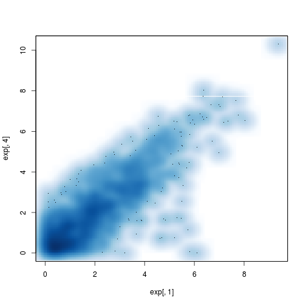
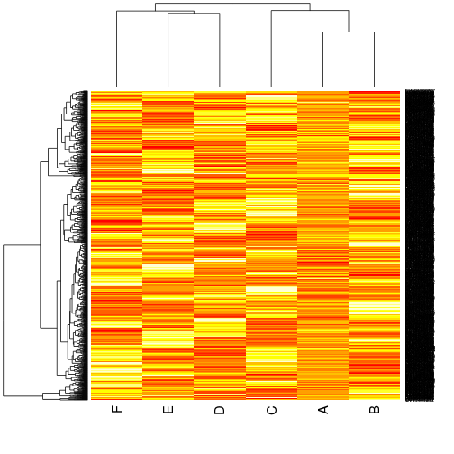
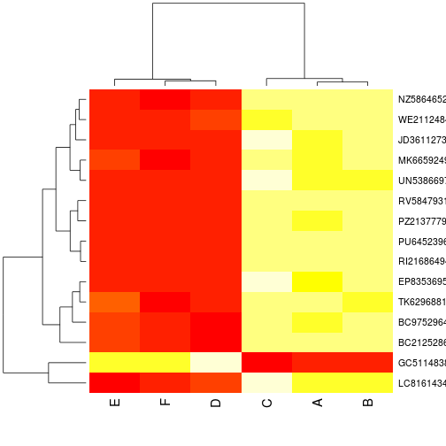

# A short microarray analysis

## Create an `marray` list

We are going to use `read.csv` to import our comma-separated spreadsheet into `R`.
Setting `row.names = 1` uses the first column of the imported spreadshhet 
to define the row names of the resulting data frame. 


```r
exp <- read.csv("MAdata1.csv", row.names = 1)
head(exp)
```

```
##       X1     X2     X3    X4     X5     X6
## 1 3.3735 4.2236 1.5681 3.894 4.9315 2.2357
## 2 5.1836 4.2583 4.5056 5.561 4.4543 4.2318
## 3 3.1644 4.0580 2.6910 2.541 1.6604 4.7836
## 4 3.5953 2.6543 4.6227 3.023 3.0285 3.7631
## 5 1.3295 1.8685 0.7321 1.642 0.7749 0.4213
## 6 0.8205 0.6385 1.9803 0.113 1.3512 2.1623
```


Because we want to store our expression data in a `matrix`, 
we explicitly coerce the `data.frame` into the adequate class.


```r
class(exp)
```

```
## [1] "data.frame"
```

```r
exp <- as.matrix(exp)
class(exp)
```

```
## [1] "matrix"
```


We use the same call to create the sample and feature meta data, 
which are directly represented by the desired `data.frame` class.


```r
smeta <- read.csv("smeta1.csv", row.names = 1)
fmeta <- read.csv("fmeta1.csv", row.names = 1)
class(smeta)
```

```
## [1] "data.frame"
```


We now only need to create our final `marray` list as shown in the previous exercise.


```r
marray <- list(expression = exp,
               featuremeta = fmeta,
               samplemeta = smeta)
str(marray)
```

```
## List of 3
##  $ expression : num [1:1000, 1:6] 3.37 5.18 3.16 3.6 1.33 ...
##   ..- attr(*, "dimnames")=List of 2
##   .. ..$ : chr [1:1000] "1" "2" "3" "4" ...
##   .. ..$ : chr [1:6] "X1" "X2" "X3" "X4" ...
##  $ featuremeta:'data.frame':	1000 obs. of  4 variables:
##   ..$ genes  : Factor w/ 1000 levels "AB12615715","AB48674611",..: 1 2 3 4 5 6 7 8 9 10 ...
##   ..$ pathway: Factor w/ 25 levels "PathWay_1","PathWay_10",..: 8 14 4 9 13 25 23 22 19 12 ...
##   ..$ pv     : num [1:1000] 0.599 0.85 0.775 0.6 0.498 ...
##   ..$ bh     : num [1:1000] 0.995 0.995 0.995 0.995 0.995 ...
##  $ samplemeta :'data.frame':	6 obs. of  3 variables:
##   ..$ sample   : Factor w/ 6 levels "A","B","C","D",..: 1 2 3 4 5 6
##   ..$ group    : Factor w/ 2 levels "cond","ctrl": 2 2 2 1 1 1
##   ..$ replicate: int [1:6] 1 2 3 1 2 3
```


To avoid repeating the above every time we use `R` to study this data, 
we `save` it on disk as a binary representation and verify that we can 
`load` it again.


```r
save(marray, file = "marray.rda")
rm(list = ls())  ## clean working environment
load("marray.rda")
str(marray)
```

```
## List of 3
##  $ expression : num [1:1000, 1:6] 3.37 5.18 3.16 3.6 1.33 ...
##   ..- attr(*, "dimnames")=List of 2
##   .. ..$ : chr [1:1000] "1" "2" "3" "4" ...
##   .. ..$ : chr [1:6] "X1" "X2" "X3" "X4" ...
##  $ featuremeta:'data.frame':	1000 obs. of  4 variables:
##   ..$ genes  : Factor w/ 1000 levels "AB12615715","AB48674611",..: 1 2 3 4 5 6 7 8 9 10 ...
##   ..$ pathway: Factor w/ 25 levels "PathWay_1","PathWay_10",..: 8 14 4 9 13 25 23 22 19 12 ...
##   ..$ pv     : num [1:1000] 0.599 0.85 0.775 0.6 0.498 ...
##   ..$ bh     : num [1:1000] 0.995 0.995 0.995 0.995 0.995 ...
##  $ samplemeta :'data.frame':	6 obs. of  3 variables:
##   ..$ sample   : Factor w/ 6 levels "A","B","C","D",..: 1 2 3 4 5 6
##   ..$ group    : Factor w/ 2 levels "cond","ctrl": 2 2 2 1 1 1
##   ..$ replicate: int [1:6] 1 2 3 1 2 3
```


The feature meta data has a `bh` column with FDR adjusted p-values using 
the Benjamini Hochberg method. Let's verify the number of significant 
values using 0.05 as threshold and count how many pass our threshold.


```r
names(marray$featuremeta)
```

```
## [1] "genes"   "pathway" "pv"      "bh"
```

```r
de <- marray$featuremeta[, "bh"] < 0.05
class(de)
```

```
## [1] "logical"
```

```r
table(de)
```

```
## de
## FALSE  TRUE 
##   985    15
```

## Exploratory data analysis

A boxplot showing the distribution of expression data for each sample.


```r
boxplot(marray$expression)
```

 


A scatter plot comparing the expression values of the first and fourth samples


```r
plot(marray$expression[, 1], marray$expression[, 4])
```

 


Let's tune the above scatter plot. To reduce typing, the expression data is stored in the `exp` variable.
We customise the plot with axes labels, a title, a grid, and a diagonal identity line.
We also use the `de` logical vector to highlight the significantly differentially expressed genes.


```r
exp <- marray$expression
plot(exp[, 1], exp[, 4], xlab = colnames(exp)[1], ylab = colnames(exp)[4])
title(main = "Comparing expression levels")
grid()
points(exp[de, 1], exp[de, 4], col = "red", pch = 19)
abline(0, 1)
```

 


We can identify individual points on the plot


```r
identify(exp[, 1], exp[, 4], labels = fmeta$genes)
```


The `pairs` function creates all possible pairs of scatter plots


```r
pairs(exp)
```

 


We can also represent the data using density colouring instead of plotting 
individual points.


```r
smoothScatter(exp[, 1], exp[, 4])
```

```
## KernSmooth 2.23 loaded Copyright M. P. Wand 1997-2009
```

 


A histogram of expression values for sample 1


```r
hist(exp[, 1])
```

 


Below, we prepare a 3 by 2 matrix of figures with `par` and use a `for` loop 
to plot the 6 histograms of intensities.


```r
par(mfrow = c(3, 2))
for (i in 1:6) {
    hist(exp[, i], xlab = marray$samplemeta[i, "sample"], main = "Histrogram of intensities")
    rug(exp[, i])
}
```

 


By extracting the expression data, we have lost some information 
that was stored in the respective meta data elements. 
Let set the sample and gene names.


```r
colnames(exp) <- marray$samplemeta$sample
rownames(exp) <- marray$featuremeta$genes
```


Below, we plot a heatmap of all genes and those that were deemed significantly differentially expressed.


```r
heatmap(exp)
```

 

```r
heatmap(exp[de, ])
```

 


## Counting number of DE genes

We first use the `dir` function to list all the files in our working directory 
and then filter only those with a pattern of interest.


```r
dir()
```

```
##  [1] "003017395018.CEL"      "003017395019.CEL"     
##  [3] "003017395020.CEL"      "003017395021.CEL"     
##  [5] "003017395022.CEL"      "Exercise-02.html"     
##  [7] "Exercise-02.md"        "Exercise-02.R"        
##  [9] "Exercise-02.Rmd"       "Exercise-03.html"     
## [11] "Exercise-03.md"        "Exercise-03.R"        
## [13] "Exercise-03.Rmd"       "Exercise-04.html"     
## [15] "Exercise-04.md"        "Exercise-04.R"        
## [17] "Exercise-04.Rmd"       "Exercise-05-DE1.tsv"  
## [19] "Exercise-05-DE2.tsv"   "Exercise-05-DE3.tsv"  
## [21] "Exercise-05-DE4.tsv"   "Exercise-05-DE5.tsv"  
## [23] "Exercise-05.html"      "Exercise-05.md"       
## [25] "Exercise-05.R"         "Exercise-05.Rmd"      
## [27] "Exercise-05-table.tsv" "Exercise-06.html"     
## [29] "Exercise-06.md"        "Exercise-06.R"        
## [31] "Exercise-06.Rmd"       "figure"               
## [33] "fmeta1.csv"            "fmeta2.csv"           
## [35] "fmeta3.csv"            "heatmap1.pdf"         
## [37] "heatmap2.pdf"          "MAdata1.csv"          
## [39] "MAdata2.csv"           "MAdata3.csv"          
## [41] "makeHtml"              "marray.rda"           
## [43] "smeta1.csv"            "smeta2.csv"           
## [45] "smeta3.csv"
```

```r
dir(pattern = "fmeta")
```

```
## [1] "fmeta1.csv" "fmeta2.csv" "fmeta3.csv"
```


We could use `dir` to create a vector of file names of interest and 
iterate over those, as illustrated below.


```r
for (fmetafile in dir(pattern = "fmeta")) {
    fmeta <- read.csv(fmetafile, row.names = 1)
    print(dim(fmeta))
}
```

```
## [1] 1000    4
## [1] 1000    4
## [1] 1000    4
```


Alternatively, we create these file names manually to illustrate the `paste0` function.
We then apply the same strategy as above to read the feature meta data into `R`, 
extract the differentially expressed genes and, if there are any, 
print how many have been counted, import the expression data and save
a heatmap into a pdf file.


```r
for (i in 1:3) {
    fmetafile <- paste0("fmeta", i, ".csv")
    cat(fmetafile, ":\n")
    fmeta <- read.csv(fmetafile, row.names = 1)
    de <- which(fmeta$bh < 0.05)
    if (length(de) > 0) {
        expfile <- paste0("MAdata", i, ".csv")
        exp <- read.csv(expfile, row.names = 1)
        exp <- as.matrix(exp)
        pdffile <- paste0("heatmap", i, ".pdf")
        cat(length(de), "DE genes.\n")
        cat("Saved", pdffile, ".\n")
        pdf(pdffile)
        heatmap(exp[de, ])
        dev.off()
    } else {
        cat("No DE found.\n")
    }
    cat("\n")
}
```

```
## fmeta1.csv :
## 15 DE genes.
## Saved heatmap1.pdf .
```

```
## 
## fmeta2.csv :
## 5 DE genes.
## Saved heatmap2.pdf .
```

```
## 
## fmeta3.csv :
## No DE found.
```

