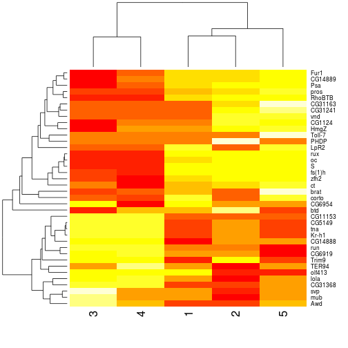
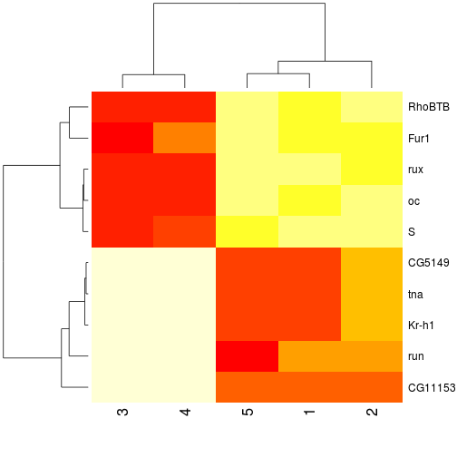

# Another microarray analysis

## Combine expression data

This this, we use `dir` and a file pattern to create a vector 
of file names.


```r
fls <- dir(pattern = "Exercise-05-DE")
length(fls)
```

```
## [1] 5
```

```r
fls
```

```
## [1] "Exercise-05-DE1.tsv" "Exercise-05-DE2.tsv" "Exercise-05-DE3.tsv"
## [4] "Exercise-05-DE4.tsv" "Exercise-05-DE5.tsv"
```


We then use the `lapply` function that iterates over vector of file names 
(passed as first argument) and applies the `read.delim` function 
(the second argument) on each element of `fls`. The third argument of 
`lapply` is passed to `read.delim` to set the resulting `data.frame` row names
using the first column. As suggested by the letter `l`, `lapply`, returns 
a list of length equal to the length of its first argument. 
Because `read.delim` returns a `data.fame`, `l` will be a list of `data.frames`.


```r
l <- lapply(fls, read.delim, row.names = 1)
length(l)
```

```
## [1] 5
```

```r
class(l)
```

```
## [1] "list"
```


To obtain a vector of unique gene names, we iterate through the list 
of `data.frame`, extract their respective row names to create a list 
of characters (the gene names). We then `unlist`/flatten this list, 
producing a vector containing all the elements of the list and 
finall keep `unique` instances of each gene name (removing all duplicated gene names).


```r
allgenes <- lapply(l, rownames)
allgenes <- unique(unlist(allgenes))
length(allgenes)
```

```
## [1] 38
```

```r
head(allgenes)
```

```
## [1] "LpR2"   "fs(1)h" "CG6954" "Psa"    "zfh2"   "Fur1"
```


We now know how many unique genes have been observed in total 
(`length(allgenes)`) and the number of experiments (`length(l)`) 
and initialise a matrix of adequate dimensions with 0s. We also 
use the gene names to set to matrix row names.


```r
eset <- matrix(0, nrow = length(allgenes), ncol = length(l))
rownames(eset) <- allgenes
```


We populate the matrix by iterating over the number of replicates. 
On each iteration, we `match` the position of the genes in our big
matrix and the individual replicate data stored in the `l` matrix. 
`idx` gives us the row indices of the exeriments in the big `eset` 
matrix. We then use these, and the loop index to set the expression 
data.


```r
for (i in 1:length(l)) {
    ## find the row indices
    idx <- match(rownames(l[[i]]), rownames(eset))
    eset[idx, i] <- l[[i]][, 1]
}
```


Finally, we plot a heatmap of `eset`.


```r
heatmap(eset)
```

 


##  Extracting and visualising genes of interest  

We have a table of validated genes that need to be parsed. 
We first read the data, assuring that the content of the 
resulting `data.frame` is interpreted as characters instead 
as factors.


```r
tab <- read.delim("Exercise-05-table.tsv", stringsAsFactors = FALSE)
tab
```

```
##                                 genes                       citation
## 1 oc,run,RhoBTB,CG5149,CG11153,S,Fur1  Segal et al, Development 2001
## 2                       tna,Kr-h1,rux Krejci et al, Development 2002
```


We then  split the comma separated genes names to produce a list 
(of length 2 because there were two rows in `tab`), which is then 
flattened with `unlist`.


```r
genes <- unlist(strsplit(tab$genes, ","))
genes
```

```
##  [1] "oc"      "run"     "RhoBTB"  "CG5149"  "CG11153" "S"       "Fur1"   
##  [8] "tna"     "Kr-h1"   "rux"
```

Before subsetting our `eset` matrix, we check that all the extracted 
gene names are present.


```r
all(genes %in% rownames(eset))
```

```
## [1] TRUE
```


```r
heatmap(eset[genes, ])
```

 

