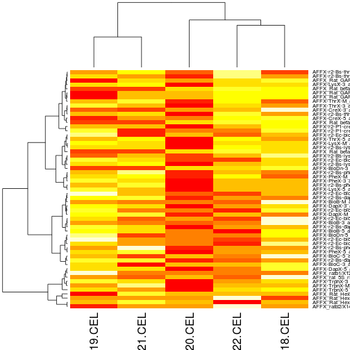

# A short Bioconductor data analysis

We start by loading the packages that will provide the infrastrucutre 
to the Affymetric microarrys that we want to import and explore.


```r
library("Biobase")
library("affy")
library("AnnotationDbi")
```


The Affymetrix raw data files are listed and saved in a vector of file names


```r
dir()
```

```
##  [1] "003017395018.CEL"      "003017395019.CEL"     
##  [3] "003017395020.CEL"      "003017395021.CEL"     
##  [5] "003017395022.CEL"      "Exercise-02.html"     
##  [7] "Exercise-02.md"        "Exercise-02.R"        
##  [9] "Exercise-02.Rmd"       "Exercise-03.html"     
## [11] "Exercise-03.md"        "Exercise-03.R"        
## [13] "Exercise-03.Rmd"       "Exercise-04.html"     
## [15] "Exercise-04.md"        "Exercise-04.R"        
## [17] "Exercise-04.Rmd"       "Exercise-05-DE1.tsv"  
## [19] "Exercise-05-DE2.tsv"   "Exercise-05-DE3.tsv"  
## [21] "Exercise-05-DE4.tsv"   "Exercise-05-DE5.tsv"  
## [23] "Exercise-05.html"      "Exercise-05.md"       
## [25] "Exercise-05.R"         "Exercise-05.Rmd"      
## [27] "Exercise-05-table.tsv" "Exercise-06.html"     
## [29] "Exercise-06.R"         "Exercise-06.Rmd"      
## [31] "figure"                "fmeta1.csv"           
## [33] "fmeta2.csv"            "fmeta3.csv"           
## [35] "heatmap1.pdf"          "heatmap2.pdf"         
## [37] "MAdata1.csv"           "MAdata2.csv"          
## [39] "MAdata3.csv"           "makeHtml"             
## [41] "marray.rda"            "smeta1.csv"           
## [43] "smeta2.csv"            "smeta3.csv"
```

```r
flnms <- dir(pattern = "*CEL")
flnms
```

```
## [1] "003017395018.CEL" "003017395019.CEL" "003017395020.CEL"
## [4] "003017395021.CEL" "003017395022.CEL"
```


All raw data files and then read with the specialised `ReadAffy` function
to produce a specific object of class `AffyBatch`.


```r
rawdata <- ReadAffy(filenames = flnms)
class(rawdata)
```

```
## [1] "AffyBatch"
## attr(,"package")
## [1] "affy"
```


Below, we show how to plot the array using the `image` function.


```r
par(mfrow = c(2, 2))
image(rawdata[, 1:4])
```

 


Let perform some quality control and assess whether RNA degradation is a concern here. 
The `AffyRNAdeg` function calculates a degradation pattern for each samples, 
that can then be plotted with `plotAffyRNAdeg`.


```r
deg <- AffyRNAdeg(rawdata)
```

```
## ```

```r
plotAffyRNAdeg(deg)
```

 


The `AffyBatch` object stores raw data. Before proceeding with data analysis, 
we normalise the data with the popular robust multi-array average methods, 
implemented in the `rma` function. This produces another type of specialised 
object, an `ExpressionSet`. We can extract the assay data with the `exprs` 
accessor.


```r
eset <- rma(rawdata)
```

```
## Background correcting
## Normalizing
## Calculating Expression
```

```r
class(eset)
```

```
## [1] "ExpressionSet"
## attr(,"package")
## [1] "Biobase"
```

```r
eset
```

```
## ExpressionSet (storageMode: lockedEnvironment)
## assayData: 31099 features, 5 samples 
##   element names: exprs 
## protocolData
##   sampleNames: 003017395018.CEL 003017395019.CEL ...
##     003017395022.CEL (5 total)
##   varLabels: ScanDate
##   varMetadata: labelDescription
## phenoData
##   sampleNames: 003017395018.CEL 003017395019.CEL ...
##     003017395022.CEL (5 total)
##   varLabels: sample
##   varMetadata: labelDescription
## featureData: none
## experimentData: use 'experimentData(object)'
## Annotation: rat2302
```

```r
head(exprs(eset))
```

```
##            003017395018.CEL 003017395019.CEL 003017395020.CEL
## 1367452_at            9.521            9.344            9.325
## 1367453_at            8.770            8.770            8.807
## 1367454_at            9.300            9.300            9.215
## 1367455_at           10.904           10.813           10.718
## 1367456_at           11.147           11.084           11.058
## 1367457_at            8.183            8.073            7.990
##            003017395021.CEL 003017395022.CEL
## 1367452_at            9.439            9.413
## 1367453_at            8.677            8.813
## 1367454_at            9.342            9.363
## 1367455_at           10.812           10.813
## 1367456_at           11.066           11.090
## 1367457_at            8.073            8.048
```


We can now produce a boxplot of normalised intensities


```r
boxplot(exprs(eset))
```

 


Let's extract all control probe sets that are labelled `AFFX`, 
extract their measured expression intensities and generate a 
heatmap.


```r
ctrl <- grep("AFFX", featureNames(eset))
heatmap(exprs(eset[ctrl, ]))
```

 


The code below illustrates a principal component analysis. 
The samples are then plotted on a 2 dimensional PCA plot 


```r
pca <- prcomp(t(exprs(eset)))
plot(pca$x[, 1:2], pch = 19, col = "#AB000030", cex = 3)
text(pca$x[, 1:2], labels = 1:5)
grid()
```

 


We can save the `ExpressionSet` for later re-use with the 
`save` function.


```r
save(eset, file = "eset.rda")
```


A complete set of quality metrics and plots are available through the 
`arrayQualityMetrics` function from the `arrayQualityMetrics` package. 
This function creates a complete html report in the `aqmReport` directory. 


```r
library("arrayQualityMetrics")
arrayQualityMetrics(eset, outdir = "aqmReport")
```


See the vignette for more details.


```r
vignette(package = "arrayQualityMetrics")
vignette("arrayQualityMetrics", package = "arrayQualityMetrics")
```

