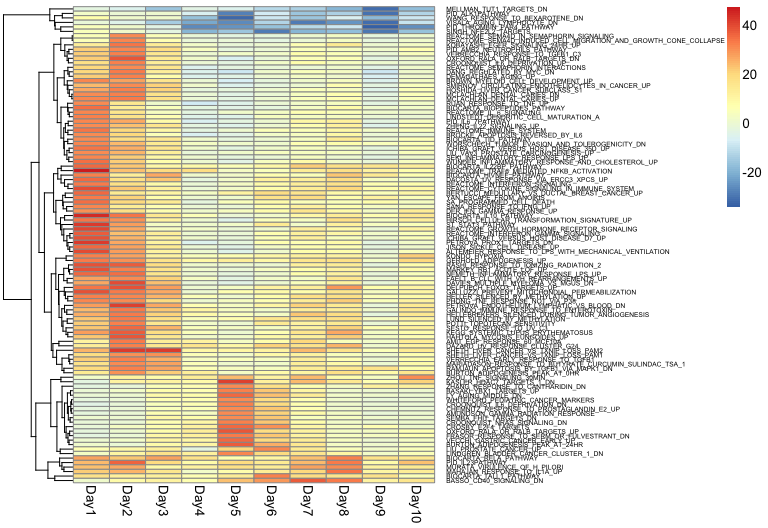

# Bioinformatics for Big Omics Data: RNA-seq data analysis
Raphael Gottardo  
February 12, 2015  


## Setting up some options

Let's first turn on the cache for increased performance and improved styling

```r
# Set some global knitr options
library("knitr")
opts_chunk$set(tidy=TRUE, tidy.opts=list(blank=FALSE, width.cutoff=60), cache=TRUE, messages=FALSE)
```

We will be using the folliwng packages

```r
library(limma)
library(GEOquery)
```

```
## Loading required package: Biobase
## Loading required package: BiocGenerics
## Loading required package: parallel
## 
## Attaching package: 'BiocGenerics'
## 
## The following objects are masked from 'package:parallel':
## 
##     clusterApply, clusterApplyLB, clusterCall, clusterEvalQ,
##     clusterExport, clusterMap, parApply, parCapply, parLapply,
##     parLapplyLB, parRapply, parSapply, parSapplyLB
## 
## The following object is masked from 'package:limma':
## 
##     plotMA
## 
## The following object is masked from 'package:stats':
## 
##     xtabs
## 
## The following objects are masked from 'package:base':
## 
##     Filter, Find, Map, Position, Reduce, anyDuplicated, append,
##     as.data.frame, as.vector, cbind, colnames, do.call,
##     duplicated, eval, evalq, get, intersect, is.unsorted, lapply,
##     mapply, match, mget, order, paste, pmax, pmax.int, pmin,
##     pmin.int, rank, rbind, rep.int, rownames, sapply, setdiff,
##     sort, table, tapply, union, unique, unlist, unsplit
## 
## Welcome to Bioconductor
## 
##     Vignettes contain introductory material; view with
##     'browseVignettes()'. To cite Bioconductor, see
##     'citation("Biobase")', and for packages 'citation("pkgname")'.
## 
## Setting options('download.file.method.GEOquery'='curl')
```


## Going from genes to gene sets


So far we have seen how to use microarrays or RNA-seq to derive a list of significantly differentially expressed genes, while controlling for false discovery. 

Sometimes it can be comvenient to look at biological pathways, or more generally genesets to gain biological insights. 

## Goals of GSEA


Detecting changes in gene expression datasets can be hard due to
- the large number of genes/probes,
- the high variability between samples, and
- the limited number of samples.

The goal of GSEA is to enable the detection of modest but coordinated
changes in prespecified sets of related genes. Such a set might include all the genes in a specific pathway,
for instance, or genes that have been shown to be coregulated based on previously published studies. 

Most of what I'll be discussing here will be based on this paper:

- Wu, D. & Smyth, G. Camera: a competitive gene set test accounting for inter-gene correlation. 40, e133-e133 (2012).

## Competitive vs self-contained analyses

As explained in Wu & Smyth (2012)

Two approaches can be used to test the significance of a gene set:
1) ‘self-contained’ gene set tests examine a set of genes in their own right without reference to other genes in the genome (or array)
2) ‘competitive’ gene set tests compare genes in the test set relative to all other genes.

Competitive tests focus more on distinguishing the most important biological processes from those that are less important. Competitive tests are overwhelmingly more commonly used in the genomic literature. In particular, this is the approach used in the GSEA paper:

- Subramanian, A. et al. Gene set enrichment analysis: a knowledge-based approach for interpreting genome-wide expression profiles. Proc. Natl. Acad. Sci. U.S.A. 102, 15545-15550 (2005).

## Accounting for within set correlation


Most competitive gene set tests assume independence of genes, because they evaluate P-values by permutation of gene labels. However, these tests can be sensitive to inter-gene correlations. 

In this lecture we will talk about geneset analysis using the approach of Wu and Smyth that accounts for inter-gene correlations. 

## CAMERA

Camera, for competitive gene set test accounting for inter-gene correlation, makes heavy used of the limma framework. The same linear model is assumed for the mean gene expression level, namely, 

$$ \mathbb{E}(\mathbf{y}_g)=\mathbf{X}\boldsymbol{\alpha}_g$$ 

and we will also write $\mathrm{cov}(y_{gi},y_{g'i})=\rho_{gg'}$
Note that this correlation is the residual treatment effect, once any treatment effect has been removed. 

As with `limma`, we assumed that a specific contrast is of interest:

$$\beta_g=\sum_{j=1}^p c_j \alpha_{gj}$$

and we wish to test $H_0: \beta_g=0$, which can be done using the moderated $t$ statistics, $\tilde{t}$ that follows a t-statistics with $d+d_0$ degrees of freedom. 


## CAMERA 


Then W&S define a normalized version $z_g =F^{-1}F_t(\tilde{t}_g)$

**What is the distribution of $z_g$?**

Consider a set of m genewise statistics $z_1,\dots , z_m$. The variance of the mean of the statistics is

$$ \mathrm{var}(\overline{z})=1/m^2(\sum_{i} \tau_i^2 + 2\sum_{i\lt j}\tau_i\tau_j)$$

where $\tau_i$ is the standard deviation of $z_i$ and the $\rho_{ij}$ are the pairwise correlations. We can rewrite it as follows when all $\tau_i$'s are equal

$$\mathrm{var}(\overline{z})=\tau^2/m \mathrm{VIF}$$ 

where VIF is the variance inflation factor $1+(m-1)\overline{\rho}$.

## CAMERA - Testing


Now the idea of competitive gene-set analysis can be done by comparing two mean set statistics $\overline{z}_1$ and $\overline{z}_2$. Where $z_1$ is our set of interest and $z_2$ is the set composed of all other genes. The main idea behind CAMERA is to form a test-statistics that incorporates dependence between the genes in the first set. 

This can simply be done by forming the following T-statistics

$$
T=(\overline{z}_1-\overline{z}_2)/(s_p\sqrt{VIF/m_1+1/m_2})
$$

Now we just need a way to estimate the inter-gene correlation. W&S also propose a
modified version of the wilcoxon-rank-sum test, which we won't discuss here.

## CAMERA - Estimating covariances


Let's consider the QR decomposition of the design matrix $X=QR$, where $R$ is upper triangular ($n\times p$) and $Q$ ($n\times n$) is such that $Q^TQ=I$. An $m\times n$ matrix of independent residuals is obtained by $U = YQ_2$, where $Q_2$ represents the trailing $d$ columns of $Q$. The matrix $U$ is already available as a by-product of fitting genewise linear models to the expression values using standard numerical algorithms, so extracting it requires no extra computation in `limma`. 
The residual standard error $s_g$ for gene $g$ is equal to the root mean square of the corresponding row of $U$. We standardize each row of $U$ by dividing by $s_g$.
At this point, we could obtain the correlation matrix for the $m$ genes from $C = UU^T$; however, this is a numerically inefficient procedure if $m$ is large.
A numerically superior algorithm is to compute the column means $\overline{u}_{\cdot k}$ of $U$. Then we can form the following estimate of the $VIF$
$$
\widehat{\mathrm{VIF}}=\frac{m}{d}\sum_d \overline{u}^2_{\cdot k}
$$

If $m$ and $d$ are both reasonably large, and $\overline{\rho}$ is relatively small, then VIF is approximately distributed as VIF $\chi^2_d/d$. This can be used to find an asymptotic distribution for our test statistics. 

## Using CAMERA

Camera is readily available in the `limma` package. Let us go back to our RNA-seq example:


```r
datadir <- "Data/GEO/"
dir.create(file.path(datadir), showWarnings = FALSE, recursive = TRUE)
gd <- getGEO("GSE45735", destdir = datadir)
pd <- pData(gd[[1]])
getGEOSuppFiles("GSE45735", makeDirectory = FALSE, baseDir = datadir)
# Note the regular expression to grep file names
files <- list.files(path = datadir, pattern = "GSE45735_T.*.gz", 
    full.names = TRUE)
# Read in gzip-compressed, tab-delimited files
file_list <- lapply(files, read.table, sep = "\t", header = TRUE)
```

## Using CAMERA


```r
# Subset to only those rows where Gene contains only
# non-space characters This addresses problems with T14 file
# containing 28 invalid rows at end of file
file_list <- lapply(file_list, function(file_list) subset(file_list, 
    grepl("^[^[:space:]]+$", Gene)))
# Remove duplicated rows
file_list_unique <- lapply(file_list, function(x) {
    x <- x[!duplicated(x$Gene), ]
    x <- x[order(x$Gene), ]
    rownames(x) <- x$Gene
    x[, -1]
})
# Take the intersection of all genes
gene_list <- Reduce(intersect, lapply(file_list_unique, rownames))
file_list_unique <- lapply(file_list_unique, "[", gene_list, 
    )
matrix <- as.matrix(do.call(cbind, file_list_unique))
# Clean up the pData
pd_small <- pd[!grepl("T13_Day8", pd$title), ]
pd_small$Day <- sapply(strsplit(gsub(" \\[PBMC\\]", "", pd_small$title), 
    "_"), "[", 2)
pd_small$subject <- sapply(strsplit(gsub(" \\[PBMC\\]", "", pd_small$title), 
    "_"), "[", 1)
colnames(matrix) <- rownames(pd_small)
```


## CAMERA - Hands on


```r
# Note that I add one to the count
new_set <- ExpressionSet(assayData = matrix + 1)
pData(new_set) <- pd_small
```

we now need to set-up our design matrix to estimate our weights:


```r
design <- model.matrix(~subject + Day, new_set)
new_set_voom <- voom(new_set, design = design)
```

## CAMERA - Hands on


```r
lm <- lmFit(new_set_voom, design)
eb <- eBayes(lm)
# Look at the other time-points
topTable(eb, coef = "DayDay1", number = 5)
```

```
##            logFC  AveExpr        t      P.Value   adj.P.Val        B
## TRIM25 0.3183383 7.417747 6.613100 6.878706e-08 0.001509050 7.951518
## IRF1   0.6689637 7.822953 6.084187 3.764288e-07 0.004030395 6.244832
## IRF9   0.4553882 6.700297 5.845475 8.117054e-07 0.004030395 5.573664
## ASPHD2 0.5128938 4.020599 5.740800 1.136747e-06 0.004060609 5.426160
## STAT1  0.8919256 8.825765 5.840196 8.256134e-07 0.004030395 5.393302
```

## MSigDB

The [Molecular Signatures Database](http://www.broadinstitute.org/gsea/msigdb/index.jsp) (MSigDB) is a collection of annotated gene sets for use with GSEA analysis. 

These gene sets are available from download as gmt files, and can be read into R using `GSEAbase`. 

Let's first download and install the package that we need

```r
library(BiocInstaller)
biocLite("GSEABase")
```
note that `camera` is available as part of `limma`, so there is nothing to install.

## Getting started with GSEA analyses

We load the `GSEAbase` package for loading gene sets.

```r
library(GSEABase)
```

```
## Loading required package: annotate
## Loading required package: AnnotationDbi
## Loading required package: stats4
## Loading required package: GenomeInfoDb
## Loading required package: S4Vectors
## Loading required package: IRanges
## 
## Attaching package: 'AnnotationDbi'
## 
## The following object is masked from 'package:GenomeInfoDb':
## 
##     species
## 
## Loading required package: XML
## 
## Attaching package: 'annotate'
## 
## The following object is masked from 'package:GenomeInfoDb':
## 
##     organism
## 
## Loading required package: graph
## 
## Attaching package: 'graph'
## 
## The following object is masked from 'package:XML':
## 
##     addNode
```
and convert the gene sets to gene indices

```r
c2_set <- getGmt("GSEA-sets/c2.all.v4.0.symbols.gmt")
gene_ids <- geneIds(c2_set)
# Camera requires gene-indices.  Which function to use will
# depend on which version of limma you have.
# http://bioconductor.org/packages/release/bioc/news/limma/NEWS
# 'symbols2indices() renamed to ids2indices().'
library(limma)
if (exists("ids2indices")) {
    sets_indices <- ids2indices(gene_ids, rownames(new_set))
}
if (exists("symbols2indices")) {
    sets_indices <- symbols2indices(gene_ids, rownames(new_set))
}
```

## Finding enriched gene sets

As with `limma`, we need to specify the contrast we wish to test at the set level:

```r
# Note that camera works on voom objects
cont_matrix <- makeContrasts("DayDay1", levels = design)
```

```
## Warning in makeContrasts("DayDay1", levels = design): Renaming (Intercept)
## to Intercept
```

```r
res <- camera(new_set_voom, sets_indices, design = design, cont_matrix)
res[1:10, ]
```

```
##                                                       NGenes   Correlation
## REACTOME_TRAF6_MEDIATED_NFKB_ACTIVATION                   21 -0.0099480785
## BIOCARTA_IL10_PATHWAY                                     17  0.0181728736
## ST_STAT3_PATHWAY                                          11 -0.0415100512
## PETROVA_PROX1_TARGETS_DN                                  64  0.0006612558
## REACTOME_GROWTH_HORMONE_RECEPTOR_SIGNALING                24  0.0052483439
## REACTOME_CYTOKINE_SIGNALING_IN_IMMUNE_SYSTEM             261  0.0247581035
## ALTEMEIER_RESPONSE_TO_LPS_WITH_MECHANICAL_VENTILATION    126  0.0737968177
## RASHI_RESPONSE_TO_IONIZING_RADIATION_2                   127  0.0086467994
## ICHIBA_GRAFT_VERSUS_HOST_DISEASE_D7_UP                   106  0.0941636383
## GALLUZZI_PREVENT_MITOCHONDIAL_PERMEABILIZATION            22  0.0042893000
##                                                       Direction
## REACTOME_TRAF6_MEDIATED_NFKB_ACTIVATION                      Up
## BIOCARTA_IL10_PATHWAY                                        Up
## ST_STAT3_PATHWAY                                             Up
## PETROVA_PROX1_TARGETS_DN                                     Up
## REACTOME_GROWTH_HORMONE_RECEPTOR_SIGNALING                   Up
## REACTOME_CYTOKINE_SIGNALING_IN_IMMUNE_SYSTEM                 Up
## ALTEMEIER_RESPONSE_TO_LPS_WITH_MECHANICAL_VENTILATION        Up
## RASHI_RESPONSE_TO_IONIZING_RADIATION_2                       Up
## ICHIBA_GRAFT_VERSUS_HOST_DISEASE_D7_UP                       Up
## GALLUZZI_PREVENT_MITOCHONDIAL_PERMEABILIZATION               Up
##                                                             PValue
## REACTOME_TRAF6_MEDIATED_NFKB_ACTIVATION               1.878800e-05
## BIOCARTA_IL10_PATHWAY                                 3.791803e-05
## ST_STAT3_PATHWAY                                      6.309109e-05
## PETROVA_PROX1_TARGETS_DN                              6.507939e-05
## REACTOME_GROWTH_HORMONE_RECEPTOR_SIGNALING            9.781600e-05
## REACTOME_CYTOKINE_SIGNALING_IN_IMMUNE_SYSTEM          1.099070e-04
## ALTEMEIER_RESPONSE_TO_LPS_WITH_MECHANICAL_VENTILATION 1.100106e-04
## RASHI_RESPONSE_TO_IONIZING_RADIATION_2                1.271917e-04
## ICHIBA_GRAFT_VERSUS_HOST_DISEASE_D7_UP                1.303549e-04
## GALLUZZI_PREVENT_MITOCHONDIAL_PERMEABILIZATION        1.433692e-04
##                                                              FDR
## REACTOME_TRAF6_MEDIATED_NFKB_ACTIVATION               0.06311751
## BIOCARTA_IL10_PATHWAY                                 0.06311751
## ST_STAT3_PATHWAY                                      0.06311751
## PETROVA_PROX1_TARGETS_DN                              0.06311751
## REACTOME_GROWTH_HORMONE_RECEPTOR_SIGNALING            0.06311751
## REACTOME_CYTOKINE_SIGNALING_IN_IMMUNE_SYSTEM          0.06311751
## ALTEMEIER_RESPONSE_TO_LPS_WITH_MECHANICAL_VENTILATION 0.06311751
## RASHI_RESPONSE_TO_IONIZING_RADIATION_2                0.06311751
## ICHIBA_GRAFT_VERSUS_HOST_DISEASE_D7_UP                0.06311751
## GALLUZZI_PREVENT_MITOCHONDIAL_PERMEABILIZATION        0.06311751
```


## Finding enriched gene sets over time


```r
res <- vector("list", length = 10)
for (i in 1:10) {
    contrast <- paste0("DayDay", i)
    cont_matrix <- makeContrasts(contrast, levels = design)
    res[[i]] <- camera(new_set_voom, sets_indices, design = design, 
        contrast = cont_matrix, sort = FALSE)
}
```

```
## Warning in makeContrasts(contrast, levels = design): Renaming (Intercept)
## to Intercept
```

```
## Warning in makeContrasts(contrast, levels = design): Renaming (Intercept)
## to Intercept
```

```
## Warning in makeContrasts(contrast, levels = design): Renaming (Intercept)
## to Intercept
```

```
## Warning in makeContrasts(contrast, levels = design): Renaming (Intercept)
## to Intercept
```

```
## Warning in makeContrasts(contrast, levels = design): Renaming (Intercept)
## to Intercept
```

```
## Warning in makeContrasts(contrast, levels = design): Renaming (Intercept)
## to Intercept
```

```
## Warning in makeContrasts(contrast, levels = design): Renaming (Intercept)
## to Intercept
```

```
## Warning in makeContrasts(contrast, levels = design): Renaming (Intercept)
## to Intercept
```

```
## Warning in makeContrasts(contrast, levels = design): Renaming (Intercept)
## to Intercept
```

```
## Warning in makeContrasts(contrast, levels = design): Renaming (Intercept)
## to Intercept
```

## Visualizing the results


```r
library(pheatmap)
PValue <- sapply(res, function(x) {
    ifelse(x$Direction == "Up", -10 * log10(x$PValue), 10 * log10(x$PValue))
})
rownames(PValue) <- rownames(res[[1]])
PValue_max <- rowMax(abs(PValue))
PValue_small <- PValue[PValue_max > 30, ]
anno <- data.frame(Time = paste0("Day", 1:10))
rownames(anno) <- colnames(PValue_small) <- paste0("Day", 1:10)
```

## Visualizing the results

 


## Using non MSigDB gene_sets


Any genesets can be used for a GSEA analysis. For example, we can use the sets published in:

Li, S. et al. Molecular signatures of antibody responses derived from a systems biology study of five human vaccines. Nat. Immunol. 15, 195–204 (2013).


```r
BTM_set <- getGmt("GSEA-sets/BTM_for_GSEA_20131008.gmt")
gene_ids <- geneIds(BTM_set)
# Camera requires gene-indices
if (exists("ids2indices")) {
    sets_indices <- ids2indices(gene_ids, rownames(new_set))
}
if (exists("symbols2indices")) {
    sets_indices <- symbols2indices(gene_ids, rownames(new_set))
}
```


```r
res <- vector("list", length = 10)
for (i in 1:10) {
    contrast <- paste0("DayDay", i)
    cont_matrix <- makeContrasts(contrast, levels = design)
    res[[i]] <- camera(new_set_voom, sets_indices, design = design, 
        contrast = cont_matrix, sort = FALSE)
}
```

```
## Warning in makeContrasts(contrast, levels = design): Renaming (Intercept)
## to Intercept
```

```
## Warning in makeContrasts(contrast, levels = design): Renaming (Intercept)
## to Intercept
```

```
## Warning in makeContrasts(contrast, levels = design): Renaming (Intercept)
## to Intercept
```

```
## Warning in makeContrasts(contrast, levels = design): Renaming (Intercept)
## to Intercept
```

```
## Warning in makeContrasts(contrast, levels = design): Renaming (Intercept)
## to Intercept
```

```
## Warning in makeContrasts(contrast, levels = design): Renaming (Intercept)
## to Intercept
```

```
## Warning in makeContrasts(contrast, levels = design): Renaming (Intercept)
## to Intercept
```

```
## Warning in makeContrasts(contrast, levels = design): Renaming (Intercept)
## to Intercept
```

```
## Warning in makeContrasts(contrast, levels = design): Renaming (Intercept)
## to Intercept
```

```
## Warning in makeContrasts(contrast, levels = design): Renaming (Intercept)
## to Intercept
```

## Visualizing the results


```r
PValue <- sapply(res, function(x) {
    ifelse(x$Direction == "Up", -10 * log10(x$PValue), 10 * log10(x$PValue))
})
rownames(PValue) <- rownames(res[[1]])
PValue_max <- rowMax(abs(PValue))
PValue_small <- PValue[PValue_max > 30, ]
anno <- data.frame(Time = paste0("Day", 1:10))
rownames(anno) <- colnames(PValue_small) <- paste0("Day", 1:10)
```

## Visualizing the results


```r
pheatmap(PValue_small, cluster_cols = FALSE)
```

 


## Conclusion

- Gene sets provide a convenient way to summarize gene activities over known pathways, which facilitate biological interpretation

- Gene set analysis are complementary to gene based analyses, as gene sets might masked gene level signal

- You are not limited to using the predefined gene sets. 
    - Specific applications might require specific gene sets (e.g. Immune gene sets). 
    - The GSEA gmt format provides a convenient way to do this.
