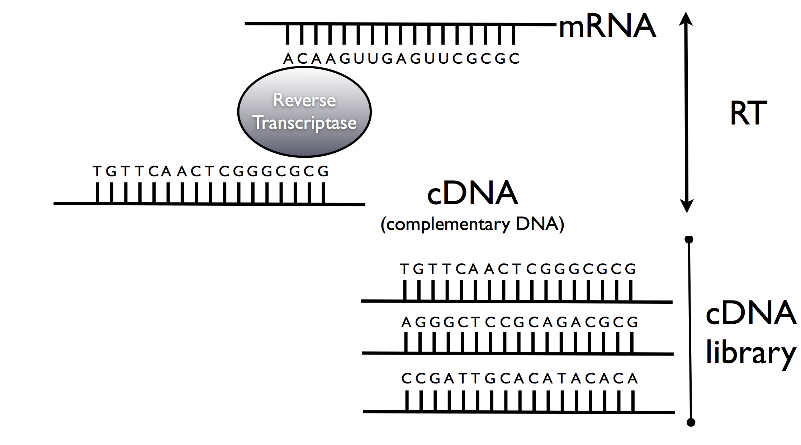
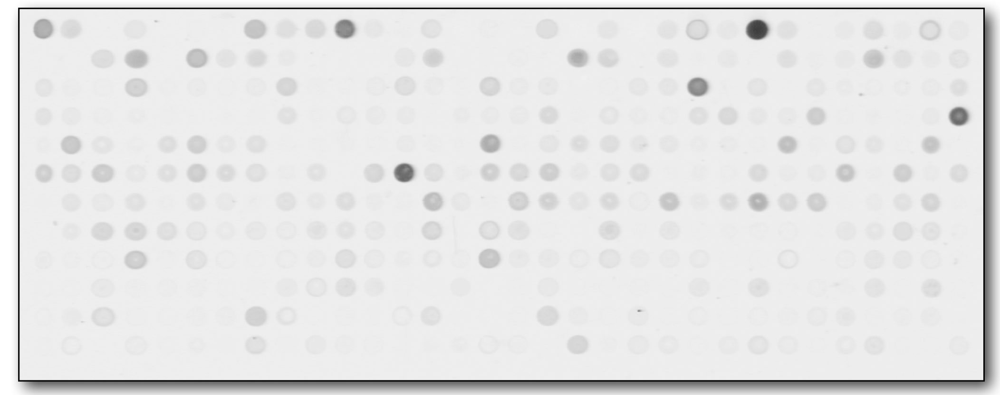

## Setting up some options

Let's first turn on the cache for increased performance and improved styling
```{r, cache=FALSE}
# Set some global knitr options
library("knitr")
opts_chunk$set(tidy=TRUE, tidy.opts=list(blank=FALSE, width.cutoff=60), cache=TRUE, messages=FALSE)
```

## Outline


- Motivation
- Reverse transcription and hybridization cDNA microarrays
- Oligonucleotide arrays (Affymetrix)
- Illumina beadarrays

## Motivation


- Why are microarrays so important?
- First technology to enable the genomewide quantification of gene-expression
- Characterize and classify diseases, design new drugs, etc. 
- "Recent" technology (1995,1996) 
- Fast moving field

## Microarrays

- Isolate mRNA from cells
- From RNA we can get DNA using an enzyme called reverse transcriptase (e.g. Retrovirus)
- The derived "copy" DNA (cDNA) is hybridized to known DNA targets (genes) to quantify gene expression


## Reverse transcription



Hybridization


## cDNA-microarray


## cDNA-microarray



## Oligonucleotide arrays


- Fabricated by placing short cDNA sequences (oligonucleotides) on a small silicon chip by a photolithographic process
- Each gene is represented by a set of distinct probes, cDNA segments of length 25 nucleotides (11-20)
- Probes chosen based on uniqueness criteria and empirical rules
- Single color

## Affymetrix arrays


## Affymetrix arrays

- about 20 probes that “perfectly” represent the gene (Perfect Match)

- about 20 probes that do not match the gene sequence (Mismatch)

- Probeset

## Affymetrix arrays


## Affymetrix arrays

For a valid gene expression measurement
the Perfect Match sticks and the Mistach does not!

## Probe synthesis

Let's watch a small video

http://www.youtube.com/watch?v=ui4BOtwJEXs


## Affymetrix arrays


## Affymetrix protocol


## Affymetrix probesets


## Affymetrix image


## Illumina bead arrays


(Source: http://www.illumina.com/)

## Illumina bead arrays


(Source: http://www.mouseclinic.de/)

## Illumina bead arrays - image


## Illumina bead arrays

- Illumina bead arrays can be applied to different problems
- Can use one or two colors depending on the application
- Gene expression arrays use one color

## Illumina bead arrays


- High density arrays
    - HumanHT-12 v4.0 Expression BeadChip, about 47,000 probes
- A specific oligonucleotide sequence is assigned to each bead type, which is replicated about 30 times on an array
- Bead level data can be relavitely large


## Summary of technologies

cDNA microarray | Affymetrix | Illumina
 ---|---|---
1 probe/gene | 1-20 probes/gene | 30 beads(probes)/gene
Probe of variable lengths | 25-mer probes | 50-mer probes
Two colors | One color | One color
Flexible, choice of probes | High density/Replication | High density/Replication
- | Cross hybridization | -


## Analysis pipeline

1. Biological question
2. Experimental design
3. Experiment
4. Image analysis
5. Normalization, Batch effect removal
6. Estimation, Testing, Clustering, Prediction, Classification, Feature selection, etc.
7. Validate finding generate new hypothesis -> New experiments

**Most of these steps require the use of statistical methods and/or computational tools**

**Note:** Even though microarrays were designed to study gene expression, they can be used to study many other things (DNA-protein binding, methylation, splicing, etc). Though they are slowly being replaced by sequencing-based assays.