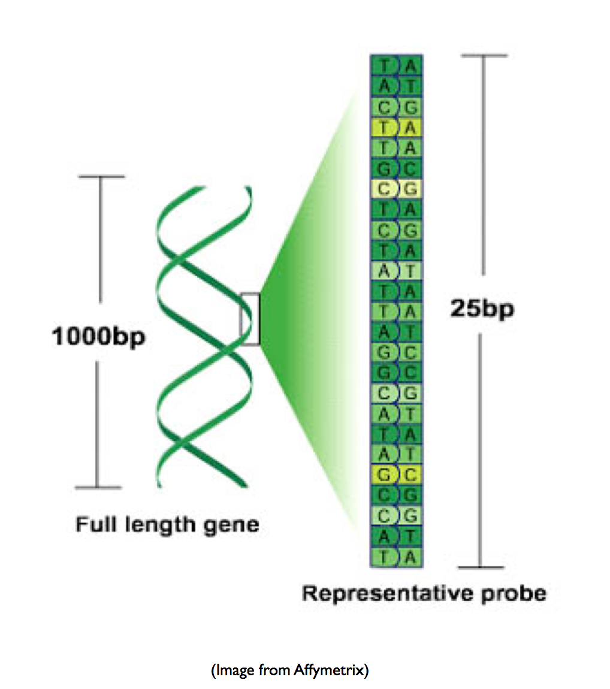
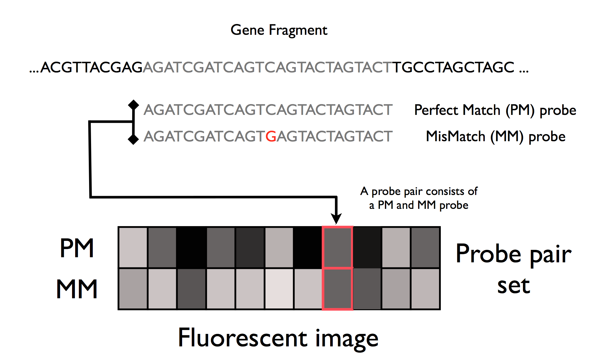
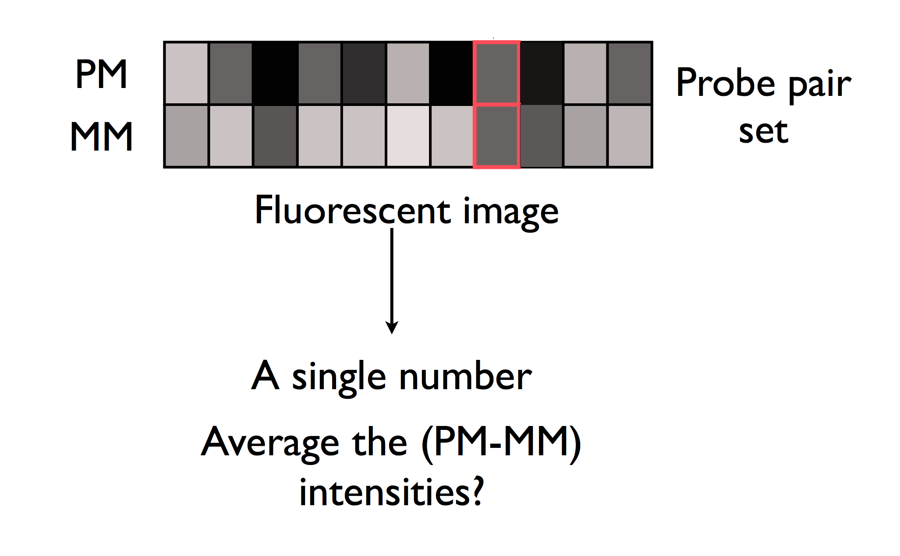
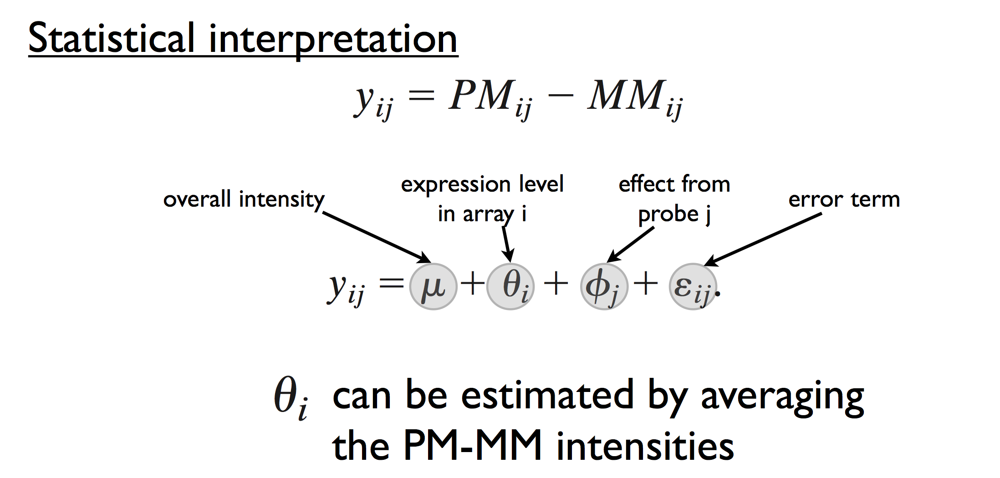
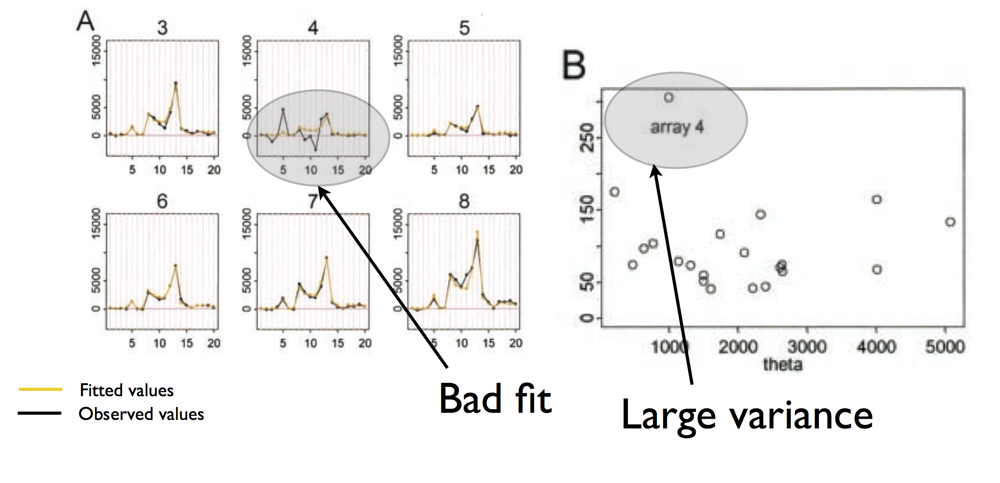
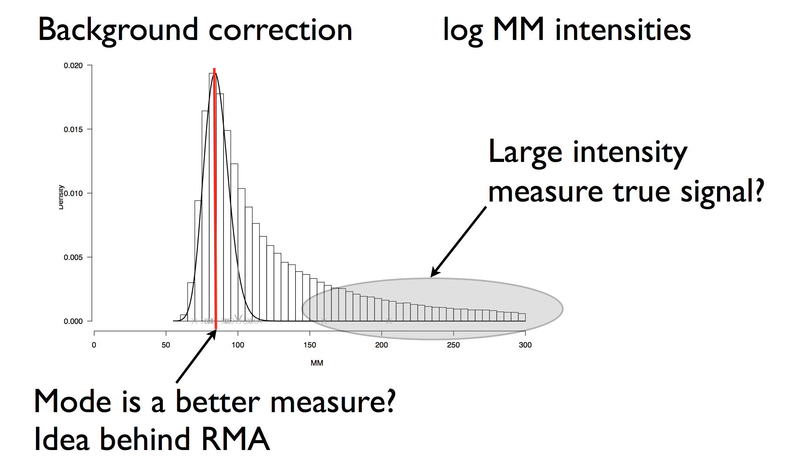
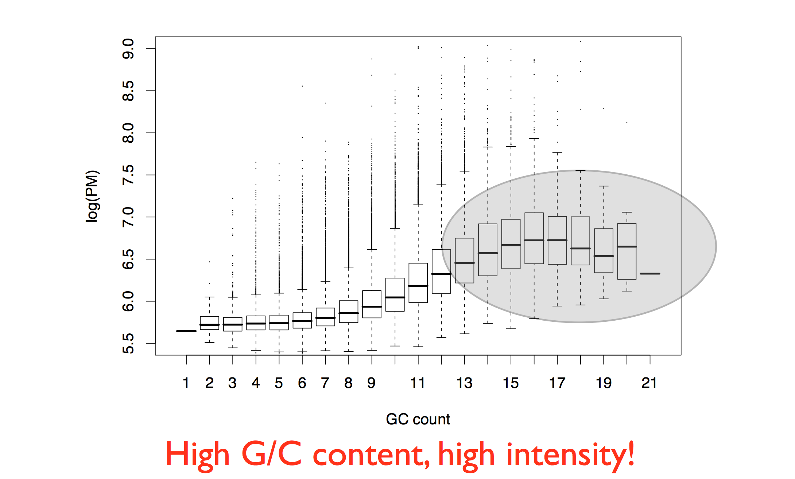
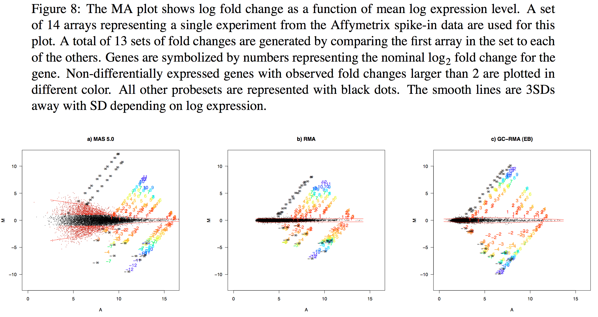

# Bioinformatics for Big Omics Data: Probe summary for oligonucleotide arrays
Raphael Gottardo  
January 21, 2014  


## Setting up some options

Let's first turn on the cache for increased performance and improved styling

```r
# Set some global knitr options
library("knitr")
opts_chunk$set(tidy=TRUE, tidy.opts=list(blank=FALSE, width.cutoff=60), cache=TRUE, messages=FALSE)
```


## Probe summary


- Remember that Affymetrix and Illumina use multiple probes for a given gene
- So it is important to summarize these "replicated" measurements before any down stream analysis
- There exist many different ways to do this for both Affymetrix and Illumina

## Affymetrix arrays - probes




- ~20 probes that “perfectly” represent the gene (Perfect Match)

- ~20 probes that do not match the gene sequence (Mismatch)

- Probeset

## Affymetrix arrays - probes (suite)


For a valid gene expression measurement
the Perfect Match sticks and the Mistach does not!

## Affymetrix probesets



## Probe summary - A Naive approach



## Probe summary - A Naive approach (suite)


## Basis of the MAS 4.0 model (Affymetrix)

Probe summary - MAS 4.0



Is this an appropriate model?

## Probe summary - Dchip

Li, C., & Wong, W. H. (2001). Model-based analysis of oligonucleotide arrays: model validation, design issues and standard error application. Genome Biology.


## Probe summary - Dchip vs MAS4.0


## Probe summary - Dchip (suite)



The same can be done with the probes
by looking at the variance of $\phi$

## Probe summary - MAS 5.0


## Alternative approaches


Irizarry, R. A., Bolstad, B. M., Collin, F., Cope, L. M., Hobbs, B., & Speed, T. P. (2003). Summaries of Affymetrix GeneChip probe level data. Nucleic Acids Research, 31(4), e15.

Irizarry et al. (2003) argued that MM is a poor measure of non specific hybridization

- Modeling $PM-MM$ results in large variance! 
- Model only the PM intensities
- Before do a "gentle" background correction

$$\log_2(PM^*) =\theta_i+\phi_j+\epsilon_{ij}$$

Where $PM^*$ is a normalized background corrected intensity

This the basic model implemeted in the robust multiarray average _RMA_

## RMA background estimation



This can also be used in new Affymetrix arrays that have no MM probes

## Probe sequence affinity


- Does the sequence composition have an effect?
    - Yes
- Should we account for it?
    - How?
- The physical system producing probe intensity is a complicated one!
- Non specific background hybridization is related to the base compositions.
- Many factors (nucleotide composition, base position, neighbors?, etc)
    - **G/C content**

## GC bias


## GC bias (suite)



## Probe sequence affinity models


Naef, F., & Magnasco, M. O. (2003). Solving the riddle of the bright mismatches: labeling and effective binding in oligonucleotide arrays. Physical Review. E, Statistical, Nonlinear, and Soft Matter Physics, 68(1 Pt 1), 011906.


## Sequence effect estimates


Wu, Z., & Irizarry, R. A. (2004). Stochastic models inspired by hybridization theory for short oligonucleotide arrays. the eighth annual international conference (pp. 98–106). New York, New York, USA: ACM. doi:10.1145/974614.974628


## RMA vs MAS5 vs gcRMA



## Summary


- There exist many different algorithms for computing probe summaries from Affymetrix arrays
- RMA is a popular package for probe summary
- Other good packages available in Bioconductor including gcRMA, PUMA, BGX, PLIER, XPS, etc
- Some of the packages are optimized for large datasets


## Illumina beadarrays

Bead level data from Illumina BeadArrays involve an analysis similar to Affymetrix arrays to obtain probe summary data.

Ritchie, M. E., Dunning, M. J., Smith, M. L., Shi, W., & Lynch, A. G. (2011). BeadArray expression analysis using bioconductor. PLoS Computational Biology, 7(12), e1002276. doi:10.1371/journal.pcbi.1002276


## Bead summary from Illumina beadarrays

<small>Dunning, M. J., Barbosa-Morais, N. L., Lynch, A. G., Tavaré, S., & Ritchie, M. E. (2008). Statistical issues in the analysis of Illumina data. BMC Bioinformatics, 9(1), 85. doi:10.1186/1471-2105-9-85</small>

**Conclusions from the paper:**

- Access to bead level data promotes more detailed quality assessment and more flexible analyses. Bead level data can be summarised on a relevant scale. We were able to use the means and variances of the log2 data in the DE analysis to improve our ability to detect known changes in the spikes.

- The background correction and summarisation methods used in BeadStudio reduce bias and produce robust gene expression measurements. However, we find that back- ground normalisation introduces a significant number of negative values and much increased variability.

- Base composition of probes has an effect on intensity and further investigation is required to remove this effect.

