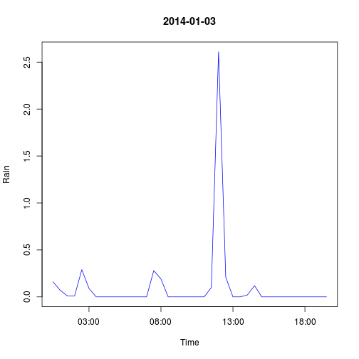

# Weather plot

Using a weather data frame as input, generate a plot showing the
hourly (or half-hourly) rainfall for the 3rd Jan 2014.


```r
library("camweather")
x <- nounits(weatherdata("2014-01-03"))
rain <- x$Rain
plot(x$Time[-1], diff(rain), type = "l",
     xlab = "Time", ylab = "Rain",
     main = "2014-01-03",
     col = "blue")
```

 


[Back](https://github.com/lgatto/rbc/blob/master/R/rprog.md)
