# Base graphics

## Painters model

Graphical elements are added to the canvas one layer at a time, and
the picture builds up in levels. Lower levels are obscured by higher
levels, allowing for blending, masking and overlaying of objects.


```r
plot(1:10, 1:10)
rect(2, 2, 8, 8, col = "black")
rect(3, 3, 7, 7, col = "white")
abline(0, 1, col = "red")
```

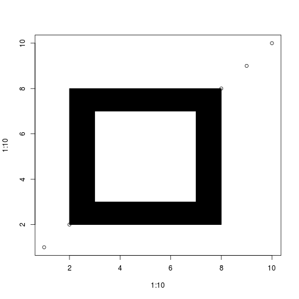 

## High level plotting functions

High level plotting functions produce an appropriate chart based on
the input.

- `plot`: generic plotting function. By default produces scatter plots
  but other `type`s can be set.


```r
par(mfrow = c(2, 2))
plot(1:10, type = "p", main = "points (default)")
plot(1:10, type = "l", main = "lines")
plot(1:10, 10:1, type = "b", main = "both (points and lines)")
plot(1:10, type = "h", main = "histogram")
```

 


- `barbplot`


```r
par(mfrow = c(1, 2))
barplot(c(1, 2, 3, 4))
s <- sample(letters, 1000, replace = TRUE)
barplot(table(s))
```

 


- `boxplot`


```r
par(mfrow = c(1, 2))
l <- lapply(1:10, rnorm)
boxplot(l)
m <- matrix(rnorm(1000), ncol = 10)
boxplot(m, names = LETTERS[1:10])
```

 


- histograms: `hist`


```r
par(mfrow = c(1, 2))
x <- rnorm(10000)
hist(x)
hist(x, breaks = 50, freq = FALSE)
lines(density(x), col = "red")
```

 


- `pie` (not recommended)


```r
pie(c(1, 2, 3, 4))
```

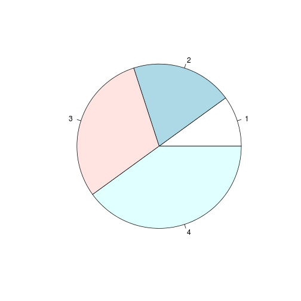 


- curve


```r
curve(x^2, 0, 10)
```

 


- `image` and `heatmap`


```r
m <- matrix(rnorm(30), ncol = 3)
dimnames(m) <- list(genes = paste("Gene", 1:10), sample = LETTERS[1:3])
heatmap(m, col = cm.colors(256))
```

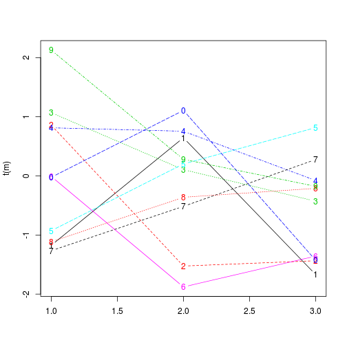 


## Low level interaction

Low level interaction with the drawing device to build up a figure
piece by piece.

- `points`, `lines`, `rect`, `arrows`, `axis`, `abline`, ...


```r
plot(1:10)
points(1:3, 3:1, pch = 19, col = "red")
lines(c(10, 1), c(1, 10))
lines(c(9, 1), c(1, 9), lty = "dotted", lwd = 3)
rect(8, 8, 10, 10, col = "black")
arrows(5, 1, 5, 10)
abline(v = 2, col = "blue")
abline(h = 2, col = "steelblue")
grid()
```

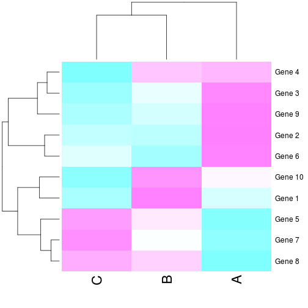 


## Numerous parameters to be tuned.

- See `par`:
  - margins (`mar`, ...), grid of figures (`mfrow` and `mfcol`), ...
  - `las`: axes label style
- Arbitrary graph `layout`


```r

(m <- matrix(c(1, 1, 2, 3, 4, 4), ncol = 3))
```

```
##      [,1] [,2] [,3]
## [1,]    1    2    4
## [2,]    1    3    4
```

```r
layout(m)
plot(1:10, main = 1)
curve(sin(x), from = -2, to = 2, main = 2)
curve(cos(x), from = -2, to = 2, main = 3)
image(t(m), main = 4)
```

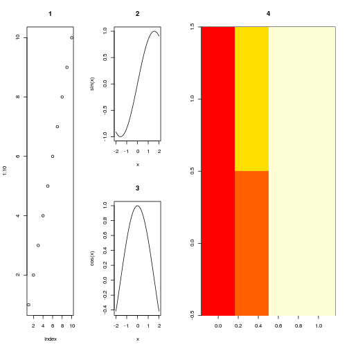 


- Point symbols (plotting character): `pch`
- Symbol sizes (character expansion): `cex`
- ...

## Adding text on graphs
- `title`: for main and sub-titles
- `mtext`: margin text
- `text`: text at `x` and `y` positions
- `legend`

## Devices

By default, the figures are produced on the screen device
(`dev.new()`). Other devices can be opened prior to plotting: `pdf`,
`postscript`, `png`, `jpeg`, `svg`, ... each with their respective
options including a file name. After plotting, the device must be
closed with `dev.off()`.


```r
pdf("fig.pdf")
plot(1:10)
dev.off()
```


It is possible to open multiple devices and navigate them with
`dev.prev()`, `dev.next()` and set the active device (the one in which
the graphics operation occur) with `dev.set(n)`. If a screen device is
open, its content can be copied into another file device with
`dev.copy()`, `dev.copy2pdf()`, ...

## Colours

- Colours can be set by their names (see `colors()`) or by the RGB
  (red, green, blue) specification (as hexadecimals). The `scales`
  package `col2hcl` allows to translate any colour to its RGB
  hexadecimal values. In addition, a fourth (0 <= `alpha`<= 1 in
  `col2hcl`) channel defines transparency (`FF` is opaque, `00` is
  completely transparent).


```r
library("scales")
```

```
## Loading required package: methods
```

```r
cl <- col2hcl("steelblue", alpha = 0.1)
x <- rnorm(3000)
y <- rnorm(3000)
plot(x, y, pch = 19, col = cl, cex = 2)
```

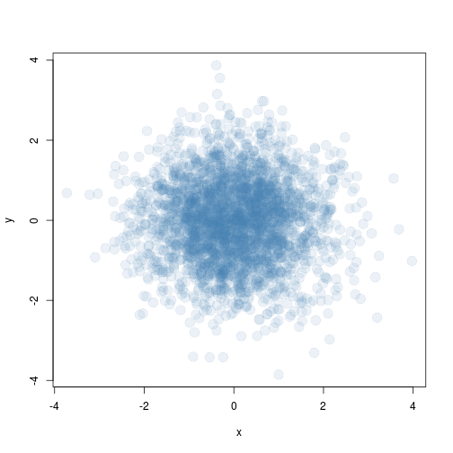 


- The `smoothScatter` function can be used to use colour density to
  represent point density


```r
smoothScatter(x, y)
```

```
## KernSmooth 2.23 loaded
## Copyright M. P. Wand 1997-2009
```

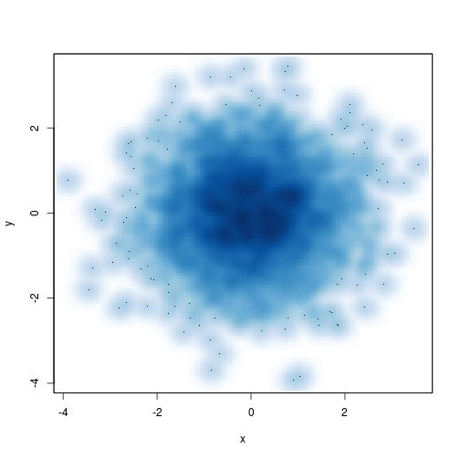 


- Colour palettes: `rainbow(n)`, `heat.colors(n)`,
`terrain.colours(n)`, `topo.colors(n)`, `cm.colors(n)` or using
`colorRampPalette`:


```r
brblramp <- colorRampPalette(c("brown", "steelblue"))
par(mfrow = c(2, 2))
plot(1:10, pch = 19, col = rainbow(10), cex = 3)
plot(1:10, pch = 19, col = cm.colors(10), cex = 3)
plot(1:10, pch = 19, col = heat.colors(10), cex = 3)
plot(1:10, pch = 19, col = brblramp(10), cex = 3)
```

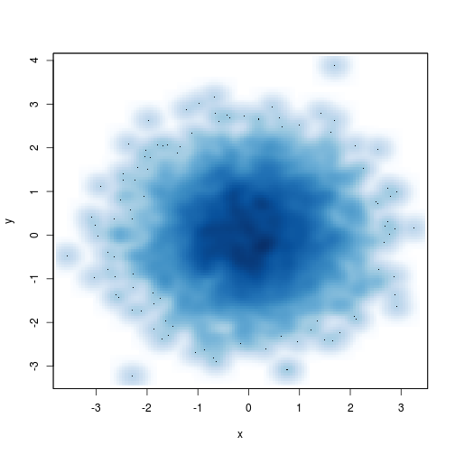 


- The `RColorBrewer` package provides a series of well defined colour
  palettes for maximal discrimination, paired data, ...


```r
library("RColorBrewer")
display.brewer.all()
```

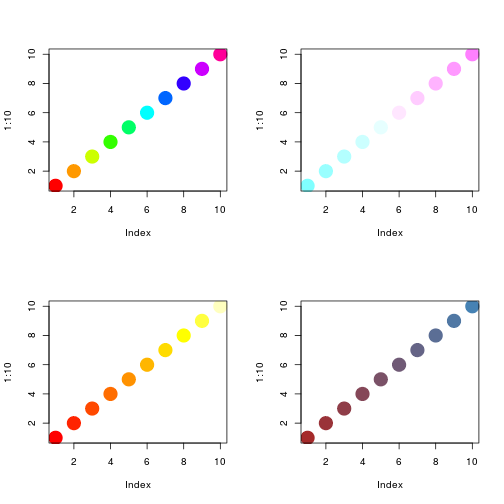 


## Other
- `locator` to obtain the `x` and `y` from a mouse click.
- `identify` to identify index of label of the closest point to a mouse click.

# `ggplot2`

Based on the **Grammar of Graphics**
- A plot is made up of multiple layers
- A layer consists of *data* (must be a `data.frame`), a set of
  *mappings* between variables and *aesthetics* (`aes`), a *geometric
  object* (`geom`) and a *statistical transformation*
- Scales control the details of the mapping
- All components are independent and reusable


```r
library("camweather")
d <- nounits(weatherdata("2013-06-01"))
library("ggplot2")
p <- ggplot(data = d, aes(x = Time, y = Temp))
p + geom_point()  ## add a layer of points 
```

 

```r
p <- ggplot(data = d, aes(x = Time, y = Temp, colour = WindDr))
p + geom_point(size = 3)
```

 

```r
p <- ggplot(data = d, aes(x = Time, y = Temp, colour = WindDr, size = WindSp))
p + geom_point()
```

 

```r
p + geom_point() + facet_wrap(~WindDr)
```

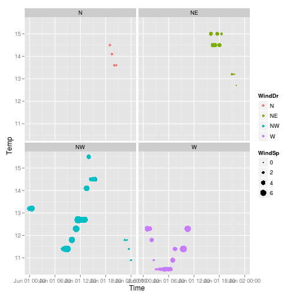 


See also these [`ggplot2` slides](https://github.com/lgatto/visualisation).

# `lattice`

The `lattice` package provides its own set of high-level plotting
functions for `data.frames`, with an emphasis on multivariate data
visualisation. It makes heavily use of the `formula` interface to
produce effective data visualisations.


```r
library("lattice")
xyplot(Temp ~ as.POSIXct(Time), data = d, col = d$WindDr, pch = 19)
```

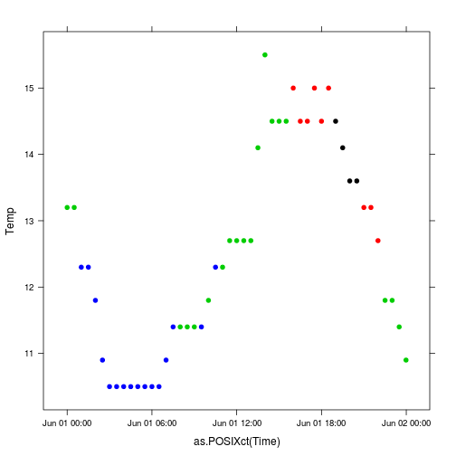 

```r
xyplot(Temp ~ Press | WindDr, data = d, pch = 19)
```

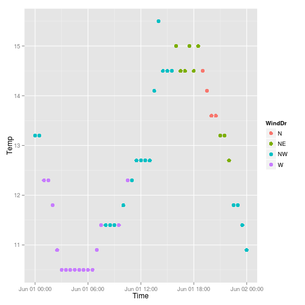 

```r
splom(d[, c("Temp", "Press", "WindSp", "Humid")])
```

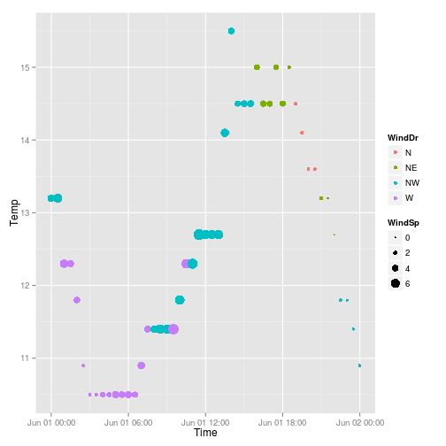 


# Interactive visualisation

- [`shiny`](http://www.rstudio.com/shiny/)
- [`googleVis`](http://code.google.com/p/google-motion-charts-with-r/)
- [`rCharts`](http://rcharts.io/)

# Resources

- `ggplot2` [web page](http://ggplot2.org/) and [book](http://www.amazon.com/dp/0387981403) (slightly outdated though).
- [R Graphics Cookbook](http://www.amazon.com/dp/1449316956).
- [R Graphics](https://www.stat.auckland.ac.nz/~paul/RG2e/) book.
- [Lattice: Multivariate Data Visualization with R](http://lmdvr.r-forge.r-project.org/figures/figures.html) book.
- [R Graphical Manual](http://rgm3.lab.nig.ac.jp/RGM/)


