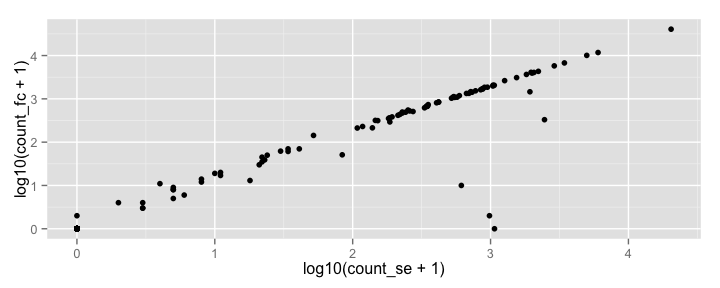

# Bioinformatics for Big Omics Data: Basics of sequence analysis and genomic interval manipulation in R
Raphael Gottardo  
February 2, 2015  

## Setting up some options

Let's first turn on the cache for increased performance and improved styling

```r
# Set some global knitr options
library("knitr")
opts_chunk$set(tidy=TRUE, tidy.opts=list(blank=FALSE, width.cutoff=60), cache=TRUE, messages=FALSE)
```


```r
library(data.table)
library(ggplot2)
library(GenomicRanges)
```

```
## Loading required package: BiocGenerics
## Loading required package: parallel
## 
## Attaching package: 'BiocGenerics'
## 
## The following objects are masked from 'package:parallel':
## 
##     clusterApply, clusterApplyLB, clusterCall, clusterEvalQ,
##     clusterExport, clusterMap, parApply, parCapply, parLapply,
##     parLapplyLB, parRapply, parSapply, parSapplyLB
## 
## The following object is masked from 'package:stats':
## 
##     xtabs
## 
## The following objects are masked from 'package:base':
## 
##     Filter, Find, Map, Position, Reduce, anyDuplicated, append,
##     as.data.frame, as.vector, cbind, colnames, do.call,
##     duplicated, eval, evalq, get, intersect, is.unsorted, lapply,
##     mapply, match, mget, order, paste, pmax, pmax.int, pmin,
##     pmin.int, rank, rbind, rep.int, rownames, sapply, setdiff,
##     sort, table, tapply, union, unique, unlist, unsplit
## 
## Loading required package: S4Vectors
## Loading required package: stats4
## Loading required package: IRanges
## 
## Attaching package: 'IRanges'
## 
## The following object is masked from 'package:data.table':
## 
##     shift
## 
## Loading required package: GenomeInfoDb
```

```r
library(IRanges)
library(reshape2)
```

```
## 
## Attaching package: 'reshape2'
## 
## The following objects are masked from 'package:data.table':
## 
##     dcast, melt
```

```r
library(GenomicAlignments)
```

```
## Loading required package: Biostrings
## Loading required package: XVector
## Loading required package: Rsamtools
## 
## Attaching package: 'GenomicAlignments'
## 
## The following object is masked from 'package:data.table':
## 
##     last
```


## Outline

Here we will discuss some of the core functionality in `Bioconductor` for manipulating sequence data and genomic intervals in R.
You should read the following papers:

1. Morgan, M. et al. ShortRead: a bioconductor package for input, quality assessment and exploration of high-throughput sequence data. Bioinformatics 25, 2607-2608 (2009).

2. Lawrence, M. et al. Software for computing and annotating genomic ranges. PLoS Comput. Biol. 9, e1003118 (2013).

3. Li, H. et al. The Sequence Alignment/Map format and SAMtools. Bioinformatics 25, 2078-2079 (2009).

## Some motivation

The process of gene regulation is a lot more complex than what we originally discussed. 
It's not as simple as DNA &#8594; RNA &#8594; Proteins. 
It's more like

Gene expression = f(Transcription factors, Splicing, miRNA, Nucleosome, Methylation, etc.)

Fortunately, Next Generation Sequencing (NGS) can help us to learn about many of these fundamental processes. 

## Transcription factors


## Alternative splicing


## Next generation sequencing (NGS)

The sequencing revolution started with the Human Genome project. An international collaboration to generate a map of the human genome:

- Took years to complete using Sanger sequencing

- Today the same can be done much more rapidly, at a fraction of the cost using next generation sequencing


## Sequencing types

- [Single end sequencing](http://www.illumina.com/technology/single_read_sequencing_assay.ilmn)

Single-read sequencing involves sequencing DNA from only one end, and is the simplest type of sequencing.

- [Paired-end sequencing](http://www.illumina.com/technology/paired_end_sequencing_assay.ilmn)

Paired-end sequencing allows users to choose the length of the insert and sequence either end of the insert, generating high-quality, alignable sequence data. Paired-end sequencing can detect rearrangements, including insertions and deletions (indels) and inversions. Note that this is different from [mate pair sequencing](http://www.illumina.com/technology/mate_pair_sequencing_assay.ilmn)

## NGS aligment

Next-generation sequencing generally produces short reads or short read pairs (e.g. $<200$ bases) as compared to long reads by Sanger sequencing, which cover ~1000 bases. We need to align these sequences to a reference genome (The exception being de-novo sequencing where we want to infer a new genome).

This is called aligning or mapping the reads against the reference sequence/genome. This is not an easy task:

- The short reads do not come with position information &#8594; need to find the corresponding region in the reference sequence.
- The reference sequence can be quite long (~3 billion bases for human) &#8594; computationally intensive task
- Reads are short &#8594; uncertainty with respect to where the reads can be aligned.
- We need to allow some mismatches and small structural variation (InDels) in our reads. For RNA-seq we need to allow for splice junctions. 
- Sequencing is not perfect &#8594; biological variation and sequencing errors can be confounded. 

## Aligners

There exist a multitude of aligners that can be used for aligning short reads to a reference genome such as: Bowtie, BWA, GSNAP, TopHat, SOAP, STAR, etc. The choice of the aligner is usually guided by the actual application (e.g. RNA-seq, de novo, etc).

More on this later.

## Common data formats

(IMAGES &#8594;) FASTA/FASTQ &#8594; SAM/BAM &#8594; VCF

All of these data formats can be read in R. 

- The SAM/BAM format has emerged as the de facto standard format for short read alignments. 
- SAM  &#8594; plain-text version
- BAM  &#8594; compressed binary version
- BAM files can also be used as an space-saving alternative to FASTQ files to store raw sequence data 
- All current alignment software can generate SAM/BAM as an output format. BAM files can be indexed to improve data accession. 


## Sequence manupulation using Biostrings

Here we will see how to manipulate sequence data in R using the `Biostrings` package


```r
source("http://bioconductor.org/biocLite.R")
biocLite(c("Biostrings", "hgu133plus2probe"))
```

Now, we are ready to use the package


```r
library(Biostrings)
```

## The Biostrings package

`Biostrings` provides memory efficient string containers, string matching algorithms, and other utilities, for fast manipulation of large biological sequences or sets of sequences. 


Most of the `Biostrings` functionalities are summarized [here](http://www.bioconductor.org/packages/2.12/bioc/vignettes/Biostrings/inst/doc/BiostringsQuickOverview.pdf).

## The XString class

The XString is in fact a virtual class and therefore cannot be instanciated. Only subclasses
(or subtypes) BString, DNAString, RNAString and AAString can. These classes are direct
extensions of the XString class (no additional slot). 


```r
library(Biostrings)
b <- BString("I am a BString object")
b
```

```
##   21-letter "BString" instance
## seq: I am a BString object
```

```r
length(b)
```

```
## [1] 21
```

```r
d <- DNAString("TTGAAAA-CTC-N")
d
```

```
##   13-letter "DNAString" instance
## seq: TTGAAAA-CTC-N
```

```r
length(d)
```

```
## [1] 13
```

## The XString class


```r
d[3]
```

```
##   1-letter "DNAString" instance
## seq: G
```

```r
d[7:12]
```

```
##   6-letter "DNAString" instance
## seq: A-CTC-
```

```r
d[]
```

```
##   13-letter "DNAString" instance
## seq: TTGAAAA-CTC-N
```

```r
b[length(b):1]
```

```
##   21-letter "BString" instance
## seq: tcejbo gnirtSB a ma I
```

## The XStringViews class

An XStringViews object contains a set of views on the same XString object called the subject
string. Particularly useful for matches and alignments.


```r
v4 <- Views(d, start = 3:0, end = 5:8)
v4
```

```
##   Views on a 13-letter DNAString subject
## subject: TTGAAAA-CTC-N
## views:
##     start end width
## [1]     3   5     3 [GAA]
## [2]     2   6     5 [TGAAA]
## [3]     1   7     7 [TTGAAAA]
## [4]     0   8     9 [ TTGAAAA-]
```

```r
length(v4)
```

```
## [1] 4
```

```r
start(v4)
```

```
## [1] 3 2 1 0
```

```r
end(v4)
```

```
## [1] 5 6 7 8
```

## Summarizing SC genome

Let's look at the Scerevisiae genome:
You will need the following package:

```r
biocLite("BSgenome.Scerevisiae.UCSC.sacCer1")
```
and then load it

```r
library("BSgenome.Scerevisiae.UCSC.sacCer1")
```

```
## Loading required package: BSgenome
## Loading required package: rtracklayer
```

here is a quick summary of the number of ACGT across the first chr1.


```r
alphabetFrequency(Scerevisiae[["chr1"]])/length(Scerevisiae[["chr1"]])
```

```
##         A         C         G         T         M         R         W 
## 0.3033344 0.1939246 0.1987985 0.3039425 0.0000000 0.0000000 0.0000000 
##         S         Y         K         V         H         D         B 
## 0.0000000 0.0000000 0.0000000 0.0000000 0.0000000 0.0000000 0.0000000 
##         N         -         +         . 
## 0.0000000 0.0000000 0.0000000 0.0000000
```


**Exercise:** Do the same with the human genome and let me know what you get.

## Finding patterns


```r
matchPattern(pattern = "GATAGA", subject = Scerevisiae[["chr1"]])
```

```
##   Views on a 230208-letter DNAString subject
## subject: CCACACCACACCCACACACCCACACACCACAC...GTGGGTGTGGTGTGGGTGTGGTGTGTGTGGG
## views:
##       start    end width
##  [1]   1265   1270     6 [GATAGA]
##  [2]   1838   1843     6 [GATAGA]
##  [3]   8185   8190     6 [GATAGA]
##  [4]  11532  11537     6 [GATAGA]
##  [5]  12000  12005     6 [GATAGA]
##  ...    ...    ...   ... ...
## [54] 209740 209745     6 [GATAGA]
## [55] 214693 214698     6 [GATAGA]
## [56] 223103 223108     6 [GATAGA]
## [57] 225347 225352     6 [GATAGA]
## [58] 229924 229929     6 [GATAGA]
```


```r
countPattern(pattern = "GATAGA", subject = Scerevisiae[["chr1"]])
```

```
## [1] 58
```


**Exercise:** Try to play with some of the options such as the number of mismatch and/or indels.

## Handling probe sequence information

Let's install the following packages

```r
biocLite(c("Biostrings", "hgu133plus2probe", "ShortRead"))
```

and load the following two libraries

```r
library(Biostrings)
library(hgu133plus2probe)
```

```
## Loading required package: AnnotationDbi
## Loading required package: Biobase
## Welcome to Bioconductor
## 
##     Vignettes contain introductory material; view with
##     'browseVignettes()'. To cite Bioconductor, see
##     'citation("Biobase")', and for packages 'citation("pkgname")'.
## 
## 
## Attaching package: 'AnnotationDbi'
## 
## The following object is masked from 'package:BSgenome':
## 
##     species
## 
## The following object is masked from 'package:GenomeInfoDb':
## 
##     species
```

We now have access to the `hgu133plus2probe` dataset containing our probe information.

## Handling probe sequence information

Let's create a `DNAStringSet`


```r
probes <- DNAStringSet(hgu133plus2probe)
```

Let's go back to our flu dataset:


```r
library(affy)
# Read the CEL file and creates and AffyBatch
GSE29617_affyBatch <- ReadAffy(celfile.path = "Data/GEO/GSE29617/")
# Normalize and summarize the data
GSE29617_set2 <- rma(GSE29617_affyBatch)
```

```
## 
```

```
## Background correcting
## Normalizing
## Calculating Expression
```

## Handling probe sequence information

Let's calculate the GC content of each probe

```r
dt_exprs <- data.table(probe_name = gsub("_PM", "", rownames(GSE29617_set2)), 
    exprs(GSE29617_set2))
# frequency for all probes
freq <- alphabetFrequency(probes)
# Compute the GC content
GC_count <- freq[, "G"] + freq[, "C"]
dt_probes <- data.table(probe_name = hgu133plus2probe$Probe.Set.Name, 
    GC_count)
setkey(dt_exprs, "probe_name")
setkey(dt_probes, "probe_name")
dt_merged <- dt_exprs[dt_probes]
dt_merged_melt <- melt(dt_merged, id.vars = c("probe_name", "GC_count"))
# This line is not needed if you're using the latest dev
# version of data.tabler
dt_merged_melt <- data.table(dt_merged_melt)
dt_merged_melt_sum <- dt_merged_melt[, list(mean = mean(value)), 
    by = GC_count]
```

## Handling probe sequence information

We now look at the effect of probe composition on observed intensities


```r
library(ggplot2)
library(reshape2)
ggplot(dt_merged_melt[variable == "GSM733942.CEL.gz"], aes(x = as.factor(GC_count), 
    y = value)) + geom_violin() + geom_point(data = dt_merged_melt_sum, 
    aes(x = as.factor(GC_count), y = mean), col = "red", size = 6) + 
    theme_minimal(base_size = 18)
```

 


What do you think about the GC content effect? 
**Excercise:** Repeat the plot above with other sequence characteristics

## GenomicRanges

Bioconductor possesses an infrastructure for representing and computing on annotated genomic ranges and integrating genomic data with the statistical computing features of R and its extensions. At the core of the infrastructure are three packages: `IRanges`, `GenomicRanges`, and `GenomicFeatures`. These packages provide scalable data structures for representing annotated ranges on the genome, and performing opperations on genomic intervals (e.g. overlaps, etc).

Most of the text and examples used here are taken from the various `*Ranges` Bioconductor package vignettes.

## IRanges

The IRanges package is designed to represent sequences, ranges representing indices along those sequences,
and data related to those ranges. IRanges makes use run-length encodings to provide increased performance.
For example, the sequence {1, 1, 1, 2, 3, 3} can be represented as values= {1, 2, 3}, run lengths = {3, 1, 2}.


```r
xVector <- sort(sample(1:100, replace = TRUE, size = 10000))
xRle <- Rle(xVector)
as.vector(object.size(xRle)/object.size(xVector))
```

```
## [1] 0.04755245
```

```r
identical(as.vector(xRle), xVector)
```

```
## [1] TRUE
```

## IRanges

The `IRanges` class is a "simple" container where 2 integer vectors of the same length are used to store the start and width values. 

```r
ir1 <- IRanges(start = 1:10, width = 10:1)
ir2 <- IRanges(start = 1:10, end = 11)
ir3 <- IRanges(end = 11, width = 10:1)
```

`IRanges` provides common accessor functions to retrieve relevant pieces of information. 


```r
start(ir1)
```

```
##  [1]  1  2  3  4  5  6  7  8  9 10
```

```r
end(ir1)
```

```
##  [1] 10 10 10 10 10 10 10 10 10 10
```

```r
width(ir1)
```

```
##  [1] 10  9  8  7  6  5  4  3  2  1
```

```r
mid(ir1)
```

```
##  [1]  5  6  6  7  7  8  8  9  9 10
```

```r
names(ir1)
```

```
## NULL
```

## RangesList

An extension of `List` that holds only `Ranges` objects. Useful for storing ranges over a set of spaces (e.g. chromosomes), each of which requires a separate Ranges object. As a Vector, RangesList may be annotated with its universe identifier (e.g. a genome) in which all of its spaces exist.


```r
range1 <- IRanges(start = c(1, 2, 3), end = c(5, 2, 8))
range2 <- IRanges(start = c(15, 45, 20, 1), end = c(15, 100, 
    80, 5))
named <- RangesList(one = range1, two = range2)
length(named)  # 2
```

```
## [1] 2
```

```r
start(named)  # same as start(c(range1, range2))
```

```
## IntegerList of length 2
## [["one"]] 1 2 3
## [["two"]] 15 45 20 1
```

```r
names(named)  # 'one' and 'two'
```

```
## [1] "one" "two"
```

```r
start(named[["one"]])
```

```
## [1] 1 2 3
```

```r
start(named[[1]])
```

```
## [1] 1 2 3
```

```r
universe(named) <- "hg18"
universe(named)
```

```
## [1] "hg18"
```

## GRanges: Single Interval Range Features

`GRanges` are like `IRanges` but with a strand and a chromosome


```r
gr <- GRanges(seqnames = Rle(c("chr1", "chr2", "chr1", "chr3"), 
    c(1, 3, 2, 4)), ranges = IRanges(1:10, end = 7:16, names = head(letters, 
    10)), strand = Rle(strand(c("-", "+", "*", "+", "-")), c(1, 
    2, 2, 3, 2)), score = 1:10, GC = seq(1, 0, length = 10))
seqlengths(gr)
```

```
## chr1 chr2 chr3 
##   NA   NA   NA
```

```r
seqnames(gr)
```

```
## factor-Rle of length 10 with 4 runs
##   Lengths:    1    3    2    4
##   Values : chr1 chr2 chr1 chr3
## Levels(3): chr1 chr2 chr3
```

```r
ranges(gr)
```

```
## IRanges of length 10
##      start end width names
## [1]      1   7     7     a
## [2]      2   8     7     b
## [3]      3   9     7     c
## [4]      4  10     7     d
## [5]      5  11     7     e
## [6]      6  12     7     f
## [7]      7  13     7     g
## [8]      8  14     7     h
## [9]      9  15     7     i
## [10]    10  16     7     j
```

```r
strand(gr)
```

```
## factor-Rle of length 10 with 5 runs
##   Lengths: 1 2 2 3 2
##   Values : - + * + -
## Levels(3): + - *
```

```r
mcols(gr)$score
```

```
##  [1]  1  2  3  4  5  6  7  8  9 10
```

## GRangesList: Multiple Interval Range Features

Whenever genomic features consist of multiple ranges that are grouped by a parent
feature, they can be represented as `GRangesList` object. Consider the simple example of the two transcript
`GRangesList` below created using the `GRangesList` constructor.


```r
gr1 <- GRanges(seqnames = "chr2", ranges = IRanges(3, 6), strand = "+", 
    score = 5L, GC = 0.45)
gr2 <- GRanges(seqnames = c("chr1", "chr1"), ranges = IRanges(c(7, 
    13), width = 3), strand = c("+", "-"), score = 3:4, GC = c(0.3, 
    0.5))
grl <- GRangesList(txA = gr1, txB = gr2)
grl
```

```
## GRangesList object of length 2:
## $txA 
## GRanges object with 1 range and 2 metadata columns:
##       seqnames    ranges strand |     score        GC
##          <Rle> <IRanges>  <Rle> | <integer> <numeric>
##   [1]     chr2    [3, 6]      + |         5      0.45
## 
## $txB 
## GRanges object with 2 ranges and 2 metadata columns:
##       seqnames   ranges strand | score  GC
##   [1]     chr1 [ 7,  9]      + |     3 0.3
##   [2]     chr1 [13, 15]      - |     4 0.5
## 
## -------
## seqinfo: 2 sequences from an unspecified genome; no seqlengths
```

```r
# Unlist to GRanges
ul <- unlist(grl)
```

Most of the accessors that work for `GRanges` also work for `GRangesList`.

## GRanges API

For more information about the GRanges API look at the following image


extracted from Lawrence et al. (2013)

## Load a BAM file into a GAlignments object


```r
library(Rsamtools)
aln1_file <- system.file("extdata", "ex1.bam", package = "Rsamtools")
aln1 <- readGAlignments(aln1_file)
aln1
```

```
## GAlignments object with 3271 alignments and 0 metadata columns:
##          seqnames strand       cigar    qwidth     start       end
##             <Rle>  <Rle> <character> <integer> <integer> <integer>
##      [1]     seq1      +         36M        36         1        36
##      [2]     seq1      +         35M        35         3        37
##      [3]     seq1      +         35M        35         5        39
##      [4]     seq1      +         36M        36         6        41
##      [5]     seq1      +         35M        35         9        43
##      ...      ...    ...         ...       ...       ...       ...
##   [3267]     seq2      +         35M        35      1524      1558
##   [3268]     seq2      +         35M        35      1524      1558
##   [3269]     seq2      -         35M        35      1528      1562
##   [3270]     seq2      -         35M        35      1532      1566
##   [3271]     seq2      -         35M        35      1533      1567
##              width     njunc
##          <integer> <integer>
##      [1]        36         0
##      [2]        35         0
##      [3]        35         0
##      [4]        36         0
##      [5]        35         0
##      ...       ...       ...
##   [3267]        35         0
##   [3268]        35         0
##   [3269]        35         0
##   [3270]        35         0
##   [3271]        35         0
##   -------
##   seqinfo: 2 sequences from an unspecified genome
```

## Load a BAM file into a GAlignments object

What if you want the actual sequences too?


```r
library(ShortRead)
```

```
## Loading required package: BiocParallel
## 
## Attaching package: 'ShortRead'
## 
## The following object is masked from 'package:affy':
## 
##     intensity
## 
## The following object is masked from 'package:data.table':
## 
##     tables
```

```r
aln1_file <- system.file("extdata", "ex1.bam", package = "Rsamtools")
aln1 <- readGappedReads(aln1_file)
aln1
```

```
## GappedReads object with 3271 alignments and 0 metadata columns:
##          seqnames strand       cigar    qwidth     start       end
##             <Rle>  <Rle> <character> <integer> <integer> <integer>
##      [1]     seq1      +         36M        36         1        36
##      [2]     seq1      +         35M        35         3        37
##      [3]     seq1      +         35M        35         5        39
##      [4]     seq1      +         36M        36         6        41
##      [5]     seq1      +         35M        35         9        43
##      ...      ...    ...         ...       ...       ...       ...
##   [3267]     seq2      +         35M        35      1524      1558
##   [3268]     seq2      +         35M        35      1524      1558
##   [3269]     seq2      -         35M        35      1528      1562
##   [3270]     seq2      -         35M        35      1532      1566
##   [3271]     seq2      -         35M        35      1533      1567
##              width     njunc
##          <integer> <integer>
##      [1]        36         0
##      [2]        35         0
##      [3]        35         0
##      [4]        36         0
##      [5]        35         0
##      ...       ...       ...
##   [3267]        35         0
##   [3268]        35         0
##   [3269]        35         0
##   [3270]        35         0
##   [3271]        35         0
##   -------
##   seqinfo: 2 sequences from an unspecified genome
```

```r
qseq(aln1)
```

```
##   A DNAStringSet instance of length 3271
##        width seq
##    [1]    36 CACTAGTGGCTCATTGTAAATGTGTGGTTTAACTCG
##    [2]    35 CTAGTGGCTCATTGTAAATGTGTGGTTTAACTCGT
##    [3]    35 AGTGGCTCATTGTAAATGTGTGGTTTAACTCGTCC
##    [4]    36 GTGGCTCATTGTAATTTTTTGTTTTAACTCTTCTCT
##    [5]    35 GCTCATTGTAAATGTGTGGTTTAACTCGTCCATGG
##    ...   ... ...
## [3267]    35 TTTCTTTTCTCCTTTTTTTTTTTTTTTTTCTACAT
## [3268]    35 TTTCTTTTCACTTTTTTTTTTTTTTTTTTTTACTT
## [3269]    35 TTTTTTCTTTTTTTTTTTTTTTTTTTTGCATGCCA
## [3270]    35 TTTTTTTTTTTTTTTTTTTTTTTGCATGCCAGAAA
## [3271]    35 TTTTTTTTTTTTTTTTTTTTTTTCATGCCAGAAAA
```

## Converting to a GRanges

you can (almost) always convert a given object to a relevant class

```r
gr1 <- as(aln1, "GRanges")
```

## Reduce

Merge overlapping and adjacent ranges

```r
reduce(gr1)
```

```
## GRanges object with 7 ranges and 0 metadata columns:
##       seqnames       ranges strand
##          <Rle>    <IRanges>  <Rle>
##   [1]     seq1 [   1, 1408]      +
##   [2]     seq1 [  18,   52]      -
##   [3]     seq1 [ 185, 1569]      -
##   [4]     seq2 [   1, 1410]      +
##   [5]     seq2 [1509, 1558]      +
##   [6]     seq2 [   1,   35]      -
##   [7]     seq2 [ 197, 1567]      -
##   -------
##   seqinfo: 2 sequences from an unspecified genome
```

## Disjoin

Ranges formed from union of endpoints

```r
disjoin(gr1)
```

```
## GRanges object with 3747 ranges and 0 metadata columns:
##          seqnames       ranges strand
##             <Rle>    <IRanges>  <Rle>
##      [1]     seq1      [1,  2]      +
##      [2]     seq1      [3,  4]      +
##      [3]     seq1      [5,  5]      +
##      [4]     seq1      [6,  8]      +
##      [5]     seq1      [9, 12]      +
##      ...      ...          ...    ...
##   [3743]     seq2 [1554, 1555]      -
##   [3744]     seq2 [1556, 1558]      -
##   [3745]     seq2 [1559, 1562]      -
##   [3746]     seq2 [1563, 1566]      -
##   [3747]     seq2 [1567, 1567]      -
##   -------
##   seqinfo: 2 sequences from an unspecified genome
```


## Coverage


```r
gr1_list <- split(gr1, seqnames(gr1))
cv <- coverage(gr1_list[[1]])
cv_vec <- as.vector(cv$seq1)
qplot(x = 1:1575, y = cv_vec) + geom_smooth() + theme_minimal(base_size = 18)
```

```
## geom_smooth: method="auto" and size of largest group is >=1000, so using gam with formula: y ~ s(x, bs = "cs"). Use 'method = x' to change the smoothing method.
```

 


## Finding overlaps

`findOverlaps` and `countOverlaps` produce a mapping and a
tabulation of interval overlaps, respectively. 


```r
query <- IRanges(c(1, 5, 3, 4), width = c(2, 2, 4, 6))
subject <- IRanges(c(1, 3, 5, 6), width = c(4, 4, 5, 4))
findOverlaps(query, subject, type = "start")
```

```
## Hits of length 3
## queryLength: 4
## subjectLength: 4
##   queryHits subjectHits 
##    <integer>   <integer> 
##  1         1           1 
##  2         2           3 
##  3         3           2
```

```r
countOverlaps(query, subject)
```

```
## [1] 1 3 4 4
```

## Preparing data for RNA-seq analysis

Let's assume that we want to generate gene counts using the drosophilia genome.
You first need to install the required transcript dataset.

```r
biocLite("TxDb.Dmelanogaster.UCSC.dm3.ensGene")
```
and load the package, which will create an object of class `TranscriptDB`.

```r
library(TxDb.Dmelanogaster.UCSC.dm3.ensGene)
```

```
## Loading required package: GenomicFeatures
```

```r
TxDb.Dmelanogaster.UCSC.dm3.ensGene
```

```
## TxDb object:
## | Db type: TxDb
## | Supporting package: GenomicFeatures
## | Data source: UCSC
## | Genome: dm3
## | Organism: Drosophila melanogaster
## | UCSC Table: ensGene
## | Resource URL: http://genome.ucsc.edu/
## | Type of Gene ID: Ensembl gene ID
## | Full dataset: yes
## | miRBase build ID: NA
## | transcript_nrow: 29173
## | exon_nrow: 76920
## | cds_nrow: 62135
## | Db created by: GenomicFeatures package from Bioconductor
## | Creation time: 2014-09-26 11:22:16 -0700 (Fri, 26 Sep 2014)
## | GenomicFeatures version at creation time: 1.17.17
## | RSQLite version at creation time: 0.11.4
## | DBSCHEMAVERSION: 1.0
```


## Preparing data for RNA-seq analysis 

As sample data we use pasillaBamSubset which contains both a single-end BAM (untreated1 chr4) and a paired-end
BAM (untreated3 chr4). Each le is a subset of chr4 from the "Pasilla" experiment. See ?pasillaBamSubset for details, but we first need to install the package

```r
biocLite("pasillaBamSubset")
```
and load the package

```r
library(pasillaBamSubset)
un1 <- untreated1_chr4()  ## single-end records
```


## Preparing data for RNA-seq analysis 

Let's also extract the exon ranges by genes as follows,

```r
exbygene <- exonsBy(TxDb.Dmelanogaster.UCSC.dm3.ensGene, "gene")
```

we are now ready to count the number of sequences that fall within each gene

```r
se <- summarizeOverlaps(exbygene, un1, mode = "IntersectionStrict")
se
```

```
## class: SummarizedExperiment 
## dim: 15682 1 
## exptData(0):
## assays(1): counts
## rownames(15682): FBgn0000003 FBgn0000008 ... FBgn0264726
##   FBgn0264727
## rowData metadata column names(0):
## colnames(1): untreated1_chr4.bam
## colData names(0):
```
which is an object of class `SummarizedExperiment`.

## Preparing data for RNA-seq analysis 

We can easily extract the counts:

```r
head(table(assays(se)$counts))
```

```
## 
##     0     1     2     3     4     5 
## 15594     2     1     3     3     1
```

The annotation is stored in the rowData slot:

```r
rowData(se)
```

```
## GRangesList object of length 15682:
## $FBgn0000003 
## GRanges object with 1 range and 2 metadata columns:
##       seqnames             ranges strand |   exon_id   exon_name
##          <Rle>          <IRanges>  <Rle> | <integer> <character>
##   [1]    chr3R [2648220, 2648518]      + |     45123        <NA>
## 
## $FBgn0000008 
## GRanges object with 13 ranges and 2 metadata columns:
##        seqnames               ranges strand   | exon_id exon_name
##    [1]    chr2R [18024494, 18024531]      +   |   20314      <NA>
##    [2]    chr2R [18024496, 18024713]      +   |   20315      <NA>
##    [3]    chr2R [18024938, 18025756]      +   |   20316      <NA>
##    [4]    chr2R [18025505, 18025756]      +   |   20317      <NA>
##    [5]    chr2R [18039159, 18039200]      +   |   20322      <NA>
##    ...      ...                  ...    ... ...     ...       ...
##    [9]    chr2R [18058283, 18059490]      +   |   20326      <NA>
##   [10]    chr2R [18059587, 18059757]      +   |   20327      <NA>
##   [11]    chr2R [18059821, 18059938]      +   |   20328      <NA>
##   [12]    chr2R [18060002, 18060339]      +   |   20329      <NA>
##   [13]    chr2R [18060002, 18060346]      +   |   20330      <NA>
## 
## ...
## <15680 more elements>
## -------
## seqinfo: 15 sequences (1 circular) from dm3 genome
```

## Alternative approaches

1. featureCounts: Liao, Y., Smyth, G. & Shi, W. featureCounts: an efficient general purpose program for assigning sequence reads to genomic features. Bioinformatics 30, 923–930 (2014).

2. RSEM: Li, B., Ruotti, V., Stewart, R. M., Thomson, J. A. & Dewey, C. N. RNA-Seq gene expression estimation with read mapping uncertainty. Bioinformatics 26, 493–500 (2010).

## The Rsubread package


```r
# load the package
library("Rsubread")
library("R.utils")
```

```
## Loading required package: R.oo
## Loading required package: R.methodsS3
## R.methodsS3 v1.6.1 (2014-01-04) successfully loaded. See ?R.methodsS3 for help.
## R.oo v1.18.0 (2014-02-22) successfully loaded. See ?R.oo for help.
## 
## Attaching package: 'R.oo'
## 
## The following object is masked from 'package:GenomicRanges':
## 
##     trim
## 
## The following object is masked from 'package:IRanges':
## 
##     trim
## 
## The following objects are masked from 'package:methods':
## 
##     getClasses, getMethods
## 
## The following objects are masked from 'package:base':
## 
##     attach, detach, gc, load, save
## 
## R.utils v1.34.0 (2014-10-07) successfully loaded. See ?R.utils for help.
## 
## Attaching package: 'R.utils'
## 
## The following object is masked from 'package:ShortRead':
## 
##     countLines
## 
## The following object is masked from 'package:Rsamtools':
## 
##     isOpen
## 
## The following object is masked from 'package:utils':
## 
##     timestamp
## 
## The following objects are masked from 'package:base':
## 
##     cat, commandArgs, getOption, inherits, isOpen, parse, warnings
```

The Rsubread package can be used to perform alignment and expression quantification.

## featureCounts 


```r
bam_file <- system.file("extdata", "untreated1_chr4.bam", package = "pasillaBamSubset")
fc_counts <- featureCounts(files = bam_file, annot.ext = "annotation.gtf", 
    isGTFAnnotationFile = TRUE, GTF.featureType = "exon", GTF.attrType = "gene_id")
```

```
## 
##         ==========     _____ _    _ ____  _____  ______          _____  
##         =====         / ____| |  | |  _ \|  __ \|  ____|   /\   |  __ \ 
##           =====      | (___ | |  | | |_) | |__) | |__     /  \  | |  | |
##             ====      \___ \| |  | |  _ <|  _  /|  __|   / /\ \ | |  | |
##               ====    ____) | |__| | |_) | | \ \| |____ / ____ \| |__| |
##         ==========   |_____/ \____/|____/|_|  \_\______/_/    \_\_____/
##        Rsubread 1.16.1
## 
## //========================== featureCounts setting ===========================\\
## ||                                                                            ||
## ||             Input files : 1 BAM file                                       ||
## ||                           S /usr/local/lib/R/site-library/pasillaBamSu ... ||
## ||                                                                            ||
## ||             Output file : ./.Rsubread_featureCounts_pid11585               ||
## ||             Annotations : annotation.gtf (GTF)                             ||
## ||                                                                            ||
## ||                 Threads : 1                                                ||
## ||                   Level : meta-feature level                               ||
## ||              Paired-end : no                                               ||
## ||         Strand specific : no                                               ||
## ||      Multimapping reads : not counted                                      ||
## || Multi-overlapping reads : not counted                                      ||
## ||                                                                            ||
## \\===================== http://subread.sourceforge.net/ ======================//
## 
## //================================= Running ==================================\\
## ||                                                                            ||
## || Load annotation file annotation.gtf ...                                    ||
## ||    Features : 162331                                                       ||
## ||    Meta-features : 15682                                                   ||
## ||    Chromosomes : 15                                                        ||
## ||                                                                            ||
## || Process BAM file /usr/local/lib/R/site-library/pasillaBamSubset/extdat ... ||
## ||    Single-end reads are included.                                          ||
## ||    Assign reads to features...                                             ||
## ||    Total reads : 204355                                                    ||
## ||    Successfully assigned reads : 144983 (70.9%)                            ||
## ||    Running time : 0.01 minutes                                             ||
## ||                                                                            ||
## ||                         Read assignment finished.                          ||
## ||                                                                            ||
## \\===================== http://subread.sourceforge.net/ ======================//
```

## featureCounts 


```r
count1 <- data.table(exon_id = rownames(assays(se)$counts), count_se = as.vector(assays(se)$counts))
count2 <- data.table(exon_id = rownames(fc_counts$counts), count_fc = as.vector(fc_counts$counts))
count_dt <- merge(count1, count2, by = "exon_id")
qplot(log10(count_se + 1), log10(count_fc + 1), data = count_dt)
```

 

## RSEM

RSEM: Li, B., Ruotti, V., Stewart, R. M., Thomson, J. A. & Dewey, C. N. RNA-Seq gene expression estimation with read mapping uncertainty. Bioinformatics 26, 493–500 (2010).

Let's look at these lecture notes:
https://www.biostat.wisc.edu/bmi776/lectures/rnaseq.pdf


