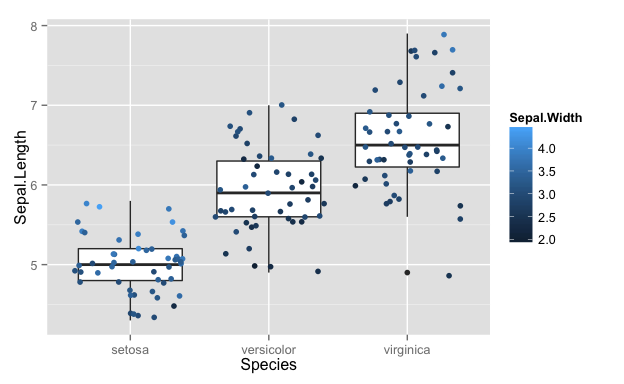
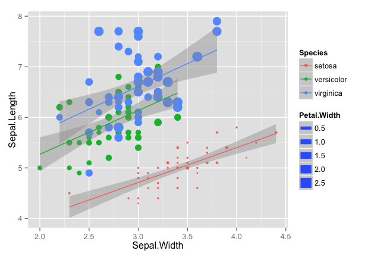
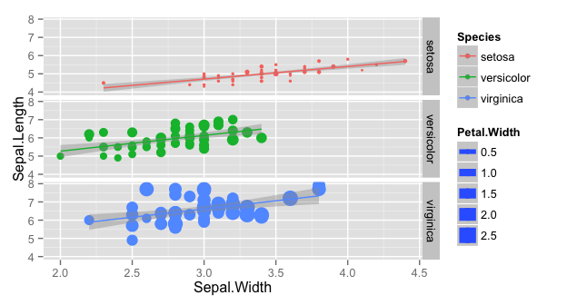
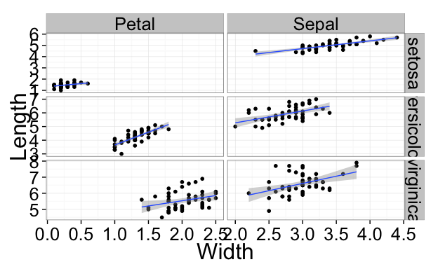
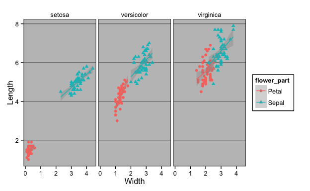

# Bioinformatics for Big Omics Data: Advanced graphics in R using ggplot2
Raphael Gottardo  
December 26, 2014  


## Exploratory data analysis (EDA)
What is EDA?

- Statistical practice concerned with (among other things): uncover underlying structure, extract important variables, detect outliers and anomalies, test underlying assumptions, develop models
- Named by John Tukey
- *Extremely Important*

R provides a powerful environment for EDA and visualization

## EDA techniques

- Mostly graphical
- Plotting the raw data (histograms, scatterplots, etc.)
- Plotting simple statistics such as means, standard deviations, medians, box plots, etc
- Positioning such plots so as to maximize our natural pattern-recognition abilities
- A clear picture is worth a thousand words!

## A few tips

- Avoid 3-D graphics
- Don’t show too much information on the same graph (color, patterns, etc)
- Stay away from Excel, Excel is not a statistics package!
- R provides a great environment for EDA with good graphics capabilities

## Graphics in R

Generic function for plotting of objects in R is `plot`. The output will vary depending on the object type (e.g. scatter-plot, pair-plot, etc)


```r
# Load the Iris data
data(iris)
plot(iris)
```

 

## Graphics in R 

R provides many other graphics capabilities, such as histograms, boxplots, etc.


```r
hist(iris$Sepal.Length)
```

 

## Graphics in R 


```r
boxplot(iris)
```

 

Anything wrong with the Species boxplot?

## Graphics in R (end)

While R's graphics is very powerful and fully customizable, it can be difficult and painful to get to the desired plot. 

For example, there are many different parameters, not necessarily consistent across function, etc.

**Friends don't let friends use R base graphics!**

[ggplot2](http://ggplot2.org/) provides a much richer and consistent environment for graphics in R.

## ggplot2

Description from Hadley Wickham:

> ggplot2 is a plotting system for R, based on the grammar of graphics, which tries to take the good parts of base and lattice graphics and none of the bad parts. It takes care of many of the fiddly details that make plotting a hassle (like drawing legends) as well as providing a powerful model of graphics that makes it easy to produce complex multi-layered graphics.

Provides lots of different geometrics for data visualization:

See http://docs.ggplot2.org/current/ for details.

ggplot2 provides two main APIs: `qplot` and `ggplot`

## ggplot2 - qplot

`qplot` is basically a replacement for `plot` but provide a cleaner output with a consistent interface.


```r
# Load library
library(ggplot2)
# Using the variables directly
qplot(iris$Sepal.Length, iris$Sepal.Width)
```

 

## ggplot2 - qplot 


```r
# Can also use a dataframe
qplot(Sepal.Length, Sepal.Width, data = iris)
```

 

## ggplot2 - plot types

Plot types can be specified with the `geom` option


```r
# Points
qplot(Sepal.Length, Sepal.Width, data = iris, geom = "point")
```

 

## ggplot2 - plot types


```r
# line
qplot(Sepal.Length, Sepal.Width, data = iris, geom = "line")
```

 

## ggplot2 - combining plot types

Plot types can be specified with the `geom` option, multiple types can be combined


```r
# Points and line
qplot(Sepal.Length, Sepal.Width, data = iris, geom = c("line", "point"))
```

 

## ggplot2 - combining plot types


```r
# Points and line
qplot(x = Species, y = Sepal.Length, data = iris, geom = c("boxplot", "point"))
```

 

Notice anything wrong on the plot above? Try changing the `point` option with `jitter`.

## ggplot2 - mapping aesthetics variables

In ggplot2, additional variables can be mapped to plot aesthetics including `color`, `fill`, `shape`, `size`, `alpha`, `linetype`. 


```r
# Points and line
qplot(x = Species, y = Sepal.Length, data = iris, geom = c("boxplot", "jitter"), 
    color = Sepal.Width)
```

 

## ggplot2 - mapping aesthetics variables


```r
# Points and line
qplot(x = Sepal.Width, y = Sepal.Length, data = iris, geom = c("point", "smooth"), 
    color = Species, size = Petal.Width, method = "lm")
```

 

## ggplot2 - facetting

Sometimes it can be convenient to visualize some characteristic of a dataset conditioning on the levels of some other variable.
Such feature is readily available in ggplot2 using the `facets` argument. 


```r
# Points and line
qplot(x = Sepal.Width, y = Sepal.Length, data = iris, geom = c("point", "smooth"), 
    color = Species, size = Petal.Width, method = "lm", facets = ~Species)
```

 

## ggplot2 - facetting

Or if you prefer to facet by rows


```r
# Points and line
qplot(x = Sepal.Width, y = Sepal.Length, data = iris, geom = c("point", "smooth"), 
    color = Species, size = Petal.Width, method = "lm", facets = Species ~ .)
```

 

## Reshaping your data with reshape2

It is often necessary to reshape (e.g. pivot) your data before analysis. This can easily be done in R using the `reshape2` package.
This package provides main functions `melt` and `*cast`. `melt` basically "melts" a dataframe in wide format into a long format. `*cast` goes in the other direction.

## Reshaping your data with reshape2

Let's revisite our `iris` dataset.

```r
# We first load the library
library(reshape2)
# Only display the first few lines
head(iris)
```

```
##   Sepal.Length Sepal.Width Petal.Length Petal.Width Species
## 1          5.1         3.5          1.4         0.2  setosa
## 2          4.9         3.0          1.4         0.2  setosa
## 3          4.7         3.2          1.3         0.2  setosa
## 4          4.6         3.1          1.5         0.2  setosa
## 5          5.0         3.6          1.4         0.2  setosa
## 6          5.4         3.9          1.7         0.4  setosa
```

We can see in the data above that we are measuring both width and length on two different flower characteristics: Sepal, and Petal. So we could store the same information with only one length (resp. width) column and an additional variable for type (Sepal/Petal). 

## reshape2 - melt

The `melt` function provides some good default options that will try to best guess how to "melt" the data.


```r
# We first need to add a column to keep track of the flower
iris$flower_id <- rownames(iris)
# Default options
iris_melted <- melt(iris)
```

```
## Using Species, flower_id as id variables
```

```r
head(iris_melted)
```

```
##   Species flower_id     variable value
## 1  setosa         1 Sepal.Length   5.1
## 2  setosa         2 Sepal.Length   4.9
## 3  setosa         3 Sepal.Length   4.7
## 4  setosa         4 Sepal.Length   4.6
## 5  setosa         5 Sepal.Length   5.0
## 6  setosa         6 Sepal.Length   5.4
```

## reshape2 - melt


```r
# We first split that variable to get the columns we need
split_variable <- strsplit(as.character(iris_melted$variable), split = "\\.")
# Create two new variables
iris_melted$flower_part <- sapply(split_variable, "[", 1)
iris_melted$measurement_type <- sapply(split_variable, "[", 2)
# Remove the one we don't need anymore
iris_melted$variable <- NULL
head(iris_melted)
```

```
##   Species flower_id value flower_part measurement_type
## 1  setosa         1   5.1       Sepal           Length
## 2  setosa         2   4.9       Sepal           Length
## 3  setosa         3   4.7       Sepal           Length
## 4  setosa         4   4.6       Sepal           Length
## 5  setosa         5   5.0       Sepal           Length
## 6  setosa         6   5.4       Sepal           Length
```
This is close but not quite what we want, let's see if cast can help us do what we need.

## reshape2 - cast

Use `acast` or `dcast` depending on whether you want vector/matrix/array output or data frame output. Data frames can have at most two dimensions.


```r
iris_cast <- dcast(iris_melted, formula = flower_id + Species + flower_part ~ measurement_type)
head(iris_cast)
```

```
##   flower_id    Species flower_part Length Width
## 1         1     setosa       Petal    1.4   0.2
## 2         1     setosa       Sepal    5.1   3.5
## 3        10     setosa       Petal    1.5   0.1
## 4        10     setosa       Sepal    4.9   3.1
## 5       100 versicolor       Petal    4.1   1.3
## 6       100 versicolor       Sepal    5.7   2.8
```

**Q:** Why are the elements of `flower_id` not properly ordered?

`melt` and `*cast` are very powerful. These can also be used on `data.tables`. More on this latter.

**Exercise:** Try to reorder the variable names in the formula. What happens?

## Back to ggplot2

Using our long format dataframe, we can further explore the iris dataset.


```r
# We can now facet by Species and Petal/Sepal
qplot(x = Width, y = Length, data = iris_cast, geom = c("point", "smooth"), color = Species, 
    method = "lm", facets = flower_part ~ Species)
```

 

It would be nice to see if we could have free scales for the panels, but before we explore this, let's talk about the `ggplot` API as an alternative to qplot. Can we also customize the look and feel?

## ggplot2 and the grammar of graphics

`ggplot2` provides another API via the `ggplot` command, that directly implements the idea of a "grammar of graphics". 
The grammar defines the components of a plot as:

- a default dataset and set of mappings from variables to aesthetics,
- one or more layers, with each layer having one geometric object, one statistical transformation, one position adjustment, and optionally, one dataset and set of aesthetic mappings,
- one scale for each aesthetic mapping used,
- a coordinate system,
- the facet specification.

## ggplot2 and the grammar of graphics


```r
ggplot(data=iris_cast, aes(x=Width, y=Length))+ # Add points and use free scales in the facet
  geom_point()+facet_grid(Species~flower_part, scale="free")+
  # Add a regression line
  geom_smooth(method="lm")+
  # Use the black/white theme and increase the font size
  theme_bw(base_size=24)
```

 

## ggplot2 and the grammar of graphics

Let's try to map one of the variable to the shape


```r
my_plot <- ggplot(data = iris_cast, aes(x = Width, y = Length, shape = flower_part, 
    color = flower_part)) + # Add points
geom_point() + facet_grid(~Species) + geom_smooth(method = "lm")
my_plot
```

 

Note: the `ggplot` API requires the use of a dataframe. Many different layers can be added to obtain the desired results. Different data can be used in the different layers. 

**Exercise:** Your turn to try! Try to facet by `flower_part` and use Species as an aesthetic variable. Try to use `facet_wrap` instead of `facet_grid`.

## Having some fun with ggplot2

Excel theme


```r
library(ggthemes)
my_plot + theme_excel(base_size = 24)
```

 

## Having some fun with ggplot2

Wall Street Journal theme


```r
my_plot + theme_wsj(base_size = 18)
```

 

## Having some fun with ggplot2

With ggplot2 you can create your own theme, and save it if you want to reuse it later.


```r
my_plot + # Polar coordinate!
coord_polar() + theme(legend.background = element_rect(fill = "pink"), text = element_text(size = 24))
```

 

Please look at the [documentation](http://docs.ggplot2.org/current/theme.html) for more details.
You have no more excuses to create boring graphs!


## References

Here are some good references for mastering ggplot2

- [R Graphics Cookbook](http://www.amazon.com/dp/1449316956/ref=cm_sw_su_dp?tag=ggplot2-20) by Winston Chang

- [ggplot2 recipes](http://www.cookbook-r.com/Graphs/) by Winston Chang (Free online)

- [ggplot2: Elegant Graphics for Data Analysis (Use R!)](http://www.amazon.com/dp/0387981403/ref=cm_sw_su_dp?tag=ggplot2-20) by Hadley Wickham

Please pay attention to the fonts, fontsize and colors you use. You may want to look at:
- [Colorbrewer](http://colorbrewer2.org/), palettes available through the `RColorBrewer` package. `ggplot2` provides options to use Colorbrewer palettes.

- [Using your favorite fonts in R](http://blog.revolutionanalytics.com/2012/09/how-to-use-your-favorite-fonts-in-r-charts.html)


