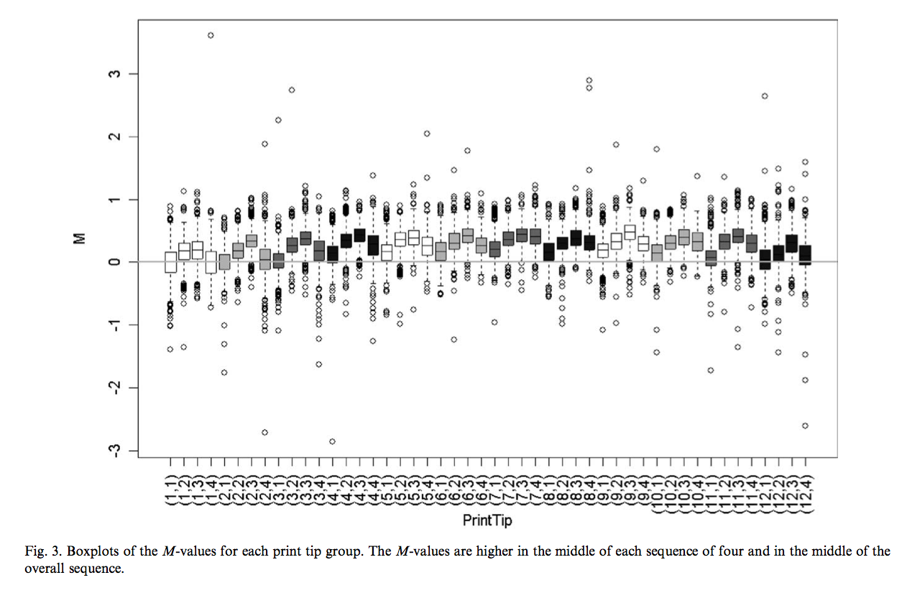
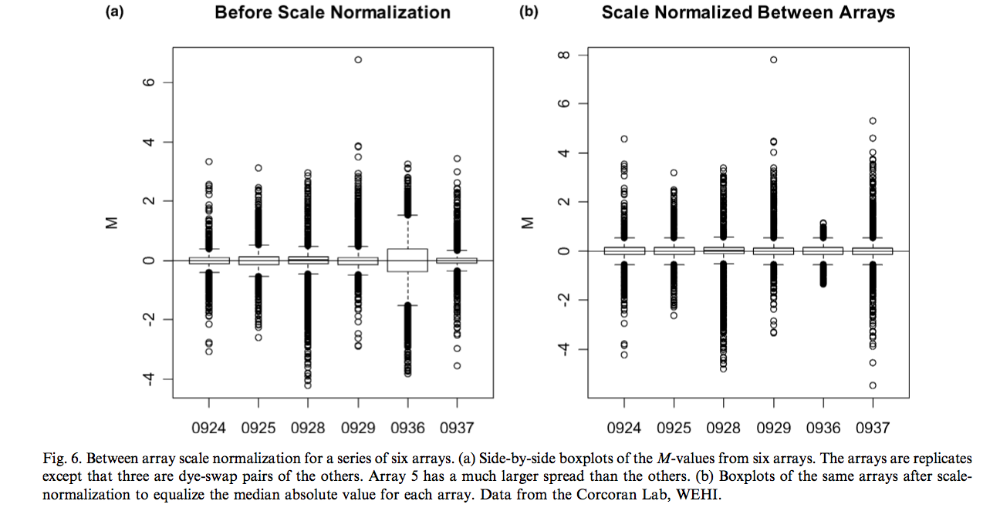
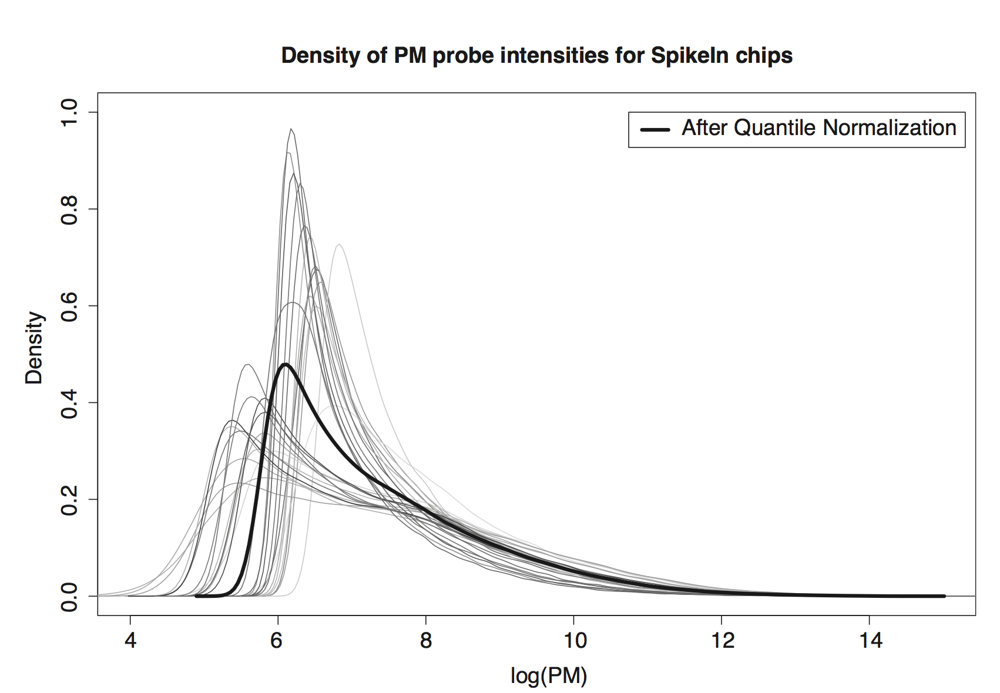
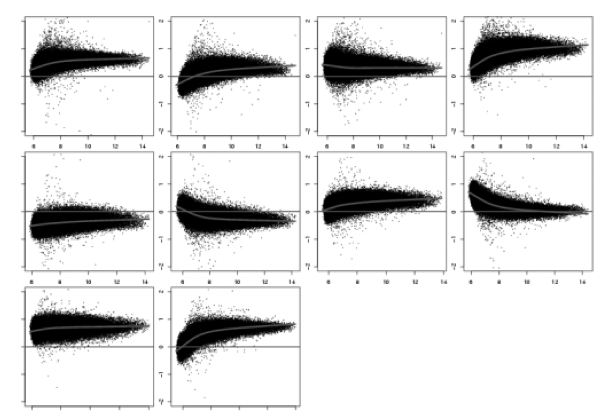
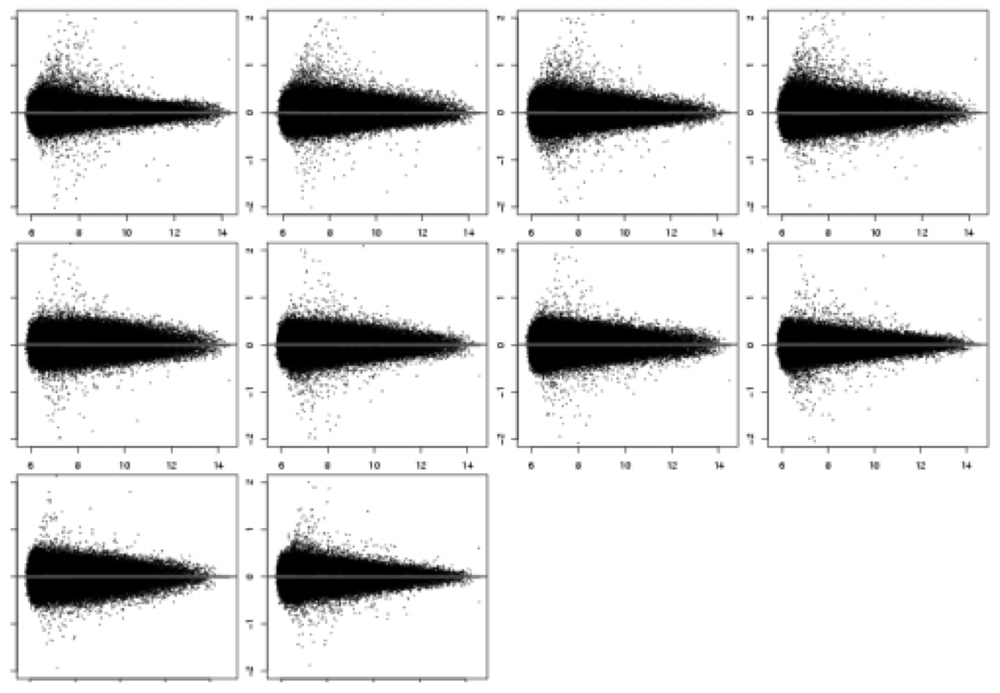

## Setting up some options

Let's first turn on the cache for increased performance and improved styling
```{r, cache=FALSE}
# Set some global knitr options
library("knitr")
opts_chunk$set(tidy=TRUE, tidy.opts=list(blank=FALSE, width.cutoff=60), cache=TRUE, messages=FALSE)
```

## What is normalization


- Normalization is needed to ensure that observed differences in intensities are indeed biological and not due to some technical artifact (e.g. array batch, technician, etc)
- Normalization is necessary before any analysis which involves  between slides comparisons of 
intensities (i.e. almost all analyses)
- Normalization techniques are different in spotted/two-color (cDNA) and high-density-oligonucleotides technologies

## cDNA microarray: An example

We have two colors (Red) and (Green)

$M=\log_2(R/G)$ (and $A=\log_2(R\cdot G)$)

Smyth, G. K., & Speed, T. (2003). Normalization of cDNA microarray data. Methods, 31(4), 265–273. doi:10.1016/s1046-2023(03)00155-5

## What is normalization



## Analysis of variance (ANOVA)

- Statistical procedure due to Fisher used to identify sources of variability from one or more potential sources ("treatments" or "factors").
- This is what we should do with microarray data

Kerr, M. K., Martin, M., & Churchill, G. A. (2000). Analysis of variance for gene expression microarray data. Journal of Computational Biology : a Journal of Computational Molecular Cell Biology, 7(6), 819–837. doi:10.1089/10665270050514954

## ANOVA - Design


## ANOVA - Design


## ANOVA - Model


- Are some effects confounded?
- Can we estimate all the effect?
- Need replicates

## ANOVA normalization

- Kerr and Chuchill use least squares to estimate the effects
- The VG effect is automatically normalized 
- Used bootstrap to compute error bars
- Nice statistical approach but do not account for non linear effect (MA plot)!

It's even worse than that!


## ANOVA normalization, enough?


- $M=\log_2(R/G)$ (and $A=\log_2(R\cdot G)$)
- Strong non-linear relationship

## Lowess Normalization


- Locally weighted scatterplot smoothing technique (Cleveland, 1979)
- Locally linear polynomial Robust to outliers
- Each smoothed value is computed using neighboring values in a given window (span)
- Span value $0< f <1$ (proportion of data to use)

**Lowess normalization normalizes the data as follows:**

$$M \leftarrow M - c(A)$$ where $c(A)$ is the estimated lowess fit.

This can be done for each print-tip, and the M values could even be scaled if necessary (again could be done by print-tip).

## Lowess + scale



**Note:** Lowess can also be applied to one color arrays (See Cyclic Lowess in R)

## Normalization of oligo-based arrays
 

**quantile-quantile plot (qqplot):**

- Used to determine if two samples comes from populations with the same distribution.
- Plot the quantiles from the first sample against the quantiles from the second.
- If straight line with slope 1 and intercept 0, the distributions are the same.

- The rationale of quantile normalization is to force the line to be y=x when comparing any two arrays.
- This can be extended to n dimensions n data vectors
- If distributions are the same, the points should align on the line passing through the origin and (1,1,....,1)

## Quantile normalization


Given $n$ arrays of length $p$, form $X$ of dimension $p \times n$ where each array is a column:

1. sort each column of $X$ to give $X_{sort}$
2. take the means across rows of $X_{sort}$ and assign this
mean to each element in the row to get $X'_{sort}$
3. get $X_{normalized}$ by rearranging each column of
$X'_{sort}$ to have the same order as the original $X$

Bolstad, B. M., Irizarry, R. A., Astrand, M., & Speed, T. P. (2003). A comparison of normalization methods for high density oligonucleotide array data based on variance and bias. Bioinformatics, 19(2), 185–193. doi:10.1093/bioinformatics/19.2.185

See http://en.wikipedia.org/wiki/Quantile_normalization for a quick illustration

## Quantile illustration



## MA plots before quantile normalization



## MA plots after quantile normalization




## Summary


- You should always normalize your data before any analysis unless you have a very good reason not to!
- In most cases, quantile normalization will do unless you're working with cDNA arrays
- Quantile normalization is readily available in R, part of standard pipelines for Affymetryx and Illumina data analyses


**Note that all these techniques assume that most genes are not changing accross conditions. This could be a problem in some context.**

## Rank invariant methods

Li, C., & Wong, W. H. (2001). Model-based analysis of oligonucleotide arrays: model validation, design issues and standard error application. Genome Biol.

- Find a set of genes, which is believed not to change
- Use these to find the non linear relationship in the MA plot
- How do we find such genes?
- Rank based methods.
- Look at the intensity ranks, if a gene is not differentially expressed its rank should be about the same in the different samples.

## Rank based lowess normalization


