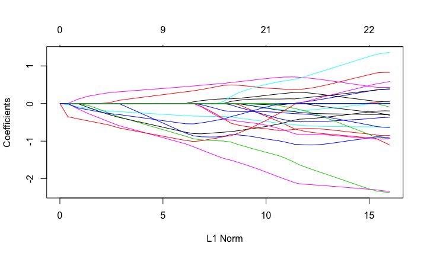
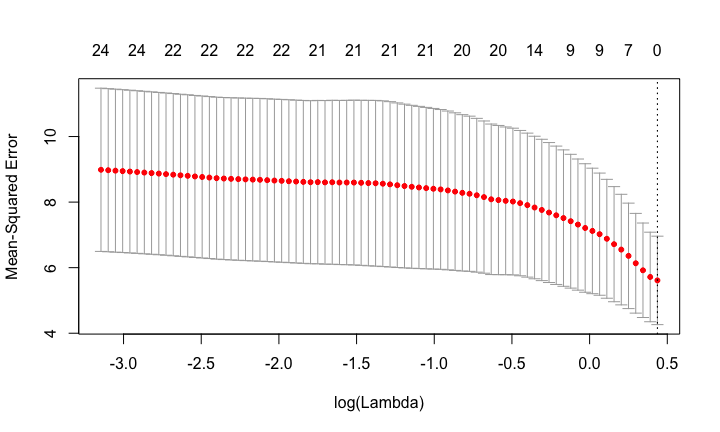
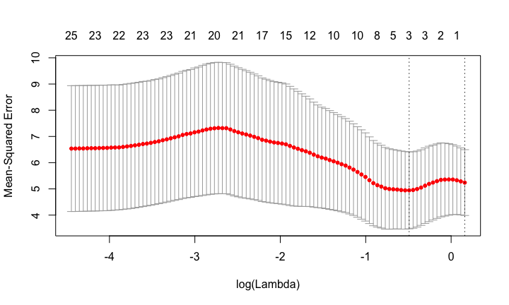

# Bioinformatics for Big Omics Data: Statistical prediction
Raphael Gottardo  
February 23, 2015  


## Setting up some options

Let's first turn on the cache for increased performance and improved styling

```r
# Set some global knitr options
library("knitr")
opts_chunk$set(tidy=TRUE, tidy.opts=list(blank=FALSE, width.cutoff=60), cache=TRUE, messages=FALSE)
```

and we need the following packages

```r
library(GEOquery)
```

```
## Loading required package: Biobase
## Loading required package: BiocGenerics
## Loading required package: parallel
## 
## Attaching package: 'BiocGenerics'
## 
## The following objects are masked from 'package:parallel':
## 
##     clusterApply, clusterApplyLB, clusterCall, clusterEvalQ,
##     clusterExport, clusterMap, parApply, parCapply, parLapply,
##     parLapplyLB, parRapply, parSapply, parSapplyLB
## 
## The following object is masked from 'package:stats':
## 
##     xtabs
## 
## The following objects are masked from 'package:base':
## 
##     anyDuplicated, append, as.data.frame, as.vector, cbind,
##     colnames, do.call, duplicated, eval, evalq, Filter, Find, get,
##     intersect, is.unsorted, lapply, Map, mapply, match, mget,
##     order, paste, pmax, pmax.int, pmin, pmin.int, Position, rank,
##     rbind, Reduce, rep.int, rownames, sapply, setdiff, sort,
##     table, tapply, union, unique, unlist
## 
## Welcome to Bioconductor
## 
##     Vignettes contain introductory material; view with
##     'browseVignettes()'. To cite Bioconductor, see
##     'citation("Biobase")', and for packages 'citation("pkgname")'.
## 
## Setting options('download.file.method.GEOquery'='auto')
```

```r
library(limma)
```

```
## 
## Attaching package: 'limma'
## 
## The following object is masked from 'package:BiocGenerics':
## 
##     plotMA
```

```r
library(data.table)
library(glmnet)
```

```
## Loading required package: Matrix
## Loaded glmnet 1.9-8
```

```r
library(ggplot2)
```

## Prediction

In statistics we are often interested in predicting an outcome variable based on a set of dependent variables. 

In our case, we might be interested in predicting antibody response at day 28 based on gene expression data at day 3 or day 7. 

As another example, Netflix has been very interested in predicting movie rankings for it's users: http://www2.research.att.com/~volinsky/netflix/bpc.html

## Statistical issues involved in prediction

In our case, we are often dealing with the traditional large $p$, small $n$ problem. We have few observations but many potential predictors. 

**What should we be worried about?**

## Statistical issues involved in prediction

In our case, we are often dealing with the traditional large $p$, small $n$ problem. We have few observations but many potential predictors. 

**What should we be worried about?**

- If we use a traditional (generalized) linear model, we won't have enough degrees of freedom to estimate all regression coefficients
- Using too many coefficients, we are likely to run into an overfitting problem

An approach that has been proposed to solve this problem is regularized or penalized regression. 

## Penalized regression

In a traditional `glm` framework, we assume the following model:

$$g(\mathbb{E}(\mathbf{Y}))=\mathbf{X}\boldsymbol{\beta}$$ 

where $g$ is the link function. Our goal is to estimate the vector $\boldsymbol{\beta}$ that leads to the best prediction of $\mathbf Y$. In traditional linear regression, this can be done via least-squares.

In regularized regression, we add a penalty term to force the coefficient to be well behaved even when the number of predictors is large. For example, in *ridge regression*, this is done by minimizing the following quantity:

$$ \|\mathbf{Y}-\mathbf{X}\boldsymbol{\beta}\|_2+ \lambda \|\boldsymbol{\beta}\|_2 $$ 

In L1-regression (aka Lasso), we minimize the following function:

$$ \|\mathbf{Y}-\mathbf{X}\boldsymbol{\beta}\|_2+ \lambda \|\boldsymbol{\beta}\|_1 $$ 

The Elastic net uses a convex combination of L1 and L2 norms. 

## L1 versus L2 regularization

Altough these two regularization strategies share a common goal, the L1 offers a significant advantage, it leads to a sparse solution where many of the estimated coefficients are exactly zero. 

In practice, this is very convenient as we are usually interested in selecting the most informative variables. In fact, we are often more interested in variable selection than actual prediction. 

## Estimation in the L1

For a fixed value of $\lambda$, estimation can be made very efficient using convex optimization. The problem is that we still need to estimate $\lambda$, as the value of $\lambda$ influence the final inference (i.e. the variables selected). A popular approach for selecting $\lambda$ is cross-validation where a small portion of the data is left out at the estimation stage and used for evaluating the selected model (i.e. error rate, deviance, etc). Then the $\lambda$ value that leads to the best performance is selected. 

However, this requires estimating our model for many different values of $\lambda$!
Fortunately, the folks at Stanford (Friedman, Hastie, Tibshirani, Efron, etc) have come up with cleaver algorithms to provide the full regularization path as the solution of the Lasso, ridge, and elastic net problems. 

## Penalized regression in R

Fortunately for us, the `glmnet` package provides everything that we need to perform statistical inference/prediction using penalized regression. 

We first need to install the package:

```r
install.packages("glmnet")
```

and load it

```r
library(glmnet)
```


## A quick example

Here we will use the `mtcars` data that is part of `R`. The data was extracted from the 1974 Motor Trend US magazine, and comprises fuel consumption and 10 aspects of automobile design and performance for 32 automobiles (1973–74 models).


```r
data(mtcars)
fit_cars <- glmnet(as.matrix(mtcars[, -1]), mtcars[, 1])
plot(fit_cars)
legend(0, 2.8, lty = 1, legend = colnames(mtcars[, -1]), col = 1:10, 
    cex = 1, bty = "n")
```

 

## Finding the optimal lambda by cross validation


```r
cv_cars <- cv.glmnet(as.matrix(mtcars[, -1]), mtcars[, 1])
cv_cars$lambda.min
```

```
## [1] 0.5028652
```

```r
plot(cv_cars)
```

 

## Finding the optimal lambda by cross validation

Now we can perform cross validation to find the optimal $\lambda$ value, as follows,

```r
fit_cars_min <- glmnet(as.matrix(mtcars[, -1]), mtcars[, 1], 
    lambda = cv_cars$lambda.min)
fit_cars_min$beta
```

```
## 10 x 1 sparse Matrix of class "dgCMatrix"
##               s0
## cyl  -0.85669974
## disp  .         
## hp   -0.01410393
## drat  0.07148815
## wt   -2.67594052
## qsec  .         
## vs    .         
## am    0.47858980
## gear  .         
## carb -0.10450258
```

```r
fit_cars_1se <- glmnet(as.matrix(mtcars[, -1]), mtcars[, 1], 
    lambda = cv_cars$lambda.1se)
fit_cars_1se$beta
```

```
## 10 x 1 sparse Matrix of class "dgCMatrix"
##               s0
## cyl  -0.84292355
## disp  .         
## hp   -0.00696688
## drat  .         
## wt   -2.36603761
## qsec  .         
## vs    .         
## am    .         
## gear  .         
## carb  .
```

## A systems biology example

Let's go back to our hai/gene expression dataset

```r
# Download the mapping information and processed data
gds <- getGEO("GSE29619", destdir = "Data/GEO/")
```

```
## ftp://ftp.ncbi.nlm.nih.gov/geo/series/GSE29nnn/GSE29619/matrix/
## Found 3 file(s)
## GSE29619-GPL13158_series_matrix.txt.gz
## Using locally cached version: Data/GEO//GSE29619-GPL13158_series_matrix.txt.gz
## Using locally cached version of GPL13158 found here:
## Data/GEO//GPL13158.soft 
## GSE29619-GPL3921_series_matrix.txt.gz
## Using locally cached version: Data/GEO//GSE29619-GPL3921_series_matrix.txt.gz
## Using locally cached version of GPL3921 found here:
## Data/GEO//GPL3921.soft 
## GSE29619-GPL570_series_matrix.txt.gz
## Using locally cached version: Data/GEO//GSE29619-GPL570_series_matrix.txt.gz
## Using locally cached version of GPL570 found here:
## Data/GEO//GPL570.soft
```

Our goal here will be to find genes at day 3 or 7 that predict antibody levels (as measured by hai) at day 28. 


```r
### Sanitize data and metadata
gds_new <- gds
sanitize_pdata <- function(pd) {
    keepCols <- c("characteristics_ch1.1", "characteristics_ch1.2", 
        "description", "supplementary_file")
    pd <- pd[, keepCols]
    colnames(pd) <- c("ptid", "time", "description", "filename")
    pd$ptid <- gsub(".*: ", "", pd$ptid)
    pd$time <- gsub(".*: ", "", pd$time)
    pd$time <- gsub("Day", "D", pd$time)
    pd$description <- gsub("(-\\w*){2}$", "", pd$description)
    pd$filename <- basename(as.character(pd$filename))
    pd$filename <- gsub(".CEL.gz", "", pd$filename)
    pd
}
pData(gds_new[[1]]) <- sanitize_pdata(pData(gds_new[[1]]))
pData(gds_new[[2]]) <- sanitize_pdata(pData(gds_new[[2]]))
pData(gds_new[[3]]) <- sanitize_pdata(pData(gds_new[[3]]))
```

## A systems biology example (suite)

Now we set up our data for the three cohorts. We will use the TIV08 cohort, for our exercise. 


```r
TIV_08 <- gds_new[[1]][, grepl("2008-TIV", pData(gds_new[[1]])$description)]
LAIV_08 <- gds_new[[1]][, grepl("2008-LAIV", pData(gds_new[[1]])$description)]
TIV_07 <- gds_new[[3]][, grepl("2007-TIV", pData(gds_new[[3]])$description)]
```

TIV_08, LAIV_08 and TIV_07 are expression sets containing data from three time points (variable name is "time", with values D0, D3 and D7), for several probes (i.e., of form GSMXXXX) and patients (variable name "ptid"). 

## A systems biology example (suite)

Now we work on the pData to extract the hai results.


```r
pd <- pData(gds[[1]][, grepl("2008-TIV", pData(gds[[1]])$description)])
hai_0 <- sapply(strsplit(as.character(pd$characteristics_ch1.6), 
    ": "), "[", 2)
hai_28 <- sapply(strsplit(as.character(pd$characteristics_ch1.7), 
    ":"), "[", 2)
hai_fold <- log2(as.double(hai_28)) - log2(as.double(hai_0))
pData(TIV_08)$hai_fold <- hai_fold
```

## A systems biology example (suite)

We are now ready to perform our prediction. First, for simplicity, I select the subjects that have data at all time points, as follows,


```r
# We first need to only keep subjets with complete data
dt_pd <- data.table(pData(TIV_08))
# Create a new variable to see if a subject has data at all
# three timepoints
dt_pd <- dt_pd[, `:=`(is_complete, (nrow(.SD) == 3)), by = "ptid"]
# Subset the ExpressionSet to remove subjects with missing
# data
TIV_08_small <- TIV_08[, pData(TIV_08)$ptid %in% dt_pd[is_complete == 
    TRUE, ptid]]
```
and then compute the log-fold changes values at day 7 to be used as the dependend variables,

```r
# Order by subjects
TIV_08_small <- TIV_08_small[, order(pData(TIV_08_small)$ptid)]
X <- exprs(TIV_08_small)
X_7_fold <- X[, pData(TIV_08_small)$time == "D7"] - X[, pData(TIV_08_small)$time == 
    "D0"]
hai_fold <- pData(TIV_08_small)$hai_fold[pData(TIV_08_small)$time == 
    "D0"]
```

## A systems biology example (suite)

We now compute the regularization path using `glmnet`,

```r
fit_hai <- glmnet(t(X_7_fold), hai_fold)
plot(fit_hai)
```

 


and perform cross-validation to select the best lambda value


```r
cv_hai <- cv.glmnet(t(X_7_fold), hai_fold)
```

```
## Warning: Option grouped=FALSE enforced in cv.glmnet, since < 3
## observations per fold
```

```r
cv_hai$lambda.min
```

```
## [1] 1.547288
```

```r
plot(cv_hai)
```

 


## A systems biology example (suite)

We now look at the number of selected variables for $\lambda_{min}$ and a fixed $\lambda$ value:

```r
fit_hai_min <- glmnet(t(X_7_fold), hai_fold, lambda = cv_hai$lambda.min)
sum(fit_hai_min$beta > 0)
```

```
## [1] 0
```

```r
fit_hai_min <- glmnet(t(X_7_fold), hai_fold, lambda = 0.1)
sum(fit_hai_min$beta != 0)
```

```
## [1] 24
```
and extract the corresponding gene symbols:

```r
fData(TIV_08_small)[fit_hai_min$beta@i, c("ID", "Gene Symbol")]
```

```
##                              ID                Gene Symbol
## 1553499_PM_s_at 1553499_PM_s_at                   SERPINA9
## 1554741_PM_s_at 1554741_PM_s_at FGF7 /// KGFLP1 /// KGFLP2
## 1560138_PM_at     1560138_PM_at                   KIAA0226
## 1568796_PM_at     1568796_PM_at                    CCDC157
## 202673_PM_at       202673_PM_at                       DPM1
## 204549_PM_at       204549_PM_at                      IKBKE
## 205065_PM_at       205065_PM_at                      ENPP1
## 205539_PM_at       205539_PM_at                       AVIL
## 211670_PM_x_at   211670_PM_x_at                       SSX3
## 212569_PM_at       212569_PM_at                     SMCHD1
## 212653_PM_s_at   212653_PM_s_at                      EHBP1
## 216942_PM_s_at   216942_PM_s_at                       CD58
## 218488_PM_at       218488_PM_at                     EIF2B3
## 220248_PM_x_at   220248_PM_x_at                     NSFL1C
## 223512_PM_at       223512_PM_at                      SAR1B
## 227687_PM_at       227687_PM_at                      HYLS1
## 227765_PM_at       227765_PM_at                           
## 229312_PM_s_at   229312_PM_s_at                      GKAP1
## 231451_PM_s_at   231451_PM_s_at                           
## 233722_PM_at       233722_PM_at                           
## 234252_PM_at       234252_PM_at                           
## 235596_PM_at       235596_PM_at                           
## 236115_PM_at       236115_PM_at                     HTR7P1
## 241792_PM_x_at   241792_PM_x_at
```


## A systems biology example (suite)

Sometimes it can be desirable to reduce the gene space by filtering the set of genes/probes to be considered. Here we do this by imposing a minimum fold change.


```r
# Filter based on log-fold change
ind <- abs(rowMeans(X_7_fold)) > log2(1.5)
X_7_fold_small <- X_7_fold[ind, ]
cv_hai <- cv.glmnet(t(X_7_fold_small), hai_fold)
```

```
## Warning: Option grouped=FALSE enforced in cv.glmnet, since < 3
## observations per fold
```

```r
cv_hai$lambda.min
```

```
## [1] 0.6116417
```

```r
plot(cv_hai)
```

 
and let's look at the selected genes/probes:

```r
fit_hai_min <- glmnet(t(X_7_fold_small), hai_fold, lambda = cv_hai$lambda.min)
fData(TIV_08_small)[rownames(X_7_fold_small)[fit_hai_min$beta@i], 
    c("ID", "Gene Symbol")]
```

```
##                            ID
## 211868_PM_x_at 211868_PM_x_at
## 230170_PM_at     230170_PM_at
## 241916_PM_at     241916_PM_at
##                                                                                                                                             Gene Symbol
## 211868_PM_x_at IGH@ /// IGHA1 /// IGHA2 /// IGHD /// IGHG1 /// IGHG2 /// IGHG3 /// IGHM /// IGHV4-31 /// LOC100126583 /// LOC100290320 /// LOC100291190
## 230170_PM_at                                                                                                                                        OSM
## 241916_PM_at
```

## A systems biology example (end)

We can now look at the correlation between two of our probes and our hai variable, as follows

```r
qplot(hai_fold, X_7_fold["211868_PM_x_at", ]) + geom_smooth(method = "lm")
```

 

## A systems biology example (end)


```r
qplot(hai_fold, X_7_fold["230170_PM_at", ]) + geom_smooth(method = "lm")
```

 


## Summary

Here we have looked at the `glmnet` package for predicting an outcome variable based on a set of dependent variables. Although there exist many other methods/packages for prediction in R, `glmnet` is a powerful framework that can perform variable section when building a prediction model. Note that there exist many other distributional options in the package that can be used to model both discrete/continuous data. 

**Exercise:** Now it's your turn to try using another cohort (e.g. LAIV), and perhaps using the binomial family after thresholding the `hai` variable. 

Finally, here we've used gene expression data to predict hai, but many other variables could also be included to predict antibody response, or more generally speaking, to predict an immune response to a stimuli (e.g. vaccination). Such integrated analysis of different data types are refered to as systems biology/immunology. 

