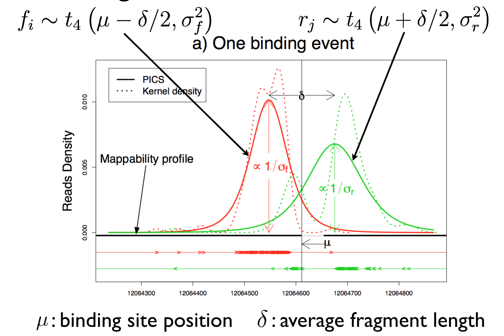
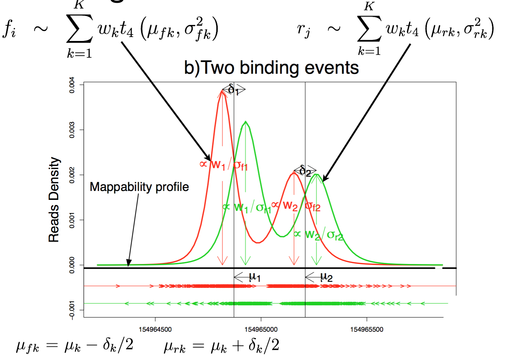
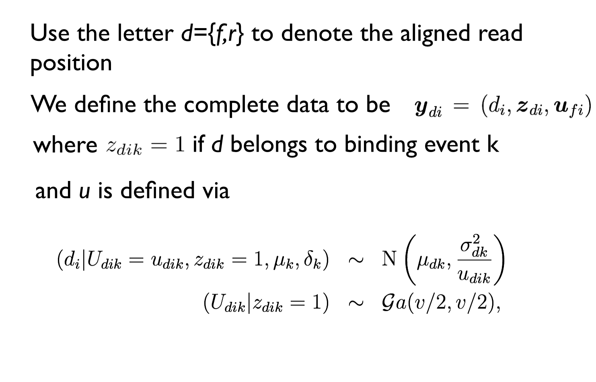
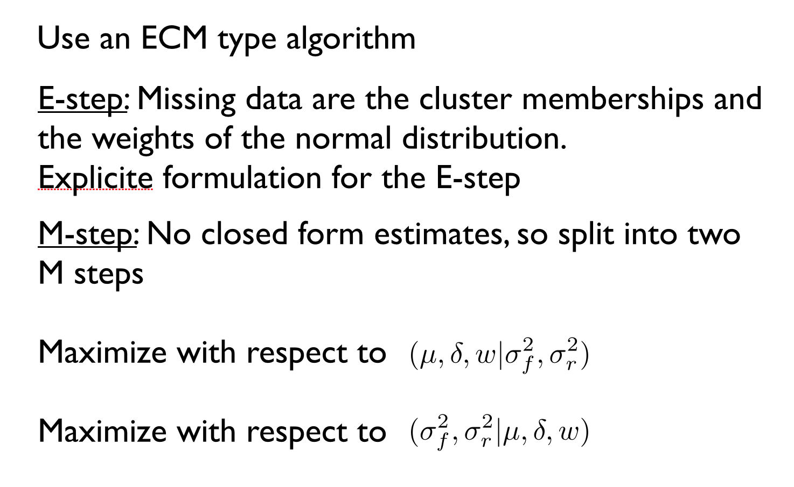
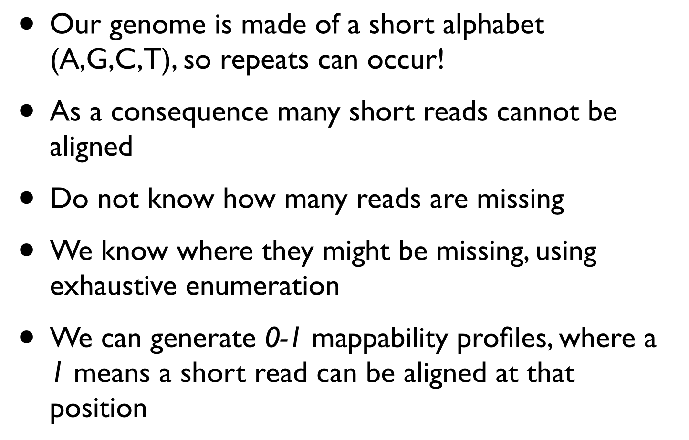
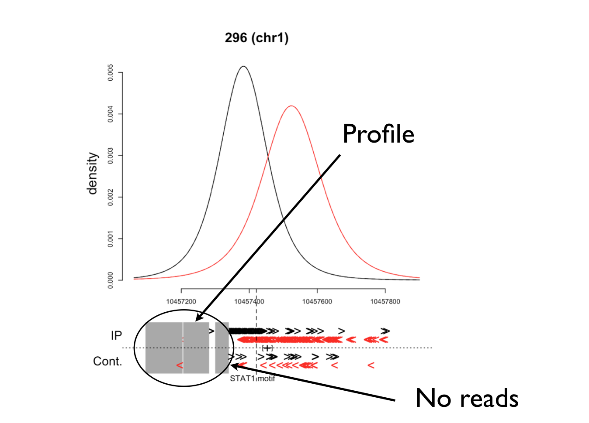
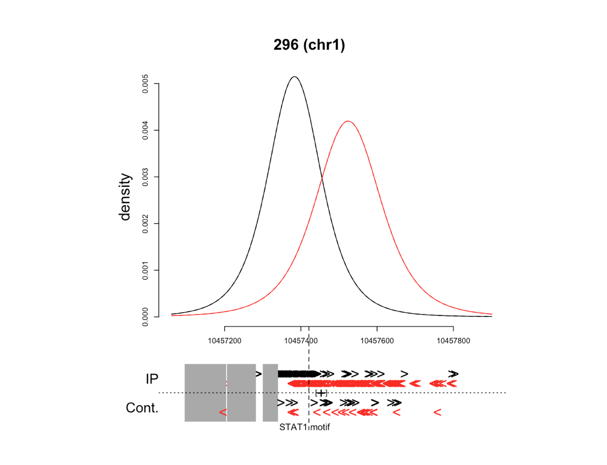
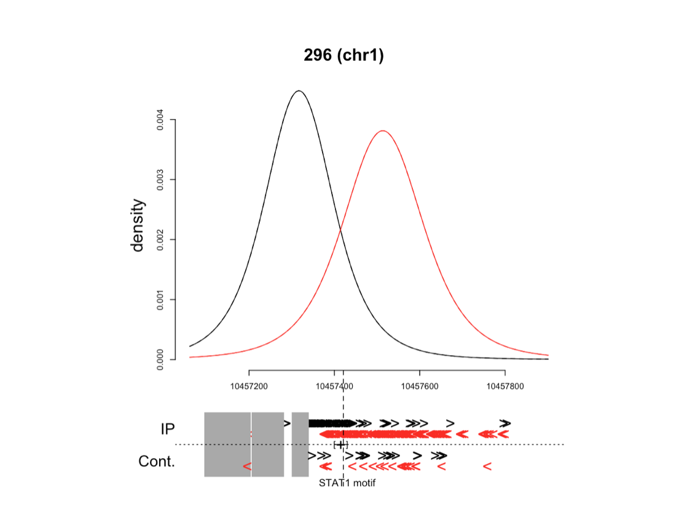

# Bioinformatics for Big Omics Data: ChIP-seq data analysis
Raphael Gottardo  
February 12, 2015  

## Setting up some options

Let's first turn on the cache for increased performance and improved styling

```r
# Set some global knitr options
library("knitr")
opts_chunk$set(tidy=TRUE, tidy.opts=list(blank=FALSE, width.cutoff=60), cache=TRUE, messages=FALSE)
```


## Outline

During this lecture, we will discuss another application of next generation sequencing to 
study DNA-binding proteins using a technique called chromatin immunoprecipitation. You should read the following papers:

1. Park, P. J. ChIP-seq: advantages and challenges of a maturing technology. Nature Reviews Genetics 10, 669–680 (2009). 
2. Zhang, X. et al. PICS: probabilistic inference for ChIP-seq. Biometrics 67, 151–163 (2011).
3. Zhang, Y. et al. Model-based analysis of ChIP-Seq (MACS). Genome Biol. 9, R137 (2008).

We will focus on the following topics:
- High throughput sequencing and ChIP-Seq
- Computational and statistical challenges

## Experimental protocol


Source: [Park Nat Rev Gen (2009)](http://www.nature.com/nrg/journal/v10/n10/full/nrg2641.html)

## ChIP-seq vs chip-chip

For a good comparison of chip-chip and chip-seq, have a look at [Park's paper](http://www.nature.com/nrg/journal/v10/n10/fig_tab/nrg2641_T1.html).

## Motivation for data analysis


Source: [Park Nat Rev Gen (2009)](http://www.nature.com/nrg/journal/v10/n10/fig_tab/nrg2641_F5.html)

Given the figure on the left, how would you analyze ChIP-seq data?

## ChIP-Seq summary

Couple ChIP with NGS: 

- A typical ChIP-Seq experiment generates millions of short reads
- Read lengths are in the order of 50-150bps, mostly single-end, but some paired-end
- Because of chromatin, antibodies and alignment biases, a control sample is still recommended
- Numerous types of controls: Input DNA, Mock IP, Naked DNA, etc. 

## Doing some analysis in R

There exist multiple packages for data analysis in R. Here we will explore one of the 
simpler packages available on Bioconductor. As usual, you first need to install the package


```r
library(BiocInstaller)
biocLite("chipseq")
```

and then load the package.

```r
library(chipseq)
```

```
## Loading required package: BiocGenerics
## Loading required package: parallel
## 
## Attaching package: 'BiocGenerics'
## 
## The following objects are masked from 'package:parallel':
## 
##     clusterApply, clusterApplyLB, clusterCall, clusterEvalQ,
##     clusterExport, clusterMap, parApply, parCapply, parLapply,
##     parLapplyLB, parRapply, parSapply, parSapplyLB
## 
## The following object is masked from 'package:stats':
## 
##     xtabs
## 
## The following objects are masked from 'package:base':
## 
##     anyDuplicated, append, as.data.frame, as.vector, cbind,
##     colnames, do.call, duplicated, eval, evalq, Filter, Find, get,
##     intersect, is.unsorted, lapply, Map, mapply, match, mget,
##     order, paste, pmax, pmax.int, pmin, pmin.int, Position, rank,
##     rbind, Reduce, rep.int, rownames, sapply, setdiff, sort,
##     table, tapply, union, unique, unlist
## 
## Loading required package: IRanges
## Loading required package: GenomicRanges
## Loading required package: GenomeInfoDb
## Loading required package: BSgenome
## Loading required package: Biostrings
## Loading required package: XVector
## Loading required package: ShortRead
## Loading required package: BiocParallel
## Loading required package: Rsamtools
## Loading required package: GenomicAlignments
```

## Getting stated with the chipseq package

The `chipseq` package contains a small dataset, `cstest`, that we will use here. 
The `cstest` dataset contains data for three chromosomes from Solexa lanes, one from a CTCF mouse ChIP-Seq, and one from a GFP mouse ChIP-Seq. The raw reads were already aligned to the mouse genome and read into R using `ShortReads`. The resulting data are stored in a `GRanges` object.


```r
data(cstest)
```

let's look what's inside


```r
cstest
```

```
## GRangesList of length 2:
## $ctcf 
## GRanges with 450096 ranges and 0 metadata columns:
##            seqnames                 ranges strand
##               <Rle>              <IRanges>  <Rle>
##        [1]    chr10     [3012936, 3012959]      +
##        [2]    chr10     [3012941, 3012964]      +
##        [3]    chr10     [3012944, 3012967]      +
##        [4]    chr10     [3012955, 3012978]      +
##        [5]    chr10     [3012963, 3012986]      +
##        ...      ...                    ...    ...
##   [450092]    chr12 [121239376, 121239399]      -
##   [450093]    chr12 [121245849, 121245872]      -
##   [450094]    chr12 [121245895, 121245918]      -
##   [450095]    chr12 [121246344, 121246367]      -
##   [450096]    chr12 [121253499, 121253522]      -
## 
## ...
## <1 more element>
## ---
## seqlengths:
##          chr1         chr2         chr3 ...  chrY_random chrUn_random
##     197195432    181748087    159599783 ...     58682461      5900358
```

## Extending reads

The first step is to reconstruct the orginal DNA fragments by extending the shortreads


```r
# Estimate the fragment length
fraglen <- estimate.mean.fraglen(cstest$ctcf)
fraglen
```

```
##    chr10    chr11    chr12 
## 179.6794 172.4884 181.6732
```


```r
table(width(cstest$ctcf))
```

```
## 
##     24 
## 450096
```


```r
# Now we can extend the fragments
ctcf.ext <- resize(cstest$ctcf, width = 180)
```

## Coverage

Next we calculate the coverage


```r
ctcf_cov <- coverage(ctcf.ext)
```


## Islands

The regions of interest are contiguous segments of non-zero coverage, also known as islands.


```r
ctcf_peaks <- slice(ctcf_cov, lower = 50)
```

## Islands

For each island, we can compute the number of reads in the island, and the maximum coverage depth within that island.


```r
viewSums(ctcf_peaks)
```

```
## IntegerList of length 35
## [["chr1"]] integer(0)
## [["chr2"]] integer(0)
## [["chr3"]] integer(0)
## [["chr4"]] integer(0)
## [["chr5"]] integer(0)
## [["chr6"]] integer(0)
## [["chr7"]] integer(0)
## [["chr8"]] integer(0)
## [["chr9"]] integer(0)
## [["chr10"]] 1425 2201 2317 1070 6753 3921 ... 6255 150 405 4282 100 2665
## ...
## <25 more elements>
```

```r
viewMaxs(ctcf_peaks)
```

```
## IntegerList of length 35
## [["chr1"]] integer(0)
## [["chr2"]] integer(0)
## [["chr3"]] integer(0)
## [["chr4"]] integer(0)
## [["chr5"]] integer(0)
## [["chr6"]] integer(0)
## [["chr7"]] integer(0)
## [["chr8"]] integer(0)
## [["chr9"]] integer(0)
## [["chr10"]] 52 53 53 52 66 55 58 50 50 65 50 51 54 50 54
## ...
## <25 more elements>
```

## Finding peaks


```r
ctcf_summary <- peakSummary(ctcf_peaks)
# Subset chr10
ctcf_summary_chr10 <- ctcf_summary["chr10"]
# Order by score (max)
ctcf_summary_chr10 <- ctcf_summary_chr10[order(-ctcf_summary_chr10$max), 
    ]
ctcf_summary_chr10
```

```
## RangedData with 15 rows and 3 value columns across 1 space
##       space                 ranges |       max    maxpos       sum
##    <factor>              <IRanges> | <integer> <integer> <integer>
## 1     chr10 [ 77875804,  77875916] |        66  77875869      6753
## 2     chr10 [ 80750623,  80750729] |        65  80750665      6255
## 3     chr10 [ 79627884,  79627977] |        58  79627932      5092
## 4     chr10 [ 79388188,  79388262] |        55  79388212      3921
## 5     chr10 [126356291, 126356372] |        54 126356304      4282
## 6     chr10 [126950000, 126950051] |        54 126950015      2665
## 7     chr10 [ 75295165,  75295207] |        53  75295177      2201
## 8     chr10 [ 76298606,  76298650] |        53  76298642      2317
## 9     chr10 [ 67476062,  67476089] |        52  67476067      1425
## 10    chr10 [ 77090435,  77090455] |        52  77090438      1070
## 11    chr10 [126356279, 126356286] |        51 126356282       405
## 12    chr10 [ 79627987,  79627987] |        50  79627987        50
## 13    chr10 [ 79909079,  79909083] |        50  79909081       250
## 14    chr10 [ 80989722,  80989724] |        50  80989723       150
## 15    chr10 [126356375, 126356376] |        50 126356375       100
```

## Validating peaks

After identifying peaks, it might be useful to see if the peaks contain the expected binding site for the transcription factor in question. We first need to download the Mmusculus genome sequence, to extract the relevant sequences.


```r
biocLite("BSgenome.Mmusculus.UCSC.mm10")
```


```r
library(BSgenome.Mmusculus.UCSC.mm10)
Mmusculus[["chr10"]]
```

```
##   130694993-letter "DNAString" instance
## seq: NNNNNNNNNNNNNNNNNNNNNNNNNNNNNNNNNN...NNNNNNNNNNNNNNNNNNNNNNNNNNNNNNNNN
```

```r
# Create views for our peaks
seq_views <- Views(Mmusculus[["chr10"]], start = ctcf_summary_chr10$maxpos - 
    100, end = ctcf_summary_chr10$maxpos + 100)
```

## Validating peaks

Let's then scan for our expected motif:


```r
# CTCF logo
CTCF_logo <- DNAString("GGCG")
# matchPWM
matchPattern(CTCF_logo, seq_views, max.mismatch = 0)
```

```
##   Views on a 130694993-letter DNAString subject
## subject: NNNNNNNNNNNNNNNNNNNNNNNNNNNNNNNN...NNNNNNNNNNNNNNNNNNNNNNNNNNNNNNN
## views:
##        start      end width
## [1] 76298637 76298640     4 [GGCG]
```

```r
matchPattern(rev(CTCF_logo), seq_views, max.mismatch = 0)
```

```
##   Views on a 130694993-letter DNAString subject
## subject: NNNNNNNNNNNNNNNNNNNNNNNNNNNNNNNN...NNNNNNNNNNNNNNNNNNNNNNNNNNNNNNN
## views:
##        start      end width
## [1] 76298638 76298641     4 [GCGG]
```

## Accounting for biases

- Biases in ChIP-seq experiment can arise due to technical or biological reasons. Such biases can significantly affect the ranking of the ChIP-seq peaks. Biases can happen because of non-specificity of the antibody, DNA accessibility (open chromatin), or even GC content

- As we have discussed earlier, one potential way to control for these sources of bias is to use a control

- Enrichment scores can be adjusted for non-specific binding by computing a relative score (fold change) between the IP and control samples

- By swapping the IP/Control samples, we can get an estimate of the number of false positives for a given threshold, and thus compute an estimate of the FDR

- This requires an analysis of the control sample

## Peak calling

- Here we've seen a fairly simple approach to ChIP-seq analysis. There exist many other (more elaborated) approaches:
     - MACS: Zhang, Y. et al. Model-based analysis of ChIP-Seq (MACS). Genome Biol. 9, R137 (2008).
     - PICS: Zhang, X. et al. PICS: probabilistic inference for ChIP-seq. Biometrics 67, 151–163 (2011).
     - cisGenomes: Ji, H. et al. An integrated software system for analyzing ChIP-chip and ChIP-seq data. Nature Biotechnology 26, 1293–1300 (2008).
     - etc, etc
     
Although these approaches use different statistical methods or models, they all follow the same basic idea. They mostly differ in the way they correct for background binding and their FDR calculation. 


## PICS - Our approach

- Probabilistic model
    - Model binding events
    - Use prior information (Fragment length distribution)
    - Measures of uncertainty
- Bidirectional reads
- Estimation of missing reads
- PICS: Probabilistic Inference of ChIP-Seq data

## PICS

- Divide the genomic reads into regions with “enough” F/R reads
- Scan the genome every 10 bps  with a sliding window of size 150 bps
- Minimum number of F reads on the left and R reads on the right
- Merge overlapping regions 
- N disjoint regions 
- Model each region separately

## PICS model



## PICS model



## PICS model (prior)


## PICS prior



## PICS prior



## PICS prior



## PICS prior



## Handling missing reads

- Use an idea similar to that of McLachlan and Jones (1998) for grouped and truncated data

- We introduce additional missing data, corresponding to the number of F/R missing reads, and the missing reads themselves

- Assume the number of missing reads follows a multinomial distribution over the possible intervals

- Closed formed E-steps, and the EM remains essentially the same

## PICS and missing reads



## PICS and missing reads



## ChIP, histones and nucleosome positioning

ChIP-seq can also be used to study histone marks and nucleosome positioning. See for example, the following papers:

- Zhang, X., Robertson, G., Woo, S., Hoffman, B. G. & Gottardo, R. Probabilistic inference for nucleosome positioning with MNase-based or sonicated short-read data. PLoS ONE 7, e32095 (2012).

- Woo, S., Zhang, X., Sauteraud, R., Robert, F. & Gottardo, R. PING 2.0: an R/Bioconductor package for nucleosome positioning using next-generation sequencing data. Bioinformatics 29, 2049–2050 (2013).
