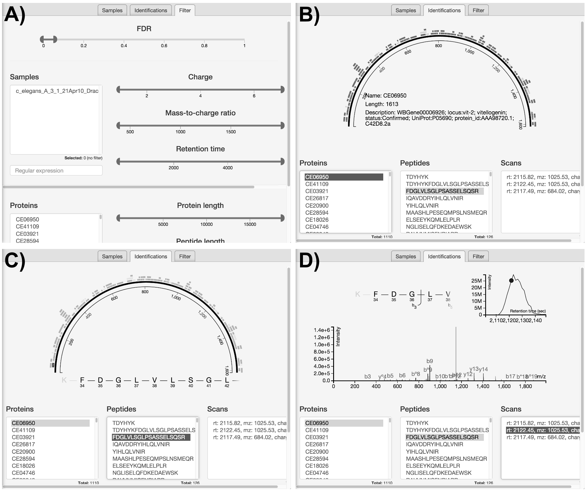

Last update: `r date()`

```{r style, echo = FALSE, results = 'asis', message=FALSE}
BiocStyle::markdown()
```

------------


# Introduction

This document provides the details to reproduce the data analysis
figures in the course
[slides](http://lgatto.github.io/Quantitative-Proteomics-and-Data-Analysis/slides.html).

To be able to execute the code below, you will need to have a working
R installation. I also recommend using the
[RStudio editor](https://www.rstudio.com/products/RStudio/). To
install the proteomics add-on packages required for this tutorial, you
will need to run the following code:

```{r install, eval=FALSE}
## try http:// if https:// URLs are not supported
source("https://bioconductor.org/biocLite.R")
biocLite("RforProteomics", dependencies = TRUE)
biocLite("AnnotationHub")
```

For a more thorough introduction to R for proteomics, please read the
`RforProteomics` vignette
([online](http://bioconductor.org/packages/release/data/experiment/vignettes/RforProteomics/inst/doc/RforProteomics.pdf)
or off-line with `vignette("RforProteomics")` after installing as
described above), the
[visualisation vignette](http://bioconductor.org/packages/release/data/experiment/vignettes/RforProteomics/inst/doc/RProtVis.html) and the corresonding papers [1, 2]

We first need to load the proteomics packages:

```{r env, message=FALSE}
library("MSnbase")
library("rpx")
library("mzR")
library("RforProteomics")
library("pRoloc")
library("pRolocdata")
library("msmsTests")
library("AnnotationHub")
library("lattice")
 require("gridExtra") 
```

# Getting example data

`r Biocpkg("AnnotationHub")` is a cloud resource set up and managed by
the Bioconductor project that programmatically disseminates omics
data. I am currently working on contributing 
[proteomics data](http://bioconductor.org/packages/devel/bioc/vignettes/ProteomicsAnnotationHubData/inst/doc/ProteomicsAnnotationHubData.html).


Below, we download a raw mass spectrometry dataset with identifier
`AH49008` and store it in a variable names `ms`.

```{r ah, message=FALSE}
ah <- AnnotationHub()
ms <- ah[["AH49008"]]
ms
```

```{r hd, echo=FALSE}
hd <- header(ms)
```

The data contains `r length(ms)` spectra - `r table(hd$msLevel)[[1]]`
MS1 spectra and `r table(hd$msLevel)[[2]]` MS2 spectra. The filename,
`r basename(fileName(ms))`, is not very descriptive because the data
originates from the `AnnotationHub` cloud repository. If the data was
read from a local file, is would be named as the `mzML` (or `mzXML`)
file. 

Later, we will use data that is distributed direclty with package and
access them using the `data` function. One can also use the 
`r Biocpkg("rpx")` package to access and download data from the
ProteomeXchange repository.

```{r, pxget, message=FALSE}
px1 <- PXDataset("PXD000001")
px1
mzf <- pxget(px1, 6)
mzf
```

Manual download:

```{r thermoprt}
f1 <- downloadData("http://proteome.sysbiol.cam.ac.uk/lgatto/files/Thermo-HELA-PRT/Thermo_Hela_PRTC_1.mzML")
f2 <- downloadData("http://proteome.sysbiol.cam.ac.uk/lgatto/files/Thermo-HELA-PRT/Thermo_Hela_PRTC_2.mzML")
f3 <- downloadData("http://proteome.sysbiol.cam.ac.uk/lgatto/files/Thermo-HELA-PRT/Thermo_Hela_PRTC_3.mzML")
f3
```

# Visualising raw data

A full chromatogam:

```{r chromato}
chromatogram(ms)
```

Multiple chromatograms:

```{r chromato3, cache=TRUE}
c1 <- chromatogram(f1)
c2 <- chromatogram(f2, plot = FALSE)
lines(c2, col = "steelblue", lty = "dashed")
c3 <- chromatogram(f3, plot = FALSE)
lines(c3, col = "orange", lty = "dotted")
```

An extracted ion chromatogram:

```{r xic, cache=TRUE}
par(mfrow = c(1, 2))
xic(ms, mz = 636.925, width = 0.01)
x <- xic(ms, mz = 636.925, width = 0.01, rtlim = c(2120, 2200))
```

Spectra:

```{r itraqdata}
data(itraqdata)
plot(itraqdata[[10]], reporters = iTRAQ4, full=TRUE)
```

```{r ms1}
plot(peaks(ms, 3071), type = "h",
     xlab = "M/Z", ylab = "Intensity",     
     sub = formatRt(hd[3071, "retentionTime"]))
```

Below, we use data downloaded from ProteomeXchange (see above) to
generate additional raw data visualisations. These examples are taken
from the `r Biocannopkg("RforProteomics")`
[visualisation vignette](http://bioconductor.org/packages/release/data/experiment/vignettes/RforProteomics/inst/doc/RProtVis.html). The
code, which is not displayed here, can also be seen in the
[source document](https://github.com/lgatto/Quantitative-Proteomics-and-Data-Analysis/blob/master/code.Rmd).

```{r pxd1, echo=FALSE}
ms <- openMSfile(mzf)

hd <- header(ms)
ms1 <- which(hd$msLevel == 1)

rtsel <- hd$retentionTime[ms1] / 60 > 30 & hd$retentionTime[ms1] / 60 < 35
```

```{r mslayout, echo=FALSE}
lout <- matrix(NA, ncol = 10, nrow = 8)
lout[1:2, ] <- 1
for (ii in 3:4)
    lout[ii, ] <- c(2, 2, 2, 2, 2, 2, 3, 3, 3, 3)
lout[5, ] <- rep(4:8, each = 2)
lout[6, ] <- rep(4:8, each = 2)
lout[7, ] <- rep(9:13, each = 2)
lout[8, ] <- rep(9:13, each = 2)

i <- ms1[which(rtsel)][1]
j <- ms1[which(rtsel)][2]
ms2 <- (i+1):(j-1)

layout(lout)

par(mar=c(4,2,1,1))
chromatogram(ms)
abline(v = hd[i, "retentionTime"], col = "red")


par(mar = c(3, 2, 1, 0))
plot(peaks(ms, i), type = "l", xlim = c(400, 1000))
legend("topright", bty = "n",
       legend = paste0(
           "Acquisition ", hd[i, "acquisitionNum"],  "\n",
           "Retention time ", formatRt(hd[i, "retentionTime"])))
abline(h = 0)
abline(v = hd[ms2, "precursorMZ"],
       col = c("#FF000080",
           rep("#12121280", 9)))

par(mar = c(3, 0.5, 1, 1))
plot(peaks(ms, i), type = "l", xlim = c(521, 522.5),
     yaxt = "n")
abline(h = 0)
abline(v = hd[ms2, "precursorMZ"], col = "#FF000080")

##par(mar = omar)
par(mar = c(2, 2, 0, 1))
for (ii in ms2) {
    p <- peaks(ms, ii)
    plot(p, xlab = "", ylab = "", type = "h", cex.axis = .6)
    legend("topright", legend = paste0("Prec M/Z\n",
                           round(hd[ii, "precursorMZ"], 2)),
           bty = "n", cex = .8)
}
```

```{r msmap1, message=FALSE, fig.width=15, echo=FALSE}
M <- MSmap(ms, ms1[rtsel], 521, 523, .005, hd)
ff <- colorRampPalette(c("yellow", "steelblue"))
trellis.par.set(regions=list(col=ff(100)))
m1 <- plot(M, aspect = 1, allTicks = FALSE)
M@map[msMap(M) == 0] <- NA
m2 <- plot3D(M, rgl = FALSE)
i <- ms1[which(rtsel)][1]
j <- ms1[which(rtsel)][2]
M2 <- MSmap(ms, i:j, 100, 1000, 1, hd)
m3 <- plot3D(M2)
grid.arrange(m1, m2, m3, ncol = 3)
```

# Identification data

```{r id1, message=FALSE, fig.width=15}
par(mfrow = c(1, 2))
itraqdata2 <- pickPeaks(itraqdata, verbose = FALSE)
i <- 14
s <- as.character(fData(itraqdata2)[i, "PeptideSequence"])
plot(itraqdata2[[i]], s, main = s)
plot(itraqdata2[[25]], itraqdata2[[28]], sequences = rep("IMIDLDGTENK", 2))
```

See also the `r Biocpkg("MSGFgui")` package.



# Quantitation data

**Data** Ratios or intenstities - do not let the software decide for
you!


> A set of protein LFQ data let’s say - two conditions, with 6
> replicates of each, and with a list of protein accession number and
> the LFQ data: This is a fabulous dataset for 

> S curves for means of both, with errors Matrix plot of all against
> all

log(Abundance) vs. protein index.

```{r msnset}
data(msnset)
pairs(exprs(msnset))
## pairs(exprs(msnset), log = "xy")
```

## MA plots


## Normalisation strategies

**Normalisation**: remove unwanted (technical) variation while
retaining biological variability.

```{r normbxplot, fig.width=20}
par(mfrow = c(1, 4))
data(dunkley2006)
boxplot(exprs(dunkley2006), main = "original")
boxplot(exprs(normalise(dunkley2006, method = "vsn")),
        main = "Variance stabilisation normalisation")
boxplot(exprs(normalise(dunkley2006, method = "center.median")),
        main = "Median")
boxplot(exprs(normalise(dunkley2006, method = "quantiles")),
        main = "Quantile")
```

## Heatmap plot

* **Replicates**: technical and biological
* **Variability**: technical vs biological


```{r heatmap}
data(msnset)
heatmap(exprs(msnset))
image(msnset)
```

## Hierarchical clustering (with or without heatmap)

```{r hclust}
data(dunkley2006)
heatmap(exprs(msnset))
hc <- hclust(dist(exprs(dunkley2006)))
plot(hc)
```

## PCA analysis and plots

```{r pca}
plot2D(dunkley2006)
addLegend(dunkley2006, where = "topleft")
```

## Abundance histograms

See normalisation above.

> From a simpler set (e.g. Dean’s kdeg/protein/abundance) data, plot a
> 2d plot with colour as a third scaling variable

```{r pcacex}
data(hyperLOPIT2015)
setStockcol(paste0(getStockcol(), 60))
plot2D(hyperLOPIT2015,
       fcol = "final.assignment",
       cex = exp(fData(hyperLOPIT2015)$svm.score) - 1)
```

## Statistical analyses

## Volcano plots

```{r volc, cache=TRUE}
data(msms.dataset)
e <- pp.msms.data(msms.dataset)
null.f <- "y~batch"
alt.f <- "y~treat+batch"
div <- apply(exprs(e), 2, sum)
res <- msms.glm.qlll(e, alt.f, null.f,div = div)
lst <- test.results(res, e, pData(e)$treat, "U600", "U200", div,
                    alpha = 0.05, minSpC = 2, minLFC = log2(1.8),
                    method = "BH")
res.volcanoplot(lst$tres, max.pval = 0.05,
                min.LFC = 1, maxx = 3, maxy = NULL,
                ylbls = 4)
```


# About this document

The source used to generate this document is available
[here](https://github.com/lgatto/Quantitative-Proteomics-and-Data-Analysis/blob/master/code.Rmd).

Software used:

```{r si, echo=FALSE}
options(max.print = 200)
print(sessionInfo(), locale=FALSE)
```
