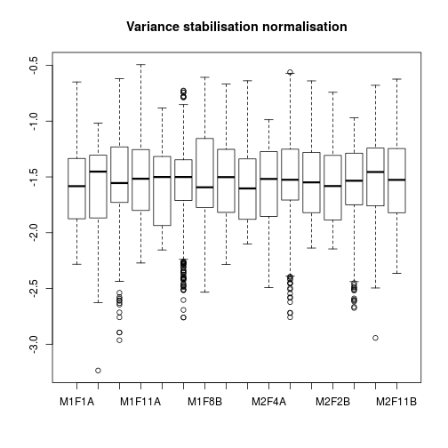
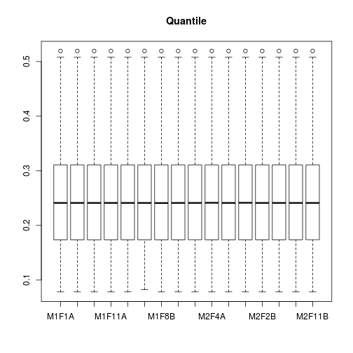

# Inspection, visualisation and analysis of quantitative proteomics data

<script type="text/javascript">
document.addEventListener("DOMContentLoaded", function() {
  document.querySelector("h1").className = "title";
});
</script>
<script type="text/javascript">
document.addEventListener("DOMContentLoaded", function() {
  var links = document.links;  
  for (var i = 0, linksLength = links.length; i < linksLength; i++)
    if (links[i].hostname != window.location.hostname)
      links[i].target = '_blank';
});
</script>
<style type="text/css" scoped>
body, td {
   font-family: sans-serif;
   background-color: white;
   font-size: 13px;
}

body {
  max-width: 800px;
  margin: 0 auto;
  padding: 1em 1em 2em;
  line-height: 20px;
}

/* Table of contents style */

div#TOC li {
    list-style:none;
    background-image:none;
    background-repeat:none;
    background-position:0;
}

/* element spacing */

p, pre { 
  margin: 0em 0em 1em;
}

/* center images and tables */
img, table {
  margin: 0em auto 1em;
}

p {
  text-align: justify;
}

tt, code, pre {
   font-family: 'DejaVu Sans Mono', 'Droid Sans Mono', 'Lucida Console', Consolas, Monaco, monospace;
}

h1, h2, h3, h4, h5, h6 { 
  font-family: Helvetica, Arial, sans-serif;
  margin: 1.2em 0em 0.6em 0em;
  font-weight: bold;
}

h1.title {
  font-size: 250%;
  font-weight: normal;
  color: #87b13f;
  line-height: 1.1em;
  margin-top: 0px;
  border-bottom: 0px;
}

h1 {
  font-size: 160%;
  font-weight: normal;
  line-height: 1.4em;
  border-bottom: 1px #1a81c2 solid;
}

h2 {
  font-size: 130%;  
}

h1, h2, h3 {
  color: #1a81c2;
}

h3, h4, h5, h6 {
  font-size:115%;
} /* not expecting to dive deeper than four levels on a single page */

/* links are simply blue, hovering slightly less blue */
a { color: #1a81c2; }
a:active { outline: none; }
a:visited { color: #1a81c2; }
a:hover { color: #4c94c2; }

pre, img {
  max-width: 100%;
  display: block;
}

pre {
  border: 0px none;
  background-color: #F8F8F8;
  white-space: pre;
  overflow-x: auto;
}

pre code {
  border: 1px #aaa dashed;
  background-color: white;
  display: block;
  padding: 1em;  
  color: #111;
  overflow-x: inherit;
}

/* markdown v1 */
pre code[class] {
  background-color: inherit;
}

/* markdown v2 */
pre[class] code {
  background-color: inherit;
}

/* formatting of inline code */
code { 
  background-color: transparent;
  color: #87b13f;
  font-size: 92%;
}

/* formatting of tables */

table, td, th {
  border: none;
  padding: 0 0.5em;
}

/* alternating row colors */
tbody tr:nth-child(odd) td {
  background-color: #F8F8F8;
}

blockquote {
   color:#666666;
   margin:0;
   padding-left: 1em;
   border-left: 0.5em #EEE solid;
}

hr {
   height: 0px;
   border-bottom: none;
   border-top-width: thin;
   border-top-style: dotted;
   border-top-color: #999999;
}

span.header-section-number {
  padding-right: 1em;
}

span.toc-section-number::after {
    content: "  ";
    white-space: pre;
}

@media print {
   * {
      background: transparent !important;
      color: black !important;
      filter:none !important;
      -ms-filter: none !important;
   }

   body {
      font-size:12pt;
      max-width:100%;
   }

   a, a:visited {
      text-decoration: underline;
   }

   hr {
      visibility: hidden;
      page-break-before: always;
   }

   pre, blockquote {
      padding-right: 1em;
      page-break-inside: avoid;
   }

   tr, img {
      page-break-inside: avoid;
   }

   img {
      max-width: 100% !important;
   }

   @page :left {
      margin: 15mm 20mm 15mm 10mm;
   }

   @page :right {
      margin: 15mm 10mm 15mm 20mm;
   }

   p, h2, h3 {
      orphans: 3; widows: 3;
   }

   h2, h3 {
      page-break-after: avoid;
   }
}
</style>

## Introduction

This document provides the details to reproduce the data analysis
figures in the course
[slides](http://lgatto.github.io/Quantitative-Proteomics-and-Data-Analysis/slides.html).

To be able to execute the code below, you will need to have a working
R installation. I also recommend using the
[RStudio editor](https://www.rstudio.com/products/RStudio/). To
install the proteomics add-on packages required for this tutorial, you
will need to run the following code:


```r
## try http:// if https:// URLs are not supported
source("https://bioconductor.org/biocLite.R")
biocLite("RforProteomics", dependencies = TRUE)
biocLite("AnnotationHub")
```

For a more thorough introduction to R for proteomics, please read the
`RforProteomics` vignette
([online](http://bioconductor.org/packages/release/data/experiment/vignettes/RforProteomics/inst/doc/RforProteomics.pdf)
or off-line with `vignette("RforProteomics")` after installing as
described above). 

We first need to load the proteomics packages:


```r
library("MSnbase")
library("mzR")
library("RforProteomics")
library("pRoloc")
library("pRolocdata")
library("msmsTests")
library("AnnotationHub")
```

## Getting example data

*[AnnotationHub](http://bioconductor.org/packages/AnnotationHub)* is a cloud resource set up and managed by
the Bioconductor project that programmatically disseminates omics
data. I am working on contributing
[proteomics data](http://bioconductor.org/packages/devel/bioc/vignettes/ProteomicsAnnotationHubData/inst/doc/ProteomicsAnnotationHubData.html).


```r
ah <- AnnotationHub()
```

```
## snapshotDate(): 2016-03-09
```

```r
ms <- ah[["AH49008"]]
```

```
## loading from cache '/home/lg390/.AnnotationHub/55314'
```

```r
ms
```

```
## Mass Spectrometry file handle.
## Filename:  55314 
## Number of scans:  7534
```

> A simple series of BPI chromatograms, usually shown as a bitmap -
> why not plot them from exported data?


```r
x <- xic(ms, mz = 636.925, width = 0.01)
```


```r
head(x)
```

```
##         int       rt       mz
## 1  796.5198  39.2427 636.9306
## 2  921.9240  98.0124 636.9213
## 3  794.2058  99.7524 636.9245
## 4  895.2659 101.5224 636.9215
## 5 1013.8354 102.4024 636.9245
## 6 1402.6438 103.2824 636.9244
```

> A series of panels that show the MS spectrum of a a SILAC
> heavy/light pair, in a nice diagram

(iTRAQ, don't have a SILAC data at hand for now)


```r
data(itraqdata)
plot(itraqdata[[10]], reporters = iTRAQ4, full=TRUE)
```


> A set of protein LFQ data let’s say - two conditions, with 6
> replicates of each, and with a list of protein accession number and
> the LFQ data: This is a fabulous dataset for 

> S curves for means of both, with errors Matrix plot of all against
> all

log(Abundance) vs. protein index.


```r
data(msnset)
pairs(exprs(msnset))
```


> Normalisation strategies


```r
data(dunkley2006)
boxplot(exprs(dunkley2006))
```


```r
boxplot(exprs(normalise(dunkley2006, method = "vsn")),
        main = "Variance stabilisation normalisation")
```

```
## vsn2: 689 x 16 matrix (1 stratum). Please use 'meanSdPlot' to verify the fit.
```



```r
boxplot(exprs(normalise(dunkley2006, method = "center.median")),
        main = "Median")
```


```r
boxplot(exprs(normalise(dunkley2006, method = "quantiles")),
        main = "Quantile")
```



> Heatmap plot


```r
data(msnset)
heatmap(exprs(msnset))
```


```r
image(msnset)
```


> Hierarchical clustering (with or without heatmap)


```r
data(dunkley2006)
heatmap(exprs(msnset))
```


```r
hc <- hclust(dist(exprs(dunkley2006)))
plot(hc)
```


> Volcano plots


```r
data(msms.dataset)
e <- pp.msms.data(msms.dataset)
null.f <- "y~batch"
alt.f <- "y~treat+batch"
div <- apply(exprs(e), 2, sum)
res <- msms.glm.qlll(e, alt.f, null.f,div = div)
lst <- test.results(res, e, pData(e)$treat, "U600", "U200", div,
                    alpha = 0.05, minSpC = 2, minLFC = log2(1.8),
                    method = "BH")
res.volcanoplot(lst$tres, max.pval = 0.05,
                min.LFC = 1, maxx = 3, maxy = NULL,
                ylbls = 4)
```


> PCA analysis and plots


```r
plot2D(dunkley2006)
```

```
## Error in plot.xy(xy.coords(x, y), type = type, ...): invalid RGB specification
```


```r
addLegend(dunkley2006, where = "topleft")
```

```
## Error in plot.xy(xy.coords(x, y), type = type, ...): invalid RGB specification
```

> Abundance histograms

See normalisation above.

> From a simpler set (e.g. Dean’s kdeg/protein/abundance) data, plot a
> 2d plot with colour as a third scaling variable


```r
data(hyperLOPIT2015)
setStockcol(paste0(getStockcol(), 60))
plot2D(hyperLOPIT2015,
       fcol = "final.assignment",
       cex = exp(fData(hyperLOPIT2015)$svm.score) - 1)
```

```
## Error in plot.xy(xy.coords(x, y), type = type, ...): invalid RGB specification
```


