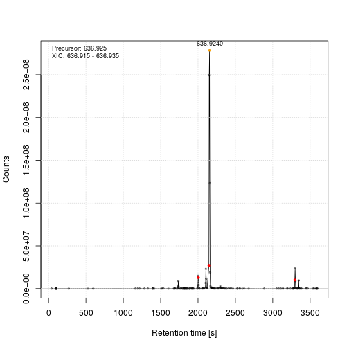
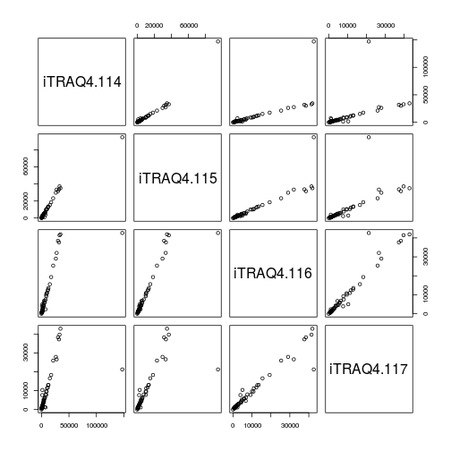
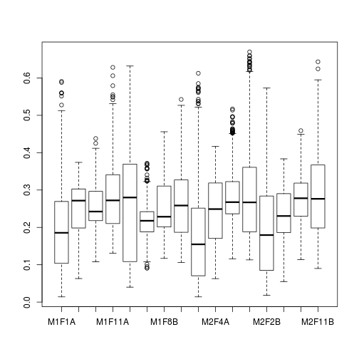
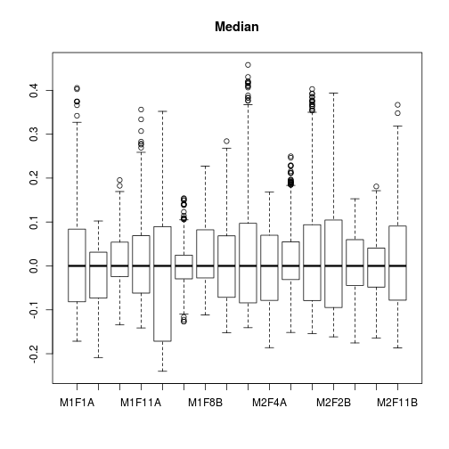
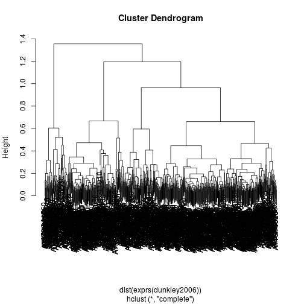

```r
library("MSnbase")
library("mzR")
library("RforProteomics")
library("pRoloc")
library("pRolocdata")
library("msmsTests")
library("AnnotationHub")
```

Getting data form `AnnotationHub`:


```r
ah <- AnnotationHub()
```

```
## snapshotDate(): 2016-03-09
```

```r
ms <- ah[["AH49008"]]
```

```
## loading from cache '/home/lg390/.AnnotationHub/55314'
```

```r
ms
```

```
## Mass Spectrometry file handle.
## Filename:  55314 
## Number of scans:  7534
```

> A simple series of BPI chromatograms, usually shown as a bitmap -
> why not plot them from exported data?


```r
x <- xic(ms, mz = 636.925, width = 0.01)
```



```r
head(x)
```

```
##         int       rt       mz
## 1  796.5198  39.2427 636.9306
## 2  921.9240  98.0124 636.9213
## 3  794.2058  99.7524 636.9245
## 4  895.2659 101.5224 636.9215
## 5 1013.8354 102.4024 636.9245
## 6 1402.6438 103.2824 636.9244
```

> A series of panels that show the MS spectrum of a a SILAC
> heavy/light pair, in a nice diagram

(iTRAQ, don't have a SILAC data at hand for now)


```r
data(itraqdata)
plot(itraqdata[[10]], reporters = iTRAQ4, full=TRUE)
```


> A set of protein LFQ data let’s say - two conditions, with 6
> replicates of each, and with a list of protein accession number and
> the LFQ data: This is a fabulous dataset for 

> S curves for means of both, with errors Matrix plot of all against
> all

S curve?


```r
data(msnset)
pairs(exprs(msnset))
```



> Normalisation strategies


```r
data(dunkley2006)
boxplot(exprs(dunkley2006))
```



```r
boxplot(exprs(normalise(dunkley2006, method = "vsn")),
        main = "Variance stabilisation normalisation")
```


```r
boxplot(exprs(normalise(dunkley2006, method = "center.median")),
        main = "Median")
```



```r
boxplot(exprs(normalise(dunkley2006, method = "quantiles")),
        main = "Quantile")
```


> Heatmap plot


```r
data(msnset)
heatmap(exprs(msnset))
```


```r
image(msnset)
```


> Hierarchical clustering (with or without heatmap)


```r
data(dunkley2006)
heatmap(exprs(msnset))
```


```r
hc <- hclust(dist(exprs(dunkley2006)))
plot(hc)
```



> Volcano plots


```r
data(msms.dataset)
e <- pp.msms.data(msms.dataset)
null.f <- "y~batch"
alt.f <- "y~treat+batch"
div <- apply(exprs(e), 2, sum)
res <- msms.glm.qlll(e, alt.f, null.f,div = div)
lst <- test.results(res, e, pData(e)$treat, "U600", "U200", div,
                    alpha = 0.05, minSpC = 2, minLFC = log2(1.8),
                    method = "BH")
res.volcanoplot(lst$tres, max.pval = 0.05,
                min.LFC = 1, maxx = 3, maxy = NULL,
                ylbls = 4)
```


> PCA analysis and plots


```r
plot2D(dunkley2006)
addLegend(dunkley2006, where = "topleft")
```


> Abundance histograms

See normalisation above.

> From a simpler set (e.g. Dean’s kdeg/protein/abundance) data, plot a
> 2d plot with colour as a third scaling variable


```r
data(hyperLOPIT2015)
setStockcol(paste0(getStockcol(), 60))
plot2D(hyperLOPIT2015,
       fcol = "final.assignment",
       cex = exp(fData(hyperLOPIT2015)$svm.score) - 1)
```


