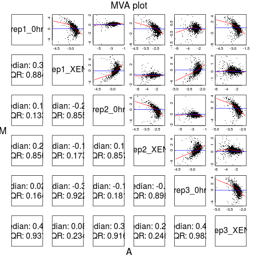

# Identifying differentially expressed proteins


```
## Warning in read.dcf(con): unable to resolve 'bioconductor.org'
```

## Running a `t-test` in R

Usig the `t.test` function:

```
t.test(x, y = NULL,
       alternative = c("two.sided", "less", "greater"),
       mu = 0, paired = FALSE, var.equal = FALSE,
       conf.level = 0.95, ...)
```

We will focus on two sample unpaires t-test, assuming unequal
variances, as this is the most common scenario in proteomics. Using a
**paired test** when appropriate is essential, as it will
substantially increase your test power.

We are going to use the `rnorm` function in this an the next section
to quickly genreate normally distributed data. Its inputs are 

- `n`: the number of data points to be generated;
- `mean`: the mean of the normal distribution to draw the data from
  (default is 0);
- `sd`: the standard deviation of the normal distribution to draw the
  data from (default is 1).

### Exercise 

* Generate 200 numbers drawn from a normal distribution of mean 0 and
  standard deviation 1. Verify that the parameters of the randomly
  data are correct. What figure would you use to visualise such data?
  
* Same as above for a normal distribution of mean 2 and standard
  deviation 0.5.

* Do you get the same values as your neighbour?

Let's now apply a t-test on two sets of values drawn from identical
and different distributions:


```r
t1 <- t.test(rnorm(5), rnorm(5))
t1
```

```
## 
## 	Welch Two Sample t-test
## 
## data:  rnorm(5) and rnorm(5)
## t = 0.034702, df = 5.0479, p-value = 0.9736
## alternative hypothesis: true difference in means is not equal to 0
## 95 percent confidence interval:
##  -1.152196  1.183822
## sample estimates:
##  mean of x  mean of y 
## -0.1049816 -0.1207944
```


```r
t2 <- t.test(rnorm(5), rnorm(5, mean = 4))
t2
```

```
## 
## 	Welch Two Sample t-test
## 
## data:  rnorm(5) and rnorm(5, mean = 4)
## t = -13.013, df = 7.9975, p-value = 1.157e-06
## alternative hypothesis: true difference in means is not equal to 0
## 95 percent confidence interval:
##  -6.638948 -4.640045
## sample estimates:
## mean of x mean of y 
## -1.102658  4.536839
```

What we see above is a pretty output that is convenient to visualise
interactively. The output of the `t.test` is an object of class 
htest, which contains statistic, parameter, p.value, conf.int, estimate, null.value, alternative, method, data.name 
values.

We can extract any of these with the `$` accessor


```r
t2$p.value
```

```
## [1] 1.157064e-06
```


### Exercise

Let's use the `mulvey2015` dataset, introduced previously, and focus
on time points 1 and 6. 

1. How can we conveniently use the sample metadata to create the
   relevant subset?


2. Use the `t.test` function to test P48432 for differences in
   timepoints 1 and 6.


In high throughput biology, we have to repeat our tests over every
feature (transcript, protein, ...). As we are using a programming
language, this is something easy to do.

Below, we use the apply function, that will iterate a function over
all elements of its input.


```r
time1 <- time16$time == 1
time6 <- time16$time != 1
## first attempt
pv <- apply(exprs(time16), 1,
            function(x) t.test(x[time1], x[time6]))

## second attempt
pv <- apply(exprs(time16), 1,
            function(x) t.test(x[time1], x[time6])$p.value)
```

We now have calculated a p-value for each of the 2337
proteins in the data; let's add them to the feature metadata slot.


```r
fData(time16)$p.value <-
                apply(exprs(time16), 1,
                      function(x) t.test(x[time1], x[time6])$p.value)
```


```r
fData(time16)$fc <-
                apply(exprs(time16), 1,
                      function(x) mean(x[time1])/mean(x[time6]))
fData(time16)$lfc <- log2(fData(time16)$fc)
```

## Visualising results

There are 3 important factors to consider when assessing the results
of a test for differential expression:

* The significance of the test, i.e. the p-values
* The magnitude of the change, i.e. the fold-change
* The (average) intensity of the measurements


```r
MAplot(time16)
```


```r
plot(fData(time16)$lfc, -log10(fData(time16)$p.value))
```



## Multiple testing

See [this section](../multtest/README.md)

## Moderated t-tests: `limma`

## Count data


## Other packages

* *[MSstats](http://bioconductor.org/packages/MSstats)* for various statistical analyses
* Isobaric tagging (iTRAQ and TMT): *[isobar](http://bioconductor.org/packages/isobar)*
* Label-free: *[aLFQ](http://cran.fhcrc.org/web/packages/aLFQ/index.html)* and *[protiq](http://cran.fhcrc.org/web/packages/protiq/index.html)*

