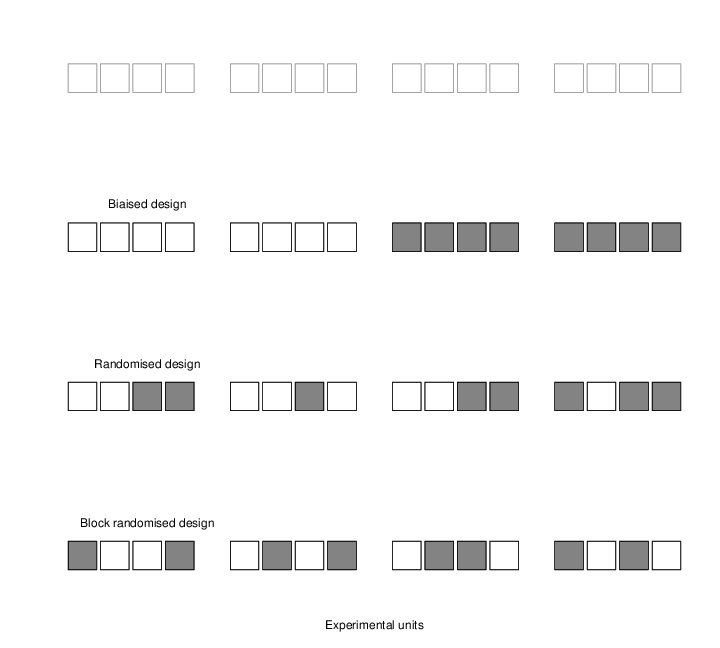

# Experimental design

> To consult the statistician after an experiment is finished is often
> merely to ask him to conduct a post mortem examination. He can
> perhaps say what the experiment died of. – Ronald Fisher

BUT

> Designing effective experiments need thinking about biology more
> than it does mathematical (statistical) calculations. (1)

The first quote highlights the fact that

> **Myth**: It does not matter how you collect data, there will always be
> a statistical ‘fix’ that will allow to analyse it. (1)

## Variability

- biological replicates, indicative of the **biological variability**
- technical replicates, indicative of the **technical variability**

In general, biological >> technical variability (otherwise, our assays
would be meaningless). What we observe/measure is the combination of
technical and biological variability.

## Replications

We can only assess an effect if we consider the variability in our
experiment. How much change is there?

We can only observe variation if we repeat our measurement: repeat
manipulation are take new measurement. Typically on different sample,
because we are interested in biological variation.

## Batch effects

We also record

- other technical factors such as operator (if multiple), processing
  date/time (a well know variable confounding factor)
- another other variables related to the samples: gender, age,
  cultivar, phenotype, genotype, ...

Leek *et al.* Tackling the widespread and critical impact of batch
effects in high-throughput data. Nat Rev Genet. 2010

> One often overlooked complication with such studies is batch
> effects, which occur because measurements are affected by laboratory
> conditions, reagent lots and personnel differences. This becomes a
> major problem when batch effects are correlated with an outcome of
> interest and lead to incorrect conclusions. Using both published
> studies and our own analyses, we argue that batch effects (as well
> as other technical and biological artefacts) are widespread and
> critical to address.

**Co-founding batch effect**: any observed differences between the
groups or interest could be due to technical variability between 2
data acquisitions/operators.

We could assign samples to runs/operators at random
(**randomisation**).

## Blocks/batches

We aim to perform experiments within a homogeneous group of
experimental units. These homogeneous groups, referred to as blocks,
help to reduce the variability between the units and increase the
meaning of differences between conditions (as well as the power of
statistics to detect them). (2)

- If possible, measure as many (all) experimental conditions at the same time

- Minimise risks of day-to-day variability between the measurements

## Randomisation revised

Even after blocking, other factors, such as age, generic background,
sex differences, etc. can influence the experimental outcome.

**Randomise within blocks**, to reduce confounding effects by
equalising variables that influence experimental units and that have
not been accounted for in the experimental design.

### References

(1) Ruxton GD, Colegrave N (2010) Experimental Design for the Life
Sciences, 3rd edn. Oxford: Oxford University Press.

(2) Klaus B. Statistical relevance-relevant statistics, part I. EMBO
J. 2015 Nov 12;34(22):2727-30.
