# Data visualization with ggplot2

We will need


```r
library("dplyr")
library("readr")
library("ggplot2")
library("hexbin")
```

## Introduction

(Based on slides by Wolfgang Huber)

### Base graphics

Uses a *canvas model* a series of instructions that sequentially fill
the plotting canvas. While this model is very useful to build plots
bits by bits bottom up, which is useful in some cases, it has some
clear drawback:

* Layout choices have to be made without global overview over what may
  still be coming.
* Different functions for different plot types with different
  interfaces.
* No standard data input.
* Many routine tasks require a lot of boilerplate code.
* No concept of facets/lattices/viewports.
* Poor default colours.

### The grammar of graphics

The components of `ggplot2`'s of graphics are

1. A **tidy** dataset
2. A choice of geometric objects that servers as the visual
   representation of the data - for instance, points, lines,
   rectangles, contours.
3. A description of how the variables in the data are mapped to visual
   properties (aesthetics) or the geometric objects, and an associated
   scale (e.g. linear, logarithmic, rang)
4. A statistical summarisation rule
5. A coordinate system.
6. A facet specification, i.e. the use of several plots to look at the
   same data.

## Plotting with `ggplot2`

Credit: This material is based on the Data Carpentry
[*R for data analysis and visualization of Ecological Data* material](http://www.datacarpentry.org/R-ecology-lesson/index.html)

We are going to use a complete version of the surveys data:


```r
surveys <- read_csv("https://ndownloader.figshare.com/files/2292169")
surveys_complete <- surveys %>%
  filter(species_id != "",         # remove missing species_id
         !is.na(weight),           # remove missing weight
         !is.na(hindfoot_length),  # remove missing hindfoot_length
         sex != "")                # remove missing sex
```

To build a ggplot we need to:

- bind the plot to a specific data frame using the `data` argument


```r
ggplot(data = surveys_complete)
```

- define aesthetics (`aes`), by selecting the variables to be plotted and the variables to define the presentation
     such as plotting size, shape color, etc.,


```r
ggplot(data = surveys_complete, aes(x = weight, y = hindfoot_length))
```

- add `geoms` -- graphical representation of the data in the plot (points,
     lines, bars). To add a geom to the plot use `+` operator:


```r
ggplot(data = surveys_complete, aes(x = weight, y = hindfoot_length)) +
  geom_point()
```


In practice, we prepare the data and aesthetics and store them in a
plot `ggplot` variable that we can re-use during our data exploration
using different geoms.


```r
surveys_plot <-
    ggplot(data = surveys_complete,
           aes(x = weight, y = hindfoot_length))
```


```r
surveys_plot + geom_point()
```


```r
surveys_plot + geom_hex()
```

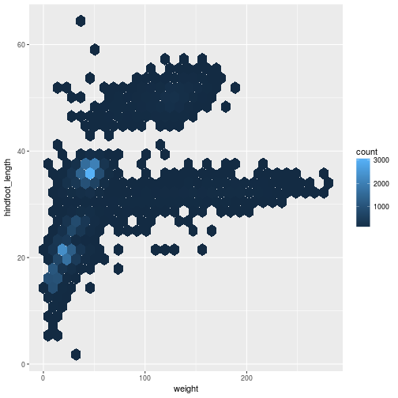

### Building your plots iteratively

Building plots with ggplot is typically an iterative process. We start
by defining the dataset we'll use, lay the axes, and choose a geom.


```r
surveys_plot + geom_point()
```

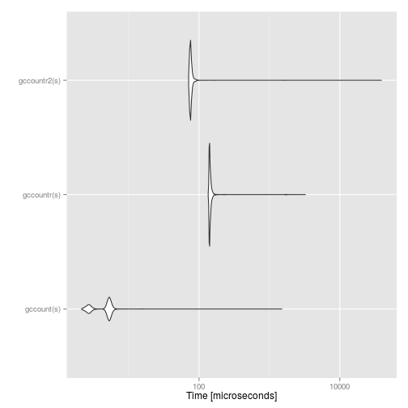

Then, we start modifying this plot to extract more information from it. For
instance, we can add transparency (alpha) to avoid overplotting.


```r
surveys_plot +
    geom_point(alpha = 0.1)
```

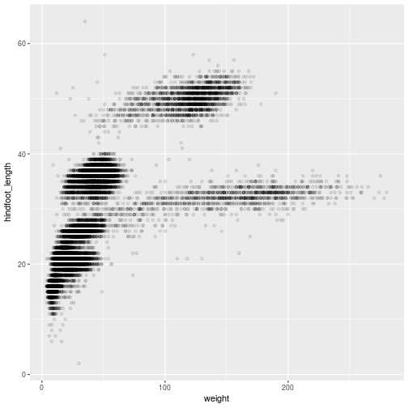

We can also add colors for all the points


```r
surveys_plot +
    geom_point(alpha = 0.1, color = "blue")
```

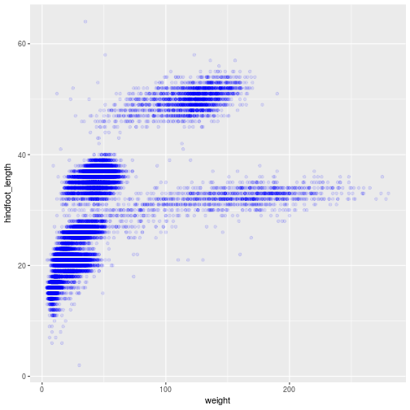

Or to color each species in the plot differently:


```r
surveys_plot +
    geom_point(alpha = 0.1, aes(color = species_id))
```


## Boxplot

Visualising the distribution of weight within each species.


```r
surveys_bw <- ggplot(data = surveys_complete,
                     aes(x = species_id, y = hindfoot_length))
surveys_bw + geom_boxplot()
```

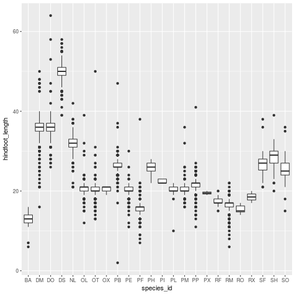

By adding points to boxplot, we can have a better idea of the number of
measurements and of their distribution:


```r
surveys_bw + 
    geom_boxplot(alpha = 0.6) +
    geom_jitter(alpha = 0.1, color = "tomato")
```

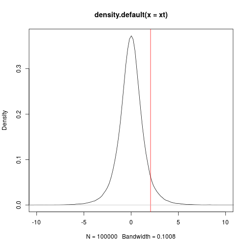

Notice how the boxplot layer is behind the jitter layer? What do you need to
change in the code to put the boxplot in front of the points such that it's not
hidden.


> ### Challenges
>
> Boxplots are useful summaries, but hide the *shape* of the distribution. For
> example, if there is a bimodal distribution, this would not be observed with a
> boxplot. An alternative to the boxplot is the violin plot (sometimes known as a
> beanplot), where the shape (of the density of points) is drawn.
>
> - Replace the box plot with a violin plot; see `geom_violin()`
>
> In many types of data, it is important to consider the *scale* of the
> observations.  For example, it may be worth changing the scale of the axis to
> better distribute the observations in the space of the plot.  Changing the scale
> of the axes is done similarly to adding/modifying other components (i.e., by
> incrementally adding commands).
>
> - Represent weight on the log10 scale; see `scale_y_log10()`
>
> - Create boxplot for `weight`.


```r
surveys_bw + geom_violin()

surveys_bw + geom_boxplot() + scale_y_log10()

ggplot(data = surveys_complete,
       aes(x = species_id, y = weight)) +
    geom_boxplot()
```
### Plotting time series data

Let's calculate number of counts per year for each species. To do that
we need to group data first and count records within each group.


```r
yearly_counts <- surveys_complete %>%
                 group_by(year, species_id) %>%
                 tally
```

Timelapse data can be visualised as a line plot with years on x axis and counts
on y axis.


```r
ggplot(data = yearly_counts, aes(x = year, y = n)) +
     geom_line()
```

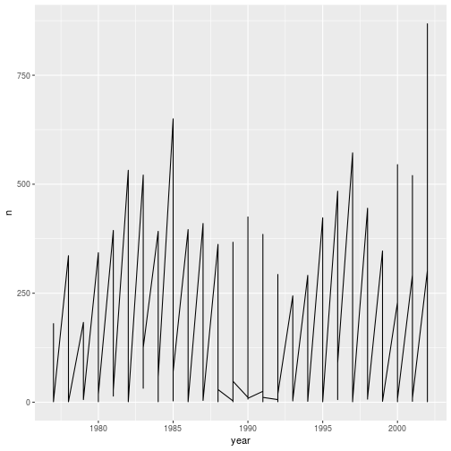

Unfortunately this does not work, because we plot data for all the species
together. We need to tell ggplot to draw a line for each species by modifying
the aesthetic function to include `group = species_id`.


```r
ggplot(data = yearly_counts,
       aes(x = year, y = n, group = species_id)) +
    geom_line()
```

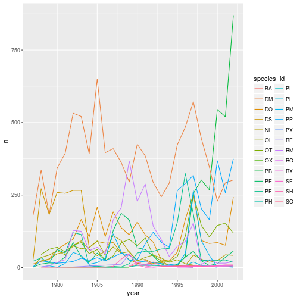

We will be able to distinguish species in the plot if we add colors.


```r
ggplot(data = yearly_counts,
       aes(x = year, y = n, group = species_id, colour = species_id)) +
    geom_line()
```

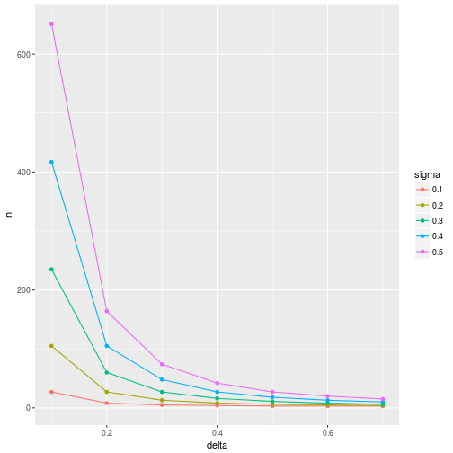

## Faceting

ggplot has a special technique called *faceting* that allows to split one plot
into multiple plots based on a factor included in the dataset. We will use it to
make one plot for a time series for each species.


```r
ggplot(data = yearly_counts,
       aes(x = year, y = n, group = species_id, colour = species_id)) +
    geom_line() +
    facet_wrap(~ species_id)
```

```
## geom_path: Each group consists of only one observation. Do you need to
## adjust the group aesthetic?
```


Now we would like to split line in each plot by sex of each individual
measured. To do that we need to make counts in data frame grouped by year,
species_id, and sex:


```r
yearly_sex_counts <- surveys_complete %>%
    group_by(year, species_id, sex) %>%
    tally
```

We can now make the faceted plot splitting further by sex (within a single plot):


```r
ggplot(data = yearly_sex_counts,
       aes(x = year, y = n, color = species_id, group = sex)) +
     geom_line() +
     facet_wrap(~ species_id)
```

```
## geom_path: Each group consists of only one observation. Do you need to
## adjust the group aesthetic?
```

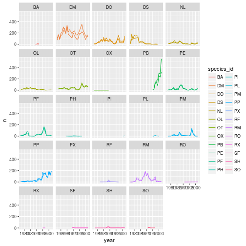

Usually plots with white background look more readable when printed.
We can set the background to white using the function
`theme_bw()`. Additionally you can also remove the grid.


```r
ggplot(data = yearly_sex_counts,
       aes(x = year, y = n, color = species_id, group = sex)) +
     geom_line() +
     facet_wrap(~ species_id) +
     theme_bw() 
```

```
## geom_path: Each group consists of only one observation. Do you need to
## adjust the group aesthetic?
```


> ### Challenges
>
> Modify the plotting code above to colour the time series by sex in
> the different facets.

To make the plot easier to read, we can color by sex instead of
species (species are already in separate plots, so we don’t need to
distinguish them further).


```r
ggplot(data = yearly_sex_counts,
       aes(x = year, y = n, color = sex, group = sex)) +
    geom_line() +
    facet_wrap(~ species_id) +
    theme_bw()
```

```
## geom_path: Each group consists of only one observation. Do you need to
## adjust the group aesthetic?
```

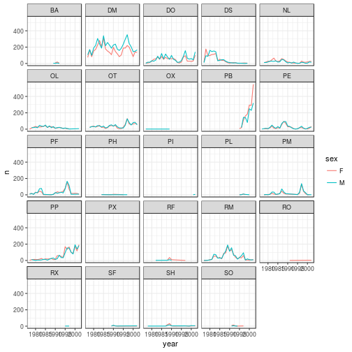

#### The ggplot2 themes

In addition of `theme_bw()` that changes the plot background to white,
ggplot2 comes with several other themes, which can be useful to
quickly change the look and feel of your visualization. The complete
list of themes is available at
<http://docs.ggplot2.org/current/ggtheme.html>. `theme_minimal()` and
`theme_light()` are popular, and `theme_void()` can be useful as a
starting point to create a new hand-crafted theme.

> ### Challenge
>
> Use what you just learned to create a plot that depicts how the
> average weight of each species changes through the years.

<details>

```r
yearly_weight <- surveys_complete %>%
                 group_by(year, species_id) %>%
                 summarise(avg_weight = mean(weight))
ggplot(data = yearly_weight,
       aes(x=year, y=avg_weight, color = species_id, group = species_id)) +
    geom_line() +
    facet_wrap(~ species_id) +
    theme_bw()
```

```
## geom_path: Each group consists of only one observation. Do you need to
## adjust the group aesthetic?
```


</details>


## References

* `ggplot2` documentation: http://docs.ggplot2.org/
* [`ggplot2` cheat sheet](https://www.rstudio.com/wp-content/uploads/2015/08/ggplot2-cheatsheet.pdf)
* Graphs in the [R cookbook](http://www.cookbook-r.com/Graphs/), by Winston Chang.
* *ggplot2: Elegant Graphics for Data Analysis* by Hadley Wickham
  ([book webpage](http://ggplot2.org/book/)). (This book is a bit
  outdated; I believe a new version is in preparation.)


## Interactivity with [`ggvis`](http://ggvis.rstudio.com/)

This section is based on the on-line
[`ggvis` documentation](http://ggvis.rstudio.com/)

> The goal of ggvis is to make it easy to build interactive graphics
> for exploratory data analysis. ggvis has a similar underlying theory
> to ggplot2 (the grammar of graphics), but it’s expressed a little
> differently, and adds new features to make your plots
> interactive. ggvis also incorporates shiny’s reactive programming
> model and dplyr’s grammar of data transformation.


```r
library("ggvis")
sml <- sample(nrow(surveys), 1e3)
surveys_sml <- surveys_complete[sml, ]
```


```r
p <- ggvis(surveys_sml, x = ~weight, y = ~hindfoot_length)
p %>% layer_points()
```


```r
surveys_sml %>%
    ggvis(x = ~weight, y = ~hindfoot_length,
          fill = ~species_id) %>%
    layer_points()
```


```r
p %>% layer_points(fill = ~species_id)
p %>% layer_points(shape = ~species_id)
```

To set fixed plotting parameters, use `:=`.


```r
p %>% layer_points(fill := "red", stroke := "black")
p %>% layer_points(size := 300, opacity := 0.4)
p %>% layer_points(shape := "cross")
```

### Interactivity


```r
p %>% layer_points(
          size := input_slider(10, 100),
          opacity := input_slider(0, 1))
```


```r
p %>%
    layer_points() %>% 
    add_tooltip(function(df) df$weight)
```

* `input_slider()`
* `input_checkbox()`
* `input_checkboxgroup()`
* `input_numeric()`
* `input_radiobuttons()`
* `input_select()`
* `input_text()`

See the
[interactivity vignette](http://ggvis.rstudio.com/interactivity.html)
for details.


### Layers

**Simple layers** 

* `layer_points()`, with properties x, y, shape, stroke, fill,
  strokeOpacity, fillOpacity, and opacity.
* `layer_paths()`, for paths and polygons (using the fill argument).
* `layer_ribbons()` for filled areas.
* `layer_rects()`, `layer_text()`.

**Compound layers**, which which combine data transformations with one
or more simple layers.

* `layer_lines()` which automatically orders by the x variable with
  `arrange()`.
* `layer_histograms()` and `layer_freqpolys()`, which first bin the
  data with `compute_bin()`.
* `layer_smooths()`, which fits and plots a smooth model to the data
  using `compute_smooth()`.

See the [layers vignette](http://ggvis.rstudio.com/layers.html) for
details.


Like for `ggplot2`'s geoms, we can overly multiple layers:


```r
p %>%
    layer_points() %>%
    layer_smooths(stroke := "red")
```


## More components 

* `scales`, to control the mapping between data and visual properties;
  see the
  [properties and scales vignette](http://ggvis.rstudio.com/properties-scales.html).

* `legends` and `axes` to control the appearance of the guides
  produced by the scales. See the
  [axes and legends vignette](http://ggvis.rstudio.com/axes-legends.html).

