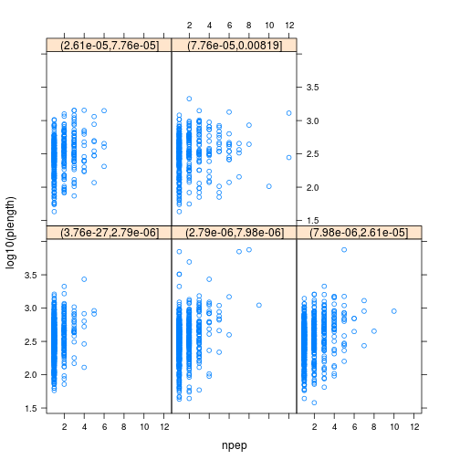

# Identification data: `mzR`, `mzID`, `MSnID`


## Handling identification data

There are two packages that can be used to parse `mzIdentML` files,
namely `mzR` (that we have already used for raw data) and `mzID`. The
major difference is that the former leverages C++ code from
`proteowizard` and is hence faster than the latter (which uses the
`XML` R package). They both work in similar ways.


|   |Data type      |File format |Data structure |Package |
|:--|:--------------|:-----------|:--------------|:-------|
|4  |Identification |mzIdentML   |mzRident       |mzR     |
|5  |Identification |mzIdentML   |mzID           |mzID    |

We are going to use the following identification file in this practical:


```r
library("msdata")
idf <- ident(full.names = TRUE)
basename(idf)
```

```
## [1] "TMT_Erwinia_1uLSike_Top10HCD_isol2_45stepped_60min_01-20141210.mzid"
```

### mzID

The main functions are `mzID` to read the data into a dedicated data
class and `flatten` to transform it into a `data.frame`. 


```r
library("mzID")
id <- mzID(idf)
```

```
## reading TMT_Erwinia_1uLSike_Top10HCD_isol2_45stepped_60min_01-20141210.mzid... DONE!
```

```r
id
```

```
## An mzID object
## 
## Software used:   MS-GF+ (version: Beta (v10072))
## 
## Rawfile:         /home/lg390/dev/01_svn/workflows/proteomics/TMT_Erwinia_1uLSike_Top10HCD_isol2_45stepped_60min_01-20141210.mzML
## 
## Database:        /home/lg390/dev/01_svn/workflows/proteomics/erwinia_carotovora.fasta
## 
## Number of scans: 5343
## Number of PSM's: 5656
```

Various data can be extracted from the `mzID` object, using one the
accessor functions such as `database`, `software`, `scans`, `peptides`,
... The object can also be converted into a `data.frame` using the
`flatten` function.


```r
head(flatten(id))
```

```
##                                      spectrumid scan number(s)
## 1 controllerType=0 controllerNumber=1 scan=5782           5782
## 2 controllerType=0 controllerNumber=1 scan=6037           6037
## 3 controllerType=0 controllerNumber=1 scan=5235           5235
##   acquisitionnum passthreshold rank calculatedmasstocharge
## 1           5782          TRUE    1              1080.2321
## 2           6037          TRUE    1              1002.2115
## 3           5235          TRUE    1              1189.2800
##   experimentalmasstocharge chargestate ms-gf:denovoscore ms-gf:evalue
## 1                1080.2325           3               174 1.086033e-20
## 2                1002.2089           3               245 1.988774e-19
## 3                1189.2836           3               264 5.129649e-19
##   ms-gf:pepqvalue ms-gf:qvalue ms-gf:rawscore ms-gf:specevalue
## 1               0            0            147     3.764831e-27
## 2               0            0            214     6.902626e-26
## 3               0            0            211     1.778789e-25
##   assumeddissociationmethod isotopeerror isdecoy post pre end start
## 1                       HCD            0   FALSE    S   R  84    50
## 2                       HCD            0   FALSE    R   K 315   288
## 3                       HCD            0   FALSE    A   R 224   192
##   accession length                                       description
## 1   ECA1932    155                        outer membrane lipoprotein
## 2   ECA1147    434                                    trigger factor
## 3   ECA0013    295                ribose-binding periplasmic protein
##                                pepseq modified modification
## 1 PVQIQAGEDSNVIGALGGAVLGGFLGNTIGGGSGR    FALSE         <NA>
## 2        TQVLDGLINANDIEVPVALIDGEIDVLR    FALSE         <NA>
## 3   TKGLNVMQNLLTAHPDVQAVFAQNDEMALGALR    FALSE         <NA>
##                                                                idFile
## 1 TMT_Erwinia_1uLSike_Top10HCD_isol2_45stepped_60min_01-20141210.mzid
## 2 TMT_Erwinia_1uLSike_Top10HCD_isol2_45stepped_60min_01-20141210.mzid
## 3 TMT_Erwinia_1uLSike_Top10HCD_isol2_45stepped_60min_01-20141210.mzid
##                                                          spectrumFile
## 1 TMT_Erwinia_1uLSike_Top10HCD_isol2_45stepped_60min_01-20141210.mzML
## 2 TMT_Erwinia_1uLSike_Top10HCD_isol2_45stepped_60min_01-20141210.mzML
## 3 TMT_Erwinia_1uLSike_Top10HCD_isol2_45stepped_60min_01-20141210.mzML
##               databaseFile
## 1 erwinia_carotovora.fasta
## 2 erwinia_carotovora.fasta
## 3 erwinia_carotovora.fasta
##  [ reached getOption("max.print") -- omitted 3 rows ]
```

#### Exercise

Open the TMT_Erwinia_1uLSike_Top10HCD_isol2_45stepped_60min_01-20141210.mzid file as shown above. What software and how many
proteins were in the database used to perform the search?

### `mzR`

The `mzR` interface provides a similar interface. It is however much
faster as it does not read all the data into memory and only extracts
relevant data on demand. It has also accessor functions such as
`softwareInfo`, `mzidInfo`, ... (use `showMethods(classes = "mzRident", where = "package:mzR")`)
to see all available methods.


```r
library("mzR")
id2 <- openIDfile(idf)
id2
```

```
## Identification file handle.
## Filename:  TMT_Erwinia_1uLSike_Top10HCD_isol2_45stepped_60min_01-20141210.mzid 
## Number of psms:  5759
```

```r
softwareInfo(id2)
```

```
## [1] "MS-GF+ Beta (v10072) "                       
## [2] "ProteoWizard MzIdentML 3.0.9490 ProteoWizard"
```

The identification data can be accessed as a `data.frame` with the
`psms` accessor.


```r
head(psms(id2))
```

```
##                                      spectrumID chargeState rank
## 1 controllerType=0 controllerNumber=1 scan=5782           3    1
## 2 controllerType=0 controllerNumber=1 scan=6037           3    1
## 3 controllerType=0 controllerNumber=1 scan=5235           3    1
## 4 controllerType=0 controllerNumber=1 scan=5397           3    1
## 5 controllerType=0 controllerNumber=1 scan=6075           3    1
##   passThreshold experimentalMassToCharge calculatedMassToCharge
## 1          TRUE                1080.2325              1080.2321
## 2          TRUE                1002.2089              1002.2115
## 3          TRUE                1189.2836              1189.2800
## 4          TRUE                 960.5365               960.5365
## 5          TRUE                1264.3409              1264.3419
##                              sequence modNum isDecoy post pre start end
## 1 PVQIQAGEDSNVIGALGGAVLGGFLGNTIGGGSGR      0   FALSE    S   R    50  84
## 2        TQVLDGLINANDIEVPVALIDGEIDVLR      0   FALSE    R   K   288 315
## 3   TKGLNVMQNLLTAHPDVQAVFAQNDEMALGALR      0   FALSE    A   R   192 224
## 4         SQILQQAGTSVLSQANQVPQTVLSLLR      0   FALSE    -   R   264 290
## 5 PIIGDNPFVVVLPDVVLDESTADQTQENLALLISR      0   FALSE    F   R   119 153
##   DatabaseAccess DBseqLength DatabaseSeq
## 1        ECA1932         155            
## 2        ECA1147         434            
## 3        ECA0013         295            
## 4        ECA1731         290            
## 5        ECA1443         298            
##                                         DatabaseDescription acquisitionNum
## 1                        ECA1932 outer membrane lipoprotein           5782
## 2                                    ECA1147 trigger factor           6037
## 3                ECA0013 ribose-binding periplasmic protein           5235
## 4                                         ECA1731 flagellin           5397
## 5      ECA1443 UTP--glucose-1-phosphate uridylyltransferase           6075
##  [ reached getOption("max.print") -- omitted 1 row ]
```

#### Example

Is there a relation between the length of a protein and the number of
identified peptides, conditioned by the (average) e-value of the
identifications?


```r
fid <- flatten(id)
fid2 <- fid[!fid$isdecoy, ]

x <- by(fid2, fid2$accession,
        function(x)
            c(unique(x$length),
              length(unique(x$pepseq)),
              mean(x$'ms-gf:specevalue')))
x <- data.frame(do.call(rbind, x))
colnames(x) <- c("plength", "npep", "eval")
x$bins <- cut(x$eval, summary(x$eval))
library("lattice")
xyplot(log10(plength) ~ npep | bins, data = x)
```



## Adding identification data to raw data

Here are two matching raw and identification data files:


```r
library("MSnbase")
## find path to a mzXML file
rwf <- dir(system.file(package = "MSnbase", dir = "extdata"),
           full.name = TRUE, pattern = "mzXML$")
## find path to a mzIdentML file
idf <- dir(system.file(package = "MSnbase", dir = "extdata"),
           full.name = TRUE, pattern = "dummyiTRAQ.mzid")
```

We first create the raw data object:


```r
msexp <- readMSData(rwf, verbose = FALSE)
head(fData(msexp))
```

```
##      spectrum
## X1.1        1
## X2.1        2
## X3.1        3
## X4.1        4
## X5.1        5
```

The simply add identification data. The matching of spectra from the
raw data and the PSMs from the identification data is done internally.


```r
msexp <- addIdentificationData(msexp, idf)
```

```
## reading dummyiTRAQ.mzid... DONE!
```

```r
head(fData(msexp))
```

```
##      spectrum scan number(s) passthreshold rank calculatedmasstocharge
## X1.1        1              1          TRUE    1               645.0375
## X2.1        2              2          TRUE    1               546.9633
## X3.1        3             NA            NA   NA                     NA
##      experimentalmasstocharge chargestate ms-gf:denovoscore ms-gf:evalue
## X1.1                 645.3741           3                77     79.36958
## X2.1                 546.9586           3                39     13.46615
## X3.1                       NA          NA                NA           NA
##      ms-gf:rawscore ms-gf:specevalue assumeddissociationmethod
## X1.1            -39     5.527468e-05                       CID
## X2.1            -30     9.399048e-06                       CID
## X3.1             NA               NA                      <NA>
##      isotopeerror isdecoy post  pre end start       accession length
## X1.1            1   FALSE    A    R 186   170 ECA0984;ECA3829    231
## X2.1            0   FALSE    A    K  62    50         ECA1028    275
## X3.1         <NA>      NA <NA> <NA>  NA    NA            <NA>     NA
##                                                                      description
## X1.1 DNA mismatch repair protein;acetolactate synthase isozyme III large subunit
## X2.1          2,3,4,5-tetrahydropyridine-2,6-dicarboxylate N-succinyltransferase
## X3.1                                                                        <NA>
##                 pepseq modified modification          idFile
## X1.1 VESITARHGEVLQLRPK    FALSE           NA dummyiTRAQ.mzid
## X2.1     IDGQWVTHQWLKK    FALSE           NA dummyiTRAQ.mzid
## X3.1              <NA>       NA           NA            <NA>
##                  databaseFile nprot npep.prot npsm.prot npsm.pep
## X1.1 erwinia_carotovora.fasta     2         1         1        1
## X2.1 erwinia_carotovora.fasta     1         1         1        1
## X3.1                     <NA>    NA        NA        NA       NA
##  [ reached getOption("max.print") -- omitted 2 rows ]
```

## Visualising identification data

For this part, let's use a ready made `MSnExp` object that is
distributed with the `MSnbase` package. Simply use the `data()`
function with the name of the desired data.


```r
library("MSnbase")
data(itraqdata)
```

### Annotated spectra and spectra comparison


```r
par(mfrow = c(1, 2))
itraqdata2 <- pickPeaks(itraqdata, verbose = FALSE)
s <- "SIGFEGDSIGR"
plot(itraqdata2[[14]], s, main = s)
plot(itraqdata2[[25]], itraqdata2[[28]], sequences = rep("IMIDLDGTENK", 2))
```


The annotation of spectra is obtained by simulating fragmentation of a
peptide and matching observed peaks to fragments:


```r
calculateFragments("SIGFEGDSIGR")
```

```
## Modifications used: C=57.02146
```

```
##            mz  ion type pos z         seq
## 1    88.03931   b1    b   1 1           S
## 2   201.12337   b2    b   2 1          SI
## 3   258.14483   b3    b   3 1         SIG
## 4   405.21324   b4    b   4 1        SIGF
## 5   534.25583   b5    b   5 1       SIGFE
## 6   591.27729   b6    b   6 1      SIGFEG
## 7   706.30423   b7    b   7 1     SIGFEGD
## 8   793.33626   b8    b   8 1    SIGFEGDS
## 9   906.42032   b9    b   9 1   SIGFEGDSI
## 10  963.44178  b10    b  10 1  SIGFEGDSIG
## 11 1119.54289  b11    b  11 1 SIGFEGDSIGR
## 12  175.11895   y1    y   1 1           R
## 13  232.14041   y2    y   2 1          GR
## 14  345.22447   y3    y   3 1         IGR
## 15  432.25650   y4    y   4 1        SIGR
## 16  547.28344   y5    y   5 1       DSIGR
##  [ reached getOption("max.print") -- omitted 20 rows ]
```

Visualising a pair of spectra means that we can access them, and that,
in addition to plotting, we can manipulate them and perform
computations. The two spectra corresponding to the `IMIDLDGTENK`
peptide, for example have 


```r
compareSpectra(itraqdata2[[25]], itraqdata2[[28]], fun = "common")
```

```
## [1] 22
```

common peaks, a correlation of


```r
compareSpectra(itraqdata2[[25]], itraqdata2[[28]], fun = "cor")
```

```
## [1] 0.1983378
```

and a dot product of 


```r
compareSpectra(itraqdata2[[25]], itraqdata2[[28]], fun = "dotproduct")
```

```
## [1] 0.2101533
```

See `?compareSpectra` for details.

There are 2 Bioconductor packages for peptide-spectrum matching
directly in R, namely *[MSGFplus](http://bioconductor.org/packages/MSGFplus)* and *[rTANDEM](http://bioconductor.org/packages/rTANDEM)*, 
replying on `MSGF+` and `X!TANDEM` respectively.
See also the *[MSGFgui](http://bioconductor.org/packages/MSGFgui)* package for visualisation of
identification data.


## Exploration and Assessment of Confidence of LC-MSn Proteomics Identifications using `MSnID`

The `MSnID` package extracts MS/MS ID data from mzIdentML (leveraging
the `mzID` package) or text files. After collating the search results
from multiple datasets it assesses their identification quality and
optimises filtering criteria to achieve the maximum number of
identifications while not exceeding a specified false discovery
rate. It also contains a number of utilities to explore the MS/MS
results and assess missed and irregular enzymatic cleavages, mass
measurement accuracy, etc.

### Step-by-step work-flow

Let's reproduce parts of the analysis described the `MSnID`
vignette. You can explore more with 


```r
vignette("msnid_vignette", package = "MSnID")
```

The *[MSnID](http://bioconductor.org/packages/MSnID)* package can be used for post-search filtering
of MS/MS identifications. One starts with the construction of an
`MSnID` object that is populated with identification results that can
be imported from a `data.frame` or from `mzIdenML` files. Here, we
will use the example identification data provided with the package.


```r
mzids <- system.file("extdata", "c_elegans.mzid.gz", package="MSnID")
basename(mzids)
```

```
## [1] "c_elegans.mzid.gz"
```

We start by loading the package, initialising the `MSnID` object, and
add the identification result from our `mzid` file (there could of
course be more that one).


```r
library("MSnID")
msnid <- MSnID(".")
```

```
## Note, the anticipated/suggested columns in the
## peptide-to-spectrum matching results are:
## -----------------------------------------------
## accession
## calculatedMassToCharge
## chargeState
## experimentalMassToCharge
## isDecoy
## peptide
## spectrumFile
## spectrumID
```

```r
msnid <- read_mzIDs(msnid, mzids)
```

```
## Loaded cached data
```

```r
show(msnid)
```

```
## MSnID object
## Working directory: "."
## #Spectrum Files:  1 
## #PSMs: 12263 at 36 % FDR
## #peptides: 9489 at 44 % FDR
## #accessions: 7414 at 76 % FDR
```

Printing the `MSnID` object returns some basic information such as

* Working directory.
* Number of spectrum files used to generate data.
* Number of peptide-to-spectrum matches and corresponding FDR.
* Number of unique peptide sequences and corresponding FDR.
* Number of unique proteins or amino acid sequence accessions and corresponding FDR.


The package then enables to define, optimise and apply filtering based
for example on missed cleavages, identification scores, precursor mass
errors, etc. and assess PSM, peptide and protein FDR levels. To
properly function, it expects to have access to the following data


```
## [1] "accession"                "calculatedMassToCharge"  
## [3] "chargeState"              "experimentalMassToCharge"
## [5] "isDecoy"                  "peptide"                 
## [7] "spectrumFile"             "spectrumID"
```

which are indeed present in our data:


```r
names(msnid)
```

```
##  [1] "spectrumID"                "scan number(s)"           
##  [3] "acquisitionNum"            "passThreshold"            
##  [5] "rank"                      "calculatedMassToCharge"   
##  [7] "experimentalMassToCharge"  "chargeState"              
##  [9] "MS-GF:DeNovoScore"         "MS-GF:EValue"             
## [11] "MS-GF:PepQValue"           "MS-GF:QValue"             
## [13] "MS-GF:RawScore"            "MS-GF:SpecEValue"         
## [15] "AssumedDissociationMethod" "IsotopeError"             
## [17] "isDecoy"                   "post"                     
## [19] "pre"                       "end"                      
## [21] "start"                     "accession"                
## [23] "length"                    "description"              
## [25] "pepSeq"                    "modified"                 
## [27] "modification"              "idFile"                   
## [29] "spectrumFile"              "databaseFile"             
## [31] "peptide"
```

Here, we summarise a few steps and redirect the reader to the
package's vignette for more details:


### Analysis of peptide sequences

Cleaning irregular cleavages at the termini of the peptides and
missing cleavage site within the peptide sequences. The following two
function call create the new `numMisCleavages` and `numIrregCleavages`
columns in the `MSnID` object


```r
msnid <- assess_termini(msnid, validCleavagePattern="[KR]\\.[^P]")
msnid <- assess_missed_cleavages(msnid, missedCleavagePattern="[KR](?=[^P$])")
```

## Trimming the data

Now, we can use the `apply_filter` function to effectively apply
filters. The strings passed to the function represent expressions that
will be evaluated, this keeping only PSMs that have 0 irregular
cleavages and 2 or less missed cleavages.


```r
msnid <- apply_filter(msnid, "numIrregCleavages == 0")
msnid <- apply_filter(msnid, "numMissCleavages <= 2")
show(msnid)
```

```
## MSnID object
## Working directory: "."
## #Spectrum Files:  1 
## #PSMs: 7838 at 17 % FDR
## #peptides: 5598 at 23 % FDR
## #accessions: 3759 at 53 % FDR
```

## Parent ion mass errors

Using `"calculatedMassToCharge"` and `"experimentalMassToCharge"`, the
`mass_measurement_error` function calculates the parent ion mass
measurement error in parts per million.


```r
summary(mass_measurement_error(msnid))
```

```
##       Min.    1st Qu.     Median       Mean    3rd Qu.       Max. 
## -2184.0000    -0.6992     0.0000    17.6100     0.7512  2013.0000
```

We then filter any matches that do not fit the +/- 20 ppm tolerance


```r
msnid <- apply_filter(msnid, "abs(mass_measurement_error(msnid)) < 20")
summary(mass_measurement_error(msnid))
```

```
##     Min.  1st Qu.   Median     Mean  3rd Qu.     Max. 
## -19.7800  -0.5866   0.0000  -0.2970   0.5713  19.6800
```

## Filtering criteria

Filtering of the identification data will rely on 

* -log10 transformed MS-GF+ Spectrum E-value, reflecting the goodness
  of match experimental and theoretical fragmentation patterns
  

```r
msnid$msmsScore <- -log10(msnid$`MS-GF:SpecEValue`)
```

* the absolute mass measurement error (in ppm units) of the parent ion


```r
msnid$absParentMassErrorPPM <- abs(mass_measurement_error(msnid))
```

## Setting filters

MS2 filters are handled by a special `MSnIDFilter` class objects, where
individual filters are set by name (that is present in `names(msnid)`)
and comparison operator (>, <, = , ...)  defining if we should retain
hits with higher or lower given the threshold and finally the
threshold value itself.


```r
filtObj <- MSnIDFilter(msnid)
filtObj$absParentMassErrorPPM <- list(comparison="<", threshold=10.0)
filtObj$msmsScore <- list(comparison=">", threshold=10.0)
show(filtObj)
```

```
## MSnIDFilter object
## (absParentMassErrorPPM < 10) & (msmsScore > 10)
```

We can then evaluate the filter on the identification data object,
which return the false discovery rate and number of retained
identifications for the filtering criteria at hand.


```r
evaluate_filter(msnid, filtObj)
```

```
##           fdr    n
## PSM         0 3807
## peptide     0 2455
## accession   0 1009
```

## Filter optimisation

Rather than setting filtering values by hand, as shown above, these
can be set automatically to meet a specific false discovery rate.


```r
filtObj.grid <- optimize_filter(filtObj, msnid, fdr.max=0.01,
                                method="Grid", level="peptide",
                                n.iter=500)
show(filtObj.grid)
```

```
## MSnIDFilter object
## (absParentMassErrorPPM < 3) & (msmsScore > 7.4)
```


```r
evaluate_filter(msnid, filtObj.grid)
```

```
##                   fdr    n
## PSM       0.004097561 5146
## peptide   0.006447651 3278
## accession 0.021996616 1208
```

Filters can eventually be applied (rather than just evaluated) using
the `apply_filter` function.


```r
msnid <- apply_filter(msnid, filtObj.grid)
show(msnid)
```

```
## MSnID object
## Working directory: "."
## #Spectrum Files:  1 
## #PSMs: 5146 at 0.41 % FDR
## #peptides: 3278 at 0.64 % FDR
## #accessions: 1208 at 2.2 % FDR
```

And finally, identifications that matched decoy and contaminant
protein sequences are removed 


```r
msnid <- apply_filter(msnid, "isDecoy == FALSE") 
msnid <- apply_filter(msnid, "!grepl('Contaminant',accession)")
show(msnid)
```

```
## MSnID object
## Working directory: "."
## #Spectrum Files:  1 
## #PSMs: 5117 at 0 % FDR
## #peptides: 3251 at 0 % FDR
## #accessions: 1179 at 0 % FDR
```

## Export `MSnID` data

The resulting filtered identification data can be exported to a
`data.frame` or to a dedicated `MSnSet` data structure for
quantitative MS data, described below, and further processed and
analyses using appropriate statistical tests.


```r
head(psms(msnid))
```

```
##   spectrumID scan number(s) acquisitionNum passThreshold rank
## 1 index=7151           8819           7151          TRUE    1
## 2 index=8520          10419           8520          TRUE    1
##   calculatedMassToCharge experimentalMassToCharge chargeState
## 1               1270.318                 1270.318           3
## 2               1426.737                 1426.739           3
##   MS-GF:DeNovoScore MS-GF:EValue MS-GF:PepQValue MS-GF:QValue
## 1               287 1.709082e-24               0            0
## 2               270 3.780745e-24               0            0
##   MS-GF:RawScore MS-GF:SpecEValue AssumedDissociationMethod IsotopeError
## 1            239     1.007452e-31                       CID            0
## 2            230     2.217275e-31                       CID            0
##   isDecoy post pre end start accession length
## 1   FALSE    A   K 283   249   CE02347    393
## 2   FALSE    A   K 182   142   CE07055    206
##                                                                                                                           description
## 1 WBGene00001993; locus:hpd-1; 4-hydroxyphenylpyruvate dioxygenase; status:Confirmed; UniProt:Q22633; protein_id:CAA90315.1; T21C12.2
## 2           WBGene00001755; locus:gst-7; glutathione S-transferase; status:Confirmed; UniProt:P91253; protein_id:AAB37846.1; F11G11.2
##                                      pepSeq modified modification
## 1       AISQIQEYVDYYGGSGVQHIALNTSDIITAIEALR    FALSE         <NA>
## 2 SAGSGYLVGDSLTFVDLLVAQHTADLLAANAALLDEFPQFK    FALSE         <NA>
##              idFile                                   spectrumFile
## 1 c_elegans.mzid.gz c_elegans_A_3_1_21Apr10_Draco_10-03-04_dta.txt
## 2 c_elegans.mzid.gz c_elegans_A_3_1_21Apr10_Draco_10-03-04_dta.txt
##               databaseFile                                       peptide
## 1 ID_004174_E48C5B52.fasta       K.AISQIQEYVDYYGGSGVQHIALNTSDIITAIEALR.A
## 2 ID_004174_E48C5B52.fasta K.SAGSGYLVGDSLTFVDLLVAQHTADLLAANAALLDEFPQFK.A
##   numIrregCleavages numMissCleavages msmsScore absParentMassErrorPPM
## 1                 0                0  30.99678             0.3843772
## 2                 0                0  30.65418             1.3689451
##  [ reached getOption("max.print") -- omitted 4 rows ]
```

```r
as(msnid, "MSnSet")
```

```
## MSnSet (storageMode: lockedEnvironment)
## assayData: 3251 features, 1 samples 
##   element names: exprs 
## protocolData: none
## phenoData: none
## featureData
##   featureNames: -.APPSQDVLKEIFNLYDEELDGK.I
##     -.APPSQDVLKEIFNLYDEELDGKIDGTQVGDVAR.A ... R.YWNMVQAYLR.T (3251
##     total)
##   fvarLabels: peptide accession
##   fvarMetadata: labelDescription
## experimentData: use 'experimentData(object)'
## Annotation:  
## - - - Processing information - - -
##  MSnbase version: 1.99.7
```
