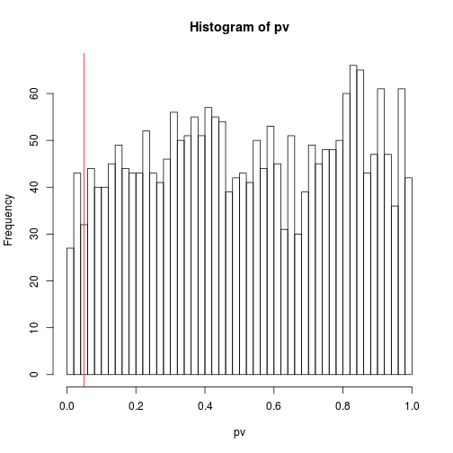

# Adjustment for multiple testing


A p-value of *p* tells us that, if all conditions are met and no
difference between groups was to be expected, one would expect to see
a p-value smaller or equal than *p* by chance with probability
*p*. That is valid for a singe test. What are the implications when we
repeat the test many times?

Let's simulate a **random** dataset, with the same dimensions as
`mulvey2015` or timepoints 1 and 6 (2337 proteins and 
6). 


```r
n <- prod(dim(time16))
m <- matrix(rnorm(n), nrow = nrow(time16))
colnames(m) <- colnames(time16)
rownames(m) <- rownames(time16)
head(m)
```

```
##            rep1_0hr   rep1_XEN   rep2_0hr    rep2_XEN     rep3_0hr
## P48432   -0.6264538  1.1899708  0.2546850  1.81668024 -1.545361858
## Q62315-2  0.1836433 -0.8940312 -1.0632732 -0.32028190 -0.168792077
## P55821   -0.8356286 -0.7652913  0.7788257  1.43786453  0.150662692
## P17809    1.5952808  0.9845250  0.5671598 -1.90125146 -0.001612218
## Q8K3F7    0.3295078  0.9167718 -0.6095706  0.24961540 -0.457093964
## Q60953-2 -0.8204684 -0.2895447  1.5105734 -0.05596084 -0.030720659
##            rep3_XEN
## P48432   -1.3029020
## Q62315-2 -0.1768132
## P55821   -0.4957569
## P17809    1.7317017
## Q8K3F7    0.7935313
## Q60953-2 -0.9215052
```

We don't expect to see any *significant* results, do we?


```r
pv <- apply(m, 1, function(x) t.test(x[1:3], x[4:6])$p.value)
summary(pv)
```

```
##      Min.   1st Qu.    Median      Mean   3rd Qu.      Max. 
## 0.0001415 0.2783000 0.5134000 0.5170000 0.7777000 0.9991000
```

```r
sum(pv <= 0.05)
```

```
## [1] 86
```

Oh dear, there are 86 *significant* random data (at p
<= 0.05), i.e. 0.04. This is, of
course, exactly what we expected.

Before adjusting the p-value for multiple testing and controlling the
false discovery rate (FDR), let first explore the p-values from the
random data. The histogramme below show that we have a **uniform**
distribution of values between 0 and 1, some of which are smaller than
0.05 (or whatever arbitrary threshold we choose).


```r
hist(pv, breaks = 50)
abline(v = 0.05, col = "red")
```



### How to interpret a p-value histogram ([link](http://varianceexplained.org/statistics/interpreting-pvalue-histogram/))

It is a very important quality control to visualise the distribution
of (non-adjusted) p-values before proceeding with adjustment. The
p-value distribution tells a lot about the data before interpreting
them.


## Adjusting for multiple comparisons

* **Family-wise error rate** (FWER) The probability of one or more
    false positives. **Bonferroni correction** For *m* tests, multiply
    each p-value by *m*. Then consider those that still are below
    significance threshold.

* **False discovery rate** (FDR): The expected fraction of false
  positives among all discoveries. Allows to choose *n* results with a
  given FDR. Examples are **Benjamini-Hochberg** or **q-values**.

## FDR adjustment


## Multiple testing adjustment

### The `multtest` package


```r
library("multtest")
adjp <- mt.rawp2adjp(pv)
names(adjp)
```

```
## [1] "adjp"    "index"   "h0.ABH"  "h0.TSBH"
```


```r
head(adjp$adjp)
```

```
##              rawp Bonferroni      Holm  Hochberg   SidakSS   SidakSD
## [1,] 0.0001415203  0.3307329 0.3307329 0.3307329 0.2816198 0.2816198
## [2,] 0.0002979285  0.6962589 0.6959609 0.6959609 0.5016051 0.5014566
## [3,] 0.0021079387  1.0000000 1.0000000 0.9991378 0.9927840 0.9927535
## [4,] 0.0021994848  1.0000000 1.0000000 0.9991378 0.9941765 0.9941379
## [5,] 0.0024973987  1.0000000 1.0000000 0.9991378 0.9971020 0.9970728
## [6,] 0.0026950961  1.0000000 1.0000000 0.9991378 0.9981764 0.9981516
##             BH BY       ABH TSBH_0.05
## [1,] 0.3307329  1 0.3307329 0.3307329
## [2,] 0.3481294  1 0.3481294 0.3481294
## [3,] 0.9476154  1 0.9476154 0.9476154
## [4,] 0.9476154  1 0.9476154 0.9476154
## [5,] 0.9476154  1 0.9476154 0.9476154
## [6,] 0.9476154  1 0.9476154 0.9476154
```

```r
head(adjp <- adjp$adjp[order(adjp$index), ])
```

```
##           rawp Bonferroni Holm  Hochberg SidakSS SidakSD        BH BY
## [1,] 0.6448295          1    1 0.9991378       1       1 0.9958659  1
## [2,] 0.4445621          1    1 0.9991378       1       1 0.9958659  1
## [3,] 0.4566506          1    1 0.9991378       1       1 0.9958659  1
## [4,] 0.4043791          1    1 0.9991378       1       1 0.9958659  1
## [5,] 0.9779685          1    1 0.9991378       1       1 0.9958659  1
## [6,] 0.5870534          1    1 0.9991378       1       1 0.9958659  1
##            ABH TSBH_0.05
## [1,] 0.9958659 0.9958659
## [2,] 0.9958659 0.9958659
## [3,] 0.9958659 0.9958659
## [4,] 0.9958659 0.9958659
## [5,] 0.9958659 0.9958659
## [6,] 0.9958659 0.9958659
```

```r
summary(adjp[, "Bonferroni"])
```

```
##    Min. 1st Qu.  Median    Mean 3rd Qu.    Max. 
##  0.3307  1.0000  1.0000  0.9996  1.0000  1.0000
```

```r
summary(adjp[, "BH"])
```

```
##    Min. 1st Qu.  Median    Mean 3rd Qu.    Max. 
##  0.3307  0.9959  0.9959  0.9952  0.9959  0.9991
```

### The `q-value` package


```r
library(qvalue)
qv <- qvalue(pv)
head(qv$pvalue)
```

```
##    P48432  Q62315-2    P55821    P17809    Q8K3F7  Q60953-2 
## 0.6448295 0.4445621 0.4566506 0.4043791 0.9779685 0.5870534
```

```r
summary(qv$qvalues)
```

```
##    Min. 1st Qu.  Median    Mean 3rd Qu.    Max. 
##  0.3307  0.9959  0.9959  0.9952  0.9959  0.9991
```
