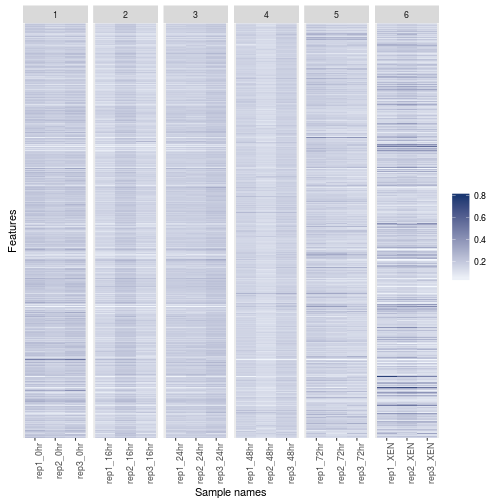
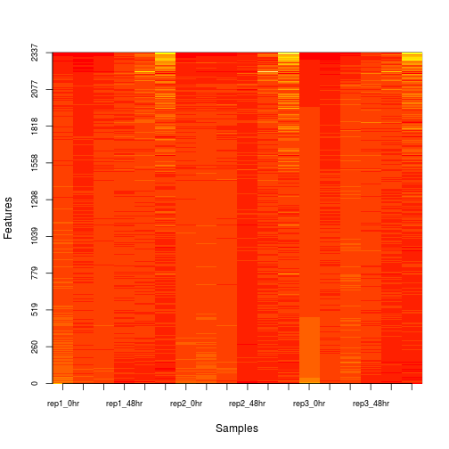

# The `MSnbase` package: `MSnSet`s for quantiative proteomics


There are a wide range of proteomics quantitation techniques that can
broadly be classified as labelled vs. label-free, depending whether
the features are labelled prior the MS acquisition and the MS level at
which quantitation is inferred, namely MS1 or MS2. 


|    |Label-free |Labelled   |
|:---|:----------|:----------|
|MS1 |XIC        |SILAC, 15N |
|MS2 |Counting   |iTRAQ, TMT |

* Isobaric tagging (iTRAQ and TMT): *[MSnbase](http://bioconductor.org/packages/MSnbase)* and *[isobar](http://bioconductor.org/packages/isobar)*.
* Label-free: *[xcms](http://bioconductor.org/packages/xcms)* (metabolomics).
* Counting: *[MSnbase](http://bioconductor.org/packages/MSnbase)* and *[MSnID](http://bioconductor.org/packages/MSnID)* for
  peptide-spectrum matching confidence assessment.
* *[N14N15](https://github.com/vladpetyuk/N14N15)* for heavy Nitrogen-labelled data.

## The `MSnSet` class

The schematics below illustrates how the `MSnSet` class is
implemented. It is build along the same principles as the `MSnExp`
class that we saw [previously](../raw/README.md). It contains 

- an *assay data* with the quantitative (expression) data `matrix`
- a feature metadata `data.frame` annotating the quantitative features
  (i.e. rows in the assay data)
- a sample metadata `data.frame` (coined phenodata) annotating the
  samples (i.e. the columns in the assay data)


Subsetting `MSnSet` objects works like other rectangluar data
structures we have seen: `[i, j]`, where `i` subsets assay data and
feature metadata **rows**, and `j` subsets assay data and sample
metadata **columns**. Conversely, one can add and remove columns to
the feature and sample metadata (the sample metadata is transposed on
the figure, to show the relation between the expression data and
sample metadata) without impacting the rest of the data.

### Accessors 

The different parts of an `MSnSet` class can be accessed with

- `exprs` to access the assay data `matrix`
- `fData` to access the feature metadata `data.frame`
- `pData` to access the sample metadata `data.frame`
- the names of the features (which can be spectra, peptides, proteins
  or protein groups) can be accessed with `feaureNames`
- The feature variable names (i.e. `fData`'s' column names) can be
  accessed with `fvarLabels`

### Exercise

1. Load the `pRolocdata` package with the `library` function and then
   load the `mulvey2015` data. Verify that it is an `MSnSet`.
2. Relying on your knowledge of how `data.fame` and `matrix` objects,
   what are the dimensions of the data.
3. Display the expression intensity of the 5 first proteins and 3
   first samples.
4. The data comes from `mulbey2015` was published in
   [*Dynamic Proteomic Profiling of Extra-Embryonic Endoderm Differentiation in Mouse Embryonic Stem Cells.*](https://www.ncbi.nlm.nih.gov/pubmed/26059426). Can
   you find out from the `MSnSet` home many time points and replicates
   where used in the study.
5. What feature metadata is available?

## Creating `MSnSet` data

### From raw data to quantitative data

#### Isobaric tagging

An `MSnExp` is converted to an `MSnSet` by the `quantitation`
method. Below, we use the iTRAQ 4-plex isobaric tagging strategy
(defined by the `iTRAQ4` parameter; other isobaric tags are available).


```r
library("MSnbase")
qf <- dir(system.file(package = "MSnbase", dir = "extdata"),
          full.name = TRUE, pattern = "mzXML$")
basename(qf)
```

```
## [1] "dummyiTRAQ.mzXML"
```

```r
msexp <- readMSData(qf, verbose = FALSE, centroided = FALSE)
msexp
```

```
## Object of class "MSnExp" (in memory)
## Object size in memory: 0.18 Mb
## - - - Spectra data - - -
##  MS level(s): 2 
##  Number of spectra: 5 
##  MSn retention times: 25:1 - 25:2 minutes
## - - - Processing information - - -
## Data loaded: Fri Oct 14 22:59:24 2016 
##  MSnbase version: 1.99.7 
## - - - Meta data  - - -
## phenoData
##   rowNames: dummyiTRAQ.mzXML
##   varLabels: sampleNames
##   varMetadata: labelDescription
## Loaded from:
##   dummyiTRAQ.mzXML 
## protocolData: none
## featureData
##   featureNames: X1.1 X2.1 ... X5.1 (5 total)
##   fvarLabels: spectrum
##   fvarMetadata: labelDescription
## experimentData: use 'experimentData(object)'
```

```r
plot(msexp[[1]], full = TRUE, reporters = iTRAQ4)
```


We can now use the `quantify` function to calculate the area under the
iTRAQ 4-plex reporter ions.


```r
msset <- quantify(msexp, reporters = iTRAQ4, verbose = FALSE)
exprs(msset)
```

```
##      iTRAQ4.114 iTRAQ4.115 iTRAQ4.116 iTRAQ4.117
## X1.1   4483.320   4873.996   6743.441   4601.378
## X2.1   1918.082   1418.040   1117.601   1581.954
## X3.1  15210.979  15296.256  15592.760  16550.502
## X4.1   4133.103   5069.983   4724.845   4694.801
## X5.1  11947.881  13061.875  12809.491  12911.479
```

```r
processingData(msset)
```

```
## - - - Processing information - - -
## Data loaded: Fri Oct 14 22:59:24 2016 
## iTRAQ4 quantification by trapezoidation: Fri Oct 14 22:59:26 2016 
##  MSnbase version: 1.99.7
```

**See also** The *[isobar](http://bioconductor.org/packages/isobar)* package supports quantitation
from centroided `mgf` peak lists or its own tab-separated files that
can be generated from Mascot and Phenyx vendor files.

#### Adding identification data

The identification results stemming from the same raw data file can
then be used to add PSM matches to the raw data, as seen previously,
or to the quantitation data


```r
## find path to a mzIdentML file
idf <- dir(system.file(package = "MSnbase", dir = "extdata"),
           full.name = TRUE, pattern = "mzid$")
basename(idf)
```

```
## [1] "dummyiTRAQ.mzid"
```

```r
msset <- addIdentificationData(msset, idf)
```

```
## reading dummyiTRAQ.mzid... DONE!
```

```r
fData(msset)
```

```
##      spectrum file retention.time precursor.mz precursor.intensity charge
## X1.1        1    1        1501.35     645.3741            47659400      3
## X2.1        2    1        1501.59     546.9586            26356100      3
##      peaks.count       tic  ionCount ms.level acquisition.number
## X1.1        2921 182542000 668170086        2                  1
## X2.1        1012  16488100  56758067        2                  2
##      collision.energy scan number(s) passthreshold rank
## X1.1               40              1          TRUE    1
## X2.1               40              2          TRUE    1
##      calculatedmasstocharge experimentalmasstocharge chargestate
## X1.1               645.0375                 645.3741           3
## X2.1               546.9633                 546.9586           3
##      ms-gf:denovoscore ms-gf:evalue ms-gf:rawscore ms-gf:specevalue
## X1.1                77     79.36958            -39     5.527468e-05
## X2.1                39     13.46615            -30     9.399048e-06
##      assumeddissociationmethod isotopeerror isdecoy post  pre end start
## X1.1                       CID            1   FALSE    A    R 186   170
## X2.1                       CID            0   FALSE    A    K  62    50
##            accession length
## X1.1 ECA0984;ECA3829    231
## X2.1         ECA1028    275
##                                                                      description
## X1.1 DNA mismatch repair protein;acetolactate synthase isozyme III large subunit
## X2.1          2,3,4,5-tetrahydropyridine-2,6-dicarboxylate N-succinyltransferase
##                 pepseq modified modification          idFile
## X1.1 VESITARHGEVLQLRPK    FALSE           NA dummyiTRAQ.mzid
## X2.1     IDGQWVTHQWLKK    FALSE           NA dummyiTRAQ.mzid
##                  databaseFile nprot npep.prot npsm.prot npsm.pep
## X1.1 erwinia_carotovora.fasta     2         1         1        1
## X2.1 erwinia_carotovora.fasta     1         1         1        1
##  [ reached getOption("max.print") -- omitted 3 rows ]
```

#### Label-free MS2

Other MS2 quantitation methods available in `quantify` include the
(normalised) spectral index `SI` and (normalised) spectral abundance
factor `SAF` or simply a simple count method.

For these quantation methods, we need to add the identification data
first, as information such as the protein length is required.


```r
msexp <- addIdentificationData(msexp, idf)
```

```
## reading dummyiTRAQ.mzid... DONE!
```

```r
exprs(si <- quantify(msexp, method = "SIn"))
```

```
## Combined 2 features into 2 using sum
```

```
##         dummyiTRAQ.mzXML
## ECA0510      0.003588641
## ECA1028      0.001470129
```

```r
exprs(saf <- quantify(msexp, method = "NSAF"))
```

```
## Combined 2 features into 2 using user-defined function
```

```
##         dummyiTRAQ.mzXML
## ECA0510        0.6235828
## ECA1028        0.3764172
```

Note that spectra that have not been assigned any peptide (`NA`) or
that match non-unique peptides (`npsm > 1`) are discarded in the
counting process.

#### Spectral counting

The *[MSnID](http://bioconductor.org/packages/MSnID)* package provides enables to explore and
assess the confidence of identification data using `mzid` files. A
subset of all peptide-spectrum matches, that pass a specific false
discovery rate threshold can them be converted to an `MSnSet`, where
the number of peptide occurrences are used to populate the assay data.

### Importing third-party data

The PSI `mzTab` file format is aimed at providing a simpler (than XML
formats) and more accessible file format to the wider community. It is
composed of a key-value metadata section and peptide/protein/small
molecule tabular sections. 


```r
mztf <- "../data/F063721.dat-mztab.txt"
mzt <- readMzTabData(mztf, what = "PEP", version = "0.9")
```

```
## Warning: Version 0.9 is deprecated. Please see '?readMzTabData' and '?
## MzTab' for details.
```

```
## Detected a metadata section
```

```
## Detected a peptide section
```

It is also possible to import arbitrary spreadsheets as `MSnSet`
objects into R with the `readMSnSet2` function. The main 2 arguments
of the function are (1) a text-based spreadsheet or a `data.frame` and
(2) column names of indices that identify the quantitation data.


```r
csv <- dir(system.file ("extdata" , package = "pRolocdata"),
           full.names = TRUE, pattern = "pr800866n_si_004-rep1.csv")
getEcols(csv, split = ",")
```

```
##  [1] "\"Protein ID\""              "\"FBgn\""                   
##  [3] "\"Flybase Symbol\""          "\"No. peptide IDs\""        
##  [5] "\"Mascot score\""            "\"No. peptides quantified\""
##  [7] "\"area 114\""                "\"area 115\""               
##  [9] "\"area 116\""                "\"area 117\""               
## [11] "\"PLS-DA classification\""   "\"Peptide sequence\""       
## [13] "\"Precursor ion mass\""      "\"Precursor ion charge\""   
## [15] "\"pd.2013\""                 "\"pd.markers\""
```

```r
ecols <- 7:10
res <- readMSnSet2(csv, ecols)
head(exprs(res))
```

```
##   area.114 area.115 area.116 area.117
## 1 0.379000 0.281000 0.225000 0.114000
## 2 0.420000 0.209667 0.206111 0.163889
## 3 0.187333 0.167333 0.169667 0.476000
## 4 0.247500 0.253000 0.320000 0.179000
## 5 0.216000 0.183000 0.342000 0.259000
## 6 0.072000 0.212333 0.573000 0.142667
```

```r
head(fData(res))
```

```
##   Protein.ID        FBgn Flybase.Symbol No..peptide.IDs Mascot.score
## 1    CG10060 FBgn0001104    G-ialpha65A               3       179.86
## 2    CG10067 FBgn0000044         Act57B               5       222.40
## 3    CG10077 FBgn0035720        CG10077               5       219.65
## 4    CG10079 FBgn0003731           Egfr               2        86.39
## 5    CG10106 FBgn0029506        Tsp42Ee               1        52.10
## 6    CG10130 FBgn0010638      Sec61beta               2        79.90
##   No..peptides.quantified PLS.DA.classification Peptide.sequence
## 1                       1                    PM                 
## 2                       9                    PM                 
## 3                       3                                       
## 4                       2                    PM                 
## 5                       1                              GGVFDTIQK
## 6                       3              ER/Golgi                 
##   Precursor.ion.mass Precursor.ion.charge     pd.2013 pd.markers
## 1                                                  PM    unknown
## 2                                                  PM    unknown
## 3                                             unknown    unknown
## 4                                                  PM    unknown
## 5            626.887                    2 Phenotype 1    unknown
## 6                                            ER/Golgi         ER
```

#### Exercise

1. Import the `mulvey2015.csv` file into R as an `MSnSet`.


2. How would you proceed to add the experimental `pData` back?


### Saving and exporting

The `save`/`load` and `saveRDS`/`readRDS` functions we have seen for
basic data structures are the best solution to serialise complex
objects. 

Exporting an `MSnSet` to a spreadsheet using a `write.csv`-like
function is possible (the function, is called `write.exprs`), but not
without loss of information. It is only possible to export the
expression data and the feature metadata in a single file.

#### Exercise

Export the `mulvey2015` data to a text-based spreadsheet.


## Processing

Once your data is available as an `MSnSet`, many data processing and
visualisation functions become available, such as normalisation. The
`normalise` (or `normalize`) method offers a wide selection of
normalisation methods that will be applied on the assay data and will
return.

We will see more data processing and data analysis using `MSnSet`
instances later.

## Visualisation

As we have access to the expression matrix and plenty of metadata, we
can extract the information and generate any visualisation we can think
of. However, one major benefit of formal data structures is that it
becomes possible to define functions that accesses and finds the
expected data automatically.

For example, we can produce annotated heatmaps:


```r
image2(mulvey2015)
```


```r
image(mulvey2015, facetBy = "rep")
```


```r
image(mulvey2015, facetBy = "times")
```



Or PCA plots using the `plot2D` function from the `pRoloc` package.


```r
library("pRoloc")
par(mfrow = c(1, 2))
plot2D(mulvey2015, addLegend = "bottomleft")
plot2D(t(mulvey2015), fcol = "times", addLegend = "bottomleft")
```



(Try also the `plot3D` function)


