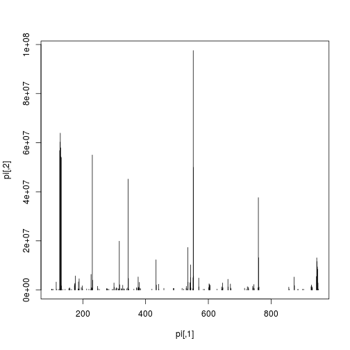
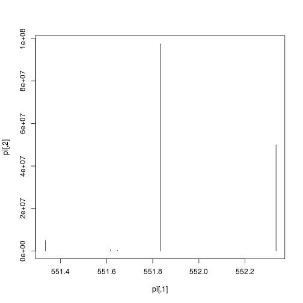
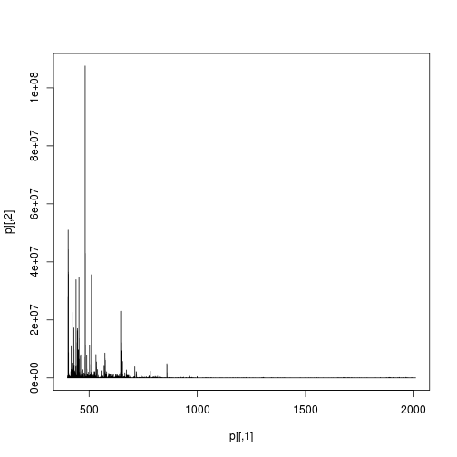
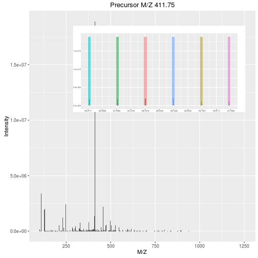
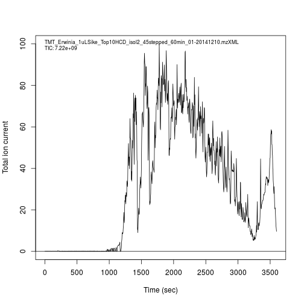
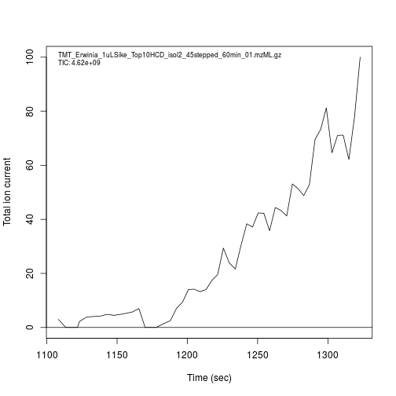
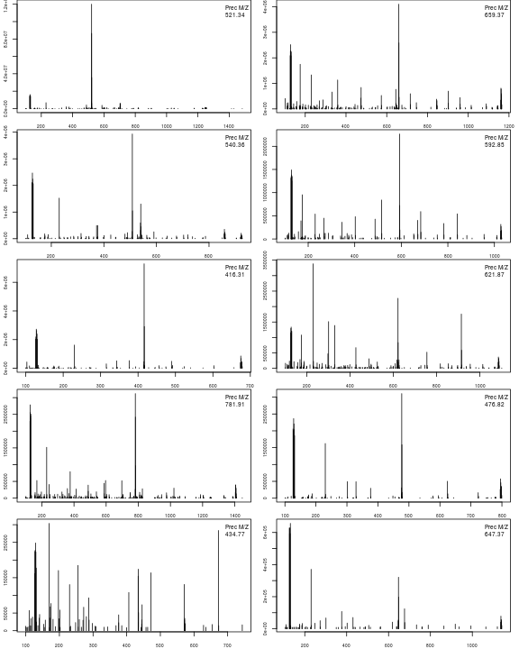
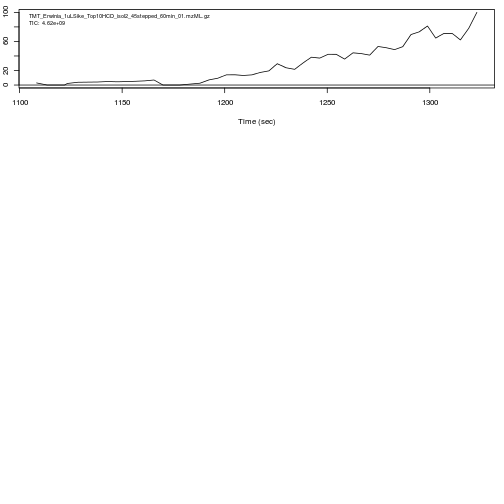
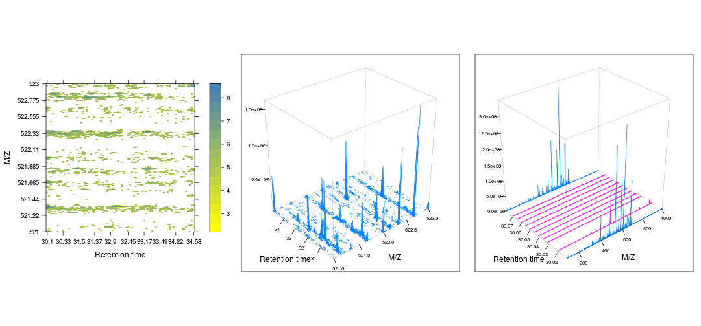

# Raw MS data: `mzR` and `MSnbase`


|   |Data type  |File format   |Data structure               |Package           |
|:--|:----------|:-------------|:----------------------------|:-----------------|
|1  |Raw        |mzXML or mzML |mzRpwiz or mzRramp           |mzR               |
|2  |Raw        |mzXML or mzML |list of MassSpectrum objects |MALDIquantForeign |
|3  |Raw        |mzXML or mzML |MSnExp                       |MSnbase           |
|7  |Peak lists |mgf           |MSnExp                       |MSnbase           |

In this section, we will learn how to read raw data in one of the
commonly used open formats (`mzML`, `mzXML` and `netCDF`) into R using
`mzR` (low level access) and `MSnbase` (higher level abstration).

## Low level access

The `mzR` package in a direct interface to the
[proteowizard](http://proteowizard.sourceforge.net/) code base. It
includes a substantial proportion of *pwiz*'s C/C++ code for fast and
efficient parsing of these large raw data files.

Let's start by using some raw data files from the `msdata`
package. After loading it, we use the `proteomics()` function to
return the full file names for two raw data files. We will start by
focusing on the second one.


```r
library(msdata)
f <- proteomics(full.names = TRUE)
f
```

```
## [1] "/home/lg390/R/x86_64-pc-linux-gnu-library/3.3/msdata/proteomics/MS3TMT10_01022016_32917-33481.mzML.gz"                        
## [2] "/home/lg390/R/x86_64-pc-linux-gnu-library/3.3/msdata/proteomics/TMT_Erwinia_1uLSike_Top10HCD_isol2_45stepped_60min_01.mzML.gz"
```

```r
f2 <- f[2]
```

The three main functions of `mzR` are

* `openMSfile` to create a file handle to a raw data file
* `header` to extract metadata about the spectra contained in the file
* `peaks` to extract one or multiple spectra of interest. 

Other functions such as `instrumentInfo`, or `runInfo` can be used to
gather general information about a run.

### Demonstration


```r
library("mzR")
ms <- openMSfile(f2)
ms
```

```
## Mass Spectrometry file handle.
## Filename:  TMT_Erwinia_1uLSike_Top10HCD_isol2_45stepped_60min_01.mzML.gz 
## Number of scans:  509
```


```r
hd <- header(ms)
dim(hd)
```

```
## [1] 509  21
```

```r
names(hd)
```

```
##  [1] "seqNum"                   "acquisitionNum"          
##  [3] "msLevel"                  "polarity"                
##  [5] "peaksCount"               "totIonCurrent"           
##  [7] "retentionTime"            "basePeakMZ"              
##  [9] "basePeakIntensity"        "collisionEnergy"         
## [11] "ionisationEnergy"         "lowMZ"                   
## [13] "highMZ"                   "precursorScanNum"        
## [15] "precursorMZ"              "precursorCharge"         
## [17] "precursorIntensity"       "mergedScan"              
## [19] "mergedResultScanNum"      "mergedResultStartScanNum"
## [21] "mergedResultEndScanNum"
```


```r
head(peaks(ms, 117))
```

```
##          [,1]       [,2]
## [1,] 101.9901   563.4893
## [2,] 104.9527   424.7643
## [3,] 110.0711  3540.1157
## [4,] 110.4495   447.8719
## [5,] 112.0502 15887.4199
## [6,] 112.0863   986.9324
```

```r
str(peaks(ms, 1:5))
```

```
## List of 5
##  $ : num [1:43527, 1:2] 400 400 400 400 400 ...
##  $ : num [1:211, 1:2] 104 108 112 112 112 ...
##  $ : num [1:124, 1:2] 107 110 112 112 112 ...
##  $ : num [1:234, 1:2] 100 101 105 110 112 ...
##  $ : num [1:215, 1:2] 105 106 107 112 112 ...
```

Let's extract the index of the MS2 spectrum with the highest base peak
intensity and plot its spectrum. Is the data centroided or in profile
mode?


```r
hd2 <- hd[hd$msLevel == 2, ]
i <- which.max(hd2$basePeakIntensity)
hd2[i, ]
```

```
##     seqNum acquisitionNum msLevel polarity peaksCount totIonCurrent
## 422    422           1424       2        0        180     946246080
##     retentionTime basePeakMZ basePeakIntensity collisionEnergy
## 422      1291.423   551.8322          97551880              45
##     ionisationEnergy    lowMZ   highMZ precursorScanNum precursorMZ
## 422                0 100.5899 950.5798             1423    551.8334
##     precursorCharge precursorIntensity mergedScan mergedResultScanNum
## 422               2          428273248          0                   0
##     mergedResultStartScanNum mergedResultEndScanNum
## 422                        0                      0
```

```r
pi <- peaks(ms, hd2[i, 1])
plot(pi, type = "h")
```



```r
mz <- hd2[i, "basePeakMZ"]
plot(pi, type = "h", xlim = c(mz-0.5, mz+0.5))
```



Zooming into spectrum 300 (an MS1 spectrum).


```r
j <- 300
pj <- peaks(ms, j)
plot(pj, type = "l")
```



```r
plot(pj, type = "l", xlim = c(480, 485))
```


### Exercise

Using the second raw data file (`f[2]` above), answer the following
questions:

* What type of data is returned by the `openMSfile` function?
* How many spectra are there in that file?
* How many MS levels, and how many spectra per MS level?
* What is the index of the MS2 spectrum with the highest precursor
  intensity?
* Plot one spectrum of each level.

## High level abstraction

While having full access to the raw data gives full control, at times
it requires a lot of effort to achieve mundane things and can be very
repetitive. There is a need for abstraction, i.e. that we shouldn't
need to know about all the details that are exposed by `mzR` to access
and manipulate raw data. In comes `MSnbase` and the `MSnExp` data
structure, that provides a much smoother approach to *handle* and
*annotate* raw data (we will see this in more details tomorrow).

ADD FIGURE HERE

An `MSnExp` contains the data and annotation to describe an MS
experiment. The data is composed of all the MS spectra (the output of
`mzR::peaks` above) and the annotation is stored in a
`data.frame`-like structure called the *feature metadata* slot
(*fData* for short). This feature metadata contains by default (or can
contain, to be precise) the content the `mzR::header` seen above, but
can be extended as need (adding identification data, for example - to
be discussed tomorrow).


```r
library("MSnbase")
```

Using the `readMSdata` or `readMSdata2` functions, passing a raw data
filename as input, we create an `MSnExp` object.


```r
rw1 <- readMSData(f[2], verbose = FALSE)
rw1
```

```
## Object of class "MSnExp" (in memory)
## Object size in memory: 3.27 Mb
## - - - Spectra data - - -
##  MS level(s): 2 
##  Number of spectra: 451 
##  MSn retention times: 18:29 - 22:2 minutes
## - - - Processing information - - -
## Data loaded: Thu Oct 13 18:42:01 2016 
##  MSnbase version: 1.99.7 
## - - - Meta data  - - -
## phenoData
##   rowNames:
##     TMT_Erwinia_1uLSike_Top10HCD_isol2_45stepped_60min_01.mzML.gz
##   varLabels: sampleNames
##   varMetadata: labelDescription
## Loaded from:
##   TMT_Erwinia_1uLSike_Top10HCD_isol2_45stepped_60min_01.mzML.gz 
## protocolData: none
## featureData
##   featureNames: X001.1 X002.1 ... X451.1 (451 total)
##   fvarLabels: spectrum
##   fvarMetadata: labelDescription
## experimentData: use 'experimentData(object)'
```


```r
rw2 <- readMSData2(f[2], verbose = FALSE)
rw2
```

```
## Object of class "MSnExp" (on disk)
## Object size in memory: 0.13 Mb
## - - - Spectra data - - -
##  MS level(s): 1 2 
##  Number of spectra: 509 
##  MSn retention times: 18:28 - 22:3 minutes
## - - - Processing information - - -
## Data loaded [Thu Oct 13 18:42:03 2016] 
##  MSnbase version: 1.99.7 
## - - - Meta data  - - -
## phenoData
##   rowNames:
##     TMT_Erwinia_1uLSike_Top10HCD_isol2_45stepped_60min_01.mzML.gz
##   varLabels: sampleNames
##   varMetadata: labelDescription
## Loaded from:
##   TMT_Erwinia_1uLSike_Top10HCD_isol2_45stepped_60min_01.mzML.gz 
## protocolData: none
## featureData
##   featureNames: X001.1 X002.1 ... X509.1 (509 total)
##   fvarLabels: fileIdx spIdx ... spectrum (27 total)
##   fvarMetadata: labelDescription
## experimentData: use 'experimentData(object)'
```

For most of our need, the two functions above are equivalent. The
major difference is that the former reads the data from only one type
of MS level into memory. The second function (newly added in MSnbase
verison 2.0), does not read any raw data into memory (and hence is
much faster) and supports any number of MS levels. The raw data is
accessed on demand when needed. If you are interested in a benchmark
between the two approaches, look at the
[*benchmarking* vignette](http://bioconductor.org/packages/devel/bioc/vignettes/MSnbase/inst/doc/benchmarking.html),
available by typing `vignette("benchmarking", package = "MSnbase")`.

Let's extrace spectra 372 and 300, or 1 to 5, as we did above. We
can do this using the familiar `[[` and `[` operators:


```r
rw2[[i]]
```

```
## Object of class "Spectrum2"
##  Precursor: 411.7465 
##  Retention time: 21:13 
##  Charge: 4 
##  MSn level: 2 
##  Peaks count: 494 
##  Total ion count: 113847074
```

```r
rw2[[j]]
```

```
## Object of class "Spectrum1"
##  Retention time: 20:46 
##  MSn level: 1 
##  Total ion count: 31653 
##  Polarity: 0
```


```r
rw1[1:5]
```

```
## Object of class "MSnExp" (in memory)
## Object size in memory: 0.03 Mb
## - - - Spectra data - - -
##  MS level(s): 2 
##  Number of spectra: 5 
##  MSn retention times: 18:29 - 18:31 minutes
## - - - Processing information - - -
## Data loaded: Thu Oct 13 18:42:01 2016 
## Data [numerically] subsetted 5 spectra: Thu Oct 13 18:42:04 2016 
##  MSnbase version: 1.99.7 
## - - - Meta data  - - -
## phenoData
##   rowNames:
##     TMT_Erwinia_1uLSike_Top10HCD_isol2_45stepped_60min_01.mzML.gz
##   varLabels: sampleNames
##   varMetadata: labelDescription
## Loaded from:
##   TMT_Erwinia_1uLSike_Top10HCD_isol2_45stepped_60min_01.mzML.gz 
## protocolData: none
## featureData
##   featureNames: X001.1 X002.1 ... X005.1 (5 total)
##   fvarLabels: spectrum
##   fvarMetadata: labelDescription
## experimentData: use 'experimentData(object)'
```

And plot them


```r
plot(rw2[[j]])
```


```r
plot(rw2[[i]], full = TRUE, reporters = TMT6, centroided = TRUE)
```



The feature metadata is stored as part of the `MSnExp` object and can
be accessed with the `fData` accessor function


```r
fData(rw2)
```

```
##        fileIdx spIdx centroided smoothed seqNum acquisitionNum msLevel
## X001.1       1     1         NA       NA      1           1003       1
## X002.1       1     2         NA       NA      2           1004       2
## X003.1       1     3         NA       NA      3           1005       2
##        polarity originalPeaksCount totIonCurrent retentionTime basePeakMZ
## X001.1        0              43527  1.380436e+08      1108.303   612.1172
## X002.1        0                211  2.297522e+06      1108.905   112.0503
## X003.1        0                124  1.812184e+06      1109.587   112.0503
##        basePeakIntensity collisionEnergy ionisationEnergy    lowMZ
## X001.1      5.277490e+06               0                0 399.9981
## X002.1      5.238027e+05              45                0 104.0775
## X003.1      8.617262e+05              45                0 107.3107
##           highMZ precursorScanNum precursorMZ precursorCharge
## X001.1 2008.4516                0      0.0000               0
## X002.1 1426.0667             1003    816.6312               2
## X003.1  929.4860             1003    608.1073               2
##        precursorIntensity mergedScan mergedResultScanNum
## X001.1       0.000000e+00          0                   0
## X002.1       1.810917e+06          0                   0
## X003.1       1.334500e+06          0                   0
##        mergedResultStartScanNum mergedResultEndScanNum injectionTime
## X001.1                        0                      0    6.34634781
## X002.1                        0                      0   21.97739029
## X003.1                        0                      0   27.65937042
##        spectrum
## X001.1        1
## X002.1        2
## X003.1        3
##  [ reached getOption("max.print") -- omitted 506 rows ]
```

### Peak lists

Similarly as for raw data, peak lists can be read into R as `MSnExp`
data using the `readMgfData`. See `?readMgfData` for details.

## Visualisation of raw MS data


The importance of flexible access to specialised data becomes visible
in the figure below (taken from the `RforProteomics`
[visualisation vignette](http://bioconductor.org/packages/release/data/experiment/vignettes/RforProteomics/inst/doc/RProtVis.html)).
**Not only can we access specific data and understand/visualise them,
but we can transverse all the data and extracted/visualise/understand
structured slices of data.**

In this code chunks we start by selecting relevant spectra of
interest. We will focus on the first MS1 spectrum acquired after 30
minutes of retention time.


```r
## (1) Open raw data file
ms <- openMSfile("../data/TMT_Erwinia_1uLSike_Top10HCD_isol2_45stepped_60min_01-20141210.mzXML")
## (2) Extract the header information
hd <- header(ms)
## (3) MS1 spectra indices
ms1 <- which(hd$msLevel == 1)
## (4) Select MS1 spectra with retention time between 30 and 35 minutes
rtsel <- hd$retentionTime[ms1] / 60 > 30 & hd$retentionTime[ms1] / 60 < 35
## (5) Indices of the 1st and 2nd MS1 spectra after 30 minutes
i <- ms1[which(rtsel)][1]
j <- ms1[which(rtsel)][2]
## (6) Interleaved MS2 spectra
ms2 <- (i+1):(j-1)
```

Now now extract and plot all relevant information:

1. The upper panel represents the chromatogram of the TMT_Erwinia_1uLSike_Top10HCD_isol2_45stepped_60min_01-20141210.mzXML
   raw data file, produced with `chromatogram`.


```r
chromatogram(ms)
```



2. We concentrate at a specific retention time, 
   30:1 minutes (1800.68 seconds) 


```r
chromatogram(ms)
abline(v = hd[i, "retentionTime"], col = "red")
```



3. This corresponds to the 2807th MS1 spectrum, shown on the second
   row of figures.


```r
plot(peaks(ms, i), type = "l", xlim = c(400, 1000))
legend("topright", bty = "n",
       legend = paste0(
           "Acquisition ", hd[i, "acquisitionNum"],  "\n",
           "Retention time ", formatRt(hd[i, "retentionTime"])))
```


4. The ions that were selected for MS2 are highlighted by vertical
   lines. These are represented in the bottom part of the figure.


```r
plot(peaks(ms, i), type = "l", xlim = c(400, 1000))
legend("topright", bty = "n",
       legend = paste0(
           "Acquisition ", hd[i, "acquisitionNum"],  "\n",
           "Retention time ", formatRt(hd[i, "retentionTime"])))
abline(v = hd[ms2, "precursorMZ"],
       col = c("#FF000080",
           rep("#12121280", 9)))
```


5. On the right, we zoom on the isotopic envelope of one peptide in
   particular (the one highlighted with a red line).


```r
plot(peaks(ms, i), type = "l", xlim = c(521, 522.5))
abline(v = hd[ms2, "precursorMZ"], col = "#FF000080")
```


6. A final loop through the relevant MS2 spectra plots the
   `length(ms2)` MS2 spectra highlighted above.


```r
par(mfrow = c(5, 2), mar = c(2, 2, 0, 1))
for (ii in ms2) {
    p <- peaks(ms, ii)
    plot(p, xlab = "", ylab = "", type = "h", cex.axis = .6)
    legend("topright", legend = paste0("Prec M/Z\n",
                           round(hd[ii, "precursorMZ"], 2)),
           bty = "n", cex = .8)
}
```




Putting it all together:


```r
layout(lout)
par(mar=c(4,2,1,1))
chromatogram(ms)

abline(v = hd[i, "retentionTime"], col = "red")
par(mar = c(3, 2, 1, 0))
plot(peaks(ms, i), type = "l", xlim = c(400, 1000))
legend("topright", bty = "n",
       legend = paste0(
           "Acquisition ", hd[i, "acquisitionNum"],  "\n",
           "Retention time ", formatRt(hd[i, "retentionTime"])))
abline(h = 0)
abline(v = hd[ms2, "precursorMZ"],
       col = c("#FF000080",
           rep("#12121280", 9)))

par(mar = c(3, 0.5, 1, 1))
plot(peaks(ms, i), type = "l", xlim = c(521, 522.5),
     yaxt = "n")
abline(h = 0)
abline(v = hd[ms2, "precursorMZ"], col = "#FF000080")

par(mar = c(2, 2, 0, 1))
for (ii in ms2) {
    p <- peaks(ms, ii)
    plot(p, xlab = "", ylab = "", type = "h", cex.axis = .6)
    legend("topright", legend = paste0("Prec M/Z\n",
                           round(hd[ii, "precursorMZ"], 2)),
           bty = "n", cex = .8)
}
```



Below, we illustrate some additional visualisation and animations of
raw MS data, also taken from the `RforProteomics`
[visualisation vignette](http://bioconductor.org/packages/release/data/experiment/vignettes/RforProteomics/inst/doc/RProtVis.html). On
the left, we have a heatmap visualisation of a MS map and a 3
dimensional representation of the same data. On the right, 2 MS1
spectra in blue and the set of interleaves 10 MS2 spectra.


```r
## Additional packages
library("lattice")
library("gridExtra")
## (1) MS space heaptmap
M <- MSmap(ms, ms1[rtsel], 521, 523, .005, hd)
```

```
## 1
```

```r
ff <- colorRampPalette(c("yellow", "steelblue"))
trellis.par.set(regions=list(col=ff(100)))
m1 <- plot(M, aspect = 1, allTicks = FALSE)
## (2) Same data as (1), in 3 dimenstion
M@map[msMap(M) == 0] <- NA
m2 <- plot3D(M, rgl = FALSE)
## (3) The 2 MS1 and 10 interleaved MS2 spectra from above
i <- ms1[which(rtsel)][1]
j <- ms1[which(rtsel)][2]
M2 <- MSmap(ms, i:j, 100, 1000, 1, hd)
```

```
## 1
```

```r
m3 <- plot3D(M2)
grid.arrange(m1, m2, m3, ncol = 3)
```



Below, we have animations build from extracting successive slices as above.


# Raw data processing

`MSnbase` also provides some raw data processing functionality, that
can be used for some targetted data exploration; for example, mz
trimming, intensity thresholding, peak picking, smoothing, ... We
redirect you to section 6 *Raw data processing* of the
[main `MSnbase` vignette](http://bioconductor.org/packages/devel/bioc/vignettes/MSnbase/inst/doc/MSnbase-demo.pdf)
(available with `vignette("MSnbase-demo", package =
"MSnbase")`). Large scale and systematic data processing should be
delegated to proteowizard and msconvert. 

The
[`MALDIquant`](https://cran.r-project.org/web/packages/MALDIquant/index.html)
also provides data processing capabilities, described in great details
in the package vignette.

