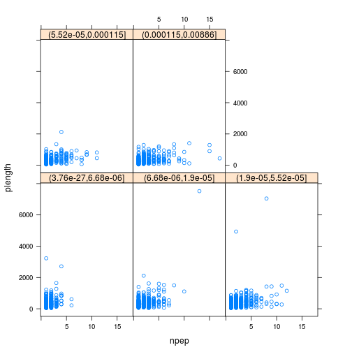

# Proteomics workflow

This workflow describes recent R / Bioconductor developments for
proteomics. Topics covered focus on support for open community-driven
formats for raw data and identification results, packages for
peptide-spectrum matching, quantitative proteomics, mass spectrometry
(MS) and quantitation data processing. Links to other packages and
references are also documented.


The follow packages will be used throughout this documents:


```r
library("mzR")
library("mzID")
library("MSnID")
```

```
## Error in library("MSnID"): there is no package called 'MSnID'
```

```r
library("MSGFplus")
```

```
## Error in library("MSGFplus"): there is no package called 'MSGFplus'
```

```r
library("MSnbase")
library("rpx")
library("MLInterfaces")
library("pRoloc")
library("pRolocdata")
library("rTANDEM")
```

```
## Error in library("rTANDEM"): there is no package called 'rTANDEM'
```

```r
library("MSGFplus")
```

```
## Error in library("MSGFplus"): there is no package called 'MSGFplus'
```

```r
library("MSGFgui")
```

```
## Error in library("MSGFgui"): there is no package called 'MSGFgui'
```

The most convenient way to install all the tutorials requirement (and
more related content), is to install
[`RforProteomics`](http://www.bioconductor.org/packages/release/data/experiment/html/RforProteomics.html)
with all its dependencies.


```r
library("BiocInstaller")
biocLite("RforProteomics", dependencies = TRUE)
```

The vignettes included in
[`RforProteomics`](http://www.bioconductor.org/packages/release/data/experiment/html/RforProteomics.html)
also contains useful material.

## Introduction


In Bioconductor version 3.0, there are respectively 65
[proteomics](http://bioconductor.org/packages/release/BiocViews.html#___Proteomics),
44
[mass spectrometry software packages](http://bioconductor.org/packages/release/BiocViews.html#___MassSpectrometry)
and 7
[mass spectrometry experiment packages](http://bioconductor.org/packages/release/BiocViews.html#___MassSpectrometryData). These
respective packages can be extracted with the `proteomicsPackages()`,
`massSpectrometryPackages()` and `massSpectrometryDataPackages()` and
explored interactively.


```r
library("RforProteomics")
pp <- proteomicsPackages()
display(pp)
```

## Mass spectrometry data


|Type           |Format                      |Package                                                                                   |
|:--------------|:---------------------------|:-----------------------------------------------------------------------------------------|
|raw            |mzML, mzXML, netCDF, mzData |[`mzR`](http://bioconductor.org/packages/release/bioc/html/mzR.html) (read)               |
|identification |mzIdentML                   |`mzR` and [`mzID`](http://bioconductor.org/packages/release/bioc/html/mzID.html) (read)   |
|quantitation   |mzQuantML                   |                                                                                          |
|peak lists     |mgf                         |[`MSnbase`](http://bioconductor.org/packages/release/bioc/html/MSnbase.html) (read/write) |
|other          |mzTab                       |[`MSnbase`](http://bioconductor.org/packages/release/bioc/html/MSnbase.html) (read/write) |

### Getting data from proteomics repositories

Contemporary MS-based proteomics data is disseminated through the
[ProteomeXchange](http://www.proteomexchange.org/) infrastructure,
which centrally coordinates submission, storage and dissemination
through multiple data repositories, such as the
[PRIDE](https://www.ebi.ac.uk/pride/archive/) data base at the EBI for
MS/MS experiments, [PASSEL](http://www.peptideatlas.org/passel/) at
the ISB for SRM data and the
[MassIVE](http://massive.ucsd.edu/ProteoSAFe/static/massive.jsp)
resource. The
[`rpx`](http://www.bioconductor.org/packages/release/bioc/html/rpx.html)
is an interface to ProteomeXchange and provides a basic and unified
access to PX data.


```r
library("rpx")
pxannounced()
```

```
## 15 new ProteomeXchange annoucements
```

```
##     Data.Set    Publication.Data             Message
## 1  PXD000898 2014-11-13 14:42:49                 New
## 2  PXD000922 2014-11-12 11:03:38                 New
## 3  PXD001243 2014-11-12 08:54:07                 New
## 4  PXD001045 2014-11-11 08:20:08                 New
## 5  PXD001090 2014-11-10 13:37:29                 New
## 6  PXD001089 2014-11-10 13:34:47                 New
## 7  PXD001099 2014-11-10 11:47:19 Updated information
## 8  PXD001203 2014-11-10 11:46:31                 New
## 9  PXD001074 2014-11-06 09:52:57                 New
## 10 PXD001165 2014-11-05 15:22:20                 New
## 11 PXD001423 2014-11-04 14:01:46                 New
## 12 PXD001422 2014-11-04 13:57:55                 New
## 13 PXD001421 2014-11-04 13:41:36                 New
## 14 PXD001420 2014-11-04 13:25:20                 New
## 15 PXD001419 2014-11-04 13:21:13                 New
```


```r
px <- PXDataset("PXD000001")
px
```

```
## Object of class "PXDataset"
##  Id: PXD000001 with 8 files
##  [1] 'F063721.dat' ... [8] 'erwinia_carotovora.fasta'
##  Use 'pxfiles(.)' to see all files.
```

```r
pxfiles(px)
```

```
## [1] "F063721.dat"                                                
## [2] "F063721.dat-mztab.txt"                                      
## [3] "PRIDE_Exp_Complete_Ac_22134.xml.gz"                         
## [4] "PRIDE_Exp_mzData_Ac_22134.xml.gz"                           
## [5] "PXD000001_mztab.txt"                                        
## [6] "TMT_Erwinia_1uLSike_Top10HCD_isol2_45stepped_60min_01.mzXML"
## [7] "TMT_Erwinia_1uLSike_Top10HCD_isol2_45stepped_60min_01.raw"  
## [8] "erwinia_carotovora.fasta"
```

Other metadata for the `px` dataset:


```r
pxtax(px)
pxurl(px)
pxref(px)
```

Data files can then be downloaded with the `pxget` function as
illustrated below. Alternatively, the file is available on the
workshop's Amazon virtual machine in `/data/Proteomics/data/`.


```r
mzf <- "TMT_Erwinia_1uLSike_Top10HCD_isol2_45stepped_60min_01.mzXML"
mzf <- file.path("/data/Proteomics/data", mzf)
if (!file.exists(mzf))
    mzf <- pxget(px, pxfiles(px)[6])
```

```
## Downloading 1 file
## TMT_Erwinia_1uLSike_Top10HCD_isol2_45stepped_60min_01.mzXML already present.
```

```r
mzf
```

```
## [1] "TMT_Erwinia_1uLSike_Top10HCD_isol2_45stepped_60min_01.mzXML"
```

### Handling raw MS data

The `mzR` package provides an interface to the
[proteowizard](http://proteowizard.sourceforge.net/) code base,
the legacy RAMP is a non-sequential parser and other C/C++ code to
access various raw data files, such as `mzML`, `mzXML`, `netCDF`, and
`mzData`. The data is accessed on-disk, i.e it does not get loaded
entirely in memory by default. The three main functions are
`openMSfile` to create a file handle to a raw data file, `header` to
extract metadata about the spectra contained in the file and `peaks`
to extract one or multiple spectra of interest. Other functions such
as `instrumentInfo`, or `runInfo` can be used to gather general
information about a run.


```r
library("mzR")
ms <- openMSfile(mzf)
ms
```

```
## Mass Spectrometry file handle.
## Filename:  TMT_Erwinia_1uLSike_Top10HCD_isol2_45stepped_60min_01.mzXML 
## Number of scans:  7534
```


```r
hd <- header(ms)
dim(hd)
```

```
## [1] 7534   21
```

```r
names(hd)
```

```
##  [1] "seqNum"                   "acquisitionNum"          
##  [3] "msLevel"                  "polarity"                
##  [5] "peaksCount"               "totIonCurrent"           
##  [7] "retentionTime"            "basePeakMZ"              
##  [9] "basePeakIntensity"        "collisionEnergy"         
## [11] "ionisationEnergy"         "lowMZ"                   
## [13] "highMZ"                   "precursorScanNum"        
## [15] "precursorMZ"              "precursorCharge"         
## [17] "precursorIntensity"       "mergedScan"              
## [19] "mergedResultScanNum"      "mergedResultStartScanNum"
## [21] "mergedResultEndScanNum"
```

#### Application

Extract the index of the MS2 spectrum with the highest base peak
intensity and plot its spectrum. Is the data centroided or in profile
mode?


```r
hd2 <- hd[hd$msLevel == 2, ]
i <- which.max(hd2$basePeakIntensity)
hd2[i, ]
```

```
##      seqNum acquisitionNum msLevel polarity peaksCount totIonCurrent
## 5404   5404           5404       2        1        275    2283283712
##      retentionTime basePeakMZ basePeakIntensity collisionEnergy
## 5404       2751.31   859.5032         354288224               0
##      ionisationEnergy    lowMZ  highMZ precursorScanNum precursorMZ
## 5404                0 100.5031 1995.63             5403    859.1722
##      precursorCharge precursorIntensity mergedScan mergedResultScanNum
## 5404               3          627820480          0                   0
##      mergedResultStartScanNum mergedResultEndScanNum
## 5404                        0                      0
```

```r
pi <- peaks(ms, hd2[i, 1])
mz <- hd2[i, "basePeakMZ"]

par(mfrow = c(2, 2))
plot(pi, type = "h", main = paste("Acquisition", i))
plot(pi, type = "h", xlim = c(mz-0.5, mz+0.5))

pj <- peaks(ms, 100)
plot(pj, type = "l", main = paste("Acquisition", 100))
plot(pj, type = "l", xlim = c(536,540))
```


### Handling identification data

The `RforProteomics` package distributes a small identification result
file (see
`?TMT_Erwinia_1uLSike_Top10HCD_isol2_45stepped_60min_01.mzid`) that we
load and parse using infrastructure from the 
[`mzID`](http://bioconductor.org/packages/release/bioc/html/mzID.html)
package.


```r
library("mzID")
(f <- dir(system.file("extdata", package = "RforProteomics"),
         pattern = "mzid", full.names=TRUE))
```

```
## [1] "/home/lg390/R/x86_64-unknown-linux-gnu-library/3.1/RforProteomics/extdata/TMT_Erwinia.mzid.gz"
```

```r
id <- mzID(f)
```

```
## reading TMT_Erwinia.mzid.gz... DONE!
```

```r
id
```

```
## An mzID object
## 
## Software used:   MS-GF+ (version: Beta (v10072))
## 
## Rawfile:         /home/lgatto/dev/00_github/RforProteomics/sandbox/TMT_Erwinia_1uLSike_Top10HCD_isol2_45stepped_60min_01.mzXML
## 
## Database:        /home/lgatto/dev/00_github/RforProteomics/sandbox/erwinia_carotovora.fasta
## 
## Number of scans: 5287
## Number of PSM's: 5563
```

Various data can be extracted from the `mzID` object, using one the
accessor functions such as `database`, `scans`, `peptides`, ... The
object can also be converted into a `data.frame` using the `flatten`
function.

The `mzR` package also support fast parsing of `mzIdentML` files with
the `openIDfile` function.

#### Application

Is there a relation between the length of a protein and the number of
identified peptides, conditioned by the (average) e-value of the
identifications?


```r
fid <- flatten(id)
x <- by(fid, fid$accession, function(x)
    c(unique(x$length),
      length(unique(x$pepseq)),
      mean(x$'ms-gf:specevalue')))
x <- data.frame(do.call(rbind, x))
colnames(x) <- c("plength", "npep", "eval")
x$bins <- cut(x$eval, summary(x$eval))
library("lattice")
xyplot(plength ~ npep | bins, data = x)
```

 

### MS/MS database search

While searches are generally performed using third-party software
independently of R or can be started from R using a `system` call, the
[`rTANDEM`](http://www.bioconductor.org/packages/release/bioc/html/rTANDEM.html)
package allows one to execute such searches using the X!Tandem
engine. The
[`shinyTANDEM`](http://www.bioconductor.org/packages/release/bioc/html/shinyTANDEM.html)
provides a interactive interface to explore the search results.


```r
library("rTANDEM")
?rtandem
library("shinyTANDEM")
?shinyTANDEM
```

Similarly, the
[`MSGFplus`](http://www.bioconductor.org/packages/release/bioc/html/MSGFplus.html)
package enables to perform a search using the MSGF+ engine, as illustrated below:


```r
library("MSGFplus")
parameters <- msgfPar(database = 'proteins.fasta',
                      tolerance='20 ppm',
                      instrument='TOF',
                      enzyme='Lys-C')
runMSGF(parameters, c('file1.mzML', 'file2.mzML'))
```

A graphical interface to perform the search the data and explore the
results is also available:


```r
library("MSGFgui")
MSGFgui()
```
### Analysing search results

The
[`MSnID`](http://bioconductor.org/packages/release/bioc/html/MSnID.html)
package can be used for post-search filtering of MS/MS
identifications. One starts with the construction of an `MSnID`
object that is populated with identification results that can be
imported from a `data.frame` or from `mzIdenML` files.


```r
library("MSnID")
```

```
## Error in library("MSnID"): there is no package called 'MSnID'
```

```r
msnid <- MSnID(".")
```

```
## Error in eval(expr, envir, enclos): could not find function "MSnID"
```

```r
PSMresults <- read.delim(system.file("extdata", "human_brain.txt",
                                     package="MSnID"),
                         stringsAsFactors=FALSE)
```

```
## Warning in file(file, "rt"): file("") only supports open = "w+" and open =
## "w+b": using the former
```

```
## Error in read.table(file = file, header = header, sep = sep, quote = quote, : no lines available in input
```

```r
psms(msnid) <- PSMresults
```

```
## Error in eval(expr, envir, enclos): object 'PSMresults' not found
```

```r
show(msnid)
```

```
## Error in show(msnid): error in evaluating the argument 'object' in selecting a method for function 'show': Error: object 'msnid' not found
```

The package then enables to define, optimise and apply filtering based
for example on missed cleavages, identification scores, precursor mass
errors, etc. and assess PSM, peptide and protein FDR levels.


```r
msnid$msmsScore <- -log10(msnid$`MS.GF.SpecEValue`)
```

```
## Error in eval(expr, envir, enclos): object 'msnid' not found
```

```r
msnid$absParentMassErrorPPM <- abs(mass_measurement_error(msnid))
```

```
## Error in eval(expr, envir, enclos): could not find function "mass_measurement_error"
```

```r
filtObj <- MSnIDFilter(msnid)
```

```
## Error in eval(expr, envir, enclos): could not find function "MSnIDFilter"
```

```r
filtObj$absParentMassErrorPPM <- list(comparison="<", threshold=5.0)
```

```
## Error in filtObj$absParentMassErrorPPM <- list(comparison = "<", threshold = 5): object 'filtObj' not found
```

```r
filtObj$msmsScore <- list(comparison=">", threshold=8.0)
```

```
## Error in filtObj$msmsScore <- list(comparison = ">", threshold = 8): object 'filtObj' not found
```

```r
show(filtObj)
```

```
## Error in show(filtObj): error in evaluating the argument 'object' in selecting a method for function 'show': Error: object 'filtObj' not found
```

```r
filtObj.grid <- optimize_filter(filtObj, msnid, fdr.max=0.01,
                                method="Grid", level="peptide",
                                n.iter=500)
```

```
## Error in eval(expr, envir, enclos): could not find function "optimize_filter"
```

```r
show(filtObj.grid)
```

```
## Error in show(filtObj.grid): error in evaluating the argument 'object' in selecting a method for function 'show': Error: object 'filtObj.grid' not found
```

```r
msnid <- apply_filter(msnid, filtObj.grid)
```

```
## Error in eval(expr, envir, enclos): could not find function "apply_filter"
```

```r
show(msnid)
```

```
## Error in show(msnid): error in evaluating the argument 'object' in selecting a method for function 'show': Error: object 'msnid' not found
```

The resulting data can be exported to a `data.frame` or to a dedicated
`MSnSet` data structure for quantitative MS data, described below, and
further processed and analyses using appropriate statistical tests.

## High-level data interface

The above sections introduced low-level interfaces to raw and
identification results. The
[`MSnbase`](http://bioconductor.org/packages/release/bioc/html/MSnbase.html)
package provides abstractions for raw data through the `MSnExp` class
and containers for quantification data via the `MSnSet` class. Both
store the actual assay data (spectra or quantitation matrix) and
sample and feature metadata, accessed with `spectra` (or the
`[`, `[[` operators) or `exprs`, `pData` and `fData`.

The figure below give a schematics of an `MSnSet` instance and the
relation between the assay data and the respective feature and sample
metadata.


Another useful slot is `processingData`, accessed with `processingData(.)`, that records all the processing that objects have undergone since their creation (see examples below).

The `readMSData` will parse the raw data, extract the MS2 spectra and
construct an MS experiment file.


```r
library("MSnbase")
quantFile <- dir(system.file(package = "MSnbase", dir = "extdata"),
                 full.name = TRUE, pattern = "mzXML$")
quantFile
```

```
## [1] "/home/lg390/R/x86_64-unknown-linux-gnu-library/3.2/MSnbase/extdata/dummyiTRAQ.mzXML"
```

```r
msexp <- readMSData(quantFile, verbose=FALSE)
msexp
```

```
## Object of class "MSnExp"
##  Object size in memory: 0.2 Mb
## - - - Spectra data - - -
##  MS level(s): 2 
##  Number of MS1 acquisitions: 1 
##  Number of MSn scans: 5 
##  Number of precursor ions: 5 
##  4 unique MZs
##  Precursor MZ's: 437.8 - 716.34 
##  MSn M/Z range: 100 2016.66 
##  MSn retention times: 25:1 - 25:2 minutes
## - - - Processing information - - -
## Data loaded: Sun Nov 16 09:10:27 2014 
##  MSnbase version: 1.15.2 
## - - - Meta data  - - -
## phenoData
##   rowNames: 1
##   varLabels: sampleNames
##   varMetadata: labelDescription
## Loaded from:
##   dummyiTRAQ.mzXML 
## protocolData: none
## featureData
##   featureNames: X1.1 X2.1 ... X5.1 (5 total)
##   fvarLabels: spectrum
##   fvarMetadata: labelDescription
## experimentData: use 'experimentData(object)'
```

The identification results stemming from the same raw data file can
then be used to add PSM matches.


```r
## find path to a mzIdentML file
identFile <- dir(system.file(package = "MSnbase", dir = "extdata"),
                 full.name = TRUE, pattern = "dummyiTRAQ.mzid")
identFile
```

```
## [1] "/home/lg390/R/x86_64-unknown-linux-gnu-library/3.2/MSnbase/extdata/dummyiTRAQ.mzid"
```

```r
msexp <- addIdentificationData(msexp, identFile)
```

```
## reading dummyiTRAQ.mzid... DONE!
```

```r
fData(msexp)
```

```
##      spectrum scan number(s) passthreshold rank calculatedmasstocharge
## X1.1        1              1          TRUE    1               645.0375
## X2.1        2              2          TRUE    1               546.9633
## X3.1        3             NA            NA   NA                     NA
## X4.1        4             NA            NA   NA                     NA
## X5.1        5              5          TRUE    1               437.2997
##      experimentalmasstocharge chargestate ms-gf:denovoscore ms-gf:evalue
## X1.1                 645.3741           3                77     79.36958
## X2.1                 546.9586           3                39     13.46615
## X3.1                       NA          NA                NA           NA
## X4.1                       NA          NA                NA           NA
## X5.1                 437.8040           2                 5    366.38422
##      ms-gf:rawscore ms-gf:specevalue assumeddissociationmethod
## X1.1            -39     5.527468e-05                       CID
## X2.1            -30     9.399048e-06                       CID
## X3.1             NA               NA                      <NA>
## X4.1             NA               NA                      <NA>
## X5.1            -42     2.577830e-04                       CID
##      isotopeerror isdecoy post  pre end start       accession length
## X1.1            1   FALSE    A    R 186   170 ECA0984;ECA3829    231
## X2.1            0   FALSE    A    K  62    50         ECA1028    275
## X3.1         <NA>      NA <NA> <NA>  NA    NA            <NA>     NA
## X4.1         <NA>      NA <NA> <NA>  NA    NA            <NA>     NA
## X5.1            1   FALSE    L    K  28    22         ECA0510    166
##                                                                      description
## X1.1 DNA mismatch repair protein;acetolactate synthase isozyme III large subunit
## X2.1          2,3,4,5-tetrahydropyridine-2,6-dicarboxylate N-succinyltransferase
## X3.1                                                                        <NA>
## X4.1                                                                        <NA>
## X5.1                    putative capsular polysacharide biosynthesis transferase
##                 pepseq modified modification             databaseFile
## X1.1 VESITARHGEVLQLRPK    FALSE           NA erwinia_carotovora.fasta
## X2.1     IDGQWVTHQWLKK    FALSE           NA erwinia_carotovora.fasta
## X3.1              <NA>       NA           NA                     <NA>
## X4.1              <NA>       NA           NA                     <NA>
## X5.1           LVILLFR    FALSE           NA erwinia_carotovora.fasta
##      identFile nprot npep.prot npsm.prot npsm.pep
## X1.1         2     2         1         1        1
## X2.1         2     1         1         1        1
## X3.1        NA    NA        NA        NA       NA
## X4.1        NA    NA        NA        NA       NA
## X5.1         2     1         1         1        1
```


```r
msexp[[1]]
```

```
## Object of class "Spectrum2"
##  Precursor: 645.3741 
##  Retention time: 25:1 
##  Charge: 3 
##  MSn level: 2 
##  Peaks count: 2921 
##  Total ion count: 668170086
```

```r
plot(msexp[[1]], full=TRUE)
```


```r
as(msexp[[1]], "data.frame")[100:105, ]
```

```
##           mz          i
## 100 141.0990 588594.812
## 101 141.1015 845401.250
## 102 141.1041 791352.125
## 103 141.1066 477623.000
## 104 141.1091 155376.312
## 105 141.1117   4752.541
```

### Quantitative proteomics

There are a wide range of proteomics quantitation techniques that can
broadly be classified as labelled vs. label-free, depending whether
the features are labelled prior the MS acquisition and the MS level at
which quantitation is inferred, namely MS1 or MS2. 


|    |Label-free |Labelled   |
|:---|:----------|:----------|
|MS1 |XIC        |SILAC, 15N |
|MS2 |Counting   |iTRAQ, TMT |

In terms of raw data quantitation, most efforts have been devoted to
MS2-level quantitation. Label-free XIC quantitation has however been
addressed in the frame of metabolomics data processing by the
[`xcms`](http://bioconductor.org/packages/release/bioc/html/xcms.html)
infrastructure. 


An `MSnExp` is converted to an `MSnSet` by the `quantitation`
method. Below, we use the iTRAQ 4-plex isobaric tagging strategy
(defined by the `iTRAQ4` parameter; other tags are available).


```r
plot(msexp[[1]], full=TRUE, reporters = iTRAQ4)
```


```r
msset <- quantify(msexp, method = "trap", reporters = iTRAQ4, verbose=FALSE)
exprs(msset)
```

```
##      iTRAQ4.114 iTRAQ4.115 iTRAQ4.116 iTRAQ4.117
## X1.1   4483.320   4873.996   6743.441   4601.378
## X2.1   1918.082   1418.040   1117.601   1581.954
## X3.1  15210.979  15296.256  15592.760  16550.502
## X4.1   4133.103   5069.983   4724.845   4694.801
## X5.1  11947.881  13061.875  12809.491  12911.479
```

```r
processingData(msset)
```

```
## - - - Processing information - - -
## Data loaded: Sun Nov 16 09:10:27 2014 
## iTRAQ4 quantification by trapezoidation: Sun Nov 16 09:10:28 2014 
##  MSnbase version: 1.15.2
```

Other MS2 quantitation methods available in `quantify` include the
(normalised) spectral index `SI` and (normalised) spectral abundance
factor `SAF` or simply a simple count method.


```r
exprs(si <- quantify(msexp, method = "SIn"))     
```

```
##                   1
## ECA0510 0.003588641
## ECA1028 0.001470129
```

```r
exprs(saf <- quantify(msexp, method = "NSAF"))
```

```
##                 1
## ECA0510 0.6235828
## ECA1028 0.3764172
```

Note that spectra that have not been assigned any peptide (`NA`) or
that match non-unique peptides (`npsm > 1`) are discarded in the
counting process.

**See also** The
[`isobar`](http://www.bioconductor.org/packages/release/bioc/html/isobar.html)
package supports quantitation from centroided `mgf` peak lists or its
own tab-separated files that can be generated from Mascot and Phenyx
vendor files.

### Importing third-party data

The PSI `mzTab` file format is aimed at providing a simpler (than XML
formats) and more accessible file format to the wider community. It is
composed of a key-value metadata section and peptide/protein/small
molecule tabular sections. 


```r
mztf <- pxget(px, pxfiles(px)[2])
```

```
## Downloading 1 file
## F063721.dat-mztab.txt already present.
```

```r
(mzt <- readMzTabData(mztf, what = "PEP"))
```

```
## Warning in readMzTabData(mztf, what = "PEP"): Support for mzTab version
## 0.9 only. Support will be added soon.
```

```
## Detected a metadata section
## Detected a peptide section
```

```
## MSnSet (storageMode: lockedEnvironment)
## assayData: 1528 features, 6 samples 
##   element names: exprs 
## protocolData: none
## phenoData
##   rowNames: sub[1] sub[2] ... sub[6] (6 total)
##   varLabels: abundance
##   varMetadata: labelDescription
## featureData
##   featureNames: 1 2 ... 1528 (1528 total)
##   fvarLabels: sequence accession ... uri (14 total)
##   fvarMetadata: labelDescription
## experimentData: use 'experimentData(object)'
## Annotation:  
## - - - Processing information - - -
## mzTab read: Sun Nov 16 09:10:31 2014 
##  MSnbase version: 1.15.2
```

It is also possible to import arbitrary spreadsheets as `MSnSet`
objects into R with the `readMSnSet2` function. The main 2 arguments
of the function are (1) a text-based spreadsheet and (2) column names
of indices that identify the quantitation data.


```r
csv <- dir(system.file ("extdata" , package = "pRolocdata"),
           full.names = TRUE, pattern = "pr800866n_si_004-rep1.csv")
getEcols(csv, split = ",")
```

```
##  [1] "\"Protein ID\""              "\"FBgn\""                   
##  [3] "\"Flybase Symbol\""          "\"No. peptide IDs\""        
##  [5] "\"Mascot score\""            "\"No. peptides quantified\""
##  [7] "\"area 114\""                "\"area 115\""               
##  [9] "\"area 116\""                "\"area 117\""               
## [11] "\"PLS-DA classification\""   "\"Peptide sequence\""       
## [13] "\"Precursor ion mass\""      "\"Precursor ion charge\""   
## [15] "\"pd.2013\""                 "\"pd.markers\""
```

```r
ecols <- 7:10
res <- readMSnSet2(csv, ecols)
head(exprs(res))
```

```
##   area.114 area.115 area.116 area.117
## 1 0.379000 0.281000 0.225000 0.114000
## 2 0.420000 0.209667 0.206111 0.163889
## 3 0.187333 0.167333 0.169667 0.476000
## 4 0.247500 0.253000 0.320000 0.179000
## 5 0.216000 0.183000 0.342000 0.259000
## 6 0.072000 0.212333 0.573000 0.142667
```

```r
head(fData(res))
```

```
##   Protein.ID        FBgn Flybase.Symbol No..peptide.IDs Mascot.score
## 1    CG10060 FBgn0001104    G-ialpha65A               3       179.86
## 2    CG10067 FBgn0000044         Act57B               5       222.40
## 3    CG10077 FBgn0035720        CG10077               5       219.65
## 4    CG10079 FBgn0003731           Egfr               2        86.39
## 5    CG10106 FBgn0029506        Tsp42Ee               1        52.10
## 6    CG10130 FBgn0010638      Sec61beta               2        79.90
##   No..peptides.quantified PLS.DA.classification Peptide.sequence
## 1                       1                    PM                 
## 2                       9                    PM                 
## 3                       3                                       
## 4                       2                    PM                 
## 5                       1                              GGVFDTIQK
## 6                       3              ER/Golgi                 
##   Precursor.ion.mass Precursor.ion.charge     pd.2013 pd.markers
## 1                                                  PM    unknown
## 2                                                  PM    unknown
## 3                                             unknown    unknown
## 4                                                  PM    unknown
## 5            626.887                    2 Phenotype 1    unknown
## 6                                            ER/Golgi         ER
```

## Data processing and analysis

### Processing and normalisation

Each different types of quantitative data will require their own
pre-processing and normalisation steps. Both `isobar` and `MSnbase`
allow to correct for isobaric tag impurities normalise the
quantitative data.


```r
data(itraqdata)
qnt <- quantify(itraqdata, method = "trap",
                reporters = iTRAQ4, verbose = FALSE)
impurities <- matrix(c(0.929,0.059,0.002,0.000,
                       0.020,0.923,0.056,0.001,
                       0.000,0.030,0.924,0.045,
                       0.000,0.001,0.040,0.923),
                     nrow=4, byrow = TRUE)
## or, using makeImpuritiesMatrix()
## impurities <- makeImpuritiesMatrix(4)
qnt.crct <- purityCorrect(qnt, impurities)
processingData(qnt.crct)
```

```
## - - - Processing information - - -
## Data loaded: Wed May 11 18:54:39 2011 
## iTRAQ4 quantification by trapezoidation: Sun Nov 16 09:10:32 2014 
## Purity corrected: Sun Nov 16 09:10:32 2014 
##  MSnbase version: 1.1.22
```


```r
plot0 <- function(x, y, main = "") {
    old.par <- par(no.readonly = TRUE)
    on.exit(par(old.par))
    par(mar = c(4, 4, 1, 1))
    par(mfrow = c(2, 2))
    sx <- sampleNames(x)
    sy <- sampleNames(y)
    for (i in seq_len(ncol(x))) {
        plot(exprs(x)[, i], exprs(y)[, i], log = "xy",
             xlab = sx[i], ylab = sy[i])
        grid()
    }
}

plot0(qnt, qnt.crct)
```


Various normalisation methods can be applied the `MSnSet` instances
using the `normalise` method: variance stabilisation (`vsn`), quantile
(`quantiles`), median or mean centring (`center.media` or
`center.mean`), ...


```r
qnt.crct.nrm <- normalise(qnt.crct,"quantiles")
plot0(qnt, qnt.crct.nrm)
```


The `combineFeatures` method combines spectra/peptides quantitation
values into protein data. The grouping is defined by the `groupBy`
parameter, which is generally taken from the feature metadata (protein
accessions, for example).


```r
## arbitraty grouping
g <- factor(c(rep(1, 25), rep(2, 15), rep(3, 15)))
prt <- combineFeatures(qnt.crct.nrm, groupBy = g, fun = "sum")
```

```
## Combined 55 features into 3 using sum
```

```r
processingData(prt)
```

```
## - - - Processing information - - -
## Data loaded: Wed May 11 18:54:39 2011 
## iTRAQ4 quantification by trapezoidation: Sun Nov 16 09:10:32 2014 
## Purity corrected: Sun Nov 16 09:10:32 2014 
## Normalised (quantiles): Sun Nov 16 09:10:32 2014 
## Combined 55 features into 3 using sum: Sun Nov 16 09:10:32 2014 
##  MSnbase version: 1.1.22
```

Finally, proteomics data analysis is generally hampered by missing
values. Missing data imputation is a sensitive operation whose success
will be guided by many factors, such as degree and (non-)random nature
of the missingness. Missing value in `MSnSet` instances can be
filtered out and imputed using the `filterNA` and `impute` functions.


```r
set.seed(1)
qnt0 <- qnt
exprs(qnt0)[sample(prod(dim(qnt0)), 10)] <- NA
table(is.na(qnt0))
```

```
## 
## FALSE  TRUE 
##   209    11
```

```r
qnt00 <- filterNA(qnt0)
dim(qnt00)
```

```
## [1] 44  4
```

```r
qnt.imp <- impute(qnt0)
plot0(qnt, qnt.imp)
```


#### Application

The `mzt` instance created from the `mzTab` file has the following is
a TMT 6-plex with the following design:

   In this TMT 6-plex experiment, four exogenous proteins were spiked
   into an equimolar *Erwinia carotovora* lysate with varying
   proportions in each channel of quantitation; yeast enolase (ENO) at
   10:5:2.5:1:2.5:10, bovine serum albumin (BSA) at 1:2.5:5:10:5:1,
   rabbit glycogen phosphorylase (PHO) at 2:2:2:2:1:1 and bovin
   cytochrome C (CYT) at 1:1:1:1:1:2. Proteins were then digested,
   differentially labelled with TMT reagents, fractionated by reverse
   phase nanoflow UPLC (nanoACQUITY, Waters), and analysed on an LTQ
   Orbitrap Velos mass spectrometer (Thermo Scientic).

Explore the `mzt` data using some of the illustrated functions. The
heatmap and MAplot (see `MAplot` function), taken from the
[`RforProteomics`](http://www.bioconductor.org/packages/release/data/experiment/html/RforProteomics.html)
vignette, have been produced using the same data.


### Statistical analysis

R in general and Bioconductor in particular are well suited for the
statistical analysis of data. Several packages provide dedicated
resources for proteomics data:

- [`MSstats`](http://www.bioconductor.org/packages/release/bioc/html/MSstats.html):
  A set of tools for statistical relative protein significance
  analysis in DDA, SRM and DIA experiments.

- [`msmsTest`](http://www.bioconductor.org/packages/release/bioc/html/msmsTests.html):
  Statistical tests for label-free LC-MS/MS data by spectral counts,
  to discover differentially expressed proteins between two biological
  conditions. Three tests are available: Poisson GLM regression,
  quasi-likelihood GLM regression, and the negative binomial of the
  edgeR package.

<!-- ```{r, msmstest} -->
<!-- library(msmsTests) -->
<!-- data(msms.dataset) -->
<!-- msms.dataset -->
<!-- e <- pp.msms.data(msms.dataset) -->
<!-- e -->
     
<!-- null.f <- "y~batch" -->
<!-- alt.f <- "y~treat+batch" -->
<!-- div <- apply(exprs(e),2,sum) -->
<!-- res <- msms.edgeR(e,alt.f,null.f,div=div,fnm="treat") -->
     
<!-- head(res) -->
<!-- ``` -->

- [`isobar`](http://www.bioconductor.org/packages/release/bioc/html/isobar.html)
  also provides dedicated infrastructure for the statistical analysis of isobaric data. 

### Machine learning

The
[`MLInterfaces`](http://www.bioconductor.org/packages/release/bioc/html/MLInterfaces.html)
package provides a unified interface to a wide range of machine
learning algorithms. Initially developed for microarray and
`ExpressionSet` instances, the
[`pRoloc`](http://www.bioconductor.org/packages/release/bioc/html/pRoloc.html)
package enables application of these algorithms to `MSnSet` data.


```r
library("MLInterfaces")
library("pRoloc")
library("pRolocdata")
data(dunkley2006)
traininds <- which(fData(dunkley2006)$markers != "unknown")
ans <- MLearn(markers ~ ., data = t(dunkley2006), knnI(k = 5), traininds)
ans
```

```
## MLInterfaces classification output container
## The call was:
## MLearn(formula = markers ~ ., data = t(dunkley2006), .method = knnI(k = 5), 
##     trainInd = traininds)
## Predicted outcome distribution for test set:
## 
##      ER lumen   ER membrane         Golgi Mitochondrion       Plastid 
##             5           140            67            51            29 
##            PM      Ribosome           TGN       vacuole 
##            89            31             6            10 
## Summary of scores on test set (use testScores() method for details):
##    Min. 1st Qu.  Median    Mean 3rd Qu.    Max. 
##  0.4000  1.0000  1.0000  0.9332  1.0000  1.0000
```


```r
kcl <- MLearn( ~ ., data = dunkley2006, kmeansI, centers = 12)
kcl
```

```
## clusteringOutput: partition table
## 
##   1   2   3   4   5   6   7   8   9  10  11  12 
##  56  29  55  49  29  78  40   9 112  44  31 157 
## The call that created this object was:
## MLearn(formula = ~., data = dunkley2006, .method = kmeansI, centers = 12)
```

```r
plot(kcl, exprs(dunkley2006))
```


```r
hcl <- MLearn( ~ ., data = t(dunkley2006), hclustI(distFun =  dist, cutParm = list(k = 4)))
hcl
```

```
## clusteringOutput: partition table
## 
## 1 2 3 4 
## 4 4 4 4 
## The call that created this object was:
## MLearn(formula = ~., data = t(dunkley2006), .method = hclustI(distFun = dist, 
##     cutParm = list(k = 4)))
```

```r
plot(hcl, exprs(t(dunkley2006)))
```


## Annotation

All the
[Bioconductor annotation infrastructure](http://bioconductor.org/help/workflows/annotation/annotation/),
such as
[`biomaRt`](http://bioconductor.org/packages/release/bioc/html/biomaRt.html),
[`GO.db`](http://www.bioconductor.org/packages/release/data/annotation/html/GO.db.html),
organism specific annotations, .. are directly relevant to the
analysis of proteomics data. Some proteomics-centred annotations such
as the PSI Mass Spectrometry Ontology, Molecular Interaction (PSI MI
2.5) or Protein Modifications are available through the
[`rols`](http://www.bioconductor.org/packages/release/bioc/html/rols.html). Data
from the [Human Protein Atlas](http://www.proteinatlas.org/) is
available via the
[`hpar`](http://www.bioconductor.org/packages/release/bioc/html/hpar.html)
package.

## Other relevant packages/pipelines

- Analysis of post translational modification with
  [`isobar`](http://www.bioconductor.org/packages/release/bioc/html/isobar.html).
- Analysis of label-free data from a Synapt G2 (including ion
  mobility) with
  [`synapter`](http://www.bioconductor.org/packages/release/bioc/html/synapter.html).
- Analysis of spatial proteomics data with
  [`pRoloc`](http://www.bioconductor.org/packages/release/bioc/html/pRoloc.html).
- Analysis of MALDI data with the
  [`MALDIquant`](http://cran.r-project.org/web/packages/MALDIquant/index.html)
  package.
- Access to the Proteomics Standard Initiative Common QUery InterfaCe
  with the
  [`PSICQUIC`](http://www.bioconductor.org/packages/release/bioc/html/PSICQUIC.html)
  package.

Additional relevant packages are described in the
[`RforProteomics`](http://www.bioconductor.org/packages/release/data/experiment/html/RforProteomics.html)
vignettes. 

## Session information


```
## R Under development (unstable) (2014-11-01 r66923)
## Platform: x86_64-unknown-linux-gnu (64-bit)
## 
## attached base packages:
## [1] stats4    parallel  stats     graphics  grDevices utils     datasets 
## [8] methods   base     
## 
## other attached packages:
##  [1] lattice_0.20-29      pRolocdata_1.5.1     pRoloc_1.7.0        
##  [4] MLInterfaces_1.47.0  cluster_1.15.3       annotate_1.45.0     
##  [7] XML_3.98-1.1         AnnotationDbi_1.29.1 GenomeInfoDb_1.3.7  
## [10] IRanges_2.1.10       S4Vectors_0.5.6      rpx_1.3.0           
## [13] mzID_1.5.1           RforProteomics_1.5.2 MSnbase_1.15.2      
## [16] BiocParallel_1.1.5   mzR_2.1.1            Rcpp_0.11.3         
## [19] Biobase_2.27.0       BiocGenerics_0.13.1  BiocInstaller_1.17.1
## [22] knitr_1.8           
## 
## loaded via a namespace (and not attached):
##  [1] affy_1.45.0                  affyio_1.35.0               
##  [3] base64enc_0.1-2              BatchJobs_1.5               
##  [5] BBmisc_1.8                   biocViews_1.35.6            
##  [7] BradleyTerry2_1.0-5          brew_1.0-6                  
##  [9] brglm_0.5-9                  car_2.0-21                  
## [11] caret_6.0-37                 Category_2.33.0             
## [13] checkmate_1.5.0              class_7.3-11                
## [15] codetools_0.2-9              colorspace_1.2-4            
## [17] DBI_0.3.1                    digest_0.6.4                
## [19] doParallel_1.0.8             e1071_1.6-4                 
## [21] evaluate_0.5.5               fail_1.2                    
## [23] FNN_1.1                      foreach_1.4.2               
## [25] formatR_1.0                  gdata_2.13.3                
## [27] genefilter_1.49.2            ggplot2_1.0.0               
## [29] graph_1.45.0                 grid_3.2.0                  
## [31] gridSVG_1.4-0                GSEABase_1.29.0             
## [33] gtable_0.1.2                 gtools_3.4.1                
## [35] htmltools_0.2.6              httpuv_1.3.2                
## [37] impute_1.41.0                interactiveDisplay_1.5.0    
## [39] interactiveDisplayBase_1.5.1 iterators_1.0.7             
## [41] kernlab_0.9-19               labeling_0.3                
## [43] limma_3.23.1                 lme4_1.1-7                  
## [45] lpSolve_5.6.10               MALDIquant_1.11             
## [47] MASS_7.3-35                  Matrix_1.1-4                
## [49] mclust_4.4                   mime_0.2                    
## [51] minqa_1.2.4                  munsell_0.4.2               
## [53] mvtnorm_1.0-0                nlme_3.1-118                
## [55] nloptr_1.0.4                 nnet_7.3-8                  
## [57] pcaMethods_1.57.0            pls_2.4-3                   
## [59] plyr_1.8.1                   preprocessCore_1.29.0       
## [61] proto_0.3-10                 proxy_0.4-13                
## [63] R6_2.0.1                     randomForest_4.6-10         
## [65] RBGL_1.43.0                  RColorBrewer_1.0-5          
## [67] RCurl_1.95-4.3               rda_1.0.2-2                 
## [69] reshape2_1.4                 RJSONIO_1.3-0               
## [71] R.methodsS3_1.6.1            R.oo_1.18.0                 
## [73] rpart_4.1-8                  RSQLite_1.0.0               
## [75] RUnit_0.4.27                 R.utils_1.34.0              
## [77] sampling_2.6                 scales_0.2.4                
## [79] sendmailR_1.2-1              sfsmisc_1.0-26              
## [81] shiny_0.10.2.1               splines_3.2.0               
## [83] stringr_0.6.2                survival_2.37-7             
## [85] tools_3.2.0                  vsn_3.35.0                  
## [87] xtable_1.7-4                 zlibbioc_1.13.0
```
