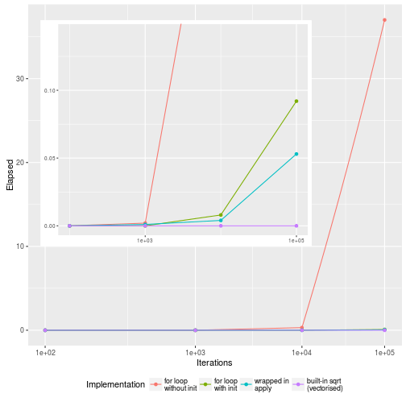

# Overview

- Benchmarking
- Profiling
- Optimisation
- Memory
- Rcpp

# A word of caution

Knuth, Donald. *Structured Programming with `go to` Statements*, ACM
Journal Computing Surveys, Vol 6, No. 4, Dec. 1974. p.268.

> We should forget about small efficiencies, say about 97% of the
> time: premature optimization is the root of all evil. Yet we should
> not pass up our opportunities in that critical 3%. A good programmer
> will not be lulled into complacency by such reasoning, he will be
> wise to look carefully at the critical code; but only after that
> code has been identified


Robert Gentleman, in R Programming for Bioinformatics, 2008,
about R's built-in C interfaces:

> Since R is not compiled, in some situations its performance can be
> substantially improved by writing code in a compiled language. There
> are also reasons not to write code in other languages, and in
> particular we caution against premature optimization, prototyping in
> R is often cost effective. And in our experience very few routines
> need to be implemented in other languages for efficiency
> reasons. Another substantial reason not to use an implementation in
> some other language is increased complexity. The use of another
> language almost always results in higher maintenance costs and less
> stability. In addition, any extensions or enhancements of the code
> will require someone that is proficient in both R and the other
> language.

(`Rcpp` does make some of the above caution statements slightly less
critical.)

# R performance

R is not a fast language, but it is most of the time *fast enough* for
what we want to do, in particular with respect to interactive data
analysis. In such cases a slow but expressive and flexible language is
way better than a fast but less expressive and flexible
alternative. It is also relatively easy to avoid bad R programming
idioms that make code too slow.

## Timing, benchmarking

Let's compare two implementation of the square root calculation:
`sqrt(x)` and `x ^ 0.5`.


```r
x <- runif(100)
system.time(sqrt(x))
system.time(x^0.5)
```

Does this work? Try


```r
x <- runif(1e5)
system.time(sqrt(x))
system.time(x^0.5)
```

We want to repeat timings multiple times:


```r
summary(replicate(10, system.time(x^0.5)[["elapsed"]]))
```

A better approach for such cases is the
[`microbenchmark` package](https://cran.rstudio.com/web/packages/microbenchmark/index.html),
which is ideal to accurately benchmark small pieces of code, in
particular sub-millisecond (nanoseconds) executions (see units below). 

Each expression is run 100 times (controlled by the `times`
argument). In addition, the execution order is randomised and summary
timings are reported.


```r
x <- runif(100)
library(microbenchmark)

microbenchmark(sqrt(x),
               x ^ 0.5)
```

# Profiling

## Profiling tools

Sampling or statistical profiling: at regular intervals, stop the
execution and record which functions are being executing and the call
stack. 

- `Rprof` (and `summaryRprof`): record and summarise timings at fixed
  intervals (default `interval` is 0.02 seconds).
  
- [`proftools`](https://cran.rstudio.com/web/packages/proftools/index.html)
  package: Tools for examining `Rprof` profile output. Comes with an
  extensive
  [vignette](https://cran.rstudio.com/web/packages/proftools/vignettes/proftools.pdf).
    
- [`profvis`](https://github.com/rstudio/profvis): interactive
  visualisation collected by `Rprof`, whith emphasis on *lines of
  code*. See also and
  [*Introduction to profvis*](http://rpubs.com/wch/123888).
  
    
  
- ([`lineprof`](https://github.com/hadley/lineprof) [\*] package: each
  *line of code* is profiled. This is less precise (than `Rprof`) but
  easier to interprete. Code must be sourced with `source()`.)
- ([`profr`](https://cran.rstudio.com/web/packages/profr/index.html)
  package [\*]: provides an alternative data structure and visual
  rendering for the profiling information generated by `Rprof).

[\*] [`lineprof`](https://github.com/hadley/lineprof) and
[`profr`](https://cran.rstudio.com/web/packages/profr/index.html) and
are now deprecated in favour of
[`profvis`](https://github.com/rstudio/profvis).


## `Rprof`


```r
m <- matrix(rnorm(1e6), ncol = 10)

Rprof("rprof")
res <- apply(m, 1, mean, trim=.3)
Rprof(NULL)
summaryRprof("rprof")
```

## `profvis`

Needs to `source()` the code or directly input the code to have access
to the individual lines.


```r
f <- function() {
  pause(0.1)
  g()
  h()
}

g <- function() {
  pause(0.1)
  h()
}

h <- function() {
  pause(0.1)
}
```


```r
library("profvis")
source("lineprof-example.R")
profvis(f())
```


## Limitations

- Not profiling of C/C++ code, or primitive functions, or byte
  compiled code.
- Anonymous functions are labelled as *anonymous*; name them
  explicitly in such cases.

## Exercise

Profile the code chunk that calculates the timmed means using
`profvis` and interpret the results.


```r
profvis({
    m <- matrix(rnorm(1e6), ncol = 10)
    res <- apply(m, 1, mean, trim=.3)
    sum(res)
})
```

# Optimisation

Optimisations often have their own costs:

- Trade-off fast vs dangerous, flexibility/functionality vs performance.
- Use any assumptions about the data, at the cost of generalisation. 

Pat Burns reminds us that 

> Our first duty is to create clear, correct code. Only consider
> optimising your code when:

- The code is debugged and stable.
- Optimisation is likely to make a significant impact. 

then

1. Find the major bottleneck: code *profiling*.
2. Try to eliminate it.
3. Repeat until *fast enough*: ideally, define fast enough in advance.

#### Make sure the code remains correct


```r
x <- runif(100)
all.equal(sqrt(x), x ^ 0.5)
```

```
## [1] TRUE
```

and/or unit tests to compare different implementations (and regression test).

#### Are implementations really equivalent?


```r
library("sequences")
gccount
gccountr <- function(x) table(strsplit(x, "")[[1]])
gccountr2 <- function(x) tabulate(factor(strsplit(x, "")[[1]]))
```

Checking that our different implementations give the same results:


```r
s <- paste(sample(c("A", "C", "G", "T"),
                  100, replace = TRUE),
           collapse = "")

gccount(s)
gccountr(s)
gccountr2(s)
```

But are they really the same? Are we really comparing the same
functionalities?

Is it worth it?


```r
library("microbenchmark")
microbenchmark(gccount(s),
                     gccountr(s),
                     gccountr2(s),
                     times = 1e4, 
					 unit = "eps")
```


```r
library("ggplot2")
mb <- microbenchmark(gccount(s),
                     gccountr(s),
                     gccountr2(s))
print(mb)
microbenchmark:::autoplot.microbenchmark(mb)
```

## Look for existing solutions

- `readr::read_csv` or  `data.table::fread` instead of `read_csv`

## Do as little as possible

- `gccountr` vs `gccountr2` example above
- simpler data structures
- set `colClasses` in `read.csv`

- Usual suspects: names, growing objects:

## Names


```r
make_id2GO <- function(n = 1e3) { ## could be 1e4 - 1e5
    gn <- sprintf(paste0("ENSG%0", 10, "d"), sample(1e6, n))
    goid <- function(n = 10) sprintf(paste0("GO:%0", 10, "d"), sample(1e6, n))
    structure(replicate(n, goid(sample(50, 1))),
              names = gn)
}
id2GO <- make_id2GO()
```

We have a list of 1000 genes, and each of these genes is
characterised by a set of 1 to 50 GO terms. 

To obtain the go terms, we `unlist` the gene list.


```r
length(id2GO)
str(head(id2GO))
str(unlist(id2GO))
```

This can be executed much faster if we ignore the names in the
original list.


```r
library(microbenchmark)
microbenchmark(unlist(l),
               unlist(l, use.names = FALSE),
               times = 10)
```

## Initialise, do not grow dynamically (to avoid copies)


```r
f1 <- function(n) {
  a <- NULL 
  for (i in 1:n) a <- c(a, sqrt(i))
  a
}

f2 <- function(n) {
  a <- numeric(n)
  for (i in 1:n) a[i] <- sqrt(i)
  a
}
```


```r
microbenchmark(f1(1e3), f2(1e3))
microbenchmark(f1(1e4), f2(1e4))
```

## Pass-by-reference with environments

When passing an environment as function argument, it is **not**
copied: all its values are accessible within the function and can be
persistently modified.


```r
e <- new.env()
e$x <- 1
f <- function(myenv) myenv$x <- 2
f(e)
e$x
```

```
## [1] 2
```

This is used in the `eSet` et al. microarray data structures to store
the expression data.

## Vectorisation


```r
f3 <- function(n)
  sapply(seq_len(n), sqrt)

f4 <- function(n) sqrt(n)
```




Code vectorisation is not only about avoiding loops at all cost, and
replacing them with `*apply`. As we have seen, this does not make any
real difference in terms of speed.

Difference between vectorisation in high level code, to improve
clarity (`apply`, `Vectorise`, ...) and, vectorise to improve
performance, which involved re-writing for loops in C/C++ (see below).

## Byte-code compilation

The `compile::cmpfun` function compiles the body of a closure and
returns a new closure with the same formals and the body replaced by
the compiled body expression. It does not always provide a speed
improvement, but is very easy to implement.


```r
lapply2 <- function(x, f, ...) {
  out <- vector("list", length(x))
  for (i in seq_along(x)) {
    out[[i]] <- f(x[[i]], ...)
  }
  out
}

lapply2_c <- compiler::cmpfun(lapply2)

x <- list(1:10, letters, c(FALSE, TRUE), NULL)


microbenchmark(
  lapply2(x, is.null),
  lapply2_c(x, is.null),
  lapply(x, is.null))
```

Note that all base R functions are aleady byte compiled. This can be
observed with the `<bytecode: 0x3858bb8>` attribute of a function.

# Memory
(See Chapter 18 in *Advanced R* for more details)

Assessing memory needs is useful to save memory in general and limit
memory access (read/write), which is one common bottleneck in R.

Requirement: 


```r
library("pryr")
library("profvis")
```

## Object size


```r
x <- 1:1e5
object.size(x)
print(object.size(x), units = "Kb")
object_size(x)
```

But, `object.size` does not account for shared elements, nor for the
size of environments.


```r
ll <- list(x, x, x)
print(object.size(ll), units = "Kb")
object_size(ll)
```

But, this does not hold when there's no shared components:


```r
x <- 1:1e6
y <- list(1:1e6, 1:1e6, 1:1e6)
object_size(x)
object_size(y)
```

Environments:


```r
e <- new.env()
object.size(e)
object_size(e)
e$a <- 1:1e6
object.size(e)
object_size(e)
```

### Exercises

- What is the object size of an empty numeric vector?

<!-- ```{r, eval=FALSE} -->
<!-- object_size(numeric()) -->
<!-- ``` -->

<!-- The object components that make up 40 bytes are  -->
<!-- - metadata (type, debugging and mempry management information: 4 bytes);  -->
<!-- - pointers to the previous and next elements (doubly-linked list, 2 * 8 bytes);  -->
<!-- - a pointer to attributes (8 bytes);  -->
<!-- - the vector length (4 bytes); -->
<!-- - "true" length, actual allocated space (4 bytes) -->
<!-- - the data (0 bytes in this case) -->

- How does the size of a numeric vector grow with it size (say from
  0 to 50)?

<!-- ```{r, eval=FALSE} -->
<!-- sz <- sapply(0:50, function(i) object_size(seq_len(i))) -->
<!-- plot(0:50, sz, type = "s", xlab = "Bytes", ylab = "Length") -->
<!-- plot(0:50, sz - 40, type = "s", xlab = "Bytes", ylab = "Length") -->
<!-- abline(h = c(0, 8, 16, 32, 48, 64, 128), col = "grey") -->
<!-- abline(0, 4) -->
<!-- ``` -->


## Memory usage

To get the total size of all object that were created by R that
currently take space in memory:


```r
mem_used()
```

To track memory change


```r
mem_change(v <- 1:1e6)
mem_change(rm(v))
```


```r
rm(list = ls())
mem_change(x <- 1:1e6)
mem_change(y <- x)
mem_change(rm(x))
mem_change(rm(y))
```

#### Garbage collection

When objects in memory are not accessed from R anymore, there is no
need to explicitly free up that memory chunk explicity. This is done
automatically by the garbage collector, as illustrated in the examples
above. There is no need to call it explicityly with `gc()`; the only
effect of this is for R to explicitly return memory to the OS. 

# Rcpp

See [here](https://github.com/lgatto/rccpp/blob/b59a1ee23dd1ace7c45bb9e2239e853c93e9ca0c/rc.md).

# Big data

- [CRAN High-Performance and Parallel Computing task view](http://cran.r-project.org/web/views/HighPerformanceComputing.html).
- Storing data in database or databases-like structures: `RMySQL`,
      `RdbiPgSQL`, \ldots, `RSQLite`, `qldf`, `data.table` (the
      `data.table::fread`, when `read.table` is slow, also `scan`),
      `dplyr`, ... packages
- The `ff` package by Adler et al. offers file-based access to data
  sets that are too large to be loaded into memory, along with a
  number of higher-level functions
- The `bigmemory` package by Kane and Emerson permits storing large
  objects such as matrices in memory (as well as via files) and uses
  `external pointer` objects to refer to them
- `netCDF` data files: `ncdf` and `RNetCDF` packages
- `hdf5` format: `rhdf5` package
- `mmap` memory-mapped files/devices I/O
- hadoop and R
- See http://r-pbd.org/ and the
  [pbdDemo](http://cran.r-project.org/web/packages/pbdDEMO/)
  package/vignette.
- [Bioconductor in the cloud](http://bioconductor.org/help/bioconductor-cloud-ami/)
- [Bioconductor docker containers](http://bioconductor.org/help/docker/)
- ...

