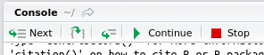

# Overview

- Defensive programming
- Debbugging: techniques and tools
- Condition handling
- Testing

# Defensive programming

Before we begin with debugging, let's look at ways to prevent bugs
(more at the end of this part). 

*Defensive programming*: 
- making the code work in a predicable manner
- writing code that fails in a well-defined manner
- if something *weird* happens, either properly deal with it, of fail
  quickly and loudly

The level of defensiveness will depend whether you write a function
for interactive of programmatic usage.

## Talk to your users

### Diagnostic messages

```{r, eval=FALSE}
message("This is a message for our dear users.")
```

```{r, eval=FALSE}
message("This is a message for our dear users. ",
	paste("Thank you for using our software",
              sw, "version", packageVersion(sw)))
```

Do not use `print` or `cat`:

```{r, eval=FALSE}
f1 <- function() {
    cat("I AM LOUD AND YOU CAN'T HELP IT.\n")
    ## do stuff
    invisible(TRUE)
}
f1()
```

```{r, eval=FALSE}
f2 <- function() {
    message("Sorry to interup, but...")
    ## do stuff
    invisible(TRUE)
}
f2()
suppressMessages(f2())
```

Of course, it is also possible to manually define verbosity. This
makes you write more code for a feature readily available. But still
better to use `message`.

```{r, eval=FALSE}
f3 <- function(verbose = TRUE) {
    if (verbose)
        message("I am being verbose because you let me.")
    ## do stuff
    invisible(TRUE)
}
f3()
f3(verbose = FALSE)
```

### Warning

> There is a problem with warnings. No one reads them. Pat Burns, in
> *R inferno*.

```{r, eval=FALSE}
warning("Do not ignore me. Somthing bad might have happened.")
warning("Do not ignore me. Somthing bad might be happening.", immediate. = TRUE)
```

```{r, eval=FALSE}
f <- function(...)
    warning("Attention, attention, ...!", ...)
f()
f(call. = FALSE)
```
Print warnings after they have been thrown.

```{r, eval=FALSE}
warnings()
last.warning
```

See also to `warn` option in `?options` .

```{r, eval=FALSE}
option("warn")
```

### Error

```{r, eval=FALSE}
stop("This is the end, my friend.")
```

```{r, eval=FALSE}
log(c(2, 1, 0, -1, 2)); print('end') ## warning 
xor(c(TRUE, FALSE));  print ('end')  ## error
```

Stop also has a `call.` parameter.

```{r, eval=FALSE}
geterrmessage()
```

## KISS

Keep your functions simple and stupid (and short). 

## Failing fast and well

> Bounds errors are ugly, nasty things that should be stamped out
> whenever possible. One solution to this problem is to use the
> `assert` statement. The `assert` statement tells C++, "This can
> never happen, but if it does, abort the program in a nice way." One
> thing you find out as you gain programming experience is that things
> that can "never happen" happen with alarming frequency. So just to
> make sure that things work as they are supposed to, it’s a good idea
> to put lots of self checks in your program. -- Practical C++
> Programming, Steve Oualline, O'Reilly.

```{r, eval=FALSE}
if (!condition) stop(...)
```

```{r, eval=FALSE}
stopifnot(TRUE)
stopifnot(TRUE, FALSE)
```

For example to test input classes, lengths, ...

```{r, eval=FALSE}
f <- function(x) {
    stopifnot(is.numeric(x), length(x) == 1)
    invisible(TRUE)
}

f(1)
f("1")
f(1:2)
f(letters)
```

The [`assertthat`](https://github.com/hadley/assertthat) package:

```{r, eval=FALSE}
x <- "1"
library("assertthat")
stopifnot(is.numeric(x))
assert_that(is.numeric(x))
assert_that(length(x) == 2)
```

* `assert_that()` signal an error.
* `see_if()` returns a logical value, with the error message as an attribute.
* `validate_that()` returns `TRUE` on success, otherwise returns the error as
  a string.

  
  
* `is.flag(x)`: is x `TRUE` or `FALSE`? (a boolean flag)
* `is.string(x)`: is x a length 1 character vector?
* `has_name(x, nm)`, `x %has_name% nm`: does `x` have component `nm`?
* `has_attr(x, attr)`, `x %has_attr% attr`: does `x` have attribute `attr`?
* `is.count(x)`: is x a single positive integer?
* `are_equal(x, y)`: are `x` and `y` equal?
* `not_empty(x)`: are all dimensions of `x` greater than 0?
* `noNA(x)`: is `x` free from missing values?
* `is.dir(path)`: is `path` a directory?
* `is.writeable(path)`/`is.readable(path)`: is `path` writeable/readable?
* `has_extension(path, extension)`: does `file` have given `extension`?


# Debugging: techniques and tools

### Shit happens

> Funding your bug is a process of confirming the many things that you
> believe are true - until you find one which is not true. -- Norm Matloff

#### 1. Identify the bug (the difficult part)
- Something went wrong!
- Where in the code does it happen?
- Does it happen every time?
- What input triggered it?
- Report it (even if it is in your code - use github issues, for
  example).

**Tip**: Beware of your intuition. As a scientist, do what you are
used to: generate a hypotheses, *design an experiment* to test them,
and record the results.

#### 2. Fix it (the less difficult part)
- Correct the bug.
- Make sure that bug will not repeat itself!
- How can we be confident that we haven't introduced new bugs?

## Tools

- `print`/`cat`
- `traceback()`
- `browser()`
- `options(error = )`, `options(warn = )`
- `trace`
- IDE: RStudio, StatET, emacs' ess tracebug.


### Manually

Inserting `print` and `cat` statements in the code. Works, but time
consuming. 

### Finding the bug

> Many bugs are subtle and hard to find. -- Hadley Wickham

Bugs are shy, and are generally hidden, deep down in your code, to
make it as difficult as possible for you to find them.

```{r, echo=TRUE}
e <- function(i) {
  x <- 1:4
  if (i < 5) x[1:2]
  else x[-1:2]
}
f <- function() sapply(1:10, e)
g <- function() f()
```

`traceback`: lists the sequence of calls that lead to the error

```{r, eval=FALSE}
g()
traceback()
```

If the source code is available (for example for `source()`d code),
then traceback will display the exact location in the function, in the
form `filename.R#linenum`.

### Browsing the error

- Register the function for debugging: `debug(g)`. This adds a call to
  the `browser()` function (see also below) and the very beginning of
  the function `g`.
  
- Every call to `g()` will not be run interactively.

- To finish debugging: `undebug(g)`.


```{r, eval=FALSE}
debug(g)
g()
```

How to debug:

- `n` executes the next step of the function. Use `print(n)` or
  `get(n)` to print/access the variable `n`.
- `s` to step into the next function. If it is not a function, same as
  `n`.
- `f` to finish execution of the current loop of function.
- `c` to leave interactive debugging and continue regular execution of
  the function. 
- `Q` to stop debugging, terminate the function and return to the
  global workspace.
- `where` print a stack trace of all active function calls.
- `Enter` same as `n` (or `s`, if it was used most recently), unless
  `options(browserNLdisabled = TRUE)` is set.

To fix a function when the source code is not directly available, use
`fix(fun)`. This will open the function's source code for editing and,
after saving and closing, store the updated function in the global
workspace.

### Breakpoints

- Add a call to `browser()` anywhere in the source code to execute the
  rest of the code interactively.
  
- To run breakpoints conditionally, wrap the call to `browser()` in a
  condition.

### Setting options

- `options(error = recover)`: display the call stack and choose where
  to step in.

- `options(error = stop)` or `options(error = NULL)`: reset to default
  behaviour.

- `options(warn = 'numeric')`: sets the handling of warning
  messages. If `warn` is negative all warnings are ignored.  If `warn`
  is zero (the default) warnings are stored until the top-level
  function returns.  If 10 or fewer warnings were signalled they will
  be printed otherwise a message saying how many were signalled. An
  object called `last.warning` is created and can be printed through
  the function `warnings`.  If `warn` is one, warnings are printed as
  they occur.  If `warn` is two or larger all warnings are turned into
  errors.

- `options(error = dump.frames)`: like `recover` but for
  non-interactive use. Will create a `last.dump.rda` file in the
  current working directory, which can then be reloaded in an
  interactive session to re-inter interactive debugging (using
  `debugger()`).

### Debugging with IDEs

- RSudio: `Show Traceback`, `Rerun with Debug` and interactive debugging.




- StatET (Eclipse plugin)

- [emacs ESS and tracebug](http://ess.r-project.org/Manual/ess.html#Developing-with-ESS)

### Exercise

1. Your turn - play with `traceback`, `recover` and `debug`:

(Example originally by Martin Morgan and Robert Gentleman.)

```{r, echo=TRUE}
e <- function(i) {
  x <- 1:4
  if (i < 5) x[1:2]
  else x[-1:2] # oops! x[-(1:2)]
}
f <- function() sapply(1:10, e)
g <- function() f()
```

2. Fix `readFasta2`.

```{r, eval=FALSE}
## make sure you have the 'sequences' package.
## Get readFasta2, the function to debug
library(devtools)
install_github("lgatto/sequences") ## from github
## or 
install.packages("sequences") ## from CRAN
library("sequences")
sequences:::debugme()
## Get an example file
f <- dir(system.file("extdata", package = "sequences"),
         full.names=TRUE, pattern = "moreDnaSeqs.fasta")
## BANG!
readFasta2(f)
```

## Condition handling

### `try` and `tryCatch`

The function `f` will never terminate.

```{r, eval=FALSE}
f <- function() {
    x <- "1"
    log(x)
    message("x was the ", class(x), " ", x)
}
f()
```

Use `try` to proceed with the execution even when an error occurs.

```{r, eval=FALSE}
f <- function() {
    x <- "1"
    try(log(x))
    message("x was the ", class(x), " ", x)
}
f()
```

```{r, eval=FALSE}
try({
    a <- 1
    b <- "2"
    a + b
})
```

In case of error, `try` returns a object of class `try-error`:

```{r, eval=FALSE}
success <- try(1 + 2)
failure <- try(1 + "2", silent = TRUE)
class(success)
class(failure)
```

```{r, eval=FALSE}
inherits(failure, "try-error")

if (inherits(failure, "try-error"))
	message("There was an error here.")
```
Handling errors is particularly useful to iterate over all elements of
an input, despite errors (and inspecting/handling/fixing the errors
afterwards).

```{r, eval=FALSE}
el <- list(1:10, c(-1, 1), TRUE, "1")
res <- lapply(el, log)
res
res <- lapply(el, function(x) try(log(x)))
res
```

#### Hadley's tip

> Another useful `try()` idiom is using a default value if an
> expression fails. Simply assign the default outside the `try` block,
> and then run the risky code:

```{r, eval=FALSE}
default <- NULL
try(default <- read.csv("possibly-bad-input.csv"), silent = TRUE)
```

> There is also `plyr::failwith()`, which makes this strategy even
> easier to implement.

```{r, eval=FALSE}
f <- function(x)
    if (x == 1) stop("Error!") else 1

f(1)
f(2)
     
     
safef <- failwith(NULL, f)
safef(1)
safef(2)
```

Use `tryCatch` to specify a behaviour (handler function) in case of
error, warning or message.

```{r, eval=FALSE}
f <- function() {
    x <- "1"
    tryCatch(log(x),
             error = function(e) cat("There was an error!\n"))
    message("x was the ", class(x), " ", x)
}
f()
```

More example from Hadleys' *Advanced R* book.

```{r, eval=FALSE}
show_condition <- function(code) {
  tryCatch(code,
    error = function(c) "error",
    warning = function(c) "warning",
    message = function(c) "message"
  )
}
show_condition(stop("!"))
show_condition(warning("?!"))
show_condition(message("?"))
show_condition(0)
```

A more informative `read.csv` version:

```{r, eval=FALSE}
read.csv2 <- function(file, ...) {
  tryCatch(read.csv(file, ...), error = function(c) {
    c$message <- paste0(c$message, " (in ", file, ")")
    stop(c)
  })
}
read.csv("code/dummy.csv")
read.csv2("code/dummy.csv")
```

`tryCatch` has a `finally` argument that specifies a code block to be
executed regardless of whether the initial expression succeeds or
fails. Usefull, for example, to clean up (deleting files, closing
connections, ...).


### `withCallingHandlers`


The `withCallingHandlers` function allows to defined special behaviour
in case of *unusual conditions*, including warnings and errors. In the
example below, we start a browser in case of (obscure) warnings.

```{r, eval=FALSE}
f <- function(x = 10) {
    lapply(seq_len(x), function(i) {
        ## make an example 2x2 contingency table
        d <- matrix(sample(4:10, 4), nrow = 2, ncol = 2)
        ## will produce warning if there is a 5 or less 
        ## in the contingency table
        chisq.test(d)
    })
}
```

```{r, eval=FALSE}
set.seed(1)
f()
set.seed(1)
withCallingHandlers(f(), warning=function(e) recover())
```

### Difference between `tryCatch` and `withCallingHandlers`

(From [*Advanced R*](http://adv-r.had.co.nz/Exceptions-Debugging.html#condition-handling))

The handlers in `withCallingHandlers()` are called in the context of
the call that generated the condition whereas the handlers in
`tryCatch()` are called in the context of `tryCatch()`. This is shown
here with `sys.calls()`, which is the run-time equivalent of
`traceback()` -- it lists all calls leading to the current function.

```{r, eval=FALSE}
f <- function() g()
g <- function() h()
h <- function() stop("!")

tryCatch(f(), error = function(e) print(sys.calls()))
withCallingHandlers(f(), error = function(e) print(sys.calls()))
```

### Exercise

```{r, eval=TRUE, echo=FALSE}
safelog <- function(x) {
  tryCatch(log(x),
           error = function(e) paste("an error with input", x),
           warning = function(e) paste("a warning with input", x))
}
```


Write a new `safelog` function that catches and handles errors and
warnings to emulate the following behaviour.

```{r, echo=TRUE, eval=TRUE}
log(1)
safelog(1)
log(-1)
safelog(-1)
log("a")
safelog("a")
```

**Answer**

```{r, echo=TRUE}
safelog <- function(x) {
  tryCatch(log(x),
           error = function(e) paste("an error with input", x),
           warning = function(e) paste("a warning with input", x))
}
```

## Tracing code

From `?trace`:

> A call to `trace` allows you to insert debugging code (e.g., a call
> to `browser` or `recover`) at chosen places in any function. A call
> to `untrace` cancels the tracing.

```{r, eval=FALSE}
## Report whenever e invoked
trace(sum)
hist(rnorm(100))
untrace(sum)
```

```{r, eval=FALSE}
## Evaluate arbitrary code whenever e invoked
trace(e, quote(cat("i am", i, "\n")))
## Another way to enter browser whenver e invoked
trace(e, browser)
## stop tracing
untrace(e)
```

### Inserting code dynamically

> The `trace` function operates by constructing a revised version of
> the function (or of the method, if ‘signature’ is supplied), and
> assigning the new object back where the original was found.

```{r, eval=FALSE}
f <- function() {
    ## make an example 2x2 contingency table
    d <- matrix(sample(4:10, 4), nrow=2, ncol=2)
     chisq.test(d)
}
set.seed(1)
f() ## no warning

set.seed(11)
f() ## warning
```

We want to conditionally enter brower mode, when an element of `d` is
smaller than 5.

```{r, eval=FALSE}
if (any(d < 5))
  browser()
```

This expression must be executed at a specific location in our function `f`:

```{r, eval=FALSE}
as.list(body(f))
```

```{r, eval=FALSE}
trace("f", quote(if (any(d < 5)) browser()), at = 3)
```

We can now run our updated function `f`

```{r, eval=FALSE}
f
body(f)
```

```{r, eval=FALSE}
set.seed(1)
f() ## normal execution

set.seed(11)
f() ## enters browser mode
```

### Debugging S4 methods

> The `trace` function operates by constructing a revised version of
> the function (or of the method, if ‘signature’ is supplied), and
> assigning the new object back where the original was found.

```{r, eval=FALSE}
library("MSnbase")
data(itraqdata)
x <- itraqdata[[1]]
plot(x, full=TRUE)
```

Not helpful:

```{r, eval=FALSE}
debug(plot)
plot(x, full=TRUE)
```

Try again:

```{r, eval=FALSE}
trace("plot", browser, 
      signature = c("Spectrum", "missing"))
plot(x, full=TRUE)
```

