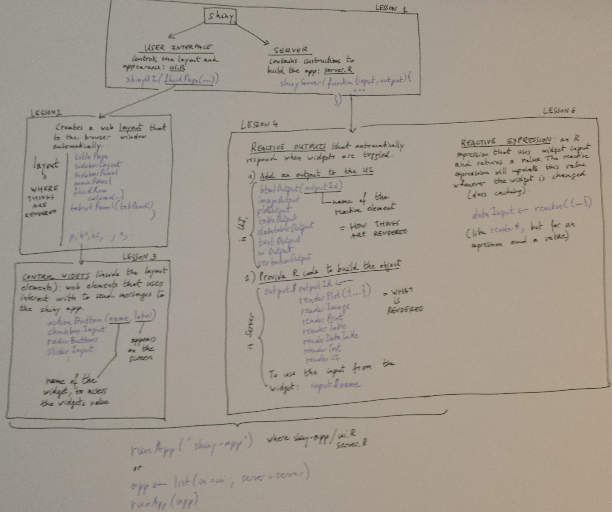

# Interactive apps with `shiny`

We will need

```{r, message = FALSE}
library("shiny")
```

## The architecture of a `shiny` app

The overview figure below is based and makes reference to
[*the written tutorial*](http://shiny.rstudio.com/tutorial/lesson1/).



Example apps:
* `shiny-app1`
* `shiny-app2`

### Sharing

* Share the code file(s) and `runApp`
* `runUrl`
* `runGitHub`
* `runGist`
* [shinyapps](http://wwwshinyapps.io)
* Shiny server

## Shiny apps

Push your shiny apps online with [shinyapps](http://www.shinyapps.io/).


## References

* [`shiny` page](http://shiny.rstudio.com/)
* [`shiny` cheat sheet](https://www.rstudio.com/wp-content/uploads/2016/01/shiny-cheatsheet.pdf)

