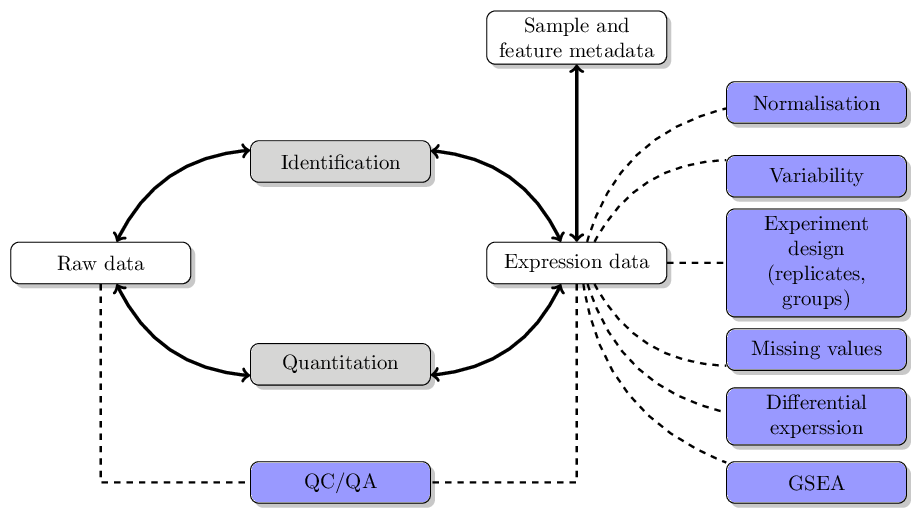
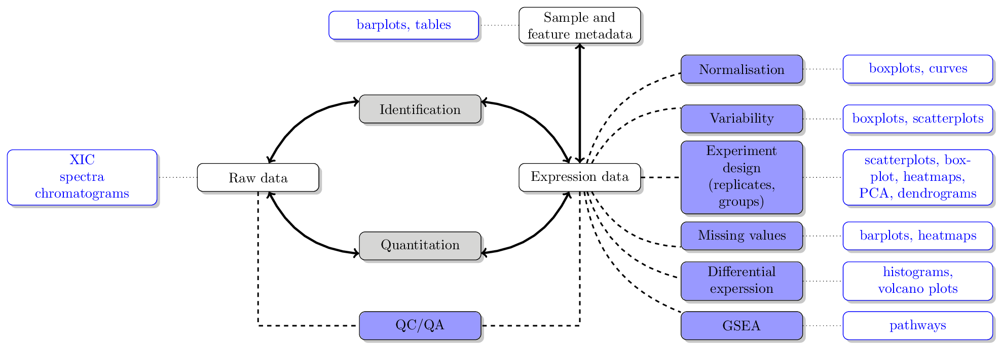

# Quantitative Proteomics and Data Analysis

Laurent Gatto -- https://lgatto.github.io

* Slides: http://bit.ly/qprotda
* Ask questions!

**Acknowledgements** BBSRC for funding; Sebastian Gibb and Lisa
Breckels for coding.

# 

These slides are available under a **creative common CC-BY**
license. You are free to **share** (copy and redistribute the material
in any medium or format) and **adapt** (remix, transform, and build
upon the material) for any purpose, even commercially. 

# What is data analysis

The ability to prepare and **explore** data, identify **patterns**
(good and pathological ones) and convince oneself that the pattern are
**genuine** (rather than random).

# To analyse data, you need

* ~~Programming skills~~
* ~~Be a statistician/machine learner~~

# To analyse data, you need

* ~~Programming skills~~
* ~~Be a statistician/machine learner~~
* Knowledge about the domain
* Know about your data
* Be able to manipulate/visualise it
* How good do we need to be? Good enough! 

# Data analysis

# Definitions

**Variability**: technical vs biological

**Replicates**: ...

**Normalisation**: remove unwanted (technical) variation while retaining
biological variability.

(see also stats course)

# Visualisation

> A picture is worth a thousand words.

> Graphics reveal data.

# 

# 

# Proteomics data analysis

# Data analysis basics

* Storing data as *computational objects* (rigorously defined data
  structures): knowing where to find things
* *Application programming interface*
* Tidy data: consistency in data structures (and conventions)

# The `MSnSet` class for quantitative data

* Expression/quantitative data
* Feature meta-data
* Sample meta-data
* Dimension constrains

# References 

* [Visualisation of proteomics data using R and Bioconductor](http://www.ncbi.nlm.nih.gov/pmc/articles/PMC4510819/)
* [Using R and Bioconductor for proteomics data analysis](http://arxiv.org/pdf/1305.6559v1.pdf)
* `RforProteomics`: http://bioconductor.org/packages/RforProteomics
