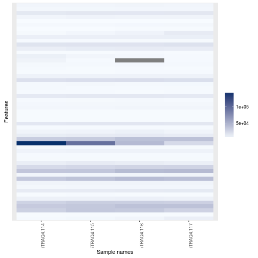

Last update: Sun Apr  3 23:12:20 2016

<script type="text/javascript">
document.addEventListener("DOMContentLoaded", function() {
  document.querySelector("h1").className = "title";
});
</script>
<script type="text/javascript">
document.addEventListener("DOMContentLoaded", function() {
  var links = document.links;  
  for (var i = 0, linksLength = links.length; i < linksLength; i++)
    if (links[i].hostname != window.location.hostname)
      links[i].target = '_blank';
});
</script>
<style type="text/css" scoped>
body, td {
   font-family: sans-serif;
   background-color: white;
   font-size: 13px;
}

body {
  max-width: 800px;
  margin: 0 auto;
  padding: 1em 1em 2em;
  line-height: 20px;
}

/* Table of contents style */

div#TOC li {
    list-style:none;
    background-image:none;
    background-repeat:none;
    background-position:0;
}

/* element spacing */

p, pre { 
  margin: 0em 0em 1em;
}

/* center images and tables */
img, table {
  margin: 0em auto 1em;
}

p {
  text-align: justify;
}

tt, code, pre {
   font-family: 'DejaVu Sans Mono', 'Droid Sans Mono', 'Lucida Console', Consolas, Monaco, monospace;
}

h1, h2, h3, h4, h5, h6 { 
  font-family: Helvetica, Arial, sans-serif;
  margin: 1.2em 0em 0.6em 0em;
  font-weight: bold;
}

h1.title {
  font-size: 250%;
  font-weight: normal;
  color: #87b13f;
  line-height: 1.1em;
  margin-top: 0px;
  border-bottom: 0px;
}

h1 {
  font-size: 160%;
  font-weight: normal;
  line-height: 1.4em;
  border-bottom: 1px #1a81c2 solid;
}

h2 {
  font-size: 130%;  
}

h1, h2, h3 {
  color: #1a81c2;
}

h3, h4, h5, h6 {
  font-size:115%;
} /* not expecting to dive deeper than four levels on a single page */

/* links are simply blue, hovering slightly less blue */
a { color: #1a81c2; }
a:active { outline: none; }
a:visited { color: #1a81c2; }
a:hover { color: #4c94c2; }

pre, img {
  max-width: 100%;
  display: block;
}

pre {
  border: 0px none;
  background-color: #F8F8F8;
  white-space: pre;
  overflow-x: auto;
}

pre code {
  border: 1px #aaa dashed;
  background-color: white;
  display: block;
  padding: 1em;  
  color: #111;
  overflow-x: inherit;
}

/* markdown v1 */
pre code[class] {
  background-color: inherit;
}

/* markdown v2 */
pre[class] code {
  background-color: inherit;
}

/* formatting of inline code */
code { 
  background-color: transparent;
  color: #87b13f;
  font-size: 92%;
}

/* formatting of tables */

table, td, th {
  border: none;
  padding: 0 0.5em;
}

/* alternating row colors */
tbody tr:nth-child(odd) td {
  background-color: #F8F8F8;
}

blockquote {
   color:#666666;
   margin:0;
   padding-left: 1em;
   border-left: 0.5em #EEE solid;
}

hr {
   height: 0px;
   border-bottom: none;
   border-top-width: thin;
   border-top-style: dotted;
   border-top-color: #999999;
}

span.header-section-number {
  padding-right: 1em;
}

span.toc-section-number::after {
    content: "  ";
    white-space: pre;
}

@media print {
   * {
      background: transparent !important;
      color: black !important;
      filter:none !important;
      -ms-filter: none !important;
   }

   body {
      font-size:12pt;
      max-width:100%;
   }

   a, a:visited {
      text-decoration: underline;
   }

   hr {
      visibility: hidden;
      page-break-before: always;
   }

   pre, blockquote {
      padding-right: 1em;
      page-break-inside: avoid;
   }

   tr, img {
      page-break-inside: avoid;
   }

   img {
      max-width: 100% !important;
   }

   @page :left {
      margin: 15mm 20mm 15mm 10mm;
   }

   @page :right {
      margin: 15mm 10mm 15mm 20mm;
   }

   p, h2, h3 {
      orphans: 3; widows: 3;
   }

   h2, h3 {
      page-break-after: avoid;
   }
}
</style>

------------

> This vignette available under a
> [**creative common CC-BY**](http://creativecommons.org/licenses/by/4.0/)
> license. You are free to **share** (copy and redistribute the
> material in any medium or format) and **adapt** (remix, transform,
> and build upon the material) for any purpose, even commercially.

------------

# Introduction

This document provides the details to reproduce the data analysis
figures in the course
[slides](http://lgatto.github.io/Quantitative-Proteomics-and-Data-Analysis/slides.html).

To be able to execute the code below, you will need to have a working
R installation. I also recommend using the
[RStudio editor](https://www.rstudio.com/products/RStudio/). To
install the proteomics add-on packages required for this tutorial, you
will need to run the following code:


```r
## try http:// if https:// URLs are not supported
source("https://bioconductor.org/biocLite.R")
biocLite("RforProteomics", dependencies = TRUE)
biocLite("AnnotationHub")
```

For a more thorough introduction to R for proteomics, please read the
`RforProteomics` vignette
([online](http://bioconductor.org/packages/release/data/experiment/vignettes/RforProteomics/inst/doc/RforProteomics.pdf)
or off-line with `vignette("RforProteomics")` after installing as
described above), the
[visualisation vignette](http://bioconductor.org/packages/release/data/experiment/vignettes/RforProteomics/inst/doc/RProtVis.html)
and the corresonding papers
[[1](http://www.ncbi.nlm.nih.gov/pubmed/25690415),
[2](http://www.ncbi.nlm.nih.gov/pubmed/23692960)]

We first need to load the proteomics packages:


```r
library("MSnbase")
library("rpx")
library("mzR")
library("RforProteomics")
library("pRoloc")
library("pRolocdata")
library("msmsTests")
library("AnnotationHub")
library("lattice")
 require("gridExtra") 
```

# Getting example data

*[AnnotationHub](http://bioconductor.org/packages/AnnotationHub)* is a cloud resource set up and managed by
the Bioconductor project that programmatically disseminates omics
data. I am currently working on contributing 
[proteomics data](http://bioconductor.org/packages/devel/bioc/vignettes/ProteomicsAnnotationHubData/inst/doc/ProteomicsAnnotationHubData.html).


Below, we download a raw mass spectrometry dataset with identifier
`AH49008` and store it in a variable names `ms`.


```r
ah <- AnnotationHub()
ms <- ah[["AH49008"]]
ms
```

```
## Mass Spectrometry file handle.
## Filename:  55314 
## Number of scans:  7534
```


The data contains 7534 spectra - 1431
MS1 spectra and 6103 MS2 spectra. The filename,
55314, is not very descriptive because the data
originates from the `AnnotationHub` cloud repository. If the data was
read from a local file, is would be named as the `mzML` (or `mzXML`)
file. 

Later, we will use data that is distributed direclty with package and
access them using the `data` function. One can also use the 
*[rpx](http://bioconductor.org/packages/rpx)* package to access and download data from the
ProteomeXchange repository.


```r
px1 <- PXDataset("PXD000001")
px1
```

```
## Object of class "PXDataset"
##  Id: PXD000001 with 10 files
##  [1] 'F063721.dat' ... [10] 'erwinia_carotovora.fasta'
##  Use 'pxfiles(.)' to see all files.
```

```r
mzf <- pxget(px1, 6)
mzf
```

```
## [1] "TMT_Erwinia_1uLSike_Top10HCD_isol2_45stepped_60min_01-20141210.mzML"
```

Manual download:


```r
f1 <- downloadData("http://proteome.sysbiol.cam.ac.uk/lgatto/files/Thermo-HELA-PRT/Thermo_Hela_PRTC_1.mzML")
f2 <- downloadData("http://proteome.sysbiol.cam.ac.uk/lgatto/files/Thermo-HELA-PRT/Thermo_Hela_PRTC_2.mzML")
f3 <- downloadData("http://proteome.sysbiol.cam.ac.uk/lgatto/files/Thermo-HELA-PRT/Thermo_Hela_PRTC_3.mzML")
f3
```

```
## [1] "./Thermo_Hela_PRTC_3.mzML"
```

# Visualising raw data

## A full chromatogam


```r
chromatogram(ms)
```


## Multiple chromatograms


```r
c1 <- chromatogram(f1)
c2 <- chromatogram(f2, plot = FALSE)
lines(c2, col = "steelblue", lty = "dashed")
c3 <- chromatogram(f3, plot = FALSE)
lines(c3, col = "orange", lty = "dotted")
```


## An extracted ion chromatogram


```r
par(mfrow = c(1, 2))
xic(ms, mz = 636.925, width = 0.01)
x <- xic(ms, mz = 636.925, width = 0.01, rtlim = c(2120, 2200))
```


## Spectra

We first load a test iTRAQ data called `itraqdata` and distributed as
part of the *[MSnbase](http://bioconductor.org/packages/MSnbase)* package using the `data`
function. This is a pre-packaged data that comes as a dedicated data
structure called `MSnExp`. We then `plot` the 10th spectum using
specific code that recognizes what to do with an element of an
`MSnExp`.


```r
data(itraqdata)
itraqdata
```

```
## Object of class "MSnExp"
##  Object size in memory: 1.88 Mb
## - - - Spectra data - - -
##  MS level(s): 2 
##  Number of MS1 acquisitions: 1 
##  Number of MSn scans: 55 
##  Number of precursor ions: 55 
##  55 unique MZs
##  Precursor MZ's: 401.74 - 1236.1 
##  MSn M/Z range: 100 2069.27 
##  MSn retention times: 19:9 - 50:18 minutes
## - - - Processing information - - -
## Data loaded: Wed May 11 18:54:39 2011 
##  MSnbase version: 1.1.22 
## - - - Meta data  - - -
## phenoData
##   rowNames: 1
##   varLabels: sampleNames sampleNumbers
##   varMetadata: labelDescription
## Loaded from:
##   dummyiTRAQ.mzXML 
## protocolData: none
## featureData
##   featureNames: X1 X10 ... X9 (55 total)
##   fvarLabels: spectrum ProteinAccession ProteinDescription
##     PeptideSequence
##   fvarMetadata: labelDescription
## experimentData: use 'experimentData(object)'
```

```r
plot(itraqdata[[10]], reporters = iTRAQ4, full=TRUE) 
```


The `ms` data is not pre-packaged as an `MSnExp` data. It is a more
bare-bone mzRramp object, a pointer to a raw data
file (here 55314): we need first to extract a
spectrum of interest (here the 3071st spectrum, an MS1 spectrum), and
use the generic `plot` function to visualise the spectrum.


```r
plot(peaks(ms, 3071), type = "h",
     xlab = "M/Z", ylab = "Intensity",     
     sub = formatRt(hd[3071, "retentionTime"]))
```


Below, we use data downloaded from ProteomeXchange (see above) to
generate additional raw data visualisations. These examples are taken
from the *[RforProteomics](http://bioconductor.org/packages/RforProteomics)*
[visualisation vignette](http://bioconductor.org/packages/release/data/experiment/vignettes/RforProteomics/inst/doc/RProtVis.html). The
code, which is not displayed here, can also be seen in the
[source document](https://github.com/lgatto/Quantitative-Proteomics-and-Data-Analysis/blob/master/code.Rmd).


The importance of flexible access to specialised data becomes visible
in the figure below (taken from the *[RforProteomics](http://bioconductor.org/packages/RforProteomics)*
[visualisation vignette](http://bioconductor.org/packages/release/data/experiment/vignettes/RforProteomics/inst/doc/RProtVis.html)). 
**Not only can we access specific data and understand/visualise them, but we
can transverse all the data and extracted/visualise/understand
structured slices of data.**

The upper panel represents the chomatogram of the TMT_Erwinia_1uLSike_Top10HCD_isol2_45stepped_60min_01-20141210.mzML raw
data file. We concentrate at a specific retention time, 
30:1 minutes (1800.6836 seconds) 
corresponding to the 2807th MS1 spectrum, shown on the second row of
figures. On the right, we zoom on the isotopic envelope of one peptide
in particular. All vertical lines (red and grey) represent all the
ions that were selected for a second round of MS analysis; these are
represented in the bottom part of the figure.


Below, we illustrate some additional visualisation and animations of
raw MS data, also taken from the *[RforProteomics](http://bioconductor.org/packages/RforProteomics)*
[visualisation vignette](http://bioconductor.org/packages/release/data/experiment/vignettes/RforProteomics/inst/doc/RProtVis.html). On
the left, we have a heatmap like visualisation of a MS map and a 3
dimensional representation of the same data. On the right, 2 MS1
spectra in blue and the set of interleaves 10 MS2 spectra.


Below, we have animations build from extracting successive slices as above.

<table class='container'><tr><td>

</td><td>
 
</td></tr></table>


# Identification data

Annotated spectra and comparing spectra. 


```r
par(mfrow = c(1, 2))
itraqdata2 <- pickPeaks(itraqdata, verbose = FALSE)
s <- "SIGFEGDSIGR"
plot(itraqdata2[[14]], s, main = s)
plot(itraqdata2[[25]], itraqdata2[[28]], sequences = rep("IMIDLDGTENK", 2))
```


The annotation of spectra is obtained by simulating fragmentation of a
peptide and matching observed peaks to fragments:


```r
calculateFragments("SIGFEGDSIGR")
```

```
## The mass listed in "modifications" is now added to the amino acid/peptide.
## In MSnbase < 1.17.6 the mass was replaced. Please see '?calculateFragments' for details.
```

```
## Modifications used: C=57.02146
```

```
##            mz  ion type pos z         seq
## 1    88.03931   b1    b   1 1           S
## 2   201.12337   b2    b   2 1          SI
## 3   258.14483   b3    b   3 1         SIG
## 4   405.21324   b4    b   4 1        SIGF
## 5   534.25583   b5    b   5 1       SIGFE
## 6   591.27729   b6    b   6 1      SIGFEG
## 7   706.30423   b7    b   7 1     SIGFEGD
## 8   793.33626   b8    b   8 1    SIGFEGDS
## 9   906.42032   b9    b   9 1   SIGFEGDSI
## 10  963.44178  b10    b  10 1  SIGFEGDSIG
## 11 1119.54289  b11    b  11 1 SIGFEGDSIGR
## 12  175.11895   y1    y   1 1           R
## 13  232.14041   y2    y   2 1          GR
## 14  345.22447   y3    y   3 1         IGR
## 15  432.25650   y4    y   4 1        SIGR
## 16  547.28344   y5    y   5 1       DSIGR
##  [ reached getOption("max.print") -- omitted 20 rows ]
```

Visualising a pair of spectra means that we can access them, and that,
in addition to plotting, we can manipluate them and perform
computations. The two spectra corresponding to the `IMIDLDGTENK`
peptide, for example have 22 common peaks, a correlation of `r
round(compareSpectra(itraqdata2[[25]], itraqdata2[[28]], fun = "cor"),
3)` and a dot product of 0.21 (see `?compareSpectra` for
details).


See also the *[MSGFgui](http://bioconductor.org/packages/MSGFgui)* package.


# Quantitation data

> What does the quantitative data encode: ratios or intenstities? Do
> not let the software decide for you!

Here's where the experimental design becomes essential: what are
**replicates**: technical and biological, what **variability**
(technical vs biological vs different conditions) are we exploring.


> A set of protein LFQ data let’s say - two conditions, with 6
> replicates of each, and with a list of protein accession number and
> the LFQ data: This is a fabulous dataset for 

> S curves for means of both, with errors Matrix plot of all against
> all

log(Abundance) vs. protein index.


```r
data(msnset)
pairs(exprs(msnset))
```


```r
## pairs(exprs(msnset), log = "xy")
```

## MA plots


## Normalisation strategies

**Normalisation**: remove unwanted (technical) variation while
retaining biological variability.


```r
par(mfrow = c(1, 4))
data(dunkley2006)
boxplot(exprs(dunkley2006), main = "original")
boxplot(exprs(normalise(dunkley2006, method = "vsn")),
        main = "Variance stabilisation normalisation")
boxplot(exprs(normalise(dunkley2006, method = "center.median")),
        main = "Median")
boxplot(exprs(normalise(dunkley2006, method = "quantiles")),
        main = "Quantile")
```


## Heatmap plot


```r
data(msnset)
heatmap(exprs(msnset))
```


```r
image(msnset)
```



## Hierarchical clustering (with or without heatmap)


```r
data(dunkley2006)
heatmap(exprs(msnset))
```


```r
hc <- hclust(dist(exprs(dunkley2006)))
plot(hc)
```


## PCA analysis and plots


```r
plot2D(dunkley2006)
addLegend(dunkley2006, where = "topleft")
```


## Abundance histograms

See normalisation above.

> From a simpler set (e.g. Dean’s kdeg/protein/abundance) data, plot a
> 2d plot with colour as a third scaling variable


```r
data(hyperLOPIT2015)
setStockcol(paste0(getStockcol(), 60))
plot2D(hyperLOPIT2015,
       fcol = "final.assignment",
       cex = exp(fData(hyperLOPIT2015)$svm.score) - 1)
```


# Statistical analyses


```r
data(msms.dataset)
e <- pp.msms.data(msms.dataset)
null.f <- "y~batch"
alt.f <- "y~treat+batch"
div <- apply(exprs(e), 2, sum)
res <- msms.glm.qlll(e, alt.f, null.f,div = div)
lst <- test.results(res, e, pData(e)$treat, "U600", "U200", div,
                    alpha = 0.05, minSpC = 2, minLFC = log2(1.8),
                    method = "BH")
```

## p-values


```r
summary(lst[["tres"]]$p.values)
```

```
## Length  Class   Mode 
##      0   NULL   NULL
```

```r
hist(lst[["tres"]]$p.value)
```


```r
summary(lst[["tres"]]$adjp)
```

```
##      Min.   1st Qu.    Median      Mean   3rd Qu.      Max. 
## 0.0000003 0.3107000 0.5896000 0.5536000 0.7959000 0.9886000
```

```r
hist(lst[["tres"]]$adjp)
```


## Volcano plots


```r
res.volcanoplot(lst$tres, max.pval = 0.05,
                min.LFC = 1, maxx = 3, maxy = NULL,
                ylbls = 4)
```


# References and resources

* [Visualisation of proteomics data using R and Bioconductor](http://www.ncbi.nlm.nih.gov/pmc/articles/PMC4510819/)
* [Using R and Bioconductor for proteomics data analysis](http://arxiv.org/pdf/1305.6559v1.pdf)
* `RforProteomics`: http://bioconductor.org/packages/RforProteomics
* [R/Bioconductor workflow](http://bioconductor.org/help/workflows/proteomics/)
* [Teaching material](http://lgatto.github.io/TeachingMaterial/) for
  R and more
* Workshops: [Software](http://software-carpentry.org/) and
  [Data Carpentry](http://www.datacarpentry.org/), 
  [Data Programmers](http://www.dataprogrammers.net/)


# About this document

The source used to generate this document is available
[here](https://github.com/lgatto/Quantitative-Proteomics-and-Data-Analysis/blob/master/code.Rmd).

Software used:


```
## R Under development (unstable) (2016-03-03 r70270)
## Platform: x86_64-pc-linux-gnu (64-bit)
## Running under: Ubuntu 14.04.4 LTS
## 
## attached base packages:
## [1] stats4    parallel  methods   stats     graphics  grDevices utils    
## [8] datasets  base     
## 
## other attached packages:
##  [1] gridExtra_2.2.1      lattice_0.20-33      AnnotationHub_2.3.16
##  [4] msmsTests_1.9.0      msmsEDA_1.9.0        pRolocdata_1.9.4    
##  [7] pRoloc_1.11.19       MLInterfaces_1.51.3  cluster_2.0.3       
## [10] annotate_1.49.1      XML_3.98-1.4         AnnotationDbi_1.33.7
## [13] IRanges_2.5.40       S4Vectors_0.9.44     RforProteomics_1.9.4
## [16] rpx_1.7.2            MSnbase_1.19.17      ProtGenerics_1.3.3  
## [19] BiocParallel_1.5.21  mzR_2.5.5            Rcpp_0.12.4         
## [22] Biobase_2.31.3       BiocGenerics_0.17.3  BiocStyle_1.9.8     
## 
## loaded via a namespace (and not attached):
##   [1] plyr_1.8.3                   GSEABase_1.33.0             
##   [3] splines_3.3.0                ggvis_0.4.2                 
##   [5] ggplot2_2.1.0                digest_0.6.9                
##   [7] foreach_1.4.3                BiocInstaller_1.21.4        
##   [9] htmltools_0.3.5              gdata_2.17.0                
##  [11] magrittr_1.5                 doParallel_1.0.10           
##  [13] sfsmisc_1.1-0                limma_3.27.14               
##  [15] rda_1.0.2-2                  R.utils_2.2.0               
##  [17] lpSolve_5.6.13               colorspace_1.2-6            
##  [19] dplyr_0.4.3                  RCurl_1.95-4.8              
##  [21] graph_1.49.1                 genefilter_1.53.3           
##  [23] lme4_1.1-11                  impute_1.45.0               
##  [25] survival_2.38-3              iterators_1.0.8             
##  [27] gtable_0.2.0                 zlibbioc_1.17.1             
##  [29] MatrixModels_0.4-1           car_2.1-2                   
##  [31] kernlab_0.9-23               prabclus_2.2-6              
##  [33] DEoptimR_1.0-4               SparseM_1.7                 
##  [35] scales_0.4.0                 vsn_3.39.2                  
##  [37] mvtnorm_1.0-5                DBI_0.3.1                   
##  [39] edgeR_3.13.5                 xtable_1.8-2                
##  [41] proxy_0.4-15                 mclust_5.1                  
##  [43] preprocessCore_1.33.0        htmlwidgets_0.6             
##  [45] sampling_2.7                 httr_1.1.0                  
##  [47] threejs_0.2.1                FNN_1.1                     
##  [49] gplots_3.0.0                 RColorBrewer_1.1-2          
##  [51] fpc_2.1-10                   modeltools_0.2-21           
##  [53] R.methodsS3_1.7.1            flexmix_2.3-13              
##  [55] nnet_7.3-12                  RJSONIO_1.3-0               
##  [57] caret_6.0-64                 labeling_0.3                
##  [59] reshape2_1.4.1               munsell_0.4.3               
##  [61] mlbench_2.1-1                biocViews_1.39.8            
##  [63] tools_3.3.0                  RSQLite_1.0.0               
##  [65] pls_2.5-0                    evaluate_0.8.3              
##  [67] stringr_1.0.0                mzID_1.9.0                  
##  [69] knitr_1.12.3                 robustbase_0.92-5           
##  [71] rgl_0.95.1441                caTools_1.17.1              
##  [73] randomForest_4.6-12          RBGL_1.47.0                 
##  [75] nlme_3.1-126                 mime_0.4                    
##  [77] quantreg_5.21                formatR_1.3                 
##  [79] R.oo_1.20.0                  biomaRt_2.27.2              
##  [81] pbkrtest_0.4-6               curl_0.9.6                  
##  [83] interactiveDisplayBase_1.9.0 e1071_1.6-7                 
##  [85] affyio_1.41.0                stringi_1.0-1               
##  [87] trimcluster_0.1-2            Matrix_1.2-4                
##  [89] nloptr_1.0.4                 gbm_2.1.1                   
##  [91] RUnit_0.4.31                 MALDIquant_1.14             
##  [93] bitops_1.0-6                 httpuv_1.3.3                
##  [95] qvalue_2.3.2                 R6_2.1.2                    
##  [97] pcaMethods_1.63.0            affy_1.49.0                 
##  [99] hwriter_1.3.2                KernSmooth_2.23-15          
## [101] gridSVG_1.5-0                codetools_0.2-14            
## [103] MASS_7.3-45                  gtools_3.5.0                
## [105] assertthat_0.1               interactiveDisplay_1.9.0    
## [107] Category_2.37.1              diptest_0.75-7              
## [109] mgcv_1.8-12                  grid_3.3.0                  
## [111] rpart_4.1-10                 class_7.3-14                
## [113] minqa_1.2.4                  shiny_0.13.2                
## [115] base64enc_0.1-3
```
