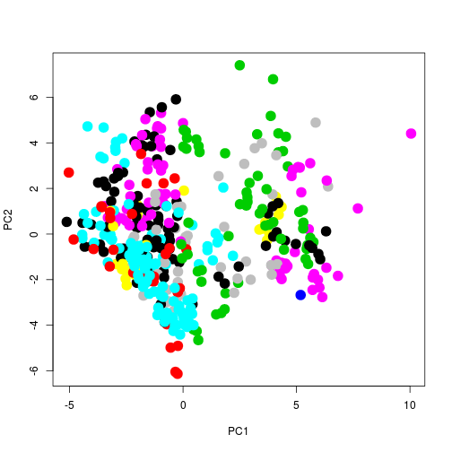

# Visualisation use-case: PCA on ABRF

## The ABRF data

Bennett et al. *The 2012/2013 ABRF Proteomic Research Group Study:
Assessing Longitudinal Intralaboratory Variability in Routine Peptide
Liquid Chromatography Tandem Mass Spectrometry*
[Molecular & Cellular Proteomics, 14, 3299-3309](http://www.mcponline.org/content/14/12/3299.short).

> Questions concerning longitudinal data quality and reproducibility
> of proteomic laboratories spurred the Protein Research Group of the
> Association of Biomolecular Resource Facilities (ABRF-PRG) to design
> a study to systematically assess the reproducibility of proteomic
> laboratories over an extended period of time. Developed as an open
> study, initially 64 participants were recruited from the broader
> mass spectrometry community to analyze provided aliquots of a six
> bovine protein tryptic digest mixture every month for a period of
> nine months. Data were uploaded to a central repository, and the
> operators answered an accompanying survey. Ultimately, 45
> laboratories submitted a minimum of eight LC-MSMS raw data files
> collected in data-dependent acquisition (DDA) mode. No standard
> operating procedures were enforced; rather the participants were
> encouraged to analyze the samples according to usual practices in
> the laboratory. Unlike previous studies, this investigation was not
> designed to compare laboratories or instrument configuration, but
> rather to assess the temporal intralaboratory reproducibility. The
> outcome of the study was reassuring with 80% of the participating
> laboratories performing analyses at a medium to high level of
> reproducibility and quality over the 9-month period. For the groups
> that had one or more outlying experiments, the major contributing
> factor that correlated to the survey data was the performance of
> preventative maintenance prior to the LC-MSMS analyses. Thus, the
> Protein Research Group of the Association of Biomolecular Resource
> Facilities recommends that laboratories closely scrutinize the
> quality control data following such events. Additionally, improved
> quality control recording is imperative. This longitudinal study
> provides evidence that mass spectrometry-based proteomics is
> reproducible. When quality control measures are strictly adhered to,
> such reproducibility is comparable among many disparate groups. Data
> from the study are available via ProteomeXchange under the accession
> code PXD002114.

The 46 metrics generated by the 'IDFree' mode of QuaMeter.


|Filename               |What.is.the.name.of.the.file.from.which.the.metrics.were.computed.          |
|:----------------------|:---------------------------------------------------------------------------|
|StartTimeStamp         |At what time did acquisition begin for this experiment?                     |
|XIC-WideFrac           |What fraction of precursor ions account for the top half of all peak width? |
|XIC-FWHM-Q1            |What is the 25%ile of peak widths for the wide XICs?                        |
|XIC-FWHM-Q2            |What is the 50%ile of peak widths for the wide XICs?                        |
|XIC-FWHM-Q3            |What is the 75%ile of peak widths for the wide XICs?                        |
|XIC-Height-Q2          |The log ratio for 50%ile of wide XIC heights over 25%ile of heights.        |
|XIC-Height-Q3          |The log ratio for 75%ile of wide XIC heights over 50%ile of heights.        |
|XIC-Height-Q4          |The log ratio for maximum of wide XIC heights over 75%ile of heights.       |
|RT-Duration            |What is the highest scan time observed minus the lowest scan time observed? |
|RT-TIC-Q1              |The interval when the first 25% of TIC accumulates divided by RT-Duration   |
|RT-TIC-Q2              |The interval when the second 25% of TIC accumulates divided by RT-Duration  |
|RT-TIC-Q3              |The interval when the third 25% of TIC accumulates divided by RT-Duration   |
|RT-TIC-Q4              |The interval when the fourth 25% of TIC accumulates divided by RT-Duration  |
|RT-MS-Q1               |The interval for the first 25% of all MS events divided by RT-Duration      |
|RT-MS-Q2               |The interval for the second 25% of all MS events divided by RT-Duration     |
|RT-MS-Q3               |The interval for the third 25% of all MS events divided by RT-Duration      |
|RT-MS-Q4               |The interval for the fourth 25% of all MS events divided by RT-Duration     |
|RT-MSMS-Q1             |The interval for the first 25% of all MS/MS events divided by RT-Duration   |
|RT-MSMS-Q2             |The interval for the second 25% of all MS/MS events divided by RT-Duration  |
|RT-MSMS-Q3             |The interval for the third 25% of all MS/MS events divided by RT-Duration   |
|RT-MSMS-Q4             |The interval for the fourth 25% of all MS/MS events divided by RT-Duration  |
|MS1-TIC-Change-Q2      |The log ratio for 50%ile of TIC changes over 25%ile of TIC changes          |
|MS1-TIC-Change-Q3      |The log ratio for 75%ile of TIC changes over 50%ile of TIC changes          |
|MS1-TIC-Change-Q4      |The log ratio for largest TIC change over 75%ile of TIC changes             |
|MS1-TIC-Q2             |The log ratio for 50%ile of TIC over 25%ile of TIC                          |
|MS1-TIC-Q3             |The log ratio for 75%ile of TIC over 50%ile of TIC                          |
|MS1-TIC-Q4             |The log ratio for largest TIC over 75%ile TIC                               |
|MS1-Count              |How many MS scans were collected?                                           |
|MS1-Freq-Max           |What was the fastest frequency for MS collection in any minute? (Hz)        |
|MS1-Density-Q1         |What was the 25%ile of MS scan peak counts?                                 |
|MS1-Density-Q2         |What was the 50%ile of MS scan peak counts?                                 |
|MS1-Density-Q3         |What was the 75%ile of MS scan peak counts?                                 |
|MS2-Count              |How many MS/MS scans were collected?                                        |
|MS2-Freq-Max           |What was the fastest frequency for MS/MS collection in any minute? (Hz)     |
|MS2-Density-Q1         |What was the 25%ile of MS/MS scan peak counts?                              |
|MS2-Density-Q2         |What was the 50%ile of MS/MS scan peak counts?                              |
|MS2-Density-Q3         |What was the 75%ile of MS/MS scan peak counts?                              |
|MS2-PrecZ-1            |What fraction of MS/MS precursors is singly charged?                        |
|MS2-PrecZ-2            |What fraction of MS/MS precursors is doubly charged?                        |
|MS2-PrecZ-3            |What fraction of MS/MS precursors is triply charged?                        |
|MS2-PrecZ-4            |What fraction of MS/MS precursors is quadruply charged?                     |
|MS2-PrecZ-5            |What fraction of MS/MS precursors is quintuply charged?                     |
|MS2-PrecZ-more         |What fraction of MS/MS precursors is charged higher than +5?                |
|MS2-PrecZ-likely-1     |What fraction of MS/MS precursors lack known charge but look like +1s?      |
|MS2-PrecZ-likely-multi |What fraction of MS/MS precursors lack known charge but look like >+1s?     |

## Exercice


* Locate the data file is `20121213-ABRF-PRF-IDFree-metrics.xlsx` on your disk.


```r
idfile <- "../data/20121213-ABRF-PRF-IDFree-metrics.xlsx"
```

* It is an Excel file. We have seen how to read a text-based
  spreadsheet using `read.csv`, `read.delim`, `read.table`, ...  We
  can also use the `read_excel` function from the `readxl` package to
  read it in. Load the package in your R session.


```r
library("readxl")
```
* In addition to the file name, we also need to provide which sheet to
  read the data from. Check the `read_xl` documentation page and
  identify how to do this.


```r
?read_xl
```
* Read the data into R


```r
idfree <- read_excel(idfile, sheet = "ID-free metrics")
```

* What are the dimensions of the data. Check the names of the
  columns. What class is the variable you created with the
  `read_excel` function.


```r
dim(idfree)
```

```
## [1] 439  48
```

```r
colnames(idfree)
```

```
##  [1] "Month"                  "Id"                    
##  [3] "Filename"               "StartTimeStamp"        
##  [5] "XIC-WideFrac"           "XIC-FWHM-Q1"           
##  [7] "XIC-FWHM-Q2"            "XIC-FWHM-Q3"           
##  [9] "XIC-Height-Q2"          "XIC-Height-Q3"         
## [11] "XIC-Height-Q4"          "RT-Duration"           
## [13] "RT-TIC-Q1"              "RT-TIC-Q2"             
## [15] "RT-TIC-Q3"              "RT-TIC-Q4"             
## [17] "RT-MS-Q1"               "RT-MS-Q2"              
## [19] "RT-MS-Q3"               "RT-MS-Q4"              
## [21] "RT-MSMS-Q1"             "RT-MSMS-Q2"            
## [23] "RT-MSMS-Q3"             "RT-MSMS-Q4"            
## [25] "MS1-TIC-Change-Q2"      "MS1-TIC-Change-Q3"     
## [27] "MS1-TIC-Change-Q4"      "MS1-TIC-Q2"            
## [29] "MS1-TIC-Q3"             "MS1-TIC-Q4"            
## [31] "MS1-Count"              "MS1-Freq-Max"          
## [33] "MS1-Density-Q1"         "MS1-Density-Q2"        
## [35] "MS1-Density-Q3"         "MS2-Count"             
## [37] "MS2-Freq-Max"           "MS2-Density-Q1"        
## [39] "MS2-Density-Q2"         "MS2-Density-Q3"        
## [41] "MS2-PrecZ-1"            "MS2-PrecZ-2"           
## [43] "MS2-PrecZ-3"            "MS2-PrecZ-4"           
## [45] "MS2-PrecZ-5"            "MS2-PrecZ-more"        
## [47] "MS2-PrecZ-likely-1"     "MS2-PrecZ-likely-multi"
```

```r
class(idfree)
```

```
## [1] "tbl_df"     "tbl"        "data.frame"
```

## Principal component analysis (PCA)

We can hardly visualise all 44 QC metrics to
identify structure or outliers among the data files. A technique that
is often used to visualise high dimensional data is **dimensionality
reduction** or **ordination**, which reduce the number of dimensions
that need to be visualised to make sense of the data. Principle
coordinate analysis will remap the data is such a way that the first
new axis, called first principal component (PC1), explains most of the
variability in the data. The second PC is then chosen to be
perpendicular to PC1 and explain as much variability in the data as
possible. This is repeated until as many PC as there are dimensions
are defined. Only the first few PCs are then used; enough to explain a
certain proportion of variability in the data, or for visualisation,
the 2 or 3 first PCs.

### PCA in R

The `prcomp` function can be used to run a PCA analysis in R. The
input must a `data.frame` or `matrix` of numerics only. Also, it is
advised to *centre* (i.e. shift the data for it to be zero centred)
and *scale* (to have unit variance) the data when doing a PCA, which
can be set with appropriate parameters in the `prcomp` function.

> Apply the `prcomp` function on the centred and scaled `idfree` data.


```r
pca <- prcomp(idfree[, -(1:4)], scale = TRUE, center = TRUE)
```

There are two types of plots that can be generated. A scree plot, that
show the variance explained by each PC, and the biplot, that projects
the original data points along the PCs. See examples in the `prcomp`
manual page.

> Produce the scree- and biplot for the QC data.


```r
plot(pca)
```


```r
biplot(pca)
```


We can also extract the projected data points from the output of
`prcomp` to generate an annotated plot ourselves. These data are
stored in the element names `x`. 

> Extract the PCA data and plot the projection of the MS acquisitions
> along PC1 and PC2, and PC1 and PC3. 


```r
plot(pca$x[, 1:2], col = idfree$Id, cex = 2, pch = 19)
```



```r
plot(pca$x[, c(1, 3)], col = idfree$Id, cex = 2, pch = 19)
text(pca$x[, 1], pca$x[, 2], rownames(idfree), cex = .7)
```


> **Extra**: added colours representing the acquisitions identifiers
> and add the row indices on the plot (using the `text` function).


```r
library("RColorBrewer")
cls <- c(brewer.pal(12, "Set3"), "steelblue")
cls <- rep(cls, 4)
pch <- rep(c(15, 20), each = 26)
names(cls) <- names(pch) <- unique(idfree$Id)

plot(pca$x[, 1:2], cex = 2, col = cls[as.character(idfree$Id)],
     pch = pch[as.character(idfree$Id)])
text(pca$x[, 1], pca$x[, 2], rownames(idfree), cex = .7)
legend("bottomright", legend = unique(idfree$Id),
       col = cls, pch = pch, ncol = 2, cex = .7, bty = "n")
```


